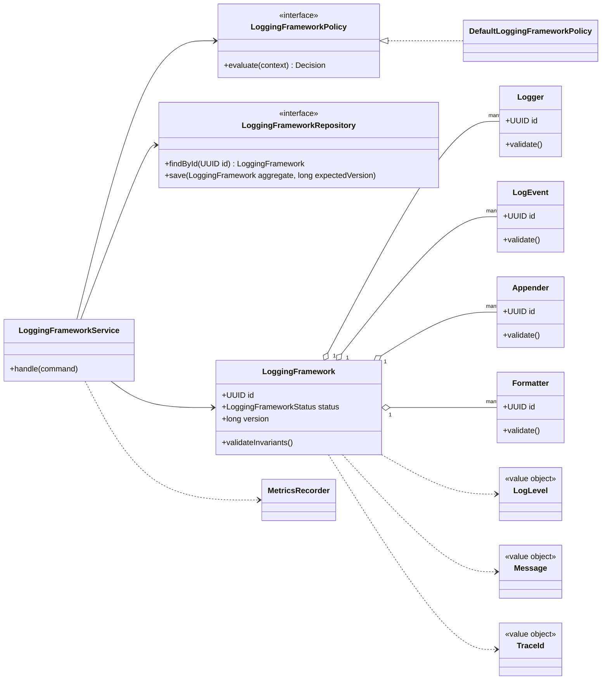
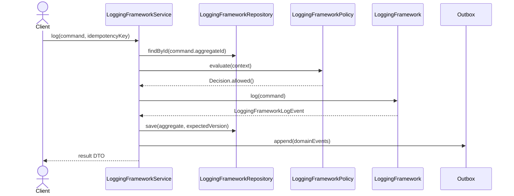

# 066. Design Logging Framework

Source problem: `Design logging framework.`  
Category: `Developer tool`  
Primary focus: `appenders, formatters, levels, async buffering`  
Archetype: `platform-library`

## 1. Interview Framing

Design `logging framework` as a domain-centered LLD. Start with behavior, invariants, lifecycle states, and change points before naming classes. Keep the core model independent from UI, database, queues, and vendor SDKs.

## 2. Requirements

- Support the main user journeys for `logging framework` with clear command boundaries.
- Maintain lifecycle state with explicit valid transitions: `ENABLED, BUFFERING, FLUSHING, DROPPING, CLOSED`.
- Preserve core invariants inside the aggregate instead of scattering checks across controllers.
- Expose repository and policy interfaces so storage, rules, and integrations can change independently.
- Emit domain events for important state changes to support audit, projections, and notifications.
- Offer a small public API with bounded resources, back-pressure, and safe shutdown.
- Expose metrics hooks without coupling the core library to a specific observability vendor.

## 3. Non-Goals

- Full distributed system design, capacity planning, and network protocols.
- UI screens, mobile clients, and authentication flows unless they affect domain invariants.
- Vendor-specific database schemas or framework annotations in the core model.

## 4. Actors And Use Cases

Actors:

- `Application`
- `Appender`
- `Formatter`

Primary use cases:

- `log` command on `LoggingFramework`
- `format` command on `LoggingFramework`
- `append` command on `LoggingFramework`
- `flush` command on `LoggingFramework`

## 5. Core Domain Model

| Type | Examples | Responsibility |
|---|---|---|
| Aggregate root | `LoggingFramework` | Owns lifecycle, invariants, version, and domain events. |
| Entities | `Logger, LogEvent, Appender, Formatter, AsyncBuffer` | Have identity and change over time under the aggregate. |
| Value objects | `LogLevel, Message, TraceId, Timestamp` | Immutable concepts compared by value. |
| Policies | `LoggingFrameworkPolicy`, validation/ranking/pricing strategies | Encapsulate rules that vary by business or deployment. |
| Repositories | `LoggingFrameworkRepository` | Load/save aggregate with optimistic concurrency. |
| Events | Domain event records | Capture meaningful state changes after successful commands. |

## 6. State, Invariants, And Relationships

States:

```text
ENABLED, BUFFERING, FLUSHING, DROPPING, CLOSED
```

Invariants:

- `LoggingFramework` can only move through declared states; invalid transitions fail fast.
- Every command validates caller intent, current state, and policy decision before mutating state.
- Aggregate version increases exactly once per successful command.
- Domain events are recorded only after the aggregate has accepted the state change.

Relationships:

| Component | Relationship | Collaborators | Why it exists |
|---|---|---|---|
| `LoggingFrameworkService` | Depends on | Repository, policies, clock/idempotency store | Coordinates one use case and transaction boundary. |
| `LoggingFramework` | Composes | Logger, LogEvent, Appender | Owns invariants and lifecycle transitions. |
| `LoggingFrameworkRepository` | Abstracts | Persistence model | Keeps database details out of domain code. |
| `LoggingFrameworkPolicy` | Strategy/specification | Business rules | Enables new rules without editing core workflow. |
| Domain events | Publish facts | Outbox/subscribers | Decouples side effects such as notifications, indexing, and audit. |
| Lock/atomic primitive | Protects | Shared mutable state | Documents thread-safety and prevents race conditions. |

## 7. UML Class Diagram



## 8. Main Sequence



## 9. Applied Design Patterns

| Pattern | Where it fits |
|---|---|
| Adapter | Hide vendor or infrastructure differences behind stable ports. |

## 10. Java Reference Design

This is intentionally framework-free Java. In an interview, write the aggregate, repository, policy, and service first; add adapters later.

```java
package lld.loggingframework;

import java.time.Duration;
import java.util.Objects;
import java.util.UUID;
import java.util.concurrent.*;
import java.util.concurrent.atomic.AtomicReference;

enum LoggingFrameworkState {
    ENABLED,
    BUFFERING,
    FLUSHING,
    DROPPING,
    CLOSED
}

interface LoggingFrameworkOperation<R> {
    R run() throws Exception;
}

interface LoggingFrameworkPolicy {
    boolean allowAttempt(int attempt, Throwable lastFailure);
    Duration delayBeforeNextAttempt(int attempt);
}

interface MetricsRecorder {
    void increment(String metricName);
    void timing(String metricName, Duration duration);
}

final class LoggingFramework {
    private final AtomicReference<LoggingFrameworkState> state = new AtomicReference<>(LoggingFrameworkState.ENABLED);
    private final ScheduledExecutorService scheduler;
    private final LoggingFrameworkPolicy policy;
    private final MetricsRecorder metrics;

    LoggingFramework(ScheduledExecutorService scheduler, LoggingFrameworkPolicy policy, MetricsRecorder metrics) {
        this.scheduler = Objects.requireNonNull(scheduler);
        this.policy = Objects.requireNonNull(policy);
        this.metrics = Objects.requireNonNull(metrics);
    }

    public <R> CompletableFuture<R> execute(LoggingFrameworkOperation<R> operation) {
        if (isClosed()) return CompletableFuture.failedFuture(new IllegalStateException("LoggingFramework is closed"));
        CompletableFuture<R> result = new CompletableFuture<>();
        executeAttempt(operation, result, 1, null);
        return result;
    }

    private <R> void executeAttempt(LoggingFrameworkOperation<R> operation, CompletableFuture<R> result, int attempt, Throwable lastFailure) {
        scheduler.execute(() -> {
            try {
                state.set(LoggingFrameworkState.BUFFERING);
                R value = operation.run();
                metrics.increment("logging-framework.success");
                result.complete(value);
            } catch (Throwable failure) {
                metrics.increment("logging-framework.failure");
                if (!policy.allowAttempt(attempt, failure)) {
                    result.completeExceptionally(failure);
                    return;
                }
                Duration delay = policy.delayBeforeNextAttempt(attempt);
                scheduler.schedule(
                        () -> executeAttempt(operation, result, attempt + 1, failure),
                        delay.toMillis(),
                        TimeUnit.MILLISECONDS
                );
            }
        });
    }

    public void close() {
        state.set(LoggingFrameworkState.CLOSED);
        scheduler.shutdown();
    }

    private boolean isClosed() {
        return state.get() == LoggingFrameworkState.CLOSED;
    }
}
```

## 11. Concurrency And Thread Safety

- Bound queues, pools, buffers, and retry attempts to avoid unbounded memory growth.
- Use explicit lifecycle states for start, drain, shutdown, and closed operations.
- Protect shared mutable state with locks/atomics and document which APIs are thread-safe.
- Prefer listener/event callbacks for asynchronous completion instead of blocking client threads.

## 12. Persistence And Transactions

- Keep runtime state in memory by default; persist only jobs, leases, offsets, or workflow state that must survive restart.
- Store idempotency keys, delivery receipts, or execution records where retries cross process boundaries.
- Use repository interfaces so embedded, SQL, Redis, or remote stores can be swapped.

## 13. Error Handling And Idempotency

- Return typed domain errors: `NotFound`, `InvalidState`, `PolicyRejected`, `Conflict`, and `DuplicateCommand`.
- Never partially mutate aggregate state before all guards pass.
- Log rejection reasons with correlation id; avoid logging secrets, tokens, or sensitive payloads.
- Use idempotency records for externally retried commands and provider callbacks.
- Expose caller-visible failure modes such as timeout, rejected execution, open circuit, or closed client.

## 14. Extensibility Hooks

| Change point | Extension mechanism |
|---|---|
| Hide vendor or infrastructure differences behind stable ports. | `Adapter` |
| New persistence backend | Implement repository/adapter interfaces. |
| New read model or notification | Subscribe to domain events from the outbox. |
| New validation or business rule | Add policy/specification implementation and register it. |

## 15. Test Plan

- Unit test `LoggingFramework` invariants and each command method.
- State-machine test all valid and invalid `LoggingFrameworkStatus` transitions.
- Contract test every `LoggingFrameworkRepository` implementation with optimistic conflict cases.
- Policy tests for allow/deny decisions and explainability.
- Idempotency tests that replay the same command and verify a single mutation/event.

## 16. Interview Tips

1. Start with the invariant: `LoggingFramework` owns state and rejects invalid transitions.
2. Explain the command path: controller -> `LoggingFrameworkService` -> policy -> aggregate -> repository -> outbox.
3. Call out the primary change points and the pattern that protects each one.
4. Discuss concurrency explicitly: optimistic versioning for aggregates or locks/atomics for in-memory structures.
5. Finish with tests: state transitions, policies, repository contracts, idempotency, and concurrency.
