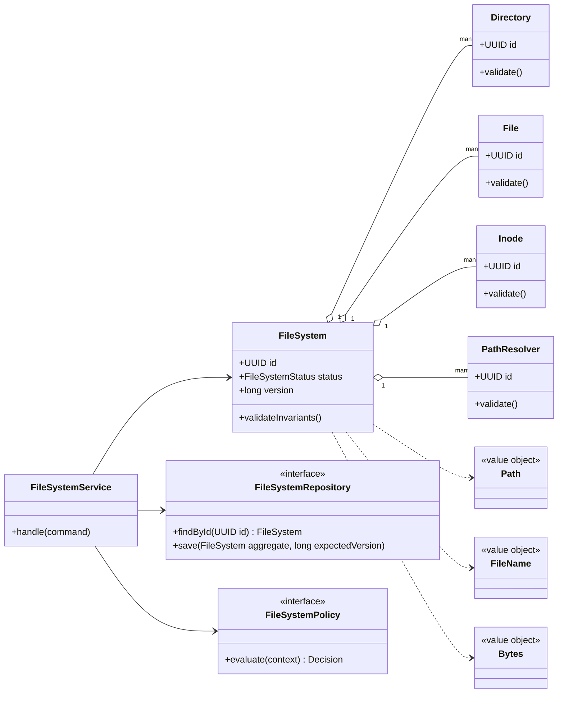
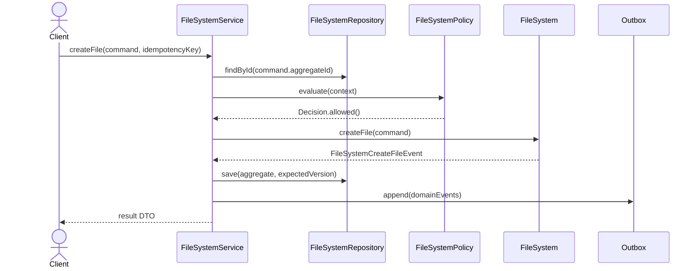

# 071. Design File System

Source problem: `Design file system.`  
Category: `Storage OOD`  
Primary focus: `directories, files, permissions, path resolution`  
Archetype: `domain`

## 1. Interview Framing

Design `file system` as a domain-centered LLD. Start with behavior, invariants, lifecycle states, and change points before naming classes. Keep the core model independent from UI, database, queues, and vendor SDKs.

## 2. Requirements

- Support the main user journeys for `file system` with clear command boundaries.
- Maintain lifecycle state with explicit valid transitions: `CREATED, OPEN, LOCKED, DELETED, PERMISSION_DENIED`.
- Preserve core invariants inside the aggregate instead of scattering checks across controllers.
- Expose repository and policy interfaces so storage, rules, and integrations can change independently.
- Emit domain events for important state changes to support audit, projections, and notifications.

## 3. Non-Goals

- Full distributed system design, capacity planning, and network protocols.
- UI screens, mobile clients, and authentication flows unless they affect domain invariants.
- Vendor-specific database schemas or framework annotations in the core model.

## 4. Actors And Use Cases

Actors:

- `User`
- `Process`
- `PermissionService`

Primary use cases:

- `createFile` command on `FileSystem`
- `resolvePath` command on `FileSystem`
- `readFile` command on `FileSystem`
- `deleteNode` command on `FileSystem`

## 5. Core Domain Model

| Type | Examples | Responsibility |
|---|---|---|
| Aggregate root | `FileSystem` | Owns lifecycle, invariants, version, and domain events. |
| Entities | `Directory, File, Inode, PathResolver, Permission` | Have identity and change over time under the aggregate. |
| Value objects | `Path, FileName, Bytes, UserId` | Immutable concepts compared by value. |
| Policies | `FileSystemPolicy`, validation/ranking/pricing strategies | Encapsulate rules that vary by business or deployment. |
| Repositories | `FileSystemRepository` | Load/save aggregate with optimistic concurrency. |
| Events | Domain event records | Capture meaningful state changes after successful commands. |

## 6. State, Invariants, And Relationships

States:

```text
CREATED, OPEN, LOCKED, DELETED, PERMISSION_DENIED
```

Invariants:

- `FileSystem` can only move through declared states; invalid transitions fail fast.
- Every command validates caller intent, current state, and policy decision before mutating state.
- Aggregate version increases exactly once per successful command.
- Domain events are recorded only after the aggregate has accepted the state change.

Relationships:

| Component | Relationship | Collaborators | Why it exists |
|---|---|---|---|
| `FileSystemService` | Depends on | Repository, policies, clock/idempotency store | Coordinates one use case and transaction boundary. |
| `FileSystem` | Composes | Directory, File, Inode | Owns invariants and lifecycle transitions. |
| `FileSystemRepository` | Abstracts | Persistence model | Keeps database details out of domain code. |
| `FileSystemPolicy` | Strategy/specification | Business rules | Enables new rules without editing core workflow. |
| Domain events | Publish facts | Outbox/subscribers | Decouples side effects such as notifications, indexing, and audit. |

## 7. UML Class Diagram



## 8. Main Sequence



## 9. Applied Design Patterns

| Pattern | Where it fits |
|---|---|
| Repository | Keep persistence and optimistic version checks outside the domain model. |

## 10. Java Reference Design

This is intentionally framework-free Java. In an interview, write the aggregate, repository, policy, and service first; add adapters later.

```java
package lld.filesystem;

import java.time.Instant;
import java.util.*;

record IdempotencyKey(String value) {
    IdempotencyKey {
        if (value == null || value.isBlank()) throw new IllegalArgumentException("idempotency key is required");
    }
}

record Decision(boolean allowed, String reason) {
    static Decision allow() { return new Decision(true, "allowed"); }
    static Decision reject(String reason) { return new Decision(false, reason); }
}

enum FileSystemStatus {
    CREATED,
    OPEN,
    LOCKED,
    DELETED,
    PERMISSION_DENIED
}

interface DomainEvent {
    UUID aggregateId();
    Instant occurredAt();
}

record FileSystemCreateFileEvent(UUID aggregateId, Instant occurredAt, String idempotencyKey) implements DomainEvent {}
record FileSystemResolvePathEvent(UUID aggregateId, Instant occurredAt, String idempotencyKey) implements DomainEvent {}
record FileSystemReadFileEvent(UUID aggregateId, Instant occurredAt, String idempotencyKey) implements DomainEvent {}
record FileSystemDeleteNodeEvent(UUID aggregateId, Instant occurredAt, String idempotencyKey) implements DomainEvent {}

sealed interface FileSystemCommand permits CreateFileCommand, ResolvePathCommand, ReadFileCommand, DeleteNodeCommand {
    UUID aggregateId();
    IdempotencyKey idempotencyKey();
}

record CreateFileCommand(UUID aggregateId, IdempotencyKey idempotencyKey, Map<String, String> attributes) implements FileSystemCommand {}
record ResolvePathCommand(UUID aggregateId, IdempotencyKey idempotencyKey, Map<String, String> attributes) implements FileSystemCommand {}
record ReadFileCommand(UUID aggregateId, IdempotencyKey idempotencyKey, Map<String, String> attributes) implements FileSystemCommand {}
record DeleteNodeCommand(UUID aggregateId, IdempotencyKey idempotencyKey, Map<String, String> attributes) implements FileSystemCommand {}

interface FileSystemRepository {
    Optional<FileSystem> findById(UUID id);
    void save(FileSystem aggregate, long expectedVersion);
}

interface FileSystemPolicy {
    Decision evaluate(FileSystem aggregate, FileSystemCommand command);
}

final class Directory {
    private final UUID id = UUID.randomUUID();
    private final Map<String, String> attributes = new HashMap<>();

    UUID id() { return id; }
    Map<String, String> attributes() { return Collections.unmodifiableMap(attributes); }
}

final class FileSystem {
    private final UUID id;
    private final List<Directory> children = new ArrayList<>();
    private final List<DomainEvent> domainEvents = new ArrayList<>();
    private final Set<String> processedIdempotencyKeys = new HashSet<>();
    private FileSystemStatus status;
    private long version;

    FileSystem(UUID id) {
        this.id = Objects.requireNonNull(id);
        this.status = FileSystemStatus.CREATED;
        this.version = 0;
    }

    UUID id() { return id; }
    long version() { return version; }
    FileSystemStatus status() { return status; }
    List<DomainEvent> pullDomainEvents() {
        List<DomainEvent> copy = List.copyOf(domainEvents);
        domainEvents.clear();
        return copy;
    }

    public void createFile(CreateFileCommand command) {
    ensureCommandCanRun(command.idempotencyKey());
    ensure(!isTerminal(), "Cannot run createFile when aggregate is terminal");
    this.status = FileSystemStatus.OPEN;
    this.version++;
    this.domainEvents.add(new FileSystemCreateFileEvent(id, Instant.now(), command.idempotencyKey().value()));
}

    public void resolvePath(ResolvePathCommand command) {
    ensureCommandCanRun(command.idempotencyKey());
    ensure(!isTerminal(), "Cannot run resolvePath when aggregate is terminal");
    this.status = FileSystemStatus.LOCKED;
    this.version++;
    this.domainEvents.add(new FileSystemResolvePathEvent(id, Instant.now(), command.idempotencyKey().value()));
}

    public void readFile(ReadFileCommand command) {
    ensureCommandCanRun(command.idempotencyKey());
    ensure(!isTerminal(), "Cannot run readFile when aggregate is terminal");
    this.status = FileSystemStatus.DELETED;
    this.version++;
    this.domainEvents.add(new FileSystemReadFileEvent(id, Instant.now(), command.idempotencyKey().value()));
}

    public void deleteNode(DeleteNodeCommand command) {
    ensureCommandCanRun(command.idempotencyKey());
    ensure(!isTerminal(), "Cannot run deleteNode when aggregate is terminal");
    this.status = FileSystemStatus.PERMISSION_DENIED;
    this.version++;
    this.domainEvents.add(new FileSystemDeleteNodeEvent(id, Instant.now(), command.idempotencyKey().value()));
}

    private void ensureCommandCanRun(IdempotencyKey key) {
        if (!processedIdempotencyKeys.add(key.value())) {
            throw new DuplicateCommandException("Command already processed: " + key.value());
        }
    }

    private boolean isTerminal() {
        return status == FileSystemStatus.PERMISSION_DENIED;
    }

    private static void ensure(boolean condition, String message) {
        if (!condition) throw new InvalidStateException(message);
    }
}

final class FileSystemService {
    private final FileSystemRepository repository;
    private final FileSystemPolicy policy;
    private final Outbox outbox;

    FileSystemService(FileSystemRepository repository, FileSystemPolicy policy, Outbox outbox) {
        this.repository = repository;
        this.policy = policy;
        this.outbox = outbox;
    }

    public void handle(FileSystemCommand command) {
        FileSystem aggregate = repository.findById(command.aggregateId())
                .orElseThrow(() -> new NoSuchElementException("FileSystem not found"));
        long expectedVersion = aggregate.version();
        Decision decision = policy.evaluate(aggregate, command);
        if (!decision.allowed()) throw new PolicyRejectedException(decision.reason());

        if (command instanceof CreateFileCommand c) aggregate.createFile(c);
        if (command instanceof ResolvePathCommand c) aggregate.resolvePath(c);
        if (command instanceof ReadFileCommand c) aggregate.readFile(c);
        if (command instanceof DeleteNodeCommand c) aggregate.deleteNode(c);
        repository.save(aggregate, expectedVersion);
        outbox.appendAll(aggregate.pullDomainEvents());
    }
}

interface Outbox {
    void appendAll(List<DomainEvent> events);
}

class InvalidStateException extends RuntimeException { InvalidStateException(String message) { super(message); } }
class DuplicateCommandException extends RuntimeException { DuplicateCommandException(String message) { super(message); } }
class PolicyRejectedException extends RuntimeException { PolicyRejectedException(String message) { super(message); } }
```

## 11. Concurrency And Thread Safety

- Use optimistic concurrency on aggregate save: `save(aggregate, expectedVersion)`.
- Lock scarce resources such as seats, rooms, inventory, accounts, or tasks with short-lived holds.
- Make commands idempotent when callers can retry after timeout.
- Publish events through an outbox in the same transaction as the aggregate update.

## 12. Persistence And Transactions

- Persist `FileSystem` as the aggregate table/document with `id`, `status`, `version`, and audit timestamps.
- Persist child entities in owned tables/documents keyed by aggregate id.
- Store domain events in an outbox table in the same transaction.
- Add indexes for business lookup keys, active state, owner/user id, and expiry deadlines.

## 13. Error Handling And Idempotency

- Return typed domain errors: `NotFound`, `InvalidState`, `PolicyRejected`, `Conflict`, and `DuplicateCommand`.
- Never partially mutate aggregate state before all guards pass.
- Log rejection reasons with correlation id; avoid logging secrets, tokens, or sensitive payloads.

## 14. Extensibility Hooks

| Change point | Extension mechanism |
|---|---|
| Keep persistence and optimistic version checks outside the domain model. | `Repository` |
| New persistence backend | Implement repository/adapter interfaces. |
| New read model or notification | Subscribe to domain events from the outbox. |
| New validation or business rule | Add policy/specification implementation and register it. |

## 15. Test Plan

- Unit test `FileSystem` invariants and each command method.
- State-machine test all valid and invalid `FileSystemStatus` transitions.
- Contract test every `FileSystemRepository` implementation with optimistic conflict cases.
- Policy tests for allow/deny decisions and explainability.
- Idempotency tests that replay the same command and verify a single mutation/event.

## 16. Interview Tips

1. Start with the invariant: `FileSystem` owns state and rejects invalid transitions.
2. Explain the command path: controller -> `FileSystemService` -> policy -> aggregate -> repository -> outbox.
3. Call out the primary change points and the pattern that protects each one.
4. Discuss concurrency explicitly: optimistic versioning for aggregates or locks/atomics for in-memory structures.
5. Finish with tests: state transitions, policies, repository contracts, idempotency, and concurrency.
