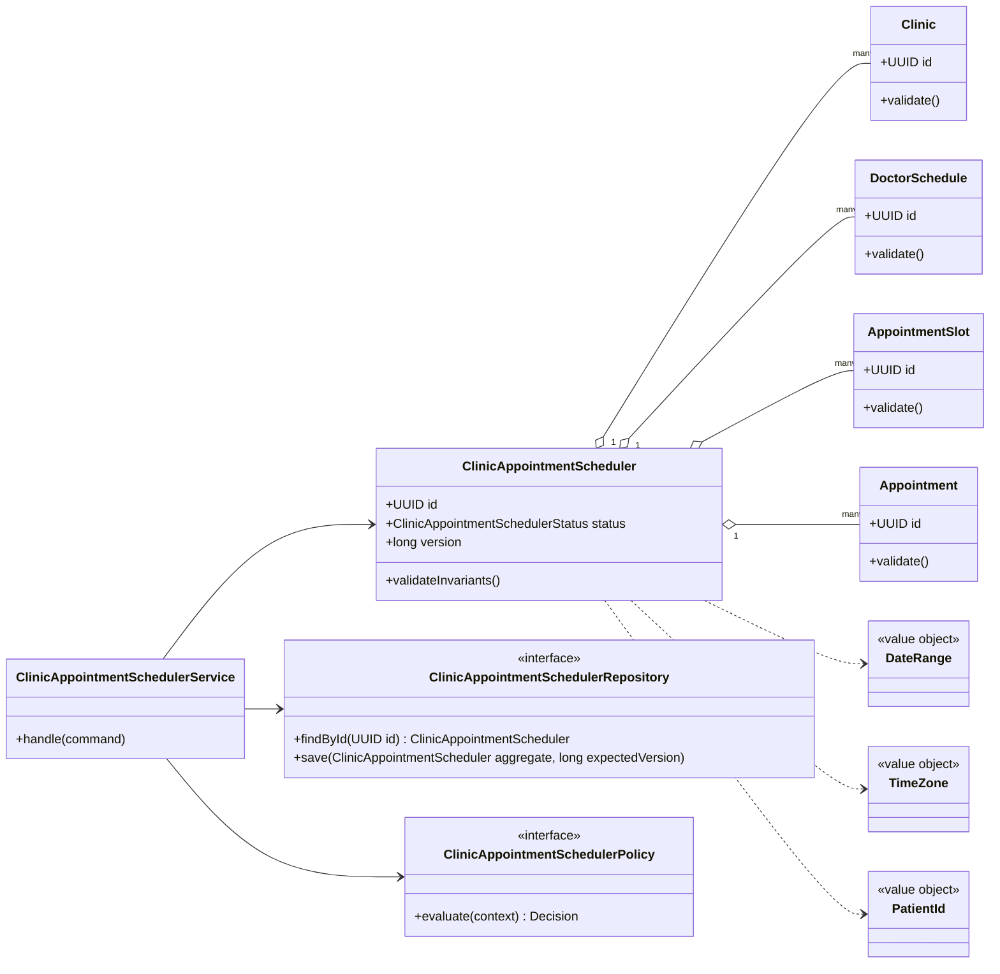
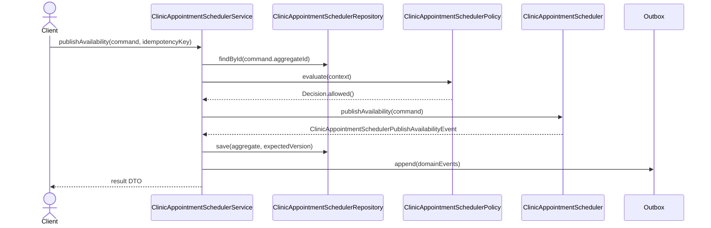

# 092. Design Clinic Appointment Scheduler

Source problem: `Design clinic appointment scheduler.`  
Category: `Healthcare`  
Primary focus: `slots, availability, cancellations, reminders`  
Archetype: `booking`

## 1. Interview Framing

Design `clinic appointment scheduler` as a domain-centered LLD. Start with behavior, invariants, lifecycle states, and change points before naming classes. Keep the core model independent from UI, database, queues, and vendor SDKs.

## 2. Requirements

- Support the main user journeys for `clinic appointment scheduler` with clear command boundaries.
- Maintain lifecycle state with explicit valid transitions: `AVAILABLE, HELD, CONFIRMED, CANCELLED, NO_SHOW`.
- Preserve core invariants inside the aggregate instead of scattering checks across controllers.
- Expose repository and policy interfaces so storage, rules, and integrations can change independently.
- Emit domain events for important state changes to support audit, projections, and notifications.
- Handle retries through idempotency keys and optimistic version checks.

## 3. Non-Goals

- Full distributed system design, capacity planning, and network protocols.
- UI screens, mobile clients, and authentication flows unless they affect domain invariants.
- Vendor-specific database schemas or framework annotations in the core model.

## 4. Actors And Use Cases

Actors:

- `Patient`
- `Doctor`
- `Receptionist`
- `ReminderService`

Primary use cases:

- `publishAvailability` command on `ClinicAppointmentScheduler`
- `holdSlot` command on `ClinicAppointmentScheduler`
- `confirmAppointment` command on `ClinicAppointmentScheduler`
- `sendReminder` command on `ClinicAppointmentScheduler`

## 5. Core Domain Model

| Type | Examples | Responsibility |
|---|---|---|
| Aggregate root | `ClinicAppointmentScheduler` | Owns lifecycle, invariants, version, and domain events. |
| Entities | `Clinic, DoctorSchedule, AppointmentSlot, Appointment, Reminder` | Have identity and change over time under the aggregate. |
| Value objects | `DateRange, TimeZone, PatientId, DoctorId` | Immutable concepts compared by value. |
| Policies | `ClinicAppointmentSchedulerPolicy`, validation/ranking/pricing strategies | Encapsulate rules that vary by business or deployment. |
| Repositories | `ClinicAppointmentSchedulerRepository` | Load/save aggregate with optimistic concurrency. |
| Events | Domain event records | Capture meaningful state changes after successful commands. |

## 6. State, Invariants, And Relationships

States:

```text
AVAILABLE, HELD, CONFIRMED, CANCELLED, NO_SHOW, COMPLETED
```

Invariants:

- `ClinicAppointmentScheduler` can only move through declared states; invalid transitions fail fast.
- Every command validates caller intent, current state, and policy decision before mutating state.
- Aggregate version increases exactly once per successful command.
- Domain events are recorded only after the aggregate has accepted the state change.
- Money and capacity changes are atomic within the transaction boundary.
- A repeated idempotency key returns the original result and never double-applies side effects.

Relationships:

| Component | Relationship | Collaborators | Why it exists |
|---|---|---|---|
| `ClinicAppointmentSchedulerService` | Depends on | Repository, policies, clock/idempotency store | Coordinates one use case and transaction boundary. |
| `ClinicAppointmentScheduler` | Composes | Clinic, DoctorSchedule, AppointmentSlot | Owns invariants and lifecycle transitions. |
| `ClinicAppointmentSchedulerRepository` | Abstracts | Persistence model | Keeps database details out of domain code. |
| `ClinicAppointmentSchedulerPolicy` | Strategy/specification | Business rules | Enables new rules without editing core workflow. |
| Domain events | Publish facts | Outbox/subscribers | Decouples side effects such as notifications, indexing, and audit. |
| Idempotency store | Guards | Command handling | Makes retries safe for payment, booking, and workflow commands. |

## 7. UML Class Diagram



## 8. Main Sequence



## 9. Applied Design Patterns

| Pattern | Where it fits |
|---|---|
| State | Model valid lifecycle transitions and reject illegal moves at the aggregate boundary. |
| Repository | Keep persistence and optimistic version checks outside the domain model. |

## 10. Java Reference Design

This is intentionally framework-free Java. In an interview, write the aggregate, repository, policy, and service first; add adapters later.

```java
package lld.clinicappointmentscheduler;

import java.time.Instant;
import java.util.*;

record IdempotencyKey(String value) {
    IdempotencyKey {
        if (value == null || value.isBlank()) throw new IllegalArgumentException("idempotency key is required");
    }
}

record Decision(boolean allowed, String reason) {
    static Decision allow() { return new Decision(true, "allowed"); }
    static Decision reject(String reason) { return new Decision(false, reason); }
}

enum ClinicAppointmentSchedulerStatus {
    AVAILABLE,
    HELD,
    CONFIRMED,
    CANCELLED,
    NO_SHOW,
    COMPLETED
}

interface DomainEvent {
    UUID aggregateId();
    Instant occurredAt();
}

record ClinicAppointmentSchedulerPublishAvailabilityEvent(UUID aggregateId, Instant occurredAt, String idempotencyKey) implements DomainEvent {}
record ClinicAppointmentSchedulerHoldSlotEvent(UUID aggregateId, Instant occurredAt, String idempotencyKey) implements DomainEvent {}
record ClinicAppointmentSchedulerConfirmAppointmentEvent(UUID aggregateId, Instant occurredAt, String idempotencyKey) implements DomainEvent {}
record ClinicAppointmentSchedulerSendReminderEvent(UUID aggregateId, Instant occurredAt, String idempotencyKey) implements DomainEvent {}

sealed interface ClinicAppointmentSchedulerCommand permits PublishAvailabilityCommand, HoldSlotCommand, ConfirmAppointmentCommand, SendReminderCommand {
    UUID aggregateId();
    IdempotencyKey idempotencyKey();
}

record PublishAvailabilityCommand(UUID aggregateId, IdempotencyKey idempotencyKey, Map<String, String> attributes) implements ClinicAppointmentSchedulerCommand {}
record HoldSlotCommand(UUID aggregateId, IdempotencyKey idempotencyKey, Map<String, String> attributes) implements ClinicAppointmentSchedulerCommand {}
record ConfirmAppointmentCommand(UUID aggregateId, IdempotencyKey idempotencyKey, Map<String, String> attributes) implements ClinicAppointmentSchedulerCommand {}
record SendReminderCommand(UUID aggregateId, IdempotencyKey idempotencyKey, Map<String, String> attributes) implements ClinicAppointmentSchedulerCommand {}

interface ClinicAppointmentSchedulerRepository {
    Optional<ClinicAppointmentScheduler> findById(UUID id);
    void save(ClinicAppointmentScheduler aggregate, long expectedVersion);
}

interface ClinicAppointmentSchedulerPolicy {
    Decision evaluate(ClinicAppointmentScheduler aggregate, ClinicAppointmentSchedulerCommand command);
}

final class Clinic {
    private final UUID id = UUID.randomUUID();
    private final Map<String, String> attributes = new HashMap<>();

    UUID id() { return id; }
    Map<String, String> attributes() { return Collections.unmodifiableMap(attributes); }
}

final class ClinicAppointmentScheduler {
    private final UUID id;
    private final List<Clinic> children = new ArrayList<>();
    private final List<DomainEvent> domainEvents = new ArrayList<>();
    private final Set<String> processedIdempotencyKeys = new HashSet<>();
    private ClinicAppointmentSchedulerStatus status;
    private long version;

    ClinicAppointmentScheduler(UUID id) {
        this.id = Objects.requireNonNull(id);
        this.status = ClinicAppointmentSchedulerStatus.AVAILABLE;
        this.version = 0;
    }

    UUID id() { return id; }
    long version() { return version; }
    ClinicAppointmentSchedulerStatus status() { return status; }
    List<DomainEvent> pullDomainEvents() {
        List<DomainEvent> copy = List.copyOf(domainEvents);
        domainEvents.clear();
        return copy;
    }

    public void publishAvailability(PublishAvailabilityCommand command) {
    ensureCommandCanRun(command.idempotencyKey());
    ensure(!isTerminal(), "Cannot run publishAvailability when aggregate is terminal");
    this.status = ClinicAppointmentSchedulerStatus.HELD;
    this.version++;
    this.domainEvents.add(new ClinicAppointmentSchedulerPublishAvailabilityEvent(id, Instant.now(), command.idempotencyKey().value()));
}

    public void holdSlot(HoldSlotCommand command) {
    ensureCommandCanRun(command.idempotencyKey());
    ensure(!isTerminal(), "Cannot run holdSlot when aggregate is terminal");
    this.status = ClinicAppointmentSchedulerStatus.CONFIRMED;
    this.version++;
    this.domainEvents.add(new ClinicAppointmentSchedulerHoldSlotEvent(id, Instant.now(), command.idempotencyKey().value()));
}

    public void confirmAppointment(ConfirmAppointmentCommand command) {
    ensureCommandCanRun(command.idempotencyKey());
    ensure(!isTerminal(), "Cannot run confirmAppointment when aggregate is terminal");
    this.status = ClinicAppointmentSchedulerStatus.CANCELLED;
    this.version++;
    this.domainEvents.add(new ClinicAppointmentSchedulerConfirmAppointmentEvent(id, Instant.now(), command.idempotencyKey().value()));
}

    public void sendReminder(SendReminderCommand command) {
    ensureCommandCanRun(command.idempotencyKey());
    ensure(!isTerminal(), "Cannot run sendReminder when aggregate is terminal");
    this.status = ClinicAppointmentSchedulerStatus.NO_SHOW;
    this.version++;
    this.domainEvents.add(new ClinicAppointmentSchedulerSendReminderEvent(id, Instant.now(), command.idempotencyKey().value()));
}

    private void ensureCommandCanRun(IdempotencyKey key) {
        if (!processedIdempotencyKeys.add(key.value())) {
            throw new DuplicateCommandException("Command already processed: " + key.value());
        }
    }

    private boolean isTerminal() {
        return status == ClinicAppointmentSchedulerStatus.COMPLETED;
    }

    private static void ensure(boolean condition, String message) {
        if (!condition) throw new InvalidStateException(message);
    }
}

final class ClinicAppointmentSchedulerService {
    private final ClinicAppointmentSchedulerRepository repository;
    private final ClinicAppointmentSchedulerPolicy policy;
    private final Outbox outbox;

    ClinicAppointmentSchedulerService(ClinicAppointmentSchedulerRepository repository, ClinicAppointmentSchedulerPolicy policy, Outbox outbox) {
        this.repository = repository;
        this.policy = policy;
        this.outbox = outbox;
    }

    public void handle(ClinicAppointmentSchedulerCommand command) {
        ClinicAppointmentScheduler aggregate = repository.findById(command.aggregateId())
                .orElseThrow(() -> new NoSuchElementException("ClinicAppointmentScheduler not found"));
        long expectedVersion = aggregate.version();
        Decision decision = policy.evaluate(aggregate, command);
        if (!decision.allowed()) throw new PolicyRejectedException(decision.reason());

        if (command instanceof PublishAvailabilityCommand c) aggregate.publishAvailability(c);
        if (command instanceof HoldSlotCommand c) aggregate.holdSlot(c);
        if (command instanceof ConfirmAppointmentCommand c) aggregate.confirmAppointment(c);
        if (command instanceof SendReminderCommand c) aggregate.sendReminder(c);
        repository.save(aggregate, expectedVersion);
        outbox.appendAll(aggregate.pullDomainEvents());
    }
}

interface Outbox {
    void appendAll(List<DomainEvent> events);
}

class InvalidStateException extends RuntimeException { InvalidStateException(String message) { super(message); } }
class DuplicateCommandException extends RuntimeException { DuplicateCommandException(String message) { super(message); } }
class PolicyRejectedException extends RuntimeException { PolicyRejectedException(String message) { super(message); } }
```

## 11. Concurrency And Thread Safety

- Use optimistic concurrency on aggregate save: `save(aggregate, expectedVersion)`.
- Lock scarce resources such as seats, rooms, inventory, accounts, or tasks with short-lived holds.
- Make commands idempotent when callers can retry after timeout.
- Publish events through an outbox in the same transaction as the aggregate update.

## 12. Persistence And Transactions

- Persist `ClinicAppointmentScheduler` as the aggregate table/document with `id`, `status`, `version`, and audit timestamps.
- Persist child entities in owned tables/documents keyed by aggregate id.
- Store domain events in an outbox table in the same transaction.
- Add indexes for business lookup keys, active state, owner/user id, and expiry deadlines.

## 13. Error Handling And Idempotency

- Return typed domain errors: `NotFound`, `InvalidState`, `PolicyRejected`, `Conflict`, and `DuplicateCommand`.
- Never partially mutate aggregate state before all guards pass.
- Log rejection reasons with correlation id; avoid logging secrets, tokens, or sensitive payloads.
- Use idempotency records for externally retried commands and provider callbacks.

## 14. Extensibility Hooks

| Change point | Extension mechanism |
|---|---|
| Model valid lifecycle transitions and reject illegal moves at the aggregate boundary. | `State` |
| Keep persistence and optimistic version checks outside the domain model. | `Repository` |
| New persistence backend | Implement repository/adapter interfaces. |
| New read model or notification | Subscribe to domain events from the outbox. |
| New validation or business rule | Add policy/specification implementation and register it. |

## 15. Test Plan

- Unit test `ClinicAppointmentScheduler` invariants and each command method.
- State-machine test all valid and invalid `ClinicAppointmentSchedulerStatus` transitions.
- Contract test every `ClinicAppointmentSchedulerRepository` implementation with optimistic conflict cases.
- Policy tests for allow/deny decisions and explainability.
- Idempotency tests that replay the same command and verify a single mutation/event.

## 16. Interview Tips

1. Start with the invariant: `ClinicAppointmentScheduler` owns state and rejects invalid transitions.
2. Explain the command path: controller -> `ClinicAppointmentSchedulerService` -> policy -> aggregate -> repository -> outbox.
3. Call out the primary change points and the pattern that protects each one.
4. Discuss concurrency explicitly: optimistic versioning for aggregates or locks/atomics for in-memory structures.
5. Finish with tests: state transitions, policies, repository contracts, idempotency, and concurrency.
