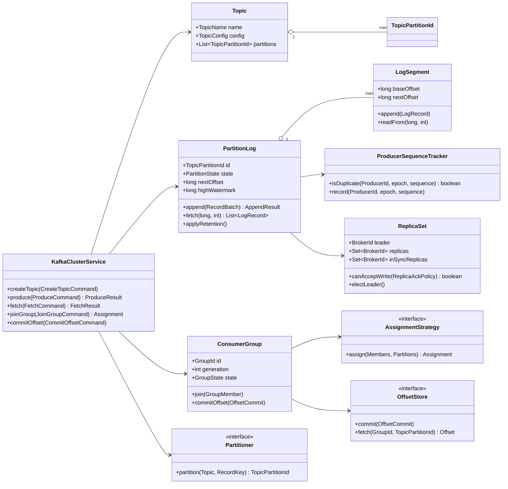
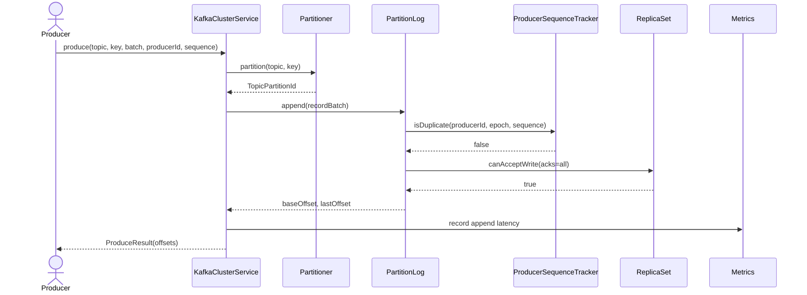
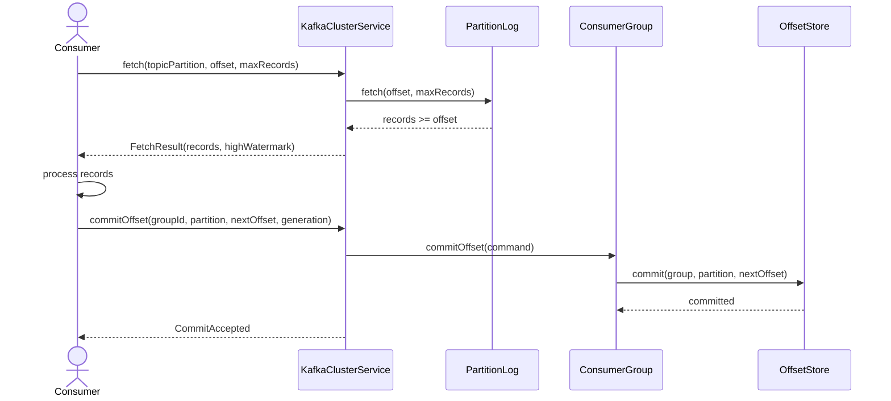
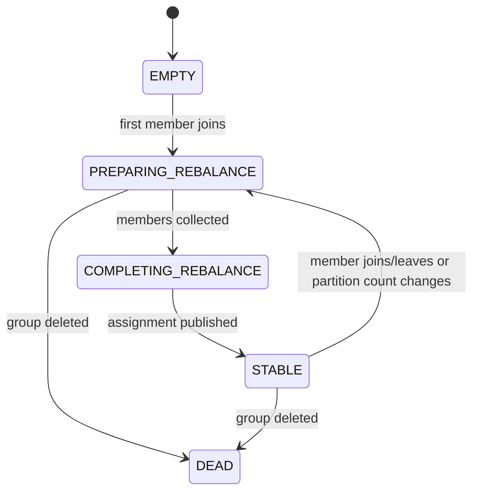

# 101. Design Kafka / Distributed Event Log

Source problem: `Design Kafka / distributed event log.`  
Category: `Messaging / Streaming`  
Primary focus: `topics, partitions, append-only log, offsets, consumer groups, replication, retention`  
Reference: Apache Kafka docs via Context7 (`/apache/kafka`)

## 1. Interview Framing

Design Kafka as a durable, partitioned, append-only event log. The LLD should not start with brokers and clusters only; it should start with the core object model that protects Kafka's most important guarantees: ordering within a partition, monotonic offsets, producer retry safety, consumer-controlled offsets, group assignment, retention, and replicated durability.

For an LLD interview, scope the design to a single cluster abstraction with brokers, topics, partitions, producers, consumers, group coordinators, offset commits, and retention. Treat networking and disk implementation details as adapters around the domain model.

## 2. Requirements

- Create topics with configurable partition count, replication factor, cleanup policy, and retention.
- Append records to a topic partition in strict offset order.
- Route producer records by explicit partition, key-based partitioning, or round-robin strategy.
- Support idempotent producer append using producer id, epoch, and sequence number.
- Fetch records from a partition starting at a caller-provided offset.
- Track consumer group membership, partition assignment, generation, and committed offsets.
- Commit offsets manually after processing so consumers can resume after restart.
- Replicate partition logs and expose committed/high-watermark semantics.
- Apply retention by time, size, or compaction policy without breaking visible offsets.
- Expose metrics for lag, append latency, fetch latency, under-replicated partitions, and rejected appends.

## 3. Non-Goals

- Full Kafka protocol compatibility.
- Cross-data-center replication, MirrorMaker, or cluster linking.
- Kafka Connect, Kafka Streams, schema registry, and transactional stream processing APIs.
- Real storage engine optimization such as zero-copy sendfile, page cache tuning, or tiered storage.

## 4. Actors And Use Cases

Actors:

- `ProducerClient`
- `ConsumerClient`
- `ConsumerGroupCoordinator`
- `Broker`
- `Controller`
- `RetentionManager`
- `ReplicaFetcher`
- `AdminClient`

Primary use cases:

- `createTopic`
- `produce`
- `fetch`
- `joinGroup`
- `commitOffset`
- `electLeader`
- `replicate`
- `applyRetention`

## 5. Core Domain Model

| Type | Examples | Responsibility |
|---|---|---|
| Aggregate root | `Topic` | Owns topic configuration and partition identities. |
| Aggregate root | `PartitionLog` | Owns ordered append, fetch, offsets, segments, leader epoch, and high watermark. |
| Entity | `Broker` | Hosts partition replicas and exposes produce/fetch APIs. |
| Entity | `ReplicaSet` | Tracks leader, followers, ISR, replication factor, and leader epoch. |
| Entity | `ConsumerGroup` | Owns members, generation, assignment, and committed offsets. |
| Entity | `LogSegment` | Stores ordered records for an offset range. |
| Value object | `TopicName`, `TopicPartitionId`, `Offset`, `RecordKey`, `ProducerId`, `GroupId` | Immutable identifiers and routing values. |
| Policy | `Partitioner`, `AssignmentStrategy`, `RetentionPolicy`, `ReplicaAckPolicy` | Encapsulates routing, group assignment, cleanup, and durability decisions. |
| Repository | `TopicRepository`, `PartitionLogRepository`, `ConsumerGroupRepository` | Persists metadata, logs, and offset state behind interfaces. |

## 6. State, Invariants, And Relationships

Partition states:

```text
CREATED, LEADER, FOLLOWER, OFFLINE, REASSIGNING, DELETING
```

Consumer group states:

```text
EMPTY, PREPARING_REBALANCE, COMPLETING_REBALANCE, STABLE, DEAD
```

Invariants:

- Offsets are monotonically increasing per partition and are never reused.
- Ordering is guaranteed only within a partition, not across a topic.
- A producer retry with the same producer id, epoch, and sequence number must not append a duplicate record.
- A fetch from offset `N` returns records with offset `>= N`, unless retention has already removed that offset range.
- A consumer group offset commit is valid only for the active group generation and assigned partition.
- A committed offset represents the next offset the consumer should read, not the last processed offset.
- The leader accepts writes only when the replica acknowledgement policy can be satisfied.
- The high watermark never exceeds the highest offset replicated to required in-sync replicas.
- Retention can remove old segments, but it cannot mutate remaining record offsets.

Relationships:

| Component | Relationship | Collaborators | Why it exists |
|---|---|---|---|
| `KafkaClusterService` | Facade | Topic repository, broker registry, coordinator registry | Provides a simple entry point for admin, producer, and consumer commands. |
| `Topic` | Composes | `TopicPartitionId` values | Keeps topic-level configuration and partition count consistent. |
| `PartitionLog` | Composes | `LogSegment`, `ProducerSequenceTracker` | Owns append order, offsets, idempotence, and retention-visible state. |
| `ReplicaSet` | Coordinates | Leader and follower replicas | Encapsulates durability and leader election rules. |
| `ConsumerGroup` | Composes | `GroupMember`, `PartitionAssignment`, committed offsets | Owns group generation and rebalance invariants. |
| `OffsetStore` | Abstracts | Internal compacted offset topic or database | Isolates offset persistence and fast lookup. |
| Domain events | Publish facts | Metrics, audit, replica fetchers | Decouples append, commit, rebalance, and retention side effects. |

## 7. UML Class Diagram



## 8. Main Sequences

### Produce Path



### Consumer Fetch And Offset Commit



### Group Rebalance



## 9. Applied Design Patterns

| Pattern | Where it fits |
|---|---|
| Facade | `KafkaClusterService` hides topic metadata, partition logs, brokers, and group coordinators from clients. |
| Strategy | `Partitioner`, `AssignmentStrategy`, `RetentionPolicy`, and `ReplicaAckPolicy` vary independently. |
| Repository | Topic metadata, partition logs, and offset state are persisted through interfaces. |
| State | Partition and consumer group lifecycles reject invalid transitions. |
| Command | Produce, fetch, join group, commit offset, and admin operations are explicit command objects. |
| Observer / Domain Events | Append, offset commit, leader election, and retention events feed metrics, audit, and replication. |
| Adapter | Disk log, network protocol, compression, and metadata store implementations sit behind ports. |

## 10. Java Reference Design

This is framework-free Java that models the LLD core. In an interview, write the value objects and `PartitionLog` first because most Kafka correctness hangs on offsets, ordering, idempotent append, and fetch semantics.

```java
package lld.kafkaeventlog;

import java.time.Clock;
import java.time.Duration;
import java.time.Instant;
import java.util.*;
import java.util.concurrent.ConcurrentHashMap;

record TopicName(String value) {
    TopicName {
        if (value == null || value.isBlank()) throw new IllegalArgumentException("topic name is required");
    }
}

record GroupId(String value) {}
record BrokerId(int value) {}
record ProducerId(long value) {}
record RecordKey(String value) {}
record Offset(long value) {
    Offset {
        if (value < 0) throw new IllegalArgumentException("offset cannot be negative");
    }

    Offset next() {
        return new Offset(value + 1);
    }
}

record TopicPartitionId(TopicName topic, int partition) {
    TopicPartitionId {
        if (partition < 0) throw new IllegalArgumentException("partition cannot be negative");
    }
}

record TopicConfig(int partitions, int replicationFactor, Duration retention, CleanupPolicy cleanupPolicy) {
    TopicConfig {
        if (partitions <= 0) throw new IllegalArgumentException("partitions must be positive");
        if (replicationFactor <= 0) throw new IllegalArgumentException("replicationFactor must be positive");
    }
}

enum CleanupPolicy { DELETE, COMPACT }
enum PartitionState { CREATED, LEADER, FOLLOWER, OFFLINE, REASSIGNING, DELETING }
enum GroupState { EMPTY, PREPARING_REBALANCE, COMPLETING_REBALANCE, STABLE, DEAD }

record Topic(TopicName name, TopicConfig config, List<TopicPartitionId> partitions) {
    static Topic create(TopicName name, TopicConfig config) {
        List<TopicPartitionId> partitions = new ArrayList<>();
        for (int i = 0; i < config.partitions(); i++) {
            partitions.add(new TopicPartitionId(name, i));
        }
        return new Topic(name, config, List.copyOf(partitions));
    }
}

record ProducerSequence(ProducerId producerId, int epoch, int sequence) {}

record ProducerRecord(RecordKey key, byte[] value, Map<String, String> headers, ProducerSequence sequence) {
    ProducerRecord {
        value = value == null ? new byte[0] : Arrays.copyOf(value, value.length);
        headers = headers == null ? Map.of() : Map.copyOf(headers);
    }
}

record LogRecord(Offset offset, RecordKey key, byte[] value, Instant timestamp, ProducerSequence sequence) {
    LogRecord {
        value = value == null ? new byte[0] : Arrays.copyOf(value, value.length);
    }
}

record ProduceCommand(TopicName topic, Optional<Integer> partition, RecordKey key, List<ProducerRecord> records) {}
record ProduceResult(TopicPartitionId topicPartition, Offset baseOffset, Offset lastOffset) {}
record FetchCommand(TopicPartitionId topicPartition, Offset offset, int maxRecords) {}
record FetchResult(List<LogRecord> records, Offset highWatermark) {}
record OffsetCommit(GroupId groupId, TopicPartitionId topicPartition, Offset nextOffset, int generation) {}

interface Partitioner {
    TopicPartitionId partition(Topic topic, RecordKey key);
}

final class KeyHashPartitioner implements Partitioner {
    public TopicPartitionId partition(Topic topic, RecordKey key) {
        int selected = Math.floorMod(Objects.hashCode(key.value()), topic.config().partitions());
        return topic.partitions().get(selected);
    }
}

interface RetentionPolicy {
    boolean shouldDelete(LogSegment segment, Instant now, TopicConfig config);
}

final class TimeRetentionPolicy implements RetentionPolicy {
    public boolean shouldDelete(LogSegment segment, Instant now, TopicConfig config) {
        return segment.maxTimestamp()
                .map(lastWrite -> lastWrite.plus(config.retention()).isBefore(now))
                .orElse(false);
    }
}

final class ProducerSequenceTracker {
    private final Map<ProducerId, ProducerSequence> lastSeen = new HashMap<>();

    boolean isDuplicate(ProducerSequence sequence) {
        ProducerSequence previous = lastSeen.get(sequence.producerId());
        return previous != null
                && previous.epoch() == sequence.epoch()
                && sequence.sequence() <= previous.sequence();
    }

    void record(ProducerSequence sequence) {
        lastSeen.put(sequence.producerId(), sequence);
    }
}

final class LogSegment {
    private final Offset baseOffset;
    private final int maxRecords;
    private final List<LogRecord> records = new ArrayList<>();

    LogSegment(Offset baseOffset, int maxRecords) {
        this.baseOffset = baseOffset;
        this.maxRecords = maxRecords;
    }

    boolean hasCapacity() {
        return records.size() < maxRecords;
    }

    void append(LogRecord record) {
        if (!hasCapacity()) throw new IllegalStateException("segment is full");
        records.add(record);
    }

    List<LogRecord> readFrom(Offset offset, int maxRecords) {
        return records.stream()
                .filter(record -> record.offset().value() >= offset.value())
                .limit(maxRecords)
                .toList();
    }

    Optional<Instant> maxTimestamp() {
        return records.stream().map(LogRecord::timestamp).max(Comparator.naturalOrder());
    }

    Offset baseOffset() {
        return baseOffset;
    }
}

interface ReplicaAckPolicy {
    boolean canAcceptWrite(ReplicaSet replicaSet);
}

final class AcksAllPolicy implements ReplicaAckPolicy {
    public boolean canAcceptWrite(ReplicaSet replicaSet) {
        return replicaSet.inSyncReplicas().containsAll(replicaSet.replicas());
    }
}

final class ReplicaSet {
    private BrokerId leader;
    private final Set<BrokerId> replicas;
    private final Set<BrokerId> inSyncReplicas;

    ReplicaSet(BrokerId leader, Set<BrokerId> replicas, Set<BrokerId> inSyncReplicas) {
        this.leader = Objects.requireNonNull(leader);
        this.replicas = new HashSet<>(replicas);
        this.inSyncReplicas = new HashSet<>(inSyncReplicas);
    }

    BrokerId leader() {
        return leader;
    }

    Set<BrokerId> replicas() {
        return Collections.unmodifiableSet(replicas);
    }

    Set<BrokerId> inSyncReplicas() {
        return Collections.unmodifiableSet(inSyncReplicas);
    }

    void electLeader(BrokerId nextLeader) {
        if (!inSyncReplicas.contains(nextLeader)) {
            throw new IllegalStateException("leader must be in sync");
        }
        leader = nextLeader;
    }
}

final class PartitionLog {
    private static final int SEGMENT_MAX_RECORDS = 10_000;

    private final TopicPartitionId id;
    private final TopicConfig config;
    private final ReplicaSet replicaSet;
    private final ReplicaAckPolicy ackPolicy;
    private final RetentionPolicy retentionPolicy;
    private final ProducerSequenceTracker sequenceTracker = new ProducerSequenceTracker();
    private final List<LogSegment> segments = new ArrayList<>();
    private PartitionState state = PartitionState.CREATED;
    private Offset nextOffset = new Offset(0);
    private Offset highWatermark = new Offset(0);

    PartitionLog(
            TopicPartitionId id,
            TopicConfig config,
            ReplicaSet replicaSet,
            ReplicaAckPolicy ackPolicy,
            RetentionPolicy retentionPolicy
    ) {
        this.id = Objects.requireNonNull(id);
        this.config = Objects.requireNonNull(config);
        this.replicaSet = Objects.requireNonNull(replicaSet);
        this.ackPolicy = Objects.requireNonNull(ackPolicy);
        this.retentionPolicy = Objects.requireNonNull(retentionPolicy);
        this.segments.add(new LogSegment(new Offset(0), SEGMENT_MAX_RECORDS));
    }

    synchronized void becomeLeader() {
        if (state == PartitionState.DELETING) throw new IllegalStateException("partition is deleting");
        state = PartitionState.LEADER;
    }

    synchronized ProduceResult append(List<ProducerRecord> records, Clock clock) {
        ensure(state == PartitionState.LEADER, "only leader accepts writes");
        ensure(ackPolicy.canAcceptWrite(replicaSet), "required replicas are not in sync");
        if (records.isEmpty()) throw new IllegalArgumentException("records cannot be empty");

        Offset baseOffset = nextOffset;
        Offset lastOffset = baseOffset;
        for (ProducerRecord input : records) {
            if (sequenceTracker.isDuplicate(input.sequence())) {
                continue;
            }
            LogRecord record = new LogRecord(nextOffset, input.key(), input.value(), clock.instant(), input.sequence());
            activeSegment().append(record);
            sequenceTracker.record(input.sequence());
            lastOffset = nextOffset;
            nextOffset = nextOffset.next();
            highWatermark = nextOffset;
        }
        return new ProduceResult(id, baseOffset, lastOffset);
    }

    synchronized FetchResult fetch(Offset offset, int maxRecords) {
        if (offset.value() < earliestOffset().value()) {
            throw new OffsetOutOfRangeException("requested offset was removed by retention");
        }
        List<LogRecord> result = new ArrayList<>();
        for (LogSegment segment : segments) {
            result.addAll(segment.readFrom(offset, maxRecords - result.size()));
            if (result.size() >= maxRecords) break;
        }
        return new FetchResult(List.copyOf(result), highWatermark);
    }

    synchronized void applyRetention(Clock clock) {
        if (segments.size() <= 1) return;
        Instant now = clock.instant();
        segments.removeIf(segment -> segment != activeSegment() && retentionPolicy.shouldDelete(segment, now, config));
    }

    private LogSegment activeSegment() {
        LogSegment active = segments.get(segments.size() - 1);
        if (!active.hasCapacity()) {
            active = new LogSegment(nextOffset, SEGMENT_MAX_RECORDS);
            segments.add(active);
        }
        return active;
    }

    private Offset earliestOffset() {
        return segments.get(0).baseOffset();
    }

    private static void ensure(boolean condition, String message) {
        if (!condition) throw new IllegalStateException(message);
    }
}

interface OffsetStore {
    void commit(OffsetCommit commit);
    Optional<Offset> fetch(GroupId groupId, TopicPartitionId topicPartition);
}

final class InMemoryOffsetStore implements OffsetStore {
    private final Map<GroupId, Map<TopicPartitionId, Offset>> offsets = new ConcurrentHashMap<>();

    public void commit(OffsetCommit commit) {
        offsets.computeIfAbsent(commit.groupId(), ignored -> new ConcurrentHashMap<>())
                .put(commit.topicPartition(), commit.nextOffset());
    }

    public Optional<Offset> fetch(GroupId groupId, TopicPartitionId topicPartition) {
        return Optional.ofNullable(offsets.getOrDefault(groupId, Map.of()).get(topicPartition));
    }
}

final class ConsumerGroup {
    private final GroupId groupId;
    private final OffsetStore offsetStore;
    private final Map<String, Set<TopicPartitionId>> assignmentByMember = new HashMap<>();
    private GroupState state = GroupState.EMPTY;
    private int generation = 0;

    ConsumerGroup(GroupId groupId, OffsetStore offsetStore) {
        this.groupId = Objects.requireNonNull(groupId);
        this.offsetStore = Objects.requireNonNull(offsetStore);
    }

    synchronized void completeRebalance(Map<String, Set<TopicPartitionId>> newAssignments) {
        state = GroupState.COMPLETING_REBALANCE;
        assignmentByMember.clear();
        assignmentByMember.putAll(newAssignments);
        generation++;
        state = GroupState.STABLE;
    }

    synchronized void commit(String memberId, OffsetCommit commit) {
        ensure(state == GroupState.STABLE, "group is not stable");
        ensure(commit.generation() == generation, "stale group generation");
        ensure(assignmentByMember.getOrDefault(memberId, Set.of()).contains(commit.topicPartition()), "partition not assigned");
        offsetStore.commit(commit);
    }

    private static void ensure(boolean condition, String message) {
        if (!condition) throw new IllegalStateException(message);
    }
}

class OffsetOutOfRangeException extends RuntimeException {
    OffsetOutOfRangeException(String message) {
        super(message);
    }
}
```

## 11. Concurrency And Thread Safety

- Serialize append and retention per `PartitionLog`; this preserves offset ordering and prevents segment deletion races.
- Use one logical owner thread or a lock per partition, not a global cluster lock.
- Store consumer group generation and assignment under a group-level lock.
- Use idempotent producer sequence tracking to make retried appends safe.
- Offset commits are independent per group and partition, but must validate generation and assignment.
- Avoid blocking append on slow consumers; consumers pull by offset and lag is observed, not pushed.
- Use bounded queues between network handlers, append workers, replica fetchers, and retention workers.

## 12. Persistence And Transactions

- `Topic` metadata persists in a metadata store with topic name, partition count, replication factor, cleanup policy, and config version.
- `PartitionLog` persists as append-only segment files plus indexes by offset and timestamp.
- `OffsetStore` can be implemented as an internal compacted topic, matching Kafka's model where a group coordinator stores committed offsets and serves offset fetches quickly.
- Produce transaction boundary: validate partition leadership, append records, update producer sequence state, then expose offsets.
- Offset commit boundary: validate group generation and assignment, append/commit offset state, then acknowledge.
- Retention deletes whole inactive segments; it never rewrites offsets in retained segments.

## 13. Error Handling And Idempotency

- `UnknownTopicOrPartition`: topic or partition does not exist.
- `NotLeaderForPartition`: write/fetch reached a broker that is not the current leader.
- `OffsetOutOfRange`: requested offset is earlier than the retained earliest offset or beyond the log end.
- `DuplicateSequence`: producer retry was recognized and must return the original append result when stored.
- `StaleGeneration`: consumer committed an offset using an old group generation.
- `RebalanceInProgress`: commits and fetch assignment operations should retry after group stabilizes.
- `NotEnoughReplicas`: required replica acknowledgement policy cannot be satisfied.

Idempotency strategy:

- Producers include `ProducerId`, epoch, and monotonically increasing sequence.
- Partition log stores the latest accepted sequence per producer.
- Consumer side effects must be idempotent because fetch can replay records after restart.
- Offset commits store the next offset after successful processing.

## 14. Extensibility Hooks

| Change point | Extension mechanism |
|---|---|
| Partition routing | Implement `Partitioner` for key hash, round-robin, sticky partitioning, or custom routing. |
| Group assignment | Implement `AssignmentStrategy` for range, round-robin, sticky, or cooperative assignment. |
| Retention | Implement `RetentionPolicy` for time, size, compaction, tenant, or tiered-storage policies. |
| Durability | Implement `ReplicaAckPolicy` for leader-only, majority, or all in-sync replicas. |
| Storage | Replace `PartitionLogRepository` / segment adapter with disk, memory, or object-storage-backed segments. |
| Compression/serialization | Add codecs and schema validators as producer/consumer adapters. |
| Observability | Subscribe to append, fetch, commit, rebalance, and retention events. |

## 15. Test Plan

- Unit test `PartitionLog.append` assigns contiguous monotonically increasing offsets.
- Unit test fetch from offset returns only records with `offset >= requested`.
- Unit test duplicate producer sequence does not append another record.
- Unit test retention removes inactive old segments but retained offsets remain unchanged.
- State-machine test invalid partition transitions such as `DELETING -> LEADER`.
- Unit test consumer group rejects offset commit with stale generation.
- Unit test consumer group rejects commit for a partition not assigned to the member.
- Contract test `OffsetStore` implementations for commit/fetch and overwrite behavior.
- Concurrency test many producers appending to one partition never produce duplicate offsets.
- Concurrency test fetch while retention runs either returns valid records or `OffsetOutOfRange`, never partial corruption.
- Property test partitioner always maps a key to a valid partition.
- Failure test leader election rejects an out-of-sync replica when unclean election is disabled.

## 16. Interview Tips

1. Start with the log abstraction: topic partitions are append-only logs, and offsets are the stable contract.
2. State ordering precisely: Kafka gives order within a partition, so partition key choice is part of correctness.
3. Explain offset ownership: consumers control fetch offsets and commit the next offset after successful processing.
4. Discuss group coordination: rebalances create a generation, and commits from stale generations are rejected.
5. Separate data plane from metadata plane: append/fetch are hot paths; topic config and leader election are control paths.
6. Call out practical delivery semantics: Kafka can redeliver, so consumer side effects need idempotency.
