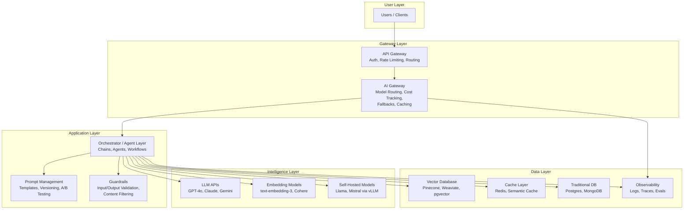
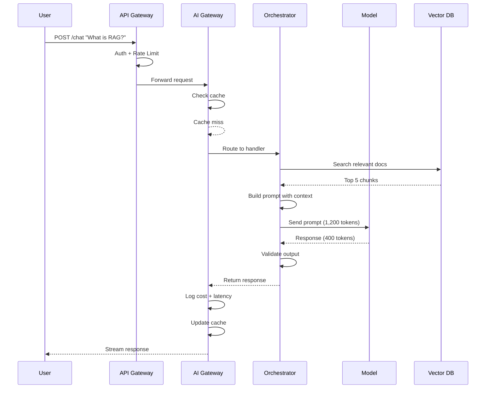
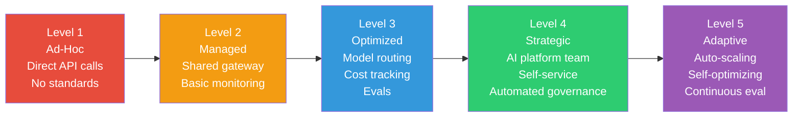

# 01 - What is AI Architecture?

## The Hospital Analogy

Building an AI system is like building a **hospital**, not just hiring doctors.

A doctor (the LLM) is brilliant — but without the building, the intake process, the billing system, the pharmacy, the triage protocol, and the emergency procedures, that doctor can't serve patients at scale. An **AI Architect** designs the hospital. They decide how patients flow through the system, which specialists to hire, how to handle emergencies, and how to keep costs under control.

## AI Architecture vs Traditional Software Architecture

| Dimension | Traditional Architecture | AI Architecture |
|---|---|---|
| **Behavior** | Deterministic — same input = same output | Probabilistic — same input ≈ similar output |
| **Testing** | Assert exact values | Evaluate quality ranges |
| **Errors** | Crashes, exceptions | Hallucinations, drift, toxicity |
| **Scaling cost** | Compute (CPU/RAM) | Tokens (pay per intelligence) |
| **Latency** | Milliseconds | Seconds (model inference) |
| **Versioning** | Code versions | Code + model + prompt versions |
| **Security** | SQL injection, XSS | Prompt injection, data leakage |

Traditional software is a **vending machine** — press B7, get chips. Always.
AI software is a **chef** — ask for "something spicy," and you'll get a great dish, but it might be different each time.

## The Role of an AI Architect

### Responsibilities

1. **System Design** — How do models, APIs, data stores, and UIs connect?
2. **Model Selection** — Which model for which task? GPT-4o for reasoning, Haiku for classification?
3. **Cost Management** — A single bad design can burn $50K/month in tokens
4. **Reliability Engineering** — Fallback models, retry strategies, graceful degradation
5. **Prompt Engineering Strategy** — Not writing prompts, but designing the *system* for prompts
6. **Guardrails & Safety** — Preventing hallucinations, injection attacks, toxic output
7. **Evaluation Design** — How do you know your AI system is actually working?

### Skills Required

- Traditional software architecture (you still need APIs, databases, queues)
- Understanding of ML/LLM capabilities and limitations
- Cost modeling and optimization
- Security mindset (prompt injection is the new SQL injection)
- Evaluation methodology (you can't unit-test creativity)

## How AI Systems Differ from Traditional Systems

### 1. Non-Determinism
```
Traditional: add(2, 3) → 5 (always)
AI:          summarize(article) → "The article discusses..." (varies)
```

### 2. Probabilistic Failures
AI systems don't crash — they **confidently give wrong answers**. This is worse than a crash because it's harder to detect.

### 3. Cost Scales with Usage Differently
Traditional: 1M requests costs ~$50/month (compute)
AI: 1M GPT-4o requests with 1K tokens each = **$2,500/month** (tokens)

### 4. Latency is Structural
You can't cache your way out of AI latency the way you can with traditional APIs. A 2-second model call is fundamentally different from a 2ms database read.

## The AI System Stack

Every production AI system has these layers:



### Layer Breakdown

| Layer | Purpose | Example Technologies |
|---|---|---|
| **API Gateway** | Auth, rate limiting, routing | Kong, AWS API Gateway, nginx |
| **AI Gateway** | Model routing, cost tracking, fallbacks | LiteLLM, Portkey, custom |
| **Orchestrator** | Chain calls, manage agents, workflows | LangChain, custom code |
| **Prompt Management** | Version, test, and manage prompts | Promptfoo, custom |
| **Guardrails** | Validate inputs/outputs, content safety | Guardrails AI, NeMo, custom |
| **Model Layer** | The actual intelligence | OpenAI, Anthropic, self-hosted |
| **Vector DB** | Semantic search for RAG | Pinecone, Weaviate, pgvector |
| **Observability** | Logging, tracing, evaluation | LangSmith, Langfuse, custom |

## The Request Lifecycle



## Why This Matters for an Architect

You are not building an app that *uses* AI. You are building an **AI system** — one where the model is a core component, not a plugin. Every decision you make (which model, how to prompt, where to cache, how to fallback) has direct cost, latency, and quality implications.

The difference between a toy demo and a production AI system is **architecture**. The model is 10% of the work. The other 90% is everything around it — the hospital, not the doctor.

## Key Takeaways

1. AI architecture adds new dimensions: non-determinism, token costs, prompt management
2. The AI architect owns the *system*, not just the model choice
3. Every layer in the stack exists for a reason — skip one, and production will teach you why
4. Cost is a first-class architectural concern, not an afterthought
5. Testing AI systems requires evaluation frameworks, not just unit tests

---
## Anti-Patterns
1. **"Just call GPT-4"** - Treating AI as a simple API call without architecture
2. **Monolithic AI** - Single model handling everything instead of specialized components
3. **No evaluation** - Shipping without measuring quality
4. **Security afterthought** - Adding guardrails after production incidents
5. **Over-engineering v1** - Building for 1M users when you have 100

## Trade-Offs Every AI Architect Faces
| Decision | Option A | Option B | When to Choose A |
|----------|----------|----------|-----------------|
| Accuracy vs Latency | More retrieval + reranking | Direct generation | High-stakes domains |
| Cost vs Quality | Expensive model | Cheap model + RAG | When wrong answers cost > $1 |
| Build vs Buy | Custom pipeline | Managed service | When AI is your core product |
| Flexibility vs Safety | Open prompts | Strict guardrails | Internal tools, low risk |

## Real-World Case Studies
- **Stripe** built AI architecture with evaluation-first: every model change requires passing eval suite
- **Notion AI** started with simple RAG, evolved to multi-agent after proving product-market fit
- **Cursor** invested heavily in context engineering (what to put in context window) as architectural differentiator

## Staff Architect Checklist
Before designing any AI system, answer these 10 questions:
1. What happens when the model is wrong? (failure mode)
2. How will you measure quality? (eval strategy)
3. What's the cost per query at target scale? (economics)
4. Who has access to what data? (security boundary)
5. How will you update the model/prompts? (deployment)
6. What's the latency budget? (user experience)
7. How will you handle abuse? (safety)
8. What's the rollback plan? (reliability)
9. Who owns this system? (organizational)
10. What's the 10x growth plan? (scaling)

---

## Staff-Level Responsibilities by Seniority

| Level | Focus | Example Decisions |
|-------|-------|-------------------|
| **Senior Engineer** | Single service/feature | "Which model for this endpoint? How to cache responses?" |
| **Staff Engineer** | Cross-team system design | "How should model routing work across all products? What's our prompt management strategy?" |
| **Principal/Distinguished** | Organizational strategy | "Should we build an internal AI platform? How do we standardize evaluation across 50 teams?" |

### What a Staff AI Architect Actually Owns

1. **AI Platform Strategy** — Defining shared infrastructure (gateways, prompt registries, eval frameworks) that other teams consume
2. **Model Governance** — Establishing policies for model selection, approval, and deprecation across the org
3. **Cost Accountability** — Setting per-team budgets, building cost attribution, flagging runaway spend
4. **Quality Standards** — Defining minimum eval thresholds before any AI feature ships
5. **Security Posture** — Cross-cutting guardrails, prompt injection defense patterns, data classification
6. **Technical Vision** — 6-12 month roadmap for AI capabilities, build-vs-buy decisions at org scale
7. **Cross-Team Alignment** — Preventing 5 teams from building 5 different RAG pipelines

---

## Architecture Maturity Model



| Level | Characteristics | Typical Org Size | Key Risk |
|-------|----------------|------------------|----------|
| 1 - Ad-Hoc | Teams call APIs directly, no shared infra | Startup, <20 eng | Cost surprises, inconsistency |
| 2 - Managed | Central gateway, basic logging | 20-100 eng | Limited observability |
| 3 - Optimized | Model routing, prompt versioning, evals | 100-500 eng | Platform team bottleneck |
| 4 - Strategic | Self-service platform, automated guardrails | 500+ eng | Over-engineering, slow iteration |
| 5 - Adaptive | ML-driven routing, auto-tuning, continuous improvement | Large enterprise | Complexity, debugging difficulty |

**Staff guidance:** Most companies should aim for Level 3. Levels 4-5 only make sense with dedicated platform teams and significant AI investment.

---

## Day-in-the-Life: AI Architect at Different Scales

### Startup (5-20 engineers)
- Morning: Debug why RAG quality dropped after a doc update
- Afternoon: Evaluate whether to switch from GPT-4o to Claude for the main product feature
- Evening: Set up cost alerts because yesterday's bill was 3x normal
- **Key challenge:** You ARE the AI platform. Everything is your problem.

### Scale-up (50-200 engineers)
- Morning: Review 3 teams' AI design docs; push back on unnecessary fine-tuning proposal
- Afternoon: Design shared evaluation framework that multiple teams can adopt
- Evening: Write RFC for centralized prompt registry after discovering 4 teams maintaining duplicate prompt logic
- **Key challenge:** Standardization without slowing teams down.

### Enterprise (500+ engineers)
- Morning: Present AI cost governance proposal to VP Engineering
- Afternoon: Work with security team on org-wide prompt injection defense strategy
- Evening: Evaluate vendor proposals for AI observability platform
- **Key challenge:** Influence without authority; driving adoption of standards across autonomous teams.

---

## Common Organizational Anti-Patterns

### 1. "Every Team Builds Their Own AI Stack"
**Symptom:** 8 teams, 8 different vector databases, 8 prompt management approaches, 8 separate OpenAI accounts.
**Impact:** Duplicated effort, no shared learnings, impossible to enforce security/governance.
**Fix:** Establish a thin AI platform layer (gateway + observability + prompt registry) that teams must use, but don't over-constrain their choices.

### 2. "AI Is Just Another API Call"
**Symptom:** AI features are treated identically to calling a REST API — no eval, no monitoring, no cost tracking.
**Impact:** Hallucinations reach production. $40K surprise bills. No one knows if the AI is actually helping users.
**Fix:** Mandate minimum eval coverage and cost budgets before any AI feature ships.

### 3. "The ML Team Owns All AI"
**Symptom:** A central ML team becomes a bottleneck for every product team wanting to use AI.
**Impact:** 6-month queue for "add a summarization feature." Product teams route around with shadow AI projects.
**Fix:** Platform model — ML team provides tools/infrastructure, product teams self-serve with guardrails.

### 4. "Ship First, Evaluate Later"
**Symptom:** AI features launch with no eval suite. Quality is measured by "feels good in demo."
**Impact:** Gradual quality degradation undetected. Model updates break features silently.
**Fix:** No AI feature ships without an eval dataset (minimum 50 examples) and automated quality monitoring.

### 5. "The Architect Astronaut"
**Symptom:** 6 months designing the perfect AI platform before any team has shipped an AI feature.
**Impact:** Requirements were wrong. Platform doesn't match actual needs. Teams built their own anyway.
**Fix:** Start with one team's real use case. Build the minimum shared infrastructure. Iterate based on actual adoption.

---

## Architecture Decision Records (ADR) Template for AI Systems

When making AI architecture decisions, document them formally:

```markdown
# ADR-XXX: [Decision Title]

## Status: [Proposed | Accepted | Deprecated]

## Context
What AI capability are we building? What constraints exist?

## Decision
What did we decide and why?

## Consequences
- Cost impact (projected $/month)
- Latency impact (p50, p99)
- Quality impact (eval score change)
- Operational complexity
- Security implications

## Alternatives Considered
What else did we evaluate? Why was it rejected?
```

**Staff habit:** Write an ADR for every decision that involves model selection, architecture pattern choice, or build-vs-buy. These become your institutional memory when the next person asks "why did we do it this way?"
