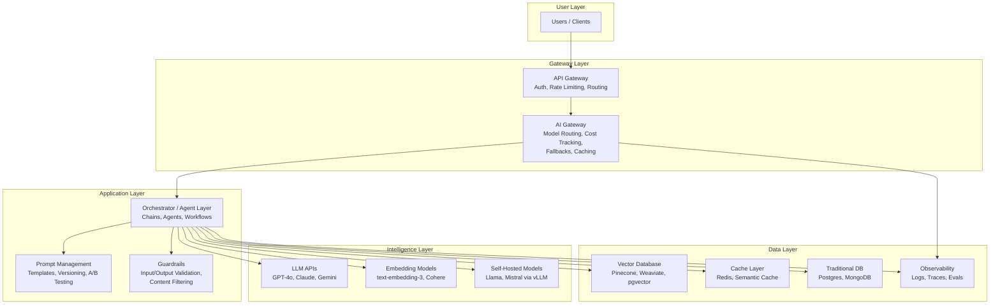
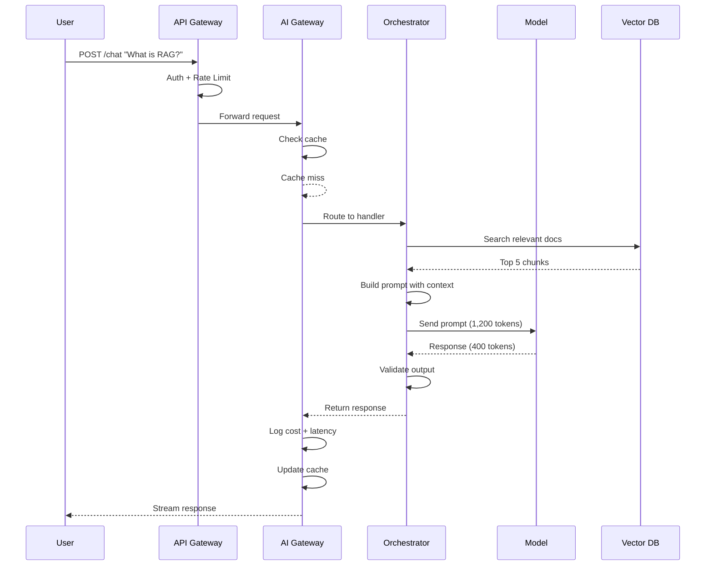

# 01 - What is AI Architecture?

## The Hospital Analogy

Building an AI system is like building a **hospital**, not just hiring doctors.

A doctor (the LLM) is brilliant — but without the building, the intake process, the billing system, the pharmacy, the triage protocol, and the emergency procedures, that doctor can't serve patients at scale. An **AI Architect** designs the hospital. They decide how patients flow through the system, which specialists to hire, how to handle emergencies, and how to keep costs under control.

## AI Architecture vs Traditional Software Architecture

| Dimension | Traditional Architecture | AI Architecture |
|---|---|---|
| **Behavior** | Deterministic — same input = same output | Probabilistic — same input ≈ similar output |
| **Testing** | Assert exact values | Evaluate quality ranges |
| **Errors** | Crashes, exceptions | Hallucinations, drift, toxicity |
| **Scaling cost** | Compute (CPU/RAM) | Tokens (pay per intelligence) |
| **Latency** | Milliseconds | Seconds (model inference) |
| **Versioning** | Code versions | Code + model + prompt versions |
| **Security** | SQL injection, XSS | Prompt injection, data leakage |

Traditional software is a **vending machine** — press B7, get chips. Always.
AI software is a **chef** — ask for "something spicy," and you'll get a great dish, but it might be different each time.

## The Role of an AI Architect

### Responsibilities

1. **System Design** — How do models, APIs, data stores, and UIs connect?
2. **Model Selection** — Which model for which task? GPT-4o for reasoning, Haiku for classification?
3. **Cost Management** — A single bad design can burn $50K/month in tokens
4. **Reliability Engineering** — Fallback models, retry strategies, graceful degradation
5. **Prompt Engineering Strategy** — Not writing prompts, but designing the *system* for prompts
6. **Guardrails & Safety** — Preventing hallucinations, injection attacks, toxic output
7. **Evaluation Design** — How do you know your AI system is actually working?

### Skills Required

- Traditional software architecture (you still need APIs, databases, queues)
- Understanding of ML/LLM capabilities and limitations
- Cost modeling and optimization
- Security mindset (prompt injection is the new SQL injection)
- Evaluation methodology (you can't unit-test creativity)

## How AI Systems Differ from Traditional Systems

### 1. Non-Determinism
```
Traditional: add(2, 3) → 5 (always)
AI:          summarize(article) → "The article discusses..." (varies)
```

### 2. Probabilistic Failures
AI systems don't crash — they **confidently give wrong answers**. This is worse than a crash because it's harder to detect.

### 3. Cost Scales with Usage Differently
Traditional: 1M requests costs ~$50/month (compute)
AI: 1M GPT-4o requests with 1K tokens each = **$2,500/month** (tokens)

### 4. Latency is Structural
You can't cache your way out of AI latency the way you can with traditional APIs. A 2-second model call is fundamentally different from a 2ms database read.

## The AI System Stack

Every production AI system has these layers:



### Layer Breakdown

| Layer | Purpose | Example Technologies |
|---|---|---|
| **API Gateway** | Auth, rate limiting, routing | Kong, AWS API Gateway, nginx |
| **AI Gateway** | Model routing, cost tracking, fallbacks | LiteLLM, Portkey, custom |
| **Orchestrator** | Chain calls, manage agents, workflows | LangChain, custom code |
| **Prompt Management** | Version, test, and manage prompts | Promptfoo, custom |
| **Guardrails** | Validate inputs/outputs, content safety | Guardrails AI, NeMo, custom |
| **Model Layer** | The actual intelligence | OpenAI, Anthropic, self-hosted |
| **Vector DB** | Semantic search for RAG | Pinecone, Weaviate, pgvector |
| **Observability** | Logging, tracing, evaluation | LangSmith, Langfuse, custom |

## The Request Lifecycle



## Why This Matters for an Architect

You are not building an app that *uses* AI. You are building an **AI system** — one where the model is a core component, not a plugin. Every decision you make (which model, how to prompt, where to cache, how to fallback) has direct cost, latency, and quality implications.

The difference between a toy demo and a production AI system is **architecture**. The model is 10% of the work. The other 90% is everything around it — the hospital, not the doctor.

## Key Takeaways

1. AI architecture adds new dimensions: non-determinism, token costs, prompt management
2. The AI architect owns the *system*, not just the model choice
3. Every layer in the stack exists for a reason — skip one, and production will teach you why
4. Cost is a first-class architectural concern, not an afterthought
5. Testing AI systems requires evaluation frameworks, not just unit tests
