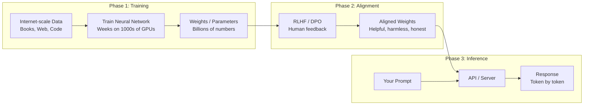
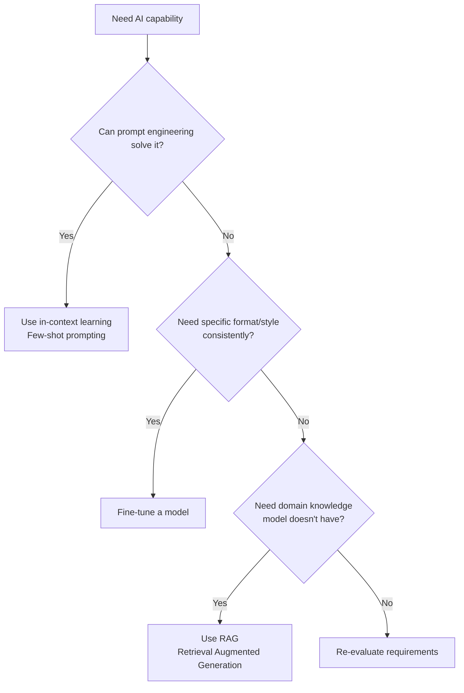
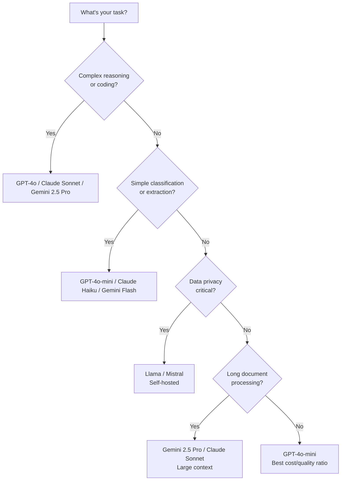

# 02 - LLM Fundamentals

## What is a Large Language Model?

### Explaining to a Smart 10-Year-Old

Imagine you've read every book in the world's biggest library — every novel, every textbook, every Wikipedia article, every Reddit comment. Now someone gives you the start of a sentence:

> "The capital of France is ___"

You'd guess "Paris" because you've seen that pattern thousands of times. That's essentially what an LLM does — it's a **very sophisticated pattern-completion machine** that has "read" most of the internet.

But here's the key: it doesn't *understand* Paris is a city. It knows that statistically, "Paris" is the most likely next word. This distinction matters enormously for architecture.

### The Formal Definition

A Large Language Model is a neural network with billions of parameters, trained on massive text datasets, that predicts the next token in a sequence. "Large" refers to parameter count (7B to 1T+) and training data (terabytes of text).

## How LLMs Work: The Three Phases



### Phase 1: Pre-Training
- Feed terabytes of text to the model
- The model learns to predict the next word
- Costs $10M-$100M+ in compute
- Takes weeks on thousands of GPUs
- Result: **base model** (knows language, not how to be helpful)

### Phase 2: Alignment (RLHF / DPO)
- Human raters rank model outputs
- Model learns to be helpful, harmless, and honest
- Transforms a text-completion engine into an assistant
- This is why ChatGPT answers questions instead of just completing text

### Phase 3: Inference (What You Use)
- Send a prompt, get a response
- Model generates tokens one at a time (auto-regressive)
- Each token takes ~10-50ms
- This is where your API costs come from

## The Transformer Architecture (Simplified)

The transformer is the architecture behind all modern LLMs. Published in 2017 as "Attention Is All You Need."

Think of it as an assembly line with three key stations:

### 1. Tokenizer (The Translator)
Converts text into numbers the model understands.
```
"Hello world" → [15496, 995]
```

### 2. Embedding Layer (The Meaning Mapper)
Converts each token into a rich vector that captures meaning.
```
[15496] → [0.23, -0.45, 0.12, ..., 0.67]  (768-4096 dimensions)
```
Words with similar meanings have similar vectors. "King" and "Queen" are close; "King" and "Bicycle" are far.

### 3. Attention Layers (The Relationship Builder)
This is the secret sauce. Multiple layers of attention blocks that figure out which words relate to which.

## Attention: The "Paying Attention in Class" Analogy

Imagine you're in a classroom reading this sentence:

> "The **cat** sat on the **mat** because **it** was tired."

What does "it" refer to? The cat or the mat? You know it's the cat because you **paid attention** to the right words.

The attention mechanism does exactly this — for every word, it computes how much to "look at" every other word:

```
"it" pays attention to:
  "cat"     → 0.72  (high - "it" probably means the cat)
  "sat"     → 0.08
  "mat"     → 0.15
  "tired"   → 0.05
```

**Multi-head attention** means the model has multiple "students" paying attention simultaneously — one might focus on grammar, another on meaning, another on sentiment. GPT-4 has 96+ attention heads.

## Pre-Training vs Fine-Tuning vs In-Context Learning

| Method | What It Does | Cost | When to Use |
|---|---|---|---|
| **Pre-training** | Train from scratch | $10M-$100M | Never (you're not OpenAI) |
| **Fine-tuning** | Adapt existing model to your data | $100-$10K | Specific format/style needs |
| **In-context learning** | Put examples in the prompt | $0 (just tokens) | First approach, always try this first |

### Decision Flow



**Architect's Rule**: Always start with prompting. Only fine-tune when prompting demonstrably fails and you have the data to prove it.

## Major Model Families

### Comparison Table (Mid-2025)

| Model Family | Provider | Top Model | Parameters | Context | Strengths |
|---|---|---|---|---|---|
| **GPT** | OpenAI | GPT-4o | Undisclosed | 128K | Reasoning, coding, multimodal |
| **Claude** | Anthropic | Claude 4 Sonnet | Undisclosed | 200K | Long context, safety, analysis |
| **Gemini** | Google | Gemini 2.5 Pro | Undisclosed | 1M | Multimodal, long context |
| **Llama** | Meta | Llama 4 | 405B (largest) | 128K | Open-source, self-hosting |
| **Mistral** | Mistral AI | Mistral Large | Undisclosed | 128K | Efficient, multilingual |
| **DeepSeek** | DeepSeek | DeepSeek-V3 | 685B (MoE) | 128K | Cost-efficient, open weights |

### Open-Source vs Closed-Source

| Factor | Open Source (Llama, Mistral) | Closed Source (GPT, Claude) |
|---|---|---|
| **Cost at scale** | Lower (self-host) | Higher (per-token) |
| **Initial setup** | Complex (GPUs, infra) | Simple (API key) |
| **Data privacy** | Full control | Data leaves your network |
| **Quality (top-tier)** | Slightly behind | Leading edge |
| **Customization** | Full (fine-tune, modify) | Limited (prompts, fine-tune API) |
| **Latency control** | Full control | Depends on provider |
| **Compliance** | Easier (on-premise) | Harder (third-party) |
| **Maintenance** | You own it | Provider handles it |

## When to Use Which Model



### The Tiered Model Strategy

Production systems should use **multiple models** — this is a key architectural pattern:

| Tier | Model Class | Use Case | Cost |
|---|---|---|---|
| **Tier 1** | GPT-4o / Claude Sonnet | Complex reasoning, customer-facing | $$$ |
| **Tier 2** | GPT-4o-mini / Haiku | Classification, routing, simple tasks | $ |
| **Tier 3** | Embedding models | Search, similarity, clustering | ¢ |
| **Tier 4** | Self-hosted (Llama) | High-volume, privacy-sensitive | Fixed cost |

## Why This Matters for an Architect

1. **Model selection is an architectural decision** — it affects cost, latency, quality, and privacy
2. **No single model fits all tasks** — design for multi-model from day one
3. **Understand inference costs** — they scale linearly with usage (no "free" scaling)
4. **In-context learning first** — fine-tuning is expensive and hard to maintain
5. **Open vs closed is a spectrum** — most systems use both
6. **Models improve rapidly** — your architecture must be model-agnostic

## Key Takeaways

- LLMs are pattern-completion machines, not reasoning engines (though they can approximate reasoning)
- The transformer's attention mechanism is what makes context-aware generation possible
- Always start with prompting, graduate to fine-tuning only with evidence
- Use tiered model strategies: expensive models for hard tasks, cheap models for easy ones
- Build model-agnostic: today's best model is tomorrow's second-best
