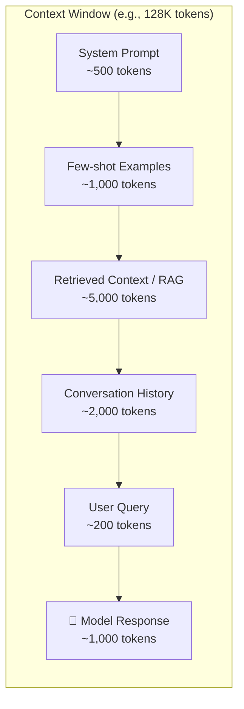
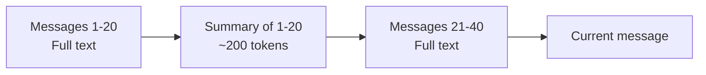
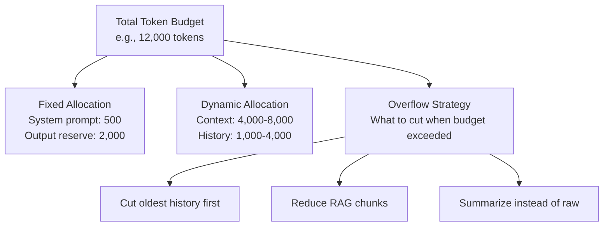

# 03 - Tokens and Context Windows

## What Are Tokens?

A token is the **smallest unit of text** an LLM processes. It's not a word, not a character — it's something in between.

Think of tokens like LEGO bricks. You can build words from them:

```
"Hello"          → 1 token  ["Hello"]
"Hello world"    → 2 tokens ["Hello", " world"]
"Tokenization"   → 3 tokens ["Token", "ization"]  (model-dependent)
"GPT-4"          → 3 tokens ["G", "PT", "-4"]
"こんにちは"       → 3-5 tokens (non-English uses more tokens)
```

### Rules of Thumb
- **1 token ≈ 4 characters** in English
- **1 token ≈ ¾ of a word**
- **100 tokens ≈ 75 words**
- **1 page of text ≈ 400-500 tokens**
- Non-English text uses **2-3x more tokens** than English
- Code uses more tokens than prose (special characters)

### Why Not Just Use Words?

Words are messy. "running", "runs", "ran" are different words but related. Subword tokenization captures this:
```
"unhappiness" → ["un", "happiness"]    — model understands both parts
"running"     → ["run", "ning"]         — model sees the root "run"
```

This lets models handle words they've never seen by composing from known parts.

## Tokenization Algorithms

| Algorithm | Used By | How It Works |
|---|---|---|
| **BPE** (Byte Pair Encoding) | GPT models, Llama | Start with characters, merge frequent pairs |
| **WordPiece** | BERT, some Google models | Similar to BPE but uses likelihood |
| **SentencePiece** | Llama, T5, multilingual models | Treats text as raw bytes, language-agnostic |

### BPE in 30 Seconds

1. Start: every character is a token → `["l", "o", "w", "e", "r"]`
2. Find most frequent pair → `("l", "o")` appears most
3. Merge it into one token → `["lo", "w", "e", "r"]`
4. Repeat 50,000-100,000 times
5. Result: a vocabulary of subword tokens

**Architect's note**: You don't pick the tokenizer — it comes with the model. But you must understand it because it directly affects your costs.

## Context Window: The "Desk Size" Analogy

Imagine your LLM is a student doing homework at a desk.

- **The desk** = context window
- **Papers on the desk** = all the tokens (your prompt + the response)
- **A small desk (4K tokens)** = can only hold a couple pages — forgets earlier material
- **A huge desk (1M tokens)** = can spread out entire textbooks

Everything the model "knows" during a conversation must fit on this desk. Once the desk is full, you can't add more without removing something.



**Critical insight**: Input tokens + output tokens must fit within the context window. If your prompt uses 120K of a 128K window, the model can only generate 8K tokens of response.

## Context Window Sizes (Mid-2025)

| Model | Context Window | Equivalent Pages | Equivalent |
|---|---|---|---|
| GPT-4o | 128K | ~250 pages | A short novel |
| GPT-4o-mini | 128K | ~250 pages | A short novel |
| Claude 4 Sonnet | 200K | ~400 pages | A long novel |
| Gemini 2.5 Pro | 1M | ~2,000 pages | An encyclopedia volume |
| Llama 4 (405B) | 128K | ~250 pages | A short novel |
| Mistral Large | 128K | ~250 pages | A short novel |

## Why Context Window Matters for Architecture

### 1. It Determines What the Model Can "See"

If a user uploads a 500-page PDF and your model has a 128K context window, you **cannot** send the entire PDF. You need a strategy:
- **RAG**: Search for relevant chunks and send only those
- **Summarization chain**: Summarize sections, then summarize summaries
- **Map-reduce**: Process chunks independently, then combine

### 2. Conversation History Management

Long conversations exceed the context window. You must decide:
- Truncate oldest messages?
- Summarize history periodically?
- Use a sliding window?

### 3. Cost Scales with Context Used

Even if the window is 128K, using all of it costs 128K tokens × price per token. **Bigger window ≠ use all of it.**

## Token Counting and Cost Calculation

### Real Pricing (approximate, mid-2025)

| Model | Input (per 1M tokens) | Output (per 1M tokens) |
|---|---|---|
| GPT-4o | $2.50 | $10.00 |
| GPT-4o-mini | $0.15 | $0.60 |
| Claude Sonnet 4 | $3.00 | $15.00 |
| Claude Haiku 3.5 | $0.80 | $4.00 |
| Gemini 2.5 Pro | $1.25 | $10.00 |
| Gemini 2.0 Flash | $0.10 | $0.40 |

### The Math

**Formula:**
```
Cost = (input_tokens × input_price / 1M) + (output_tokens × output_price / 1M)
```

**Example**: A 10K input token request to GPT-4o that generates 2K output tokens:
```
Cost = (10,000 × $2.50 / 1,000,000) + (2,000 × $10.00 / 1,000,000)
     = $0.025 + $0.02
     = $0.045 per request
```

**At scale**: 100K requests/day × $0.045 = **$4,500/day = $135,000/month**

Now do the same with GPT-4o-mini:
```
Cost = (10,000 × $0.15 / 1,000,000) + (2,000 × $0.60 / 1,000,000)
     = $0.0015 + $0.0012
     = $0.0027 per request
```
100K requests/day × $0.0027 = **$270/day = $8,100/month**

That's a **16x cost difference**. This is why model selection is an architectural decision.

## Context Window Management Strategies

### 1. Sliding Window
Keep only the last N messages. Simple but loses early context.

### 2. Summarize and Compress
Periodically summarize older messages into a compact form.



### 3. RAG (Retrieval Augmented Generation)
Don't put everything in context. Store documents in a vector database, retrieve only what's relevant.

### 4. Hierarchical Context
```
System prompt     → Always present (~500 tokens)
User profile      → Always present (~200 tokens)
Relevant history  → Retrieved on demand (~1,000 tokens)
Current query     → Always present (~200 tokens)
Retrieved docs    → Query-specific (~3,000 tokens)
```

### 5. Token Budgeting
Allocate a budget per component and enforce it:

| Component | Budget | Priority |
|---|---|---|
| System prompt | 500 tokens | Must have |
| Retrieved context | 4,000 tokens | Must have |
| Conversation history | 2,000 tokens | Should have |
| Few-shot examples | 1,000 tokens | Nice to have |
| Response space | 2,000 tokens | Must have |
| **Total** | **9,500 tokens** | |

## Why This Matters for an Architect

1. **Tokens are your unit of cost** — every architectural decision should consider token impact
2. **Context window is your primary constraint** — it determines what strategies you need (RAG, summarization)
3. **Non-English multiplies cost** — plan for 2-3x token usage for multilingual systems
4. **Model routing by complexity** saves 10-20x in costs
5. **Token budgets** should be defined in your architecture docs, not left to chance

## Key Takeaways

- Tokens are subword units, ~4 chars each in English
- Context window = how much the model can "see" at once
- Input + output must fit within the window
- Cost = tokens × price — small per request, massive at scale
- Always calculate: what does this design cost at 100K requests/day?
- Use token budgets to prevent context window overflow

---
## Anti-Patterns
1. **Not counting tokens** - Discovering overflow in production
2. **Wasting context on verbose prompts** - Every token costs money and attention
3. **Ignoring the "lost in the middle" problem** - Models attend poorly to middle of long contexts
4. **Fixed context allocation** - Same context strategy for simple and complex queries
5. **No token budget per component** - System prompt eating 50% of available context

## Trade-Offs
| Decision | Option A | Option B | Guidance |
|----------|----------|----------|----------|
| Long context vs RAG | Stuff everything in | Retrieve relevant only | RAG wins at >100 docs |
| Precise vs approximate counting | tiktoken (exact) | word/4 estimate | Use exact for production |
| Context priority | More examples | More retrieved docs | Depends on task type |

## Real-World Numbers (2025)
- GPT-4o: 128K context, ~$2.50/M input tokens
- Claude 3.5: 200K context, ~$3.00/M input tokens  
- Gemini 1.5 Pro: 2M context, ~$1.25/M input tokens
- Cost of max context: 200K tokens × $3/M = $0.60 per request
- At 1M requests/day with full context: $600K/day = $18M/month (this is why context management matters!)

---

## Token Budgeting Strategies for Production

### The Budget Allocation Framework

In production systems, every token must be justified. Define explicit budgets per component:



### Priority-Based Token Management

```python
# Production token budget manager
class TokenBudget:
    def __init__(self, max_tokens=12000, output_reserve=2000):
        self.max_input = max_tokens - output_reserve
        self.allocations = {
            "system_prompt": {"budget": 500, "priority": 1, "compressible": False},
            "user_query": {"budget": 500, "priority": 1, "compressible": False},
            "retrieved_context": {"budget": 5000, "priority": 2, "compressible": True},
            "conversation_history": {"budget": 3000, "priority": 3, "compressible": True},
            "few_shot_examples": {"budget": 1000, "priority": 4, "compressible": True},
        }
    
    def allocate(self, components: dict) -> dict:
        """Fit components within budget, cutting lowest priority first."""
        # Priority 1 items always included
        # Priority 4 items cut first when over budget
        ...
```

### Context Window Management at Scale

| Strategy | Latency Impact | Quality Impact | Implementation Complexity |
|----------|:-------------:|:--------------:|:------------------------:|
| Sliding window (drop old messages) | None | Medium loss | Low |
| Periodic summarization | +200ms | Low loss | Medium |
| RAG over conversation history | +100ms | Minimal loss | High |
| Hierarchical compression | +150ms | Low loss | High |
| Hybrid (summarize + retrieve) | +250ms | Minimal loss | Very High |

### Real Cost Calculations at Scale

**Scenario: Enterprise SaaS with 10K daily active users**

| Parameter | Conservative | Aggressive |
|-----------|:----------:|:---------:|
| Requests per user/day | 20 | 50 |
| Avg input tokens/request | 3,000 | 8,000 |
| Avg output tokens/request | 500 | 1,500 |
| Daily requests | 200K | 500K |
| Model | GPT-4o-mini | GPT-4o |

**Conservative (GPT-4o-mini):**
```
Input:  200K × 3,000 × $0.15/1M = $90/day
Output: 200K × 500 × $0.60/1M = $60/day
Total: $150/day = $4,500/month
```

**Aggressive (GPT-4o):**
```
Input:  500K × 8,000 × $2.50/1M = $10,000/day
Output: 500K × 1,500 × $10.00/1M = $7,500/day
Total: $17,500/day = $525,000/month
```

**The difference between smart and naive token management is $4,500/mo vs $525,000/mo.**

---

## Token Optimization Techniques

### 1. Prompt Compression
Remove redundant language while preserving meaning:
```
# Before (87 tokens)
"You are a helpful assistant. Your job is to help users with their questions. 
Please make sure to provide accurate information. If you don't know the answer, 
please let the user know that you don't have that information available."

# After (32 tokens)  
"You are a helpful assistant. Answer accurately. Say 'I don't know' when uncertain."
```
**Savings:** 63% fewer tokens per request.

### 2. Context Summarization
For long conversations, summarize older turns:
```
# Raw history: 3,000 tokens
Turn 1: User asked about pricing... (400 tokens)
Turn 2: Assistant explained tiers... (600 tokens)
Turn 3: User asked about enterprise... (400 tokens)
...

# Summarized: 200 tokens
"Previous conversation: User inquired about pricing tiers. 
Discussed Pro ($50/mo) and Enterprise (custom) plans. 
User is evaluating Enterprise for a 500-person team."
```

### 3. Selective RAG Retrieval
Don't retrieve K chunks blindly — use relevance scores:
```
# Bad: Always retrieve top 10 chunks (5,000 tokens)
# Good: Retrieve top 10, filter by relevance > 0.75, keep max 5
#   → Average 3 chunks used (1,500 tokens), 70% savings
```

### 4. Response Length Control
Set `max_tokens` appropriately per task type:

| Task | Appropriate max_tokens | Anti-pattern |
|------|:---------------------:|:------------:|
| Classification | 10-50 | 4,096 |
| Entity extraction | 200-500 | 4,096 |
| Summarization | 200-800 | 4,096 |
| Code generation | 1,000-2,000 | 4,096 |
| Long-form writing | 2,000-4,000 | 16,384 |

---

## Context Window Evolution Timeline

| Year | Largest Context | Model | Significance |
|------|:--------------:|-------|-------------|
| 2022 | 4K tokens | GPT-3.5 | Could barely fit a long email |
| 2023 Q1 | 32K tokens | GPT-4 | First "long context" era |
| 2023 Q3 | 100K tokens | Claude 2 | Could fit a short book |
| 2024 Q1 | 200K tokens | Claude 3 | Novel-length documents |
| 2024 Q2 | 1M tokens | Gemini 1.5 Pro | Multiple books simultaneously |
| 2024 Q4 | 2M tokens | Gemini 1.5 Pro | Entire codebases |
| 2025 | 1M+ standard | Multiple | Context is commoditized |

### Implications for Architects

1. **Longer context doesn't eliminate RAG** — cost scales linearly, so stuffing 1M tokens costs ~$3 per request
2. **"Lost in the middle" problem persists** — models attend poorly to information in the middle of very long contexts
3. **Hybrid strategies win** — use long context for always-needed info, RAG for query-specific retrieval
4. **Cost discipline matters more** — with bigger windows, the temptation to "just put it all in" grows, but so does the bill
