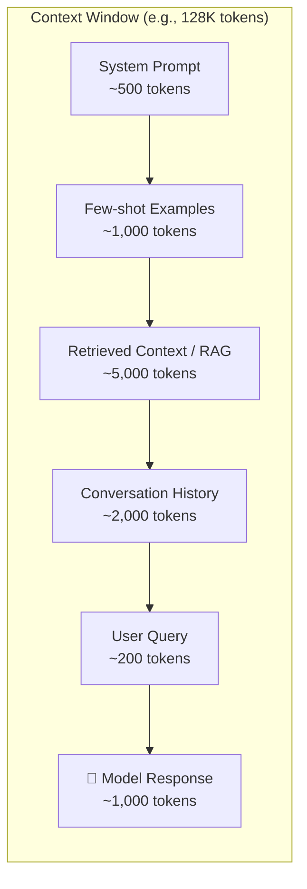
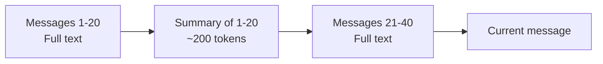

# 03 - Tokens and Context Windows

## What Are Tokens?

A token is the **smallest unit of text** an LLM processes. It's not a word, not a character — it's something in between.

Think of tokens like LEGO bricks. You can build words from them:

```
"Hello"          → 1 token  ["Hello"]
"Hello world"    → 2 tokens ["Hello", " world"]
"Tokenization"   → 3 tokens ["Token", "ization"]  (model-dependent)
"GPT-4"          → 3 tokens ["G", "PT", "-4"]
"こんにちは"       → 3-5 tokens (non-English uses more tokens)
```

### Rules of Thumb
- **1 token ≈ 4 characters** in English
- **1 token ≈ ¾ of a word**
- **100 tokens ≈ 75 words**
- **1 page of text ≈ 400-500 tokens**
- Non-English text uses **2-3x more tokens** than English
- Code uses more tokens than prose (special characters)

### Why Not Just Use Words?

Words are messy. "running", "runs", "ran" are different words but related. Subword tokenization captures this:
```
"unhappiness" → ["un", "happiness"]    — model understands both parts
"running"     → ["run", "ning"]         — model sees the root "run"
```

This lets models handle words they've never seen by composing from known parts.

## Tokenization Algorithms

| Algorithm | Used By | How It Works |
|---|---|---|
| **BPE** (Byte Pair Encoding) | GPT models, Llama | Start with characters, merge frequent pairs |
| **WordPiece** | BERT, some Google models | Similar to BPE but uses likelihood |
| **SentencePiece** | Llama, T5, multilingual models | Treats text as raw bytes, language-agnostic |

### BPE in 30 Seconds

1. Start: every character is a token → `["l", "o", "w", "e", "r"]`
2. Find most frequent pair → `("l", "o")` appears most
3. Merge it into one token → `["lo", "w", "e", "r"]`
4. Repeat 50,000-100,000 times
5. Result: a vocabulary of subword tokens

**Architect's note**: You don't pick the tokenizer — it comes with the model. But you must understand it because it directly affects your costs.

## Context Window: The "Desk Size" Analogy

Imagine your LLM is a student doing homework at a desk.

- **The desk** = context window
- **Papers on the desk** = all the tokens (your prompt + the response)
- **A small desk (4K tokens)** = can only hold a couple pages — forgets earlier material
- **A huge desk (1M tokens)** = can spread out entire textbooks

Everything the model "knows" during a conversation must fit on this desk. Once the desk is full, you can't add more without removing something.



**Critical insight**: Input tokens + output tokens must fit within the context window. If your prompt uses 120K of a 128K window, the model can only generate 8K tokens of response.

## Context Window Sizes (Mid-2025)

| Model | Context Window | Equivalent Pages | Equivalent |
|---|---|---|---|
| GPT-4o | 128K | ~250 pages | A short novel |
| GPT-4o-mini | 128K | ~250 pages | A short novel |
| Claude 4 Sonnet | 200K | ~400 pages | A long novel |
| Gemini 2.5 Pro | 1M | ~2,000 pages | An encyclopedia volume |
| Llama 4 (405B) | 128K | ~250 pages | A short novel |
| Mistral Large | 128K | ~250 pages | A short novel |

## Why Context Window Matters for Architecture

### 1. It Determines What the Model Can "See"

If a user uploads a 500-page PDF and your model has a 128K context window, you **cannot** send the entire PDF. You need a strategy:
- **RAG**: Search for relevant chunks and send only those
- **Summarization chain**: Summarize sections, then summarize summaries
- **Map-reduce**: Process chunks independently, then combine

### 2. Conversation History Management

Long conversations exceed the context window. You must decide:
- Truncate oldest messages?
- Summarize history periodically?
- Use a sliding window?

### 3. Cost Scales with Context Used

Even if the window is 128K, using all of it costs 128K tokens × price per token. **Bigger window ≠ use all of it.**

## Token Counting and Cost Calculation

### Real Pricing (approximate, mid-2025)

| Model | Input (per 1M tokens) | Output (per 1M tokens) |
|---|---|---|
| GPT-4o | $2.50 | $10.00 |
| GPT-4o-mini | $0.15 | $0.60 |
| Claude Sonnet 4 | $3.00 | $15.00 |
| Claude Haiku 3.5 | $0.80 | $4.00 |
| Gemini 2.5 Pro | $1.25 | $10.00 |
| Gemini 2.0 Flash | $0.10 | $0.40 |

### The Math

**Formula:**
```
Cost = (input_tokens × input_price / 1M) + (output_tokens × output_price / 1M)
```

**Example**: A 10K input token request to GPT-4o that generates 2K output tokens:
```
Cost = (10,000 × $2.50 / 1,000,000) + (2,000 × $10.00 / 1,000,000)
     = $0.025 + $0.02
     = $0.045 per request
```

**At scale**: 100K requests/day × $0.045 = **$4,500/day = $135,000/month**

Now do the same with GPT-4o-mini:
```
Cost = (10,000 × $0.15 / 1,000,000) + (2,000 × $0.60 / 1,000,000)
     = $0.0015 + $0.0012
     = $0.0027 per request
```
100K requests/day × $0.0027 = **$270/day = $8,100/month**

That's a **16x cost difference**. This is why model selection is an architectural decision.

## Context Window Management Strategies

### 1. Sliding Window
Keep only the last N messages. Simple but loses early context.

### 2. Summarize and Compress
Periodically summarize older messages into a compact form.



### 3. RAG (Retrieval Augmented Generation)
Don't put everything in context. Store documents in a vector database, retrieve only what's relevant.

### 4. Hierarchical Context
```
System prompt     → Always present (~500 tokens)
User profile      → Always present (~200 tokens)
Relevant history  → Retrieved on demand (~1,000 tokens)
Current query     → Always present (~200 tokens)
Retrieved docs    → Query-specific (~3,000 tokens)
```

### 5. Token Budgeting
Allocate a budget per component and enforce it:

| Component | Budget | Priority |
|---|---|---|
| System prompt | 500 tokens | Must have |
| Retrieved context | 4,000 tokens | Must have |
| Conversation history | 2,000 tokens | Should have |
| Few-shot examples | 1,000 tokens | Nice to have |
| Response space | 2,000 tokens | Must have |
| **Total** | **9,500 tokens** | |

## Why This Matters for an Architect

1. **Tokens are your unit of cost** — every architectural decision should consider token impact
2. **Context window is your primary constraint** — it determines what strategies you need (RAG, summarization)
3. **Non-English multiplies cost** — plan for 2-3x token usage for multilingual systems
4. **Model routing by complexity** saves 10-20x in costs
5. **Token budgets** should be defined in your architecture docs, not left to chance

## Key Takeaways

- Tokens are subword units, ~4 chars each in English
- Context window = how much the model can "see" at once
- Input + output must fit within the window
- Cost = tokens × price — small per request, massive at scale
- Always calculate: what does this design cost at 100K requests/day?
- Use token budgets to prevent context window overflow
