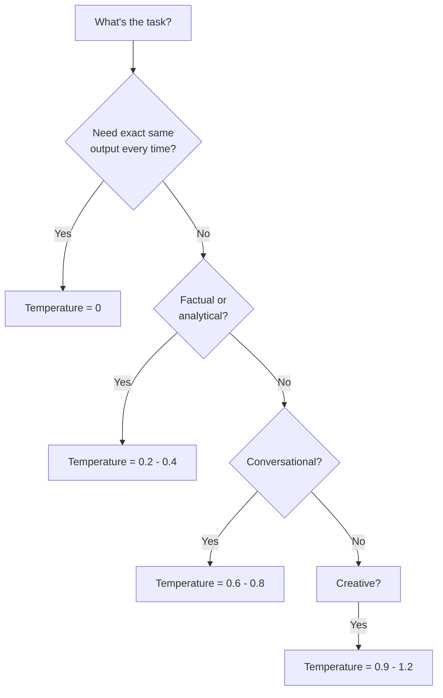

# 04 - Temperature and Sampling

## What is Temperature? The "Creativity Dial"

Temperature controls how **random** or **focused** the model's choices are when picking the next token.

### The Analogy

Imagine a restaurant where a chef picks dishes to recommend:

- **Temperature 0** — The chef always recommends the #1 most popular dish. Every. Single. Time. Predictable, safe, boring.
- **Temperature 0.7** — The chef usually picks popular dishes but sometimes surprises you with something interesting. Good balance.
- **Temperature 1.0** — The chef picks from all dishes, weighted by popularity but willing to go off-menu. Creative, sometimes weird.
- **Temperature 2.0** — The chef randomly grabs ingredients and improvises. Might be genius. Might be inedible.

### How It Actually Works

When the model generates the next token, it calculates a probability for every possible token:

```
Next token after "The capital of France is": 
  "Paris"     → 92%
  "the"       → 2%
  "a"         → 1%
  "Lyon"      → 0.5%
  "unknown"   → 0.3%
  ...thousands more with tiny probabilities
```

Temperature **reshapes** this distribution:

| Temperature | Effect | "Paris" prob | "Lyon" prob |
|---|---|---|---|
| **0** | Always pick highest | 100% | 0% |
| **0.3** | Sharpen distribution | 98% | 0.1% |
| **0.7** | Mild smoothing | 85% | 2% |
| **1.0** | Use raw probabilities | 75% | 5% |
| **1.5** | Flatten distribution | 50% | 15% |

**Mathematically**: `adjusted_prob = softmax(logits / temperature)`

## Temperature Examples

### Temperature 0 (Deterministic)
**Prompt**: "Write a greeting for a user named Alex"
```
Response 1: "Hello, Alex! Welcome back."
Response 2: "Hello, Alex! Welcome back."
Response 3: "Hello, Alex! Welcome back."
```
Same every time. Good for: data extraction, classification, factual answers.

### Temperature 0.7 (Balanced)
**Prompt**: "Write a greeting for a user named Alex"
```
Response 1: "Hello, Alex! Welcome back."
Response 2: "Hey Alex! Great to see you again."
Response 3: "Welcome back, Alex! How can I help today?"
```
Varied but coherent. Good for: chatbots, general assistants, content generation.

### Temperature 1.0 (Creative)
**Prompt**: "Write a greeting for a user named Alex"
```
Response 1: "Alex! The digital realm awaits your command."
Response 2: "Greetings, Alex — ready for another adventure?"
Response 3: "Hey there Alex! What's cooking today?"
```
More diverse, occasionally surprising. Good for: brainstorming, creative writing.

## Top-p (Nucleus Sampling)

Top-p is an alternative to temperature that limits which tokens are even *considered*.

**How it works**: Instead of considering all tokens, only consider tokens whose cumulative probability reaches `p`:

```
Top-p = 0.9 means: pick from the smallest set of tokens
that together have ≥90% probability

Probabilities: Paris(75%), the(8%), a(5%), Lyon(4%), city(3%), ...
Cumulative:    75%    83%   88%   92%  ← STOP here
                                        Only these 4 tokens are candidates
```

| Top-p | Effect |
|---|---|
| **0.1** | Only the top 1-2 tokens considered. Very focused. |
| **0.5** | Top handful of tokens. Conservative. |
| **0.9** | Most reasonable tokens included. Balanced. |
| **1.0** | All tokens considered (no filtering). |

### Temperature vs Top-p

| | Temperature | Top-p |
|---|---|---|
| **Controls** | How flat/sharp the distribution is | How many tokens are candidates |
| **Default** | 1.0 | 1.0 |
| **Best practice** | Adjust one, leave other at default | Adjust one, leave other at default |

**Don't adjust both simultaneously** — they interact unpredictably.

## Top-k Sampling

Simpler than top-p: only consider the top `k` tokens regardless of their probability.

```
Top-k = 5: Only the 5 most likely tokens are candidates.
```

- Less commonly exposed in APIs (OpenAI doesn't expose it)
- Used more in self-hosted models
- Less adaptive than top-p (k=50 might include garbage tokens for easy predictions)

## When to Use What

| Use Case | Temperature | Top-p | Why |
|---|---|---|---|
| **Data extraction** | 0 | 1.0 | Need exact, consistent output |
| **Classification** | 0 | 1.0 | Deterministic decisions |
| **Code generation** | 0 - 0.2 | 1.0 | Correctness over creativity |
| **Summarization** | 0.3 | 1.0 | Consistency with slight variation |
| **Chatbot** | 0.7 | 1.0 | Natural, varied conversation |
| **Creative writing** | 0.9 - 1.0 | 0.95 | Diversity and originality |
| **Brainstorming** | 1.0 | 0.9 | Maximum idea diversity |



## Frequency and Presence Penalties

These prevent the model from being repetitive.

### Frequency Penalty (0 to 2)
Penalizes tokens based on **how many times** they've appeared. Higher = less repetition.

```
frequency_penalty = 0:   "The cat sat on the mat. The cat..."  (repeats freely)
frequency_penalty = 1.0: "The cat sat on the mat. It then..."  (avoids repetition)
```

### Presence Penalty (0 to 2)
Penalizes tokens that have appeared **at all**, regardless of count. Encourages topic diversity.

```
presence_penalty = 0:   Stays on topic, may repeat themes
presence_penalty = 1.0: Introduces new topics and vocabulary
```

| Parameter | Good For | Default |
|---|---|---|
| Frequency penalty = 0.5 | Reducing word-level repetition | 0 |
| Presence penalty = 0.5 | Encouraging diverse vocabulary | 0 |

## Reproducibility in Production

### The Problem
Even at temperature 0, you may get slightly different outputs across API calls due to:
- Floating-point non-determinism in GPU computations
- Model updates by the provider
- Load balancing across different hardware

### Strategies for Reproducibility

1. **Use `seed` parameter** (OpenAI supports this) — makes output deterministic *for the same model version*
2. **Log everything** — prompt, parameters, response, model version
3. **Use structured output** — JSON mode or function calling constrains output
4. **Version your prompts** — treat them like code
5. **Snapshot model versions** — pin to specific model versions in production (e.g., `gpt-4o-2024-08-06`)

### Production Parameter Recommendations

| Parameter | Chatbot | Data Pipeline | Content Gen |
|---|---|---|---|
| temperature | 0.7 | 0 | 0.9 |
| top_p | 1.0 | 1.0 | 0.95 |
| frequency_penalty | 0.3 | 0 | 0.5 |
| presence_penalty | 0.2 | 0 | 0.3 |
| max_tokens | 1024 | 512 | 2048 |
| seed | — | Set fixed | — |

## Why This Matters for an Architect

1. **Temperature is a product decision, not just a tech one** — it affects user experience directly
2. **Different endpoints need different parameters** — your API extraction pipeline and your chatbot should NOT share the same settings
3. **Reproducibility is hard** — design for it from day one if you need it
4. **Parameter management** — store these in config, not hardcoded, so you can A/B test
5. **Cost implication** — higher temperature + higher max_tokens = potentially longer (more expensive) responses

## Key Takeaways

- Temperature 0 for facts, 0.7 for conversation, 1.0 for creativity
- Use temperature OR top-p, not both simultaneously
- Frequency/presence penalties prevent repetitive outputs
- True determinism is hard — use seeds and version pinning
- Treat sampling parameters as product configuration, versioned and testable

---
## Anti-Patterns
1. **Temperature 0 for everything** - Kills creativity for generative tasks
2. **Temperature 1.0 for production** - Too random for reliable outputs
3. **Ignoring top_p** - Temperature alone doesn't give fine control
4. **Not testing temperature with eval** - Guessing instead of measuring
5. **Same temperature across use cases** - Classification needs 0, brainstorming needs 0.8

## Trade-Offs
| Use Case | Recommended Temp | top_p | Reasoning |
|----------|:----------------:|:-----:|-----------|
| Classification | 0 | 1.0 | Need consistency |
| Code generation | 0.2 | 0.95 | Mostly correct, slight variation |
| Creative writing | 0.7-0.9 | 0.95 | Want diversity |
| Data extraction | 0 | 1.0 | Must be exact |
| Conversation | 0.4-0.6 | 0.9 | Natural but focused |

## Real-World Insight
OpenAI's temperature=0 is NOT truly deterministic - there's a "seed" parameter for reproducibility but even then hardware-level floating point differences can cause variation. For true reproducibility, cache your outputs.

---

## Production Sampling Configurations

### Comprehensive Use Case Table

| Use Case | temp | top_p | freq_penalty | pres_penalty | max_tokens | seed | Rationale |
|----------|:----:|:-----:|:------------:|:------------:|:----------:|:----:|-----------|
| JSON extraction | 0 | 1.0 | 0 | 0 | 500 | Fixed | Must be parseable, consistent |
| SQL generation | 0 | 1.0 | 0 | 0 | 300 | Fixed | Correctness critical |
| Classification | 0 | 1.0 | 0 | 0 | 10 | Fixed | Single token answer needed |
| Summarization (factual) | 0.2 | 1.0 | 0.3 | 0 | 500 | — | Slight variation OK, no repetition |
| Customer support chat | 0.5 | 0.9 | 0.5 | 0.3 | 1024 | — | Natural but focused |
| Product descriptions | 0.7 | 0.95 | 0.8 | 0.5 | 300 | — | Creative, unique per product |
| Email drafting | 0.6 | 0.95 | 0.3 | 0.2 | 500 | — | Professional variety |
| Brainstorming / ideation | 1.0 | 0.9 | 0.5 | 0.8 | 2048 | — | Maximum diversity |
| Story generation | 0.9 | 0.95 | 0.7 | 0.6 | 4096 | — | Creative, non-repetitive |
| Code review comments | 0.3 | 1.0 | 0.2 | 0.1 | 1024 | — | Mostly consistent, some variety |
| Search query expansion | 0.8 | 0.9 | 1.0 | 1.0 | 100 | — | Diverse reformulations |
| Translation | 0.1 | 1.0 | 0 | 0 | 2048 | Fixed | Accuracy over creativity |

---

## A/B Testing Temperature Settings

### Methodology

Temperature is one of the easiest parameters to A/B test because it doesn't require code changes:

```python
# A/B test configuration
experiments = {
    "support_chatbot_temp": {
        "variants": [
            {"name": "conservative", "temperature": 0.4, "weight": 0.33},
            {"name": "balanced", "temperature": 0.6, "weight": 0.34},
            {"name": "creative", "temperature": 0.8, "weight": 0.33},
        ],
        "metrics": ["user_satisfaction", "resolution_rate", "escalation_rate"],
        "minimum_sample": 1000,  # per variant
        "duration_days": 14,
    }
}
```

### What to Measure

| Metric | Lower Temperature Wins | Higher Temperature Wins |
|--------|:---------------------:|:----------------------:|
| Factual accuracy | ✅ | |
| User satisfaction (creative tasks) | | ✅ |
| Output diversity (unique responses) | | ✅ |
| Parse success rate (structured output) | ✅ | |
| User engagement (clicks, follows) | | ✅ |
| Escalation rate (support) | ✅ | |
| Completion rate (users finish flow) | ✅ | |

### Real-World Results (Anonymized)

A B2B SaaS company tested temperature for their support chatbot:
- **temp=0.3**: 89% resolution rate, 3.2/5 satisfaction ("robotic, but correct")
- **temp=0.6**: 85% resolution rate, 4.1/5 satisfaction ("helpful and natural")
- **temp=0.9**: 78% resolution rate, 3.8/5 satisfaction ("creative but sometimes off")

**Winner:** 0.6 — best balance of correctness and user experience.

---

## Sampling Parameter Tuning Methodology

### Step 1: Start with Defaults
Begin every new use case with `temperature=0.7, top_p=1.0, no penalties`. This is the "control."

### Step 2: Identify the Failure Mode
- Outputs too repetitive? → Increase frequency_penalty (0.3-0.8)
- Outputs too random/incoherent? → Decrease temperature (try 0.3-0.5)
- Outputs too "safe"/boring? → Increase temperature (try 0.8-1.0)
- Outputs stuck on same topics? → Increase presence_penalty (0.3-0.6)
- Need exact consistency? → Set temperature=0, use seed

### Step 3: Evaluate Systematically
Never tune based on 3-5 examples. Run at minimum 100 test cases:

```python
# Parameter sweep evaluation
results = []
for temp in [0, 0.3, 0.5, 0.7, 0.9]:
    for trial in range(100):
        response = call_model(prompt=test_prompts[trial], temperature=temp)
        score = evaluate(response, expected[trial])
        results.append({"temp": temp, "trial": trial, "score": score})

# Analyze: mean score, variance, worst-case performance
```

### Step 4: Monitor in Production
Parameters that work in testing may degrade over time as model providers update:
- Track quality metrics weekly
- Alert on score drops >5%
- Re-run parameter sweep quarterly or after model version changes

---

## Impact on Output Quality and Cost

### Temperature's Hidden Cost Impact

Higher temperature → longer outputs (on average) → more tokens → more cost:

| Temperature | Avg Output Length (tokens) | Relative Cost | Quality (eval score) |
|:-----------:|:-------------------------:|:-------------:|:-------------------:|
| 0 | 180 | 1.0x | 0.82 |
| 0.3 | 195 | 1.08x | 0.84 |
| 0.5 | 210 | 1.17x | 0.83 |
| 0.7 | 240 | 1.33x | 0.80 |
| 1.0 | 300 | 1.67x | 0.74 |

*Based on 10K sample summarization task. Your numbers will vary.*

**Insight:** At temperature=1.0, you pay ~67% more in output tokens for ~10% lower quality. The cost-quality tradeoff is nonlinear.

### max_tokens as a Cost Lever

Setting appropriate `max_tokens` is the simplest cost optimization most teams miss:

```
# Anti-pattern: default max_tokens for everything
response = openai.chat(model="gpt-4o", max_tokens=4096, ...)  # Classification using 4096 budget

# Better: task-appropriate limits
TASK_LIMITS = {
    "classify": 20,
    "extract_json": 500,
    "summarize": 300,
    "generate_email": 800,
    "code_generation": 2000,
}
```

At 100K requests/day, reducing average max_tokens from 4096 to 500 (for tasks that don't need it) saves output token costs by preventing the model from over-generating before natural stop.
