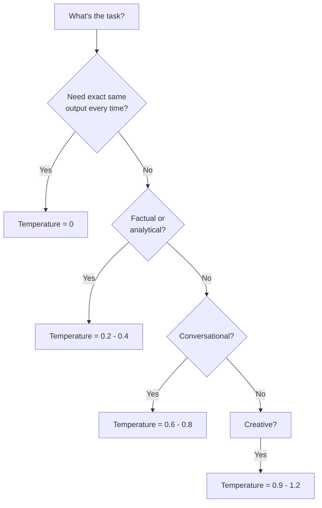

# 04 - Temperature and Sampling

## What is Temperature? The "Creativity Dial"

Temperature controls how **random** or **focused** the model's choices are when picking the next token.

### The Analogy

Imagine a restaurant where a chef picks dishes to recommend:

- **Temperature 0** — The chef always recommends the #1 most popular dish. Every. Single. Time. Predictable, safe, boring.
- **Temperature 0.7** — The chef usually picks popular dishes but sometimes surprises you with something interesting. Good balance.
- **Temperature 1.0** — The chef picks from all dishes, weighted by popularity but willing to go off-menu. Creative, sometimes weird.
- **Temperature 2.0** — The chef randomly grabs ingredients and improvises. Might be genius. Might be inedible.

### How It Actually Works

When the model generates the next token, it calculates a probability for every possible token:

```
Next token after "The capital of France is": 
  "Paris"     → 92%
  "the"       → 2%
  "a"         → 1%
  "Lyon"      → 0.5%
  "unknown"   → 0.3%
  ...thousands more with tiny probabilities
```

Temperature **reshapes** this distribution:

| Temperature | Effect | "Paris" prob | "Lyon" prob |
|---|---|---|---|
| **0** | Always pick highest | 100% | 0% |
| **0.3** | Sharpen distribution | 98% | 0.1% |
| **0.7** | Mild smoothing | 85% | 2% |
| **1.0** | Use raw probabilities | 75% | 5% |
| **1.5** | Flatten distribution | 50% | 15% |

**Mathematically**: `adjusted_prob = softmax(logits / temperature)`

## Temperature Examples

### Temperature 0 (Deterministic)
**Prompt**: "Write a greeting for a user named Alex"
```
Response 1: "Hello, Alex! Welcome back."
Response 2: "Hello, Alex! Welcome back."
Response 3: "Hello, Alex! Welcome back."
```
Same every time. Good for: data extraction, classification, factual answers.

### Temperature 0.7 (Balanced)
**Prompt**: "Write a greeting for a user named Alex"
```
Response 1: "Hello, Alex! Welcome back."
Response 2: "Hey Alex! Great to see you again."
Response 3: "Welcome back, Alex! How can I help today?"
```
Varied but coherent. Good for: chatbots, general assistants, content generation.

### Temperature 1.0 (Creative)
**Prompt**: "Write a greeting for a user named Alex"
```
Response 1: "Alex! The digital realm awaits your command."
Response 2: "Greetings, Alex — ready for another adventure?"
Response 3: "Hey there Alex! What's cooking today?"
```
More diverse, occasionally surprising. Good for: brainstorming, creative writing.

## Top-p (Nucleus Sampling)

Top-p is an alternative to temperature that limits which tokens are even *considered*.

**How it works**: Instead of considering all tokens, only consider tokens whose cumulative probability reaches `p`:

```
Top-p = 0.9 means: pick from the smallest set of tokens
that together have ≥90% probability

Probabilities: Paris(75%), the(8%), a(5%), Lyon(4%), city(3%), ...
Cumulative:    75%    83%   88%   92%  ← STOP here
                                        Only these 4 tokens are candidates
```

| Top-p | Effect |
|---|---|
| **0.1** | Only the top 1-2 tokens considered. Very focused. |
| **0.5** | Top handful of tokens. Conservative. |
| **0.9** | Most reasonable tokens included. Balanced. |
| **1.0** | All tokens considered (no filtering). |

### Temperature vs Top-p

| | Temperature | Top-p |
|---|---|---|
| **Controls** | How flat/sharp the distribution is | How many tokens are candidates |
| **Default** | 1.0 | 1.0 |
| **Best practice** | Adjust one, leave other at default | Adjust one, leave other at default |

**Don't adjust both simultaneously** — they interact unpredictably.

## Top-k Sampling

Simpler than top-p: only consider the top `k` tokens regardless of their probability.

```
Top-k = 5: Only the 5 most likely tokens are candidates.
```

- Less commonly exposed in APIs (OpenAI doesn't expose it)
- Used more in self-hosted models
- Less adaptive than top-p (k=50 might include garbage tokens for easy predictions)

## When to Use What

| Use Case | Temperature | Top-p | Why |
|---|---|---|---|
| **Data extraction** | 0 | 1.0 | Need exact, consistent output |
| **Classification** | 0 | 1.0 | Deterministic decisions |
| **Code generation** | 0 - 0.2 | 1.0 | Correctness over creativity |
| **Summarization** | 0.3 | 1.0 | Consistency with slight variation |
| **Chatbot** | 0.7 | 1.0 | Natural, varied conversation |
| **Creative writing** | 0.9 - 1.0 | 0.95 | Diversity and originality |
| **Brainstorming** | 1.0 | 0.9 | Maximum idea diversity |



## Frequency and Presence Penalties

These prevent the model from being repetitive.

### Frequency Penalty (0 to 2)
Penalizes tokens based on **how many times** they've appeared. Higher = less repetition.

```
frequency_penalty = 0:   "The cat sat on the mat. The cat..."  (repeats freely)
frequency_penalty = 1.0: "The cat sat on the mat. It then..."  (avoids repetition)
```

### Presence Penalty (0 to 2)
Penalizes tokens that have appeared **at all**, regardless of count. Encourages topic diversity.

```
presence_penalty = 0:   Stays on topic, may repeat themes
presence_penalty = 1.0: Introduces new topics and vocabulary
```

| Parameter | Good For | Default |
|---|---|---|
| Frequency penalty = 0.5 | Reducing word-level repetition | 0 |
| Presence penalty = 0.5 | Encouraging diverse vocabulary | 0 |

## Reproducibility in Production

### The Problem
Even at temperature 0, you may get slightly different outputs across API calls due to:
- Floating-point non-determinism in GPU computations
- Model updates by the provider
- Load balancing across different hardware

### Strategies for Reproducibility

1. **Use `seed` parameter** (OpenAI supports this) — makes output deterministic *for the same model version*
2. **Log everything** — prompt, parameters, response, model version
3. **Use structured output** — JSON mode or function calling constrains output
4. **Version your prompts** — treat them like code
5. **Snapshot model versions** — pin to specific model versions in production (e.g., `gpt-4o-2024-08-06`)

### Production Parameter Recommendations

| Parameter | Chatbot | Data Pipeline | Content Gen |
|---|---|---|---|
| temperature | 0.7 | 0 | 0.9 |
| top_p | 1.0 | 1.0 | 0.95 |
| frequency_penalty | 0.3 | 0 | 0.5 |
| presence_penalty | 0.2 | 0 | 0.3 |
| max_tokens | 1024 | 512 | 2048 |
| seed | — | Set fixed | — |

## Why This Matters for an Architect

1. **Temperature is a product decision, not just a tech one** — it affects user experience directly
2. **Different endpoints need different parameters** — your API extraction pipeline and your chatbot should NOT share the same settings
3. **Reproducibility is hard** — design for it from day one if you need it
4. **Parameter management** — store these in config, not hardcoded, so you can A/B test
5. **Cost implication** — higher temperature + higher max_tokens = potentially longer (more expensive) responses

## Key Takeaways

- Temperature 0 for facts, 0.7 for conversation, 1.0 for creativity
- Use temperature OR top-p, not both simultaneously
- Frequency/presence penalties prevent repetitive outputs
- True determinism is hard — use seeds and version pinning
- Treat sampling parameters as product configuration, versioned and testable
