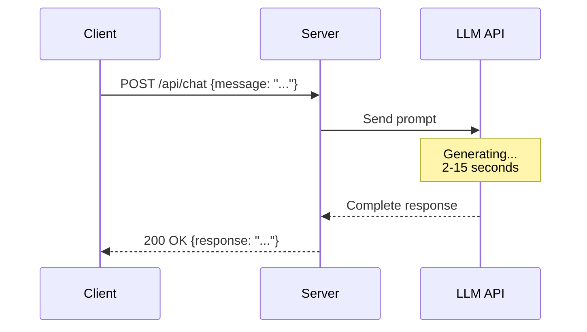
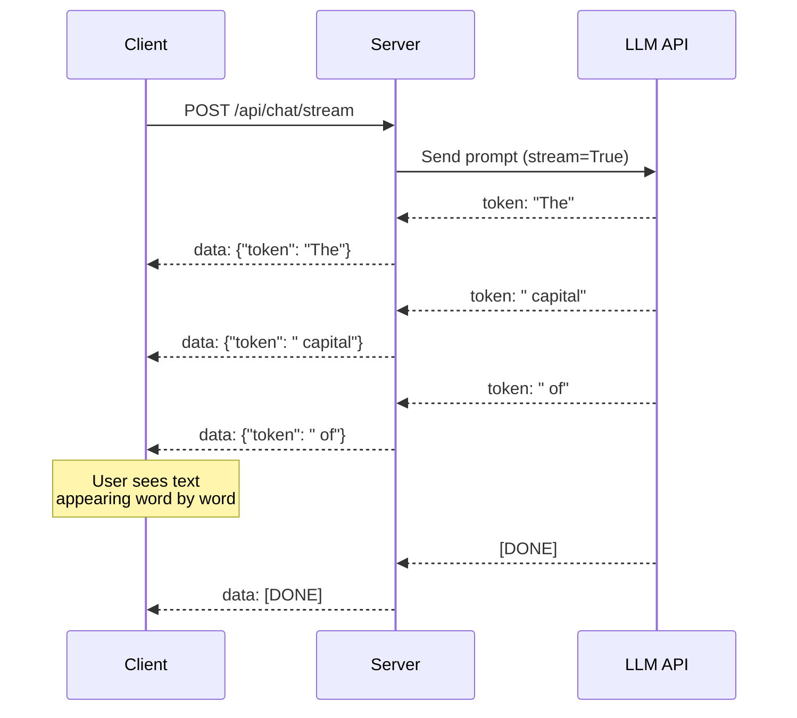
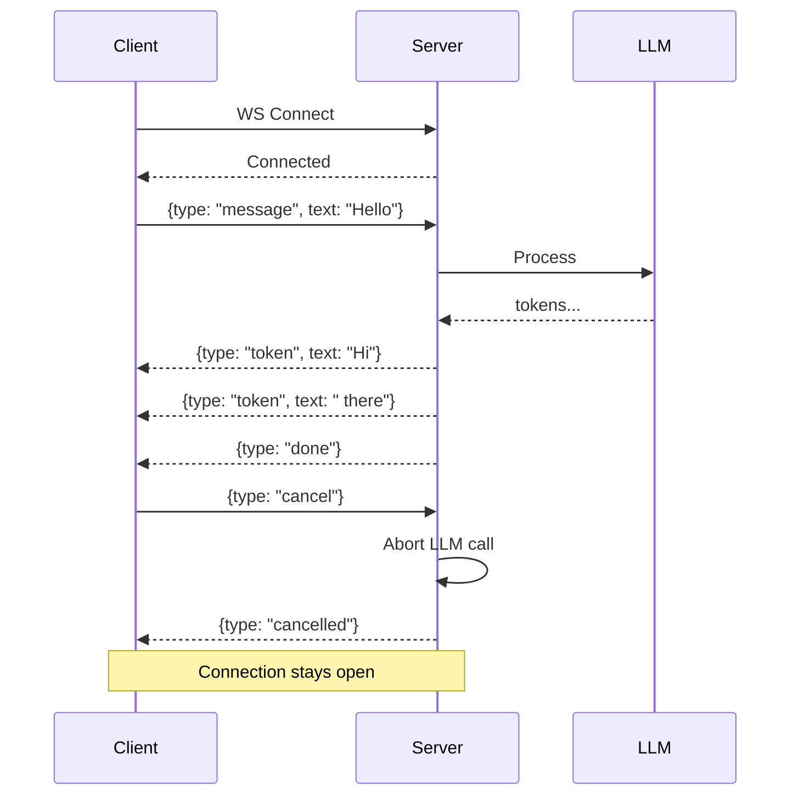
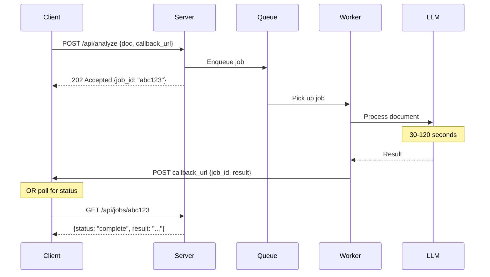
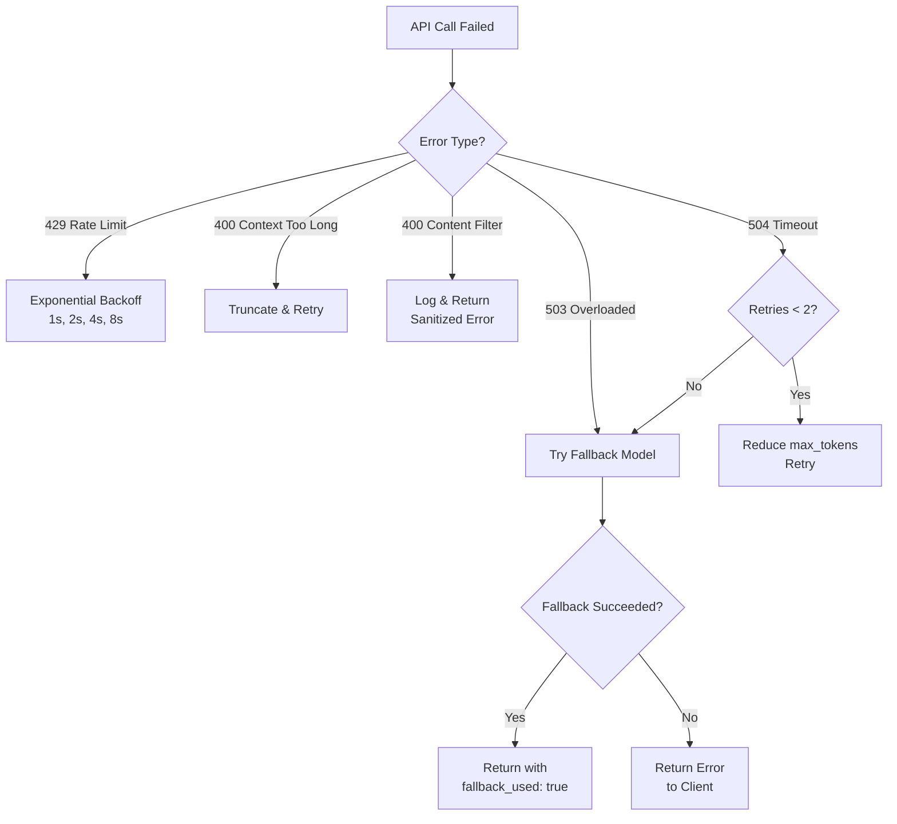

# 05 - API Design for AI Services

## Why AI APIs Are Different

Traditional APIs return data in milliseconds. AI APIs:
- Take **2-30 seconds** to respond (model inference is slow)
- Return **variable-length** responses (can't predict output size)
- **Cost money per call** (tokens aren't free compute)
- Can **fail creatively** (hallucinations, not just 500 errors)
- Benefit enormously from **streaming** (users see partial results)

These differences demand specific API design patterns.

## Pattern 1: Simple REST (Non-Streaming)

The simplest pattern. Client sends request, waits for complete response.



**When to use**: Background processing, data extraction pipelines, non-interactive use cases.

**Problem**: User stares at a spinner for 5-15 seconds. Terrible UX for chat.

```python
# Server endpoint
@app.post("/api/chat")
async def chat(request: ChatRequest):
    response = client.chat.completions.create(
        model="gpt-4o",
        messages=[{"role": "user", "content": request.message}],
    )
    return {"response": response.choices[0].message.content}
```

## Pattern 2: Server-Sent Events (SSE) Streaming

The **most common pattern** for LLM applications. Server pushes tokens as they're generated.



**Time-to-first-token**: ~200-500ms (vs 5-15s for full response)
**User perception**: "The AI is thinking and typing" vs "Is it broken?"

```python
# SSE streaming endpoint
@app.post("/api/chat/stream")
async def chat_stream(request: ChatRequest):
    async def generate():
        stream = client.chat.completions.create(
            model="gpt-4o",
            messages=[{"role": "user", "content": request.message}],
            stream=True,
        )
        for chunk in stream:
            if chunk.choices[0].delta.content:
                yield f"data: {json.dumps({'token': chunk.choices[0].delta.content})}\n\n"
        yield "data: [DONE]\n\n"

    return StreamingResponse(generate(), media_type="text/event-stream")
```

### SSE Protocol Basics
```
HTTP/1.1 200 OK
Content-Type: text/event-stream
Cache-Control: no-cache
Connection: keep-alive

data: {"token": "The"}

data: {"token": " answer"}

data: {"token": " is"}

data: [DONE]
```

Each message is prefixed with `data: ` and separated by double newlines.

## Pattern 3: WebSocket for Real-Time AI

For bidirectional, persistent connections — voice AI, real-time collaboration, interactive agents.



**When to use**:
- Voice/audio AI (real-time speech)
- Collaborative AI editing
- When client needs to **cancel** mid-generation
- Multi-turn rapid interactions

**When NOT to use**: Simple chatbots (SSE is simpler and sufficient).

## Pattern 4: Async with Webhooks

For long-running AI tasks (document processing, batch analysis).



**When to use**: Document processing, batch jobs, anything taking >30 seconds.

## Request/Response Design Patterns

### Standard AI Chat Request
```json
{
  "model": "gpt-4o",
  "messages": [
    {"role": "system", "content": "You are a helpful assistant."},
    {"role": "user", "content": "Explain quantum computing."}
  ],
  "temperature": 0.7,
  "max_tokens": 1024,
  "stream": false,
  "metadata": {
    "user_id": "usr_123",
    "session_id": "sess_456",
    "request_id": "req_789"
  }
}
```

### Standard AI Chat Response
```json
{
  "request_id": "req_789",
  "model": "gpt-4o-2024-08-06",
  "response": "Quantum computing uses quantum bits...",
  "usage": {
    "input_tokens": 42,
    "output_tokens": 156,
    "total_tokens": 198,
    "estimated_cost_usd": 0.0018
  },
  "latency_ms": 2340,
  "finish_reason": "stop"
}
```

**Always include in responses**: token usage, latency, model version, cost estimate, finish reason.

## Error Handling for AI APIs

AI APIs have unique failure modes:

| Error | HTTP Code | Retry? | Strategy |
|---|---|---|---|
| Rate limited | 429 | Yes | Exponential backoff |
| Model overloaded | 503 | Yes | Fallback to another model |
| Context too long | 400 | No | Truncate input, retry |
| Content filtered | 400 | No | Modify prompt, log for review |
| Timeout | 504 | Yes | Reduce max_tokens, try faster model |
| Invalid API key | 401 | No | Alert, don't retry |
| Hallucination | 200 ✓ | — | Output validation / guardrails |

**The dangerous one**: Hallucinations return HTTP 200. Your API thinks everything is fine. You need **output validation** beyond HTTP status codes.

### Error Response Design
```json
{
  "error": {
    "code": "context_length_exceeded",
    "message": "Input tokens (135000) exceed model maximum (128000)",
    "suggestion": "Reduce input to under 128000 tokens or use a model with larger context",
    "model": "gpt-4o",
    "input_tokens": 135000,
    "max_tokens": 128000
  },
  "fallback_attempted": true,
  "fallback_model": "gemini-2.5-pro",
  "fallback_result": "success"
}
```

### Retry Strategy



## API Versioning for AI Services

AI APIs need versioning more than traditional APIs because:
- Prompt formats change with model updates
- Model capabilities evolve (new features, deprecated behaviors)
- Output quality changes between model versions

### Recommended Strategy

```
/api/v1/chat          ← Stable, production
/api/v2/chat          ← New features, beta
/api/v1/chat?model_version=2024-08-06  ← Pin model version
```

Version your **prompts** independently from your API:
```json
{
  "prompt_version": "summarizer-v3.2",
  "model": "gpt-4o-2024-08-06",
  "api_version": "v1"
}
```

## Why This Matters for an Architect

1. **Streaming is not optional** — any user-facing AI needs SSE streaming for acceptable UX
2. **Time-to-first-token** is your key UX metric, not total latency
3. **Always include usage data** in responses — you can't optimize what you don't measure
4. **Fallback chains are essential** — model A fails → try model B → try model C
5. **HTTP 200 doesn't mean success** — AI can return confident garbage with a 200 status
6. **Version everything** — API, prompts, models, and parameters independently

## Key Takeaways

- Use SSE streaming for all user-facing AI endpoints
- WebSocket only when you need bidirectional communication
- Async/webhooks for long-running AI tasks
- Always return token usage and cost estimates in responses
- Implement fallback model chains — single-model is a single point of failure
- AI error handling must go beyond HTTP status codes

---
## Anti-Patterns
1. **Synchronous-only for long tasks** - Users get timeouts; use async + webhooks
2. **No request IDs** - Can't debug production issues
3. **Unbounded response size** - max_tokens not set, streaming not implemented
4. **No rate limiting** - Single user can exhaust your API budget
5. **Breaking changes without versioning** - AI output format changes break consumers
6. **No idempotency** - Retry causes duplicate processing and double billing

## Trade-Offs
| Pattern | Pros | Cons | Use When |
|---------|------|------|----------|
| Sync request/response | Simple | Timeout risk | <5s responses |
| Streaming (SSE) | Great UX | Complex error handling | User-facing chat |
| Async + polling | No timeouts | Higher latency | Long tasks (>30s) |
| Async + webhooks | Efficient | Requires webhook infra | Backend processing |

## Real-World API Design Examples
- **OpenAI API**: Streaming via SSE, structured output mode, tool_choice parameter
- **Anthropic API**: Message-based with system/user/assistant, content blocks for multi-modal
- **Cohere API**: Separate endpoints for different capabilities (chat, embed, rerank)
