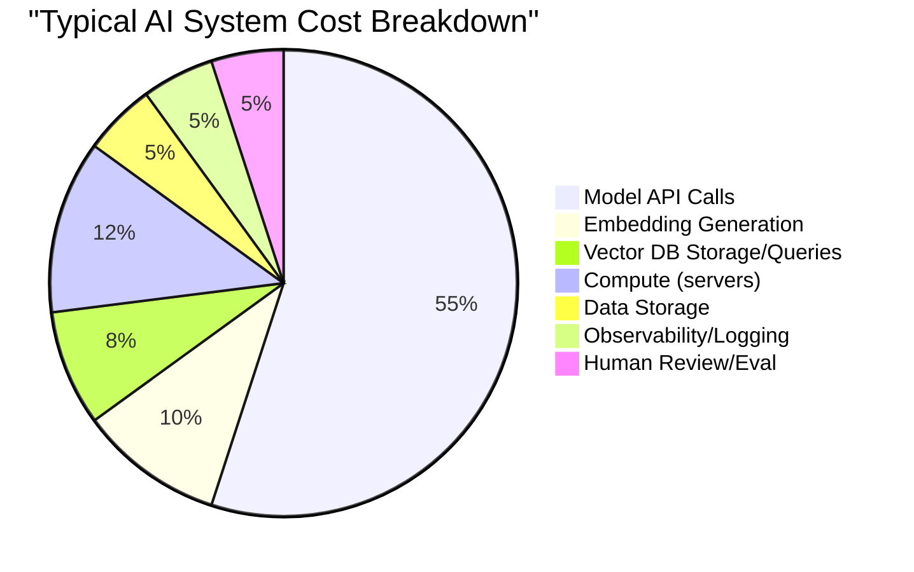

# 06 - Cost Architecture for AI Systems

## The Uncomfortable Truth

AI is the first major technology where **intelligence has a per-unit cost**. Every API call burns money. Unlike traditional software where compute costs are relatively fixed, AI costs scale linearly with usage — and can bankrupt a project overnight.

A single misconfigured loop calling GPT-4o can cost $10,000 in an hour. This isn't theoretical — it happens.

## Cost Components of AI Systems



### Detailed Breakdown

| Component | Cost Driver | Scales With |
|---|---|---|
| **LLM API calls** | Tokens in + tokens out | Request volume × prompt size |
| **Embedding generation** | Tokens embedded | Document ingestion volume |
| **Vector DB** | Storage + queries | Corpus size + query volume |
| **Fine-tuning** | Training tokens | Dataset size × epochs |
| **Self-hosted models** | GPU hours | Uptime + concurrency |
| **Guardrails/moderation** | API calls for validation | Request volume |
| **Observability** | Log storage + processing | Request volume |

## Token Costs by Model (Mid-2025)

| Model | Input / 1M tokens | Output / 1M tokens | Relative Cost |
|---|---|---|---|
| GPT-4o | $2.50 | $10.00 | ████████ |
| GPT-4o-mini | $0.15 | $0.60 | █ |
| Claude Sonnet 4 | $3.00 | $15.00 | ██████████ |
| Claude Haiku 3.5 | $0.80 | $4.00 | ███ |
| Gemini 2.5 Pro | $1.25 | $10.00 | ███████ |
| Gemini 2.0 Flash | $0.10 | $0.40 | █ |
| Llama 4 (self-hosted) | ~$0.20* | ~$0.20* | █ |

*Self-hosted costs depend on GPU pricing and utilization.

## Cost Per Request Calculation

### Formula

```
Cost per request = (input_tokens × input_price) + (output_tokens × output_price)
                   + embedding_cost + guardrail_cost + infra_overhead
```

### Worked Example: RAG Chatbot

A single RAG chatbot query:

| Component | Tokens | Price | Cost |
|---|---|---|---|
| System prompt | 500 input | $2.50/1M | $0.00125 |
| Retrieved context (RAG) | 3,000 input | $2.50/1M | $0.0075 |
| User query | 100 input | $2.50/1M | $0.00025 |
| Conversation history | 1,400 input | $2.50/1M | $0.0035 |
| Model response | 500 output | $10.00/1M | $0.005 |
| Embedding (query) | 100 | $0.02/1M | $0.000002 |
| **Total per request** | | | **$0.0175** |

**Monthly at 50K requests/day**: $0.0175 × 50,000 × 30 = **$26,250/month**

With GPT-4o-mini instead: ~**$1,575/month** (16x cheaper)

## Cost Optimization Strategies

### 1. Model Routing (Impact: 🔥🔥🔥)
Route simple queries to cheap models, complex ones to expensive models.
```
"What time is it?" → GPT-4o-mini ($0.001)
"Analyze this legal contract for risks" → GPT-4o ($0.05)
```

### 2. Prompt Compression (Impact: 🔥🔥)
Reduce token count without losing quality. Remove verbose instructions, use abbreviations the model understands.

### 3. Response Caching (Impact: 🔥🔥🔥)
Cache identical or semantically similar queries. Even a 20% cache hit rate saves 20% of costs.

- **Exact match**: Hash the prompt, cache the response
- **Semantic cache**: Embed the prompt, find similar cached results

### 4. Context Window Management (Impact: 🔥🔥)
Don't stuff the context window. Only include what's necessary.
- Summarize conversation history instead of including raw messages
- Retrieve fewer but more relevant RAG chunks

### 5. Max Token Limits (Impact: 🔥)
Set `max_tokens` appropriately. A classification task doesn't need 4,000 output tokens.

### 6. Batching (Impact: 🔥🔥)
OpenAI offers 50% discount for batch API (24-hour turnaround). Use for non-real-time tasks.

### 7. Fine-Tuning for Prompt Reduction (Impact: 🔥🔥)
A fine-tuned model can follow your format with a 50-token prompt instead of a 500-token few-shot prompt. 10x input reduction per request.

### 8. Embedding Model Optimization (Impact: 🔥)
Use smaller embedding dimensions when full precision isn't needed. `text-embedding-3-small` vs `text-embedding-3-large`.

### 9. Request Deduplication (Impact: 🔥)
Multiple users asking the same question within seconds? Deduplicate and share the response.

### 10. Streaming Cancellation (Impact: 🔥)
If a user navigates away mid-stream, **cancel the API call**. Don't generate tokens nobody will read.

### 11. Tiered Quality (Impact: 🔥🔥)
Free users get GPT-4o-mini. Paid users get GPT-4o. Enterprise gets Claude Sonnet with extended context.

### 12. Off-Peak Processing (Impact: 🔥)
Schedule non-urgent tasks for off-peak hours when some providers offer lower rates.

### 13. Prompt Template Optimization (Impact: 🔥🔥)
A/B test prompt variants not just for quality but for token efficiency. Two prompts can achieve the same quality with 30% fewer tokens.

## Budget Planning for AI Projects

### Monthly Budget Template

| Category | Small Project | Medium | Enterprise |
|---|---|---|---|
| LLM API costs | $500 | $5,000 | $50,000+ |
| Embedding costs | $50 | $500 | $5,000 |
| Vector DB | $0 (free tier) | $100 | $2,000 |
| Compute (API servers) | $50 | $500 | $5,000 |
| Observability | $0 | $200 | $2,000 |
| Buffer (30%) | $180 | $1,890 | $19,200 |
| **Total** | **$780** | **$8,190** | **$83,200** |

**Always add 30% buffer** — usage spikes, prompt changes, and model price changes happen.

### Cost Alerts

Set alerts at:
- 50% of daily budget (warning)
- 80% of daily budget (alert)
- 100% of daily budget (circuit breaker — stop non-critical calls)

## Cost Per Quality Unit

Raw cost per request is misleading. What matters is **cost per successful outcome**.

```
Cost per quality unit = Total AI cost / Number of successful outcomes
```

**Example**: Customer support bot
- Cost: $5,000/month in API calls
- Handles: 10,000 tickets
- Successfully resolved without human: 7,000 (70%)
- Cost per resolved ticket: $5,000 / 7,000 = **$0.71/ticket**
- Human agent cost per ticket: **$12-15/ticket**

Even with a 30% escalation rate, the AI is **17x cheaper** per resolved ticket.

## Build vs Buy Cost Analysis

### When to Use APIs (Buy)

| Factor | Favors API |
|---|---|
| Volume | < 1M requests/month |
| Team | No ML infra expertise |
| Speed | Need to ship fast |
| Model quality | Need frontier capabilities |
| Variety | Need multiple model types |

### When to Self-Host (Build)

| Factor | Favors Self-Hosting |
|---|---|
| Volume | > 5M requests/month |
| Privacy | Data cannot leave your network |
| Latency | Need < 200ms p99 |
| Customization | Need deep fine-tuning |
| Compliance | Regulatory requirements |

### Break-Even Analysis

```
API cost at volume V:     V × cost_per_token × avg_tokens
Self-host cost:           GPU_cost_per_month + engineering_time + maintenance

Break-even when:          API cost > Self-host cost
```

**Rough numbers** (Llama 70B on 4x A100):
- GPU cost: ~$10,000/month (cloud) or ~$120,000 one-time (on-prem)
- Can serve: ~500 requests/minute
- Equivalent API cost: ~$15,000-25,000/month at that volume

**Self-hosting makes sense above ~$15K/month in API costs**, assuming you have the team to maintain it.

### The Hidden Costs of Self-Hosting

Don't forget:
- ML engineer salary ($150-250K/year)
- GPU procurement and maintenance
- Model updates and redeployment
- Monitoring and on-call
- Lower quality than frontier models (usually)

## Why This Matters for an Architect

1. **Cost is a first-class requirement** — include it in every design doc
2. **Model routing alone can cut costs 10-20x** — this is your biggest lever
3. **Measure cost per quality unit**, not just cost per request
4. **Set circuit breakers** — a runaway loop can burn your monthly budget in hours
5. **Plan for 3x growth** — usage grows faster than you expect
6. **Build vs buy is a moving target** — re-evaluate quarterly as prices change

## Key Takeaways

- AI costs scale linearly with usage — there's no "free" tier at scale
- Model routing is the single highest-impact optimization
- Always calculate: what does this design cost at 10x current volume?
- Cost per quality unit matters more than cost per request
- Self-hosting breaks even around $15K/month in API costs
- Set budget alerts and circuit breakers — production AI needs financial guardrails
