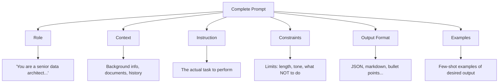
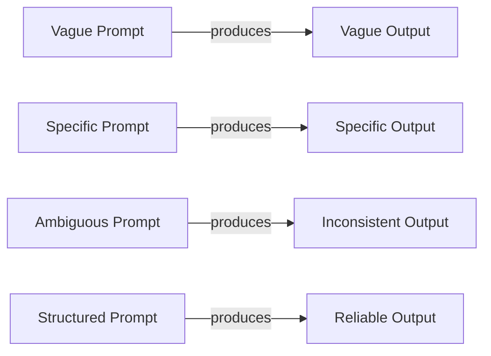

# Prompt Engineering Fundamentals

## The "Instruction Writing" Analogy

Imagine you're hiring a brilliant new employee who has read every book ever written, speaks every language, and can solve complex problems — but they take everything literally and have zero context about your specific situation. **Prompt engineering is the art of writing instructions so clear that this brilliant-but-context-less worker does exactly what you need.**

It's not "asking nicely." It's engineering. The same way you wouldn't ship code without tests, you shouldn't ship prompts without rigorous design.

## Why Prompt Quality is the #1 Lever

| Lever | Impact | Cost to Change |
|-------|--------|----------------|
| Model upgrade (GPT-3.5 → GPT-4) | 20-40% improvement | $$$$ (10x cost) |
| **Prompt engineering** | **50-300% improvement** | **Free** |
| Fine-tuning | 10-30% improvement | $$$ (data + compute) |
| RAG (retrieval) | 30-50% improvement | $$ (infrastructure) |

A well-engineered prompt on a cheaper model often outperforms a lazy prompt on an expensive model. This is the first optimization an architect should reach for.

## The Anatomy of a Prompt

Every effective prompt has up to six components:



### 1. Role (Who are you?)
```
You are a senior security engineer with 15 years of experience in cloud infrastructure.
```
**Why it works:** Activates relevant "knowledge clusters" in the model. Like telling an actor what character to play.

### 2. Context (What's the situation?)
```
We're migrating a healthcare application from on-prem to AWS. The app handles PHI data under HIPAA regulations. Current architecture uses PostgreSQL and a monolithic Java backend.
```

### 3. Instruction (What do you want?)
```
Review the following architecture diagram and identify the top 5 security risks.
```

### 4. Constraints (What are the boundaries?)
```
- Focus only on network-level and data-level risks
- Do not suggest application-level code changes
- Prioritize by likelihood × impact
```

### 5. Output Format (How should it look?)
```
Return as a JSON array with fields: risk_name, severity (critical/high/medium/low), description, mitigation
```

### 6. Examples (Show me what you mean)
```
Example: {"risk_name": "Unencrypted S3 bucket", "severity": "critical", ...}
```

## System Prompt vs User Prompt vs Assistant Prompt

| Type | Who writes it | When it's set | Purpose |
|------|--------------|---------------|---------|
| **System prompt** | Developer/Architect | At application start | Sets behavior, personality, constraints for the entire conversation |
| **User prompt** | End user (or your code) | Every turn | The actual request or input |
| **Assistant prompt** | The model | Every response | Model's output (can be pre-filled to steer) |

```python
messages = [
    {"role": "system", "content": "You are a helpful coding assistant. Always include type hints."},  # System
    {"role": "user", "content": "Write a function to calculate fibonacci numbers"},                    # User
    {"role": "assistant", "content": "```python\ndef fibonacci(n: int) -> int:\n"}                    # Assistant (pre-filled)
]
```

**Architect insight:** The system prompt is your "constitution" — it governs all interactions. User prompts are individual requests. Pre-filling assistant prompts forces the model to continue in a specific direction.

## Prompt Templates and Variables

Production prompts are never hardcoded strings. They're templates:

```python
CLASSIFICATION_PROMPT = """
You are a {role} specializing in {domain}.

## Task
Classify the following {input_type} into one of these categories: {categories}

## Input
{user_input}

## Rules
- If uncertain, choose "{default_category}"
- Confidence must be above {threshold}%
- {additional_constraints}

## Output Format
{{"category": "...", "confidence": ..., "reasoning": "..."}}
"""
```

This separates **prompt logic** from **prompt data** — the same principle as separating code from config.

## The "Garbage In, Garbage Out" Principle



**Bad prompt:** "Summarize this document"
- What length? For what audience? What to focus on? What format?

**Good prompt:** "Summarize this document in 3 bullet points for a C-level executive who needs to make a go/no-go decision on this project. Focus on risks, timeline, and budget impact."

## Prompt Engineering is Engineering

| Engineering Practice | Prompt Engineering Equivalent |
|---------------------|-------------------------------|
| Unit tests | Evaluation datasets with expected outputs |
| Version control | Prompt versioning (track changes) |
| Code review | Prompt review (does this handle edge cases?) |
| Monitoring | Track output quality metrics in production |
| Documentation | Document what each prompt does and why |
| Separation of concerns | Modular prompts (one task per prompt) |
| Contract testing | Output schema validation |

## Why This Matters for an Architect

1. **Prompts are code.** They should be versioned, reviewed, tested, and deployed with the same rigor as application code.
2. **Prompt design determines system behavior.** A poorly designed prompt creates unpredictable systems that fail in production.
3. **Cost optimization starts here.** Better prompts mean fewer tokens, fewer retries, cheaper models.
4. **Security surface.** Prompts are attack vectors (injection). Architects must treat them as security-critical.
5. **The prompt IS the specification.** Unlike traditional code where spec → implementation, in AI systems the prompt is both.

## Key Takeaways

- A prompt has 6 components: role, context, instruction, constraints, format, examples
- System prompts set behavior; user prompts make requests
- Use templates with variables for production systems
- Treat prompts as engineering artifacts, not casual text
- Prompt quality has more ROI than model upgrades in most cases
