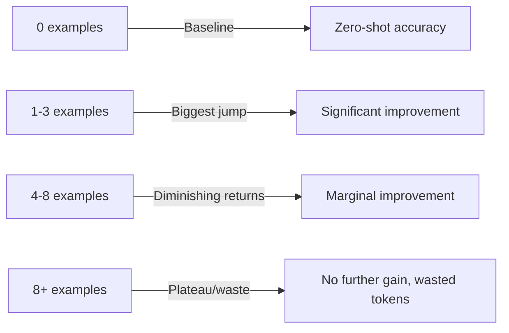
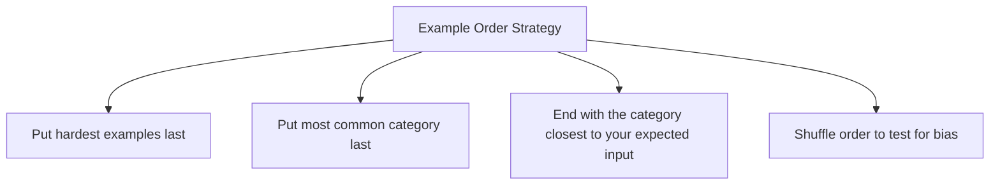

# Zero-Shot and Few-Shot Prompting

## The "Show, Don't Just Tell" Principle

Think of it like teaching a new employee:
- **Zero-shot:** "Classify these support tickets by urgency." (Just the instruction)
- **One-shot:** "Here's an example of a high-urgency ticket: [example]. Now classify these."
- **Few-shot:** "Here are 5 classified tickets showing each urgency level. Now classify these."

The more examples you show, the more the model understands *what you actually mean* — not just what you literally said.

## Zero-Shot Prompting

Give instructions only. No examples. Rely on the model's pre-training.

```
Classify the following customer review as positive, negative, or neutral:

Review: "The product arrived on time but the packaging was damaged. The item itself works fine."

Classification:
```

**When it works well:**
- Simple, well-defined tasks
- Newer, more capable models (GPT-4, Claude 3.5)
- Standard formats the model has seen millions of times
- When you need diverse/creative outputs

**When it fails:**
- Ambiguous definitions (what does "urgent" mean to YOU?)
- Custom formats the model hasn't seen
- Edge cases where your definition differs from common usage

## One-Shot Prompting

One example sets the pattern. Surprisingly powerful.

```
Extract the action items from meeting notes.

Example:
Input: "We need to update the landing page by Friday. Sarah will handle the copy."
Output: [{"task": "Update landing page", "assignee": "Sarah", "deadline": "Friday"}]

Now extract from:
Input: "John mentioned we should revisit the pricing model. No timeline set yet."
Output:
```

## Few-Shot Prompting

Multiple examples create a robust pattern. The model infers the "rule" from examples.

```
Classify the intent of customer messages:

Message: "I can't log into my account" → Intent: account_access
Message: "How much does the pro plan cost?" → Intent: pricing_inquiry  
Message: "Cancel my subscription immediately" → Intent: cancellation
Message: "Your product is amazing, love it!" → Intent: feedback_positive
Message: "The API returns 500 errors" → Intent: technical_issue

Message: "I want to upgrade to enterprise" → Intent:
```

## How Many Examples is Optimal?



| Shot Count | Best For | Trade-off |
|-----------|----------|-----------|
| 0 (zero) | Simple tasks, creative work | No token cost, but less control |
| 1-2 | Format demonstration | Minimal cost, shows structure |
| 3-5 | Classification, extraction | Sweet spot for most tasks |
| 5-8 | Complex/ambiguous tasks | Higher cost, diminishing returns |
| 8+ | Rarely justified | Better to fine-tune at this point |

**Research finding:** 3-5 examples typically capture 90%+ of the benefit. Beyond that, you're burning tokens for marginal gains.

## Example Selection Strategies

### 1. Diverse Examples (Cover the Space)
Don't show 5 examples that are all the same category. Cover the range:

```
# BAD: All positive examples
"Great product!" → positive
"Love it!" → positive
"Amazing quality" → positive

# GOOD: Cover all categories + edge cases
"Great product!" → positive
"Terrible experience" → negative
"It's okay, nothing special" → neutral
"The worst thing I've ever bought, but customer service was helpful" → mixed
"" → invalid_input
```

### 2. Edge-Case Examples (Show the Hard Ones)
Models handle obvious cases well. Show them the tricky ones:

```
# These are the cases that trip up the model:
"I'm not unhappy with it" → positive (double negative)
"Could be worse" → neutral (backhanded)
"10/10 would NOT recommend" → negative (sarcasm)
```

### 3. Representative Examples (Match the Distribution)
If 80% of your real inputs are technical questions, most examples should be technical questions.

## The Order of Examples Matters

Models exhibit **recency bias** — the last examples have more influence.



**Experiment:** If classifying mostly negative reviews, put a negative example last. If the task is ambiguous, put the edge case last to prime the model.

## When Zero-Shot Outperforms Few-Shot

With modern models (GPT-4o, Claude 3.5 Sonnet), zero-shot sometimes wins because:

1. **Examples can constrain creativity** — if you need diverse outputs, examples create a "template lock"
2. **Misleading examples confuse** — bad examples are worse than no examples
3. **Token budget** — examples consume context that could hold more relevant information
4. **Well-known tasks** — for standard tasks (translation, summarization), the model already knows the format

**Rule of thumb:** Start with zero-shot. Add examples only when output quality is insufficient or inconsistent.

## Practical Examples

### Classification (Sentiment)

```python
# Zero-shot
prompt = "Classify as positive/negative/neutral: '{text}'"

# Few-shot (3 examples)
prompt = """Classify sentiment:
"Best purchase ever!" → positive
"Broke after one day" → negative  
"It does what it says" → neutral

"{text}" →"""
```

### Extraction (Entities)

```python
# Few-shot extraction
prompt = """Extract entities from text as JSON.

Text: "Apple CEO Tim Cook announced the iPhone 15 in Cupertino on September 12."
Entities: {"people": ["Tim Cook"], "orgs": ["Apple"], "products": ["iPhone 15"], "locations": ["Cupertino"], "dates": ["September 12"]}

Text: "Microsoft acquired Activision for $69 billion in October 2023."
Entities: {"people": [], "orgs": ["Microsoft", "Activision"], "products": [], "locations": [], "dates": ["October 2023"]}

Text: "{user_text}"
Entities:"""
```

### Transformation (Reformatting)

```python
# Few-shot style transfer
prompt = """Rewrite formal text as casual Slack messages:

Formal: "Please be advised that the deployment scheduled for this evening has been postponed to tomorrow morning."
Casual: "Heads up — tonight's deploy is pushed to tomorrow AM 👍"

Formal: "We regret to inform you that the requested feature will not be included in the upcoming release cycle."
Casual: "Bad news — that feature didn't make the cut for this release. Next sprint maybe?"

Formal: "{formal_text}"
Casual:"""
```

## Why This Matters for an Architect

1. **Cost vs. quality trade-off.** Few-shot uses more tokens (= more money). Architect must decide: is the quality improvement worth the cost at scale?
2. **Example management is infrastructure.** In production, examples should be stored, versioned, and selected dynamically — not hardcoded.
3. **Testing strategy.** You need evaluation datasets to measure whether adding examples actually improves YOUR specific use case.
4. **Scalability.** At 1M requests/day, 5 extra examples per request = billions of extra tokens. Design accordingly.
5. **Dynamic few-shot.** Advanced systems retrieve the most relevant examples from a database based on the input (semantic similarity). This is a production architecture decision.

## Key Takeaways

- Start zero-shot, add examples only when needed
- 3-5 diverse examples is the sweet spot
- Include edge cases in your examples
- Order matters — put the most relevant example last
- Modern models need fewer examples than older ones
- In production, examples should be dynamically selected, not hardcoded
