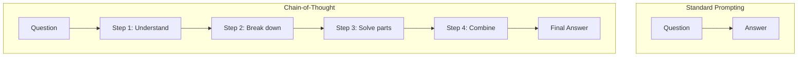
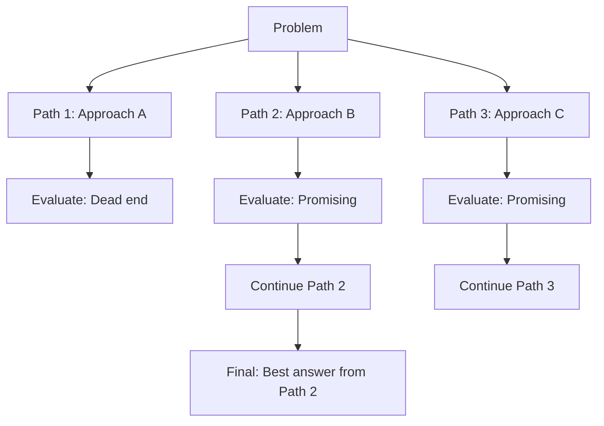
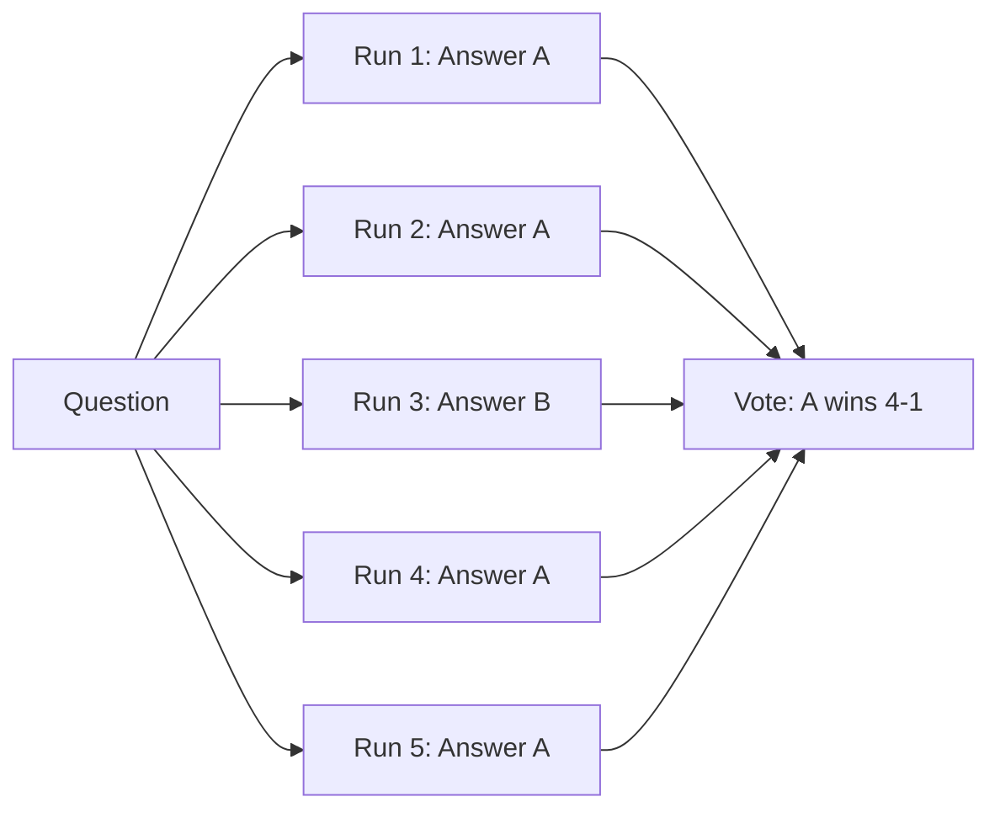
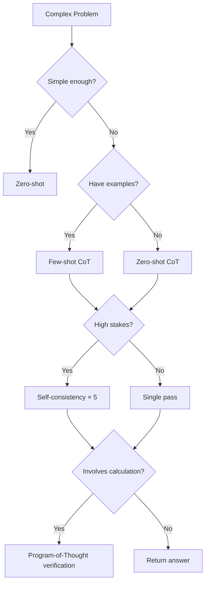

# Chain-of-Thought Reasoning

## The "Show Your Work" Analogy

Remember math class? Your teacher didn't just want the answer — they wanted to see your work. Why?
- It catches errors mid-reasoning
- It ensures you actually understand the problem
- It produces more reliable answers

Chain-of-Thought (CoT) prompting applies the same principle to LLMs: **force the model to reason step-by-step before giving a final answer.**

## Standard Prompting vs CoT



**Standard:**
```
Q: If a store has 3 shelves with 8 books each, and 2 shelves with 5 books each, how many books total?
A: 34
```

**Chain-of-Thought:**
```
Q: If a store has 3 shelves with 8 books each, and 2 shelves with 5 books each, how many books total?
A: Let me work through this step by step.
- 3 shelves × 8 books = 24 books
- 2 shelves × 5 books = 10 books
- Total: 24 + 10 = 34 books
The answer is 34.
```

Same answer here, but CoT dramatically improves accuracy on harder problems where the model would otherwise "guess."

## Zero-Shot CoT

The simplest trick in prompt engineering. Just append: **"Let's think step by step."**

```
Q: A bat and a ball cost $1.10 in total. The bat costs $1.00 more than the ball. 
   How much does the ball cost?

Let's think step by step.
```

Without CoT, models often answer "$0.10" (wrong — the intuitive but incorrect answer).
With CoT, models reason through the algebra and get "$0.05" (correct).

**Other zero-shot CoT triggers:**
- "Let's think step by step."
- "Let's work through this carefully."
- "Before answering, reason about each part."
- "Think about this step by step before giving your final answer."

## Few-Shot CoT

Provide examples that include the reasoning process:

```
Q: Roger has 5 tennis balls. He buys 2 cans of 3 tennis balls each. How many does he have now?
A: Roger starts with 5 balls. 2 cans × 3 balls = 6 new balls. 5 + 6 = 11.
The answer is 11.

Q: The cafeteria had 23 apples. They used 20 for lunch and bought 6 more. How many do they have?
A: Started with 23. Used 20, so 23 - 20 = 3 remaining. Bought 6 more: 3 + 6 = 9.
The answer is 9.

Q: {user_question}
A:
```

The model learns the *pattern of reasoning*, not just the format.

## When CoT Helps vs Doesn't

| Task Type | CoT Benefit | Why |
|-----------|-------------|-----|
| Math/arithmetic | **High** | Prevents skipping steps |
| Logic puzzles | **High** | Forces systematic exploration |
| Multi-step reasoning | **High** | Maintains coherence across steps |
| Code debugging | **High** | Traces execution flow |
| Simple classification | **Low/None** | Overthinking simple tasks adds noise |
| Creative writing | **Low** | Reasoning can kill creativity |
| Factual recall | **None** | Either knows it or doesn't |
| Translation | **Low** | Mostly pattern matching |

**Rule:** CoT helps when the problem has multiple steps, hidden complexity, or when the intuitive answer is often wrong.

## Tree-of-Thought (ToT)

Instead of one reasoning chain, explore multiple paths:



```python
TREE_OF_THOUGHT_PROMPT = """
Consider this problem: {problem}

Generate 3 different approaches to solve it:

Approach 1: {generate}
Approach 2: {generate}  
Approach 3: {generate}

Evaluate each approach:
- Which is most likely correct?
- Which has the fewest assumptions?
- Which can be verified?

Select the best approach and solve completely.
"""
```

## Self-Consistency

Generate the same problem N times with temperature > 0, then pick the most common answer:



**Implementation:**
```python
import collections

answers = []
for _ in range(5):
    response = call_llm(prompt, temperature=0.7)
    answer = extract_final_answer(response)
    answers.append(answer)

# Majority vote
most_common = collections.Counter(answers).most_common(1)[0][0]
```

**Trade-off:** 5x the API calls = 5x the cost. Use for high-stakes decisions only.

## Program-of-Thought (PoT)

Instead of reasoning in natural language, have the model write code to solve the problem:

```
Q: A store sells widgets at $4.50 each with a 15% bulk discount for orders over 100 units.
   Tax is 8.25%. What's the total for 150 widgets?

Instead of reasoning in text, write Python code to calculate:
```

```python
units = 150
price_per_unit = 4.50
subtotal = units * price_per_unit  # 675.00
discount = subtotal * 0.15  # 101.25 (bulk discount)
after_discount = subtotal - discount  # 573.75
tax = after_discount * 0.0825  # 47.33
total = after_discount + tax  # 621.08
```

**Why PoT is powerful:** Natural language reasoning can accumulate errors. Code is precise and executable — you can actually run it to verify.

## Combining Techniques



## Why This Matters for an Architect

1. **Accuracy vs. latency trade-off.** CoT produces longer outputs (more tokens, more time). Architect must decide where accuracy justifies the cost.
2. **Self-consistency multiplies costs.** 5 runs × a complex prompt = significant budget at scale. Reserve for critical paths.
3. **Observability.** CoT reasoning chains are invaluable for debugging — you can see *why* the model made a mistake. Design systems to log reasoning.
4. **Hybrid approaches.** Use PoT for calculations, CoT for logic, zero-shot for simple tasks. Route dynamically based on query complexity.
5. **User experience.** Streaming CoT reasoning gives users confidence the system is "thinking" — a UX consideration.

## Key Takeaways

- "Let's think step by step" is a free accuracy boost for complex tasks
- CoT helps with math, logic, and multi-step reasoning
- Self-consistency trades cost for reliability
- Program-of-Thought is superior for calculations
- Don't use CoT for simple tasks — it adds latency without benefit
- Log reasoning chains for debugging and observability
