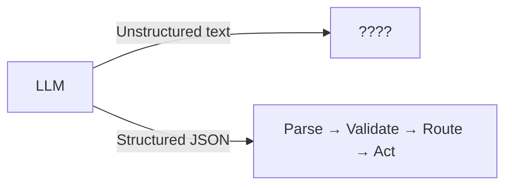
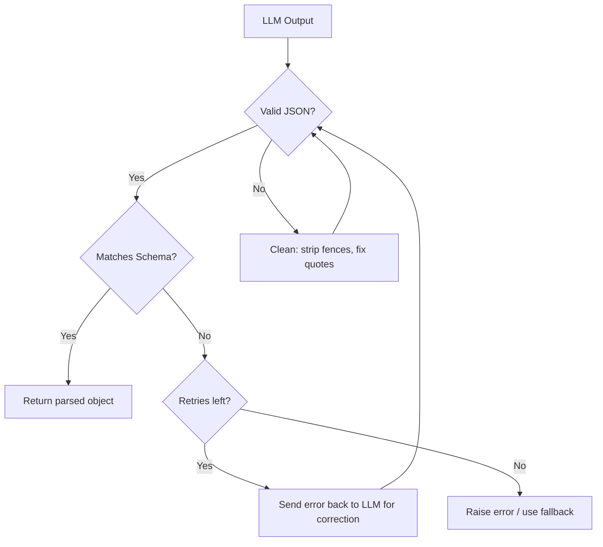
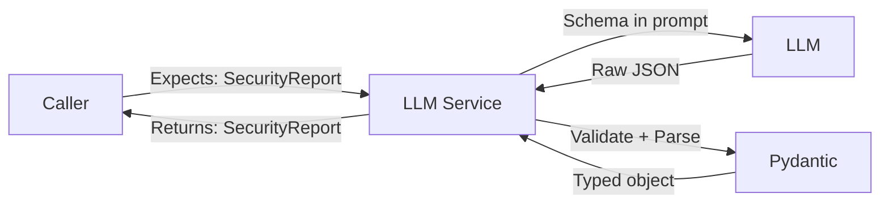

# Structured Output Engineering

## Why Structured Output Matters for Production

In production, AI output doesn't go to a human — it feeds into other systems. Code that expects a JSON object with specific fields will crash on free-form text. **Structured output transforms AI from a chatbot into a reliable API.**



The difference between a prototype and production AI system is whether the output is reliably parseable.

## Three Approaches to Structured Output

| Approach | Reliability | Flexibility | Provider Support |
|----------|------------|-------------|-----------------|
| **Prompt-based** (ask for JSON) | 70-90% | High | Universal |
| **JSON mode** | 95%+ | Medium | OpenAI, Anthropic |
| **Function calling / Tool use** | 99%+ | Schema-bound | OpenAI, Anthropic, Google |
| **Constrained generation** | 100% | Schema-bound | Outlines, Guidance, vLLM |

### Prompt-based (Weakest)
```
Return your answer as JSON with fields: name, age, city.
```
Problem: Model might add markdown code fences, extra text, or malformed JSON.

### JSON Mode (Better)
```python
response = client.chat.completions.create(
    model="gpt-4o",
    response_format={"type": "json_object"},
    messages=[{"role": "user", "content": "Extract person info as JSON: name, age, city"}]
)
```
Guarantees valid JSON, but not specific schema compliance.

### Function Calling (Best for APIs)
```python
tools = [{
    "type": "function",
    "function": {
        "name": "extract_person",
        "parameters": {
            "type": "object",
            "properties": {
                "name": {"type": "string"},
                "age": {"type": "integer"},
                "city": {"type": "string"}
            },
            "required": ["name", "age", "city"]
        }
    }
}]
```
Schema-enforced at the API level.

## Designing Output Schemas (Pydantic as Contracts)

Pydantic models are the gold standard for defining what you expect from an LLM:

```python
from pydantic import BaseModel, Field
from enum import Enum
from typing import Optional

class Severity(str, Enum):
    critical = "critical"
    high = "high"
    medium = "medium"
    low = "low"

class SecurityFinding(BaseModel):
    """A single security finding from code review."""
    title: str = Field(description="Short title of the vulnerability")
    severity: Severity = Field(description="Impact level")
    file_path: str = Field(description="Affected file")
    line_number: Optional[int] = Field(description="Line number if applicable")
    description: str = Field(description="Detailed explanation")
    remediation: str = Field(description="How to fix it")

class SecurityReport(BaseModel):
    """Complete security review output."""
    findings: list[SecurityFinding]
    overall_risk: Severity
    summary: str
```

**Why Pydantic?**
- Self-documenting (descriptions go into the prompt)
- Validates automatically (type checking, enum enforcement)
- Generates JSON Schema (feeds directly into function calling)
- Serializes/deserializes cleanly

## Handling Partial/Malformed Outputs

Models will break your schema. Plan for it.

```python
import json
from pydantic import ValidationError

def parse_llm_output(raw: str, schema: type[BaseModel], max_retries: int = 2) -> BaseModel:
    """Parse with retry logic."""
    # Step 1: Clean common issues
    cleaned = raw.strip()
    if cleaned.startswith("```json"):
        cleaned = cleaned[7:]
    if cleaned.endswith("```"):
        cleaned = cleaned[:-3]
    
    # Step 2: Try parsing
    try:
        data = json.loads(cleaned)
        return schema.model_validate(data)
    except (json.JSONDecodeError, ValidationError) as e:
        if max_retries > 0:
            # Step 3: Ask model to fix its own output
            fix_prompt = f"Fix this JSON to match the schema. Error: {e}\nBroken output: {raw}"
            new_output = call_llm(fix_prompt)
            return parse_llm_output(new_output, schema, max_retries - 1)
        raise
```



## Schema Evolution and Versioning

Schemas change over time. Handle gracefully:

```python
class ReviewV1(BaseModel):
    sentiment: str
    score: float

class ReviewV2(BaseModel):
    sentiment: str
    score: float
    confidence: float = 0.0  # New field with default
    aspects: list[str] = []  # New field with default

def parse_review(data: dict) -> ReviewV2:
    """Forward-compatible parsing."""
    # V1 data works because new fields have defaults
    return ReviewV2.model_validate(data)
```

**Rules for schema evolution:**
1. New fields MUST have defaults (backward compatible)
2. Never remove required fields (breaking change)
3. Never change field types (breaking change)
4. Version your schemas explicitly when breaking changes are unavoidable

## Enum Constraints and Validation

Enums prevent the model from inventing categories:

```python
class Priority(str, Enum):
    p0 = "P0-critical"
    p1 = "P1-high"
    p2 = "P2-medium"
    p3 = "P3-low"

# In your prompt, list valid values explicitly:
PROMPT = """Classify priority. Valid values ONLY: P0-critical, P1-high, P2-medium, P3-low
Do NOT invent other priority levels."""
```

## Nested Structures and Arrays

```python
class Address(BaseModel):
    street: str
    city: str
    country: str
    postal_code: str

class ContactInfo(BaseModel):
    email: str
    phone: Optional[str] = None
    addresses: list[Address]

class Customer(BaseModel):
    id: str
    name: str
    contact: ContactInfo
    tags: list[str]
    metadata: dict[str, str] = {}
```

**Tip:** Keep nesting to 3 levels max. Deep nesting increases schema-breaking by models.

## Error Recovery Patterns

### Pattern 1: Graceful Degradation
```python
def extract_with_fallback(text: str) -> dict:
    try:
        return parse_structured(text, FullSchema)
    except ValidationError:
        try:
            return parse_structured(text, MinimalSchema)
        except:
            return {"raw_text": text, "parse_failed": True}
```

### Pattern 2: Field-by-Field Extraction
If the full schema fails, extract individual fields separately.

### Pattern 3: Output Guardrails
```python
def validate_output(result: BaseModel) -> BaseModel:
    """Post-parse business logic validation."""
    if result.score < 0 or result.score > 1:
        result.score = max(0, min(1, result.score))
    if result.category not in VALID_CATEGORIES:
        result.category = "unknown"
    return result
```

## The "Output Contract" Pattern



The LLM service guarantees its callers a typed contract — just like any other API. The parsing/validation/retry logic is internal implementation.

## Why This Matters for an Architect

1. **System integration.** AI components must have well-defined interfaces. Structured output IS the interface contract.
2. **Reliability SLAs.** You need to guarantee parse success rate. Function calling (99%+) vs prompt-based (70-90%) is an architectural choice.
3. **Error budgets.** If parsing fails 5% of the time, you need retry logic, fallback paths, and dead-letter queues.
4. **Schema governance.** In large systems, output schemas must be shared contracts between teams — treat like API specs.
5. **Cost of failure.** Each retry is another API call. Better schemas = fewer retries = lower cost.

## Key Takeaways

- Use function calling / tool use for highest reliability
- Define schemas with Pydantic — they're your output contracts
- Always implement parse → validate → retry → fallback
- Keep schemas shallow (≤3 levels of nesting)
- Version schemas and maintain backward compatibility
- Log parse failures for monitoring and improvement
