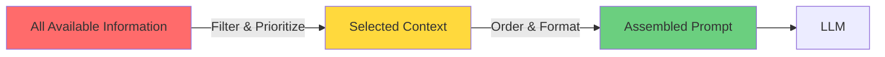
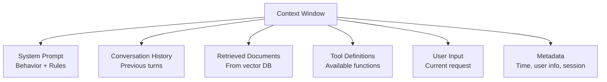
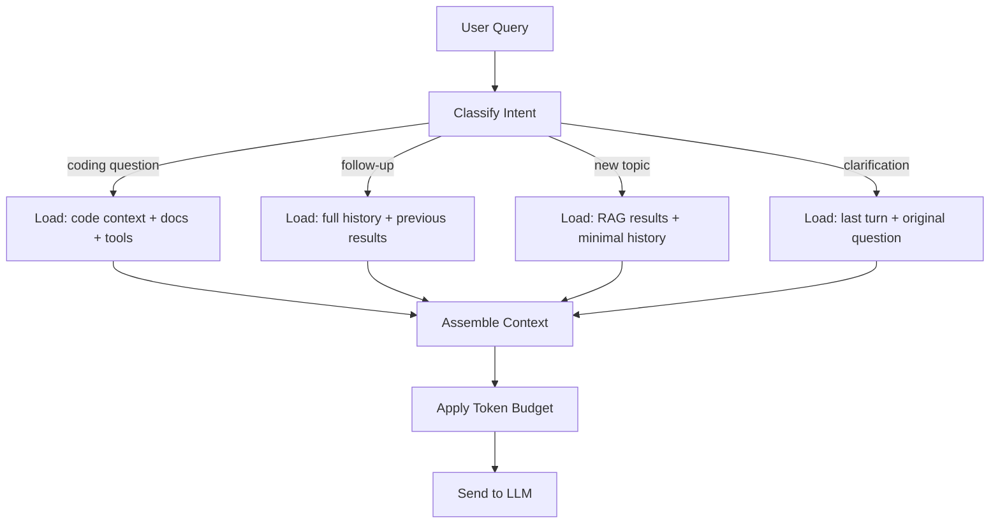
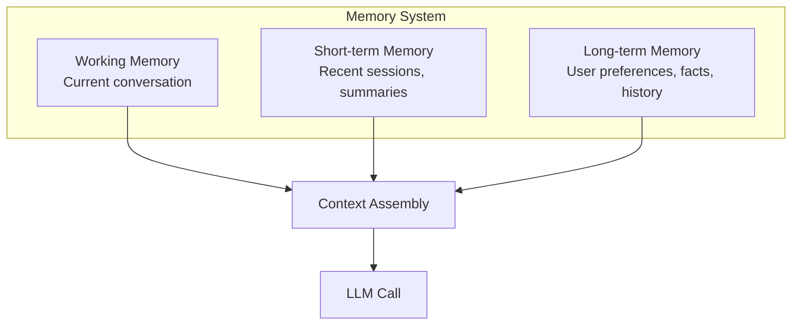

# Context Engineering

## Context Engineering vs Prompt Engineering

Prompt engineering is writing good instructions. **Context engineering is deciding what information surrounds those instructions.** It's the evolution from "how do I ask?" to "what does the model need to know to answer well?"

Think of it like a courtroom: prompt engineering is crafting the question. Context engineering is choosing which evidence, witnesses, and documents to present to the jury — and in what order.

## The Context Window as a Precious Resource

| Model | Context Window | ~Words | Cost Implication |
|-------|---------------|--------|-----------------|
| GPT-4o | 128K tokens | ~96K words | Every token costs money |
| Claude 3.5 Sonnet | 200K tokens | ~150K words | Input tokens are cheaper than output |
| Gemini 1.5 Pro | 2M tokens | ~1.5M words | Large but still finite |

**Key insight:** Even with 200K tokens, you can't dump everything. Models perform worse with irrelevant context (the "lost in the middle" problem). More context ≠ better answers.



## What Goes Into Context



Each component competes for space:

| Component | Typical % | Priority | Can be compressed? |
|-----------|-----------|----------|-------------------|
| System prompt | 5-15% | Highest (always included) | Somewhat |
| Tool definitions | 10-20% | High (if tools needed) | Rarely |
| User input | 5-10% | Highest | No |
| Retrieved docs (RAG) | 30-50% | Medium-High | Yes (summarize) |
| Conversation history | 20-40% | Medium (decays) | Yes (summarize old turns) |
| Metadata | 1-5% | Low-Medium | Yes |

## Context Priority Ordering

What to include first when space is limited:

```
1. System prompt (non-negotiable — defines behavior)
2. Current user input (the actual question)
3. Most relevant retrieved documents (directly answers the question)
4. Tool definitions (if task requires tools)
5. Recent conversation history (last 2-3 turns)
6. Older conversation summary (compressed)
7. Less relevant retrieved documents
8. Background metadata
```

**The "newspaper" principle:** Put the most important information first and last (primacy and recency effects). The middle gets less attention from the model.

## Context Compression Techniques

### 1. Conversation Summarization
```python
def compress_history(messages: list, keep_recent: int = 3) -> list:
    """Keep recent messages verbatim, summarize older ones."""
    if len(messages) <= keep_recent:
        return messages
    
    old_messages = messages[:-keep_recent]
    recent_messages = messages[-keep_recent:]
    
    summary = summarize_with_llm(old_messages)
    
    return [
        {"role": "system", "content": f"Previous conversation summary: {summary}"}
    ] + recent_messages
```

### 2. Document Chunking + Relevance Filtering
Don't include entire documents. Chunk them, embed them, and retrieve only the relevant chunks.

### 3. Schema Compression
```python
# Instead of full tool schemas with descriptions
# Use abbreviated versions for less-used tools
COMPRESSED_TOOLS = "Available: search(query), calculate(expr), send_email(to, subject, body)"
```

### 4. Selective History
Only include conversation turns relevant to the current question.

## Dynamic Context Assembly



```python
def assemble_context(query: str, session: Session) -> list[dict]:
    """Dynamically build context based on query type."""
    intent = classify_intent(query)
    budget = TokenBudget(max_tokens=120000)
    
    messages = []
    
    # Always include system prompt
    messages.append(system_prompt)
    budget.deduct(system_prompt)
    
    # Intent-specific context
    if intent == "code_question":
        relevant_files = retrieve_code_context(query)
        messages.extend(format_code_context(relevant_files, budget.remaining))
    elif intent == "follow_up":
        messages.extend(session.full_history[-6:])
    
    # RAG if needed
    if needs_retrieval(query):
        docs = vector_search(query, top_k=5)
        for doc in docs:
            if budget.can_fit(doc):
                messages.append(format_document(doc))
                budget.deduct(doc)
    
    # Always end with user query
    messages.append({"role": "user", "content": query})
    return messages
```

## The "Context Budget" Concept

Think of your context window like a financial budget:

```python
class TokenBudget:
    def __init__(self, max_tokens: int):
        self.max = max_tokens
        self.allocated = {
            "system": int(max_tokens * 0.10),      # 10% for system prompt
            "tools": int(max_tokens * 0.15),       # 15% for tool definitions
            "history": int(max_tokens * 0.25),     # 25% for conversation
            "retrieval": int(max_tokens * 0.35),   # 35% for RAG docs
            "user_input": int(max_tokens * 0.10),  # 10% for current input
            "reserve": int(max_tokens * 0.05),     # 5% safety margin
        }
```

## Memory-Augmented Context



| Memory Type | Storage | Retrieval | Example |
|-------------|---------|-----------|---------|
| Working | In-context messages | Always included | Current conversation |
| Short-term | Session store (Redis) | By recency | "You mentioned earlier..." |
| Long-term | Vector DB + key-value | By relevance | "User prefers Python, works at Acme Corp" |

```python
def build_memory_context(user_id: str, query: str) -> str:
    """Assemble multi-layer memory."""
    # Long-term: user preferences and facts
    user_profile = ltm_store.get(user_id)
    
    # Short-term: recent session summaries
    recent_sessions = stm_store.get_recent(user_id, days=7)
    
    # Relevant long-term memories
    relevant_memories = ltm_store.search(user_id, query, top_k=3)
    
    return f"""
## User Context
{user_profile}

## Recent Activity
{format_sessions(recent_sessions)}

## Relevant Past Interactions
{format_memories(relevant_memories)}
"""
```

## Why This Matters for an Architect

1. **Context is the control plane.** What you put in context determines system behavior more than any other factor. It's the primary architectural lever.
2. **Cost scales with context.** At 100K tokens input × 1M requests/day, context size directly drives infrastructure cost.
3. **Latency.** Larger contexts = slower time-to-first-token. For real-time applications, context must be lean.
4. **The "lost in the middle" problem.** Models attend less to middle content. Position critical information at the start or end.
5. **Memory architecture is a first-class concern.** Deciding what to remember, what to forget, and how to retrieve is a core system design decision.
6. **Context assembly is a pipeline.** It needs its own testing, monitoring, and optimization — treat it as infrastructure.

## Key Takeaways

- Context engineering is about *what information* to include, not just how to ask
- More context ≠ better results; relevance trumps volume
- Budget your context window like you budget money
- Assemble context dynamically based on query intent
- Implement multi-layer memory (working, short-term, long-term)
- Position critical information at the start and end of context
- Monitor context utilization and optimize continuously
