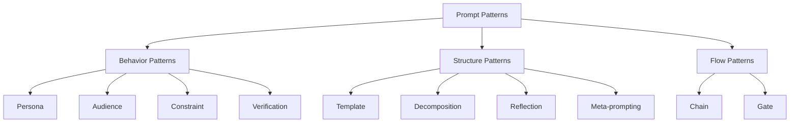

# Prompt Patterns Catalog

A reference catalog of reusable prompt patterns — like design patterns for software, but for AI interactions.

## Pattern Overview



---

## 1. Persona Pattern

**Intent:** Make the model adopt a specific expertise and communication style.

**Template:**
```
You are a [role] with [years] of experience in [domain]. 
You specialize in [specialty]. 
You communicate in a [style] manner.
```

**Example:**
```
You are a senior distributed systems engineer with 20 years of experience at FAANG companies. You specialize in high-throughput event processing. You communicate directly, prefer concrete examples over theory, and always consider failure modes.
```

**When to use:** When domain expertise shapes the quality of the answer.

**Anti-pattern:** Overly broad personas ("You are an expert in everything") — these dilute quality.

**Architect consideration:** In multi-agent systems, each agent gets a focused persona. A "general assistant" persona produces mediocre results on specialized tasks.

---

## 2. Audience Pattern

**Intent:** Control the complexity and style of the output based on who will consume it.

**Template:**
```
Explain this as if your audience is [description].
Use [vocabulary level] language.
Assume they [know/don't know] about [topic].
```

**Example:**
```
Explain Kubernetes networking to a frontend developer who understands basic HTTP but has never configured infrastructure. Use analogies to web development concepts they already know. No jargon without explanation.
```

**When to use:** When the same information needs different presentations for different stakeholders.

**Anti-pattern:** "Explain like I'm 5" for technical documentation — too simplistic for practical use.

**Architect consideration:** Build audience as a parameter in your prompt templates. The same extraction pipeline might produce executive summaries AND technical reports.

---

## 3. Constraint Pattern

**Intent:** Set hard boundaries on output.

**Template:**
```
Constraints:
- Maximum [N] [words/sentences/bullet points]
- Must include [required elements]
- Must NOT include [prohibited elements]
- Format: [specific format]
- Tone: [specific tone]
```

**Example:**
```
Constraints:
- Exactly 3 bullet points
- Each bullet ≤ 20 words
- No technical jargon
- Must mention cost impact
- Must NOT mention competitor products
```

**When to use:** When output must fit a specific slot (UI element, report section, API response).

**Anti-pattern:** Contradictory constraints ("Be detailed" + "Max 50 words").

**Architect consideration:** Constraints are your output SLA. Define them based on downstream system requirements (UI character limits, database field sizes, etc.).

---

## 4. Verification Pattern

**Intent:** Force the model to check its own work before responding.

**Template:**
```
Before providing your final answer:
1. Verify [specific check]
2. Confirm [assumption]
3. Check for [common error]
If any check fails, revise your answer.
```

**Example:**
```
Before providing your SQL query:
1. Verify all column names exist in the schema provided
2. Confirm the JOIN conditions won't produce duplicates
3. Check for potential NULL handling issues
4. Verify the query would run in under 30 seconds on a table with 10M rows
If any check fails, fix the query and explain what you changed.
```

**When to use:** High-stakes outputs where errors are costly (code generation, financial calculations, medical info).

**Anti-pattern:** Excessive verification on trivial tasks (adds latency without value).

**Architect consideration:** Verification adds tokens and latency. Use selectively on critical paths. For non-critical paths, validate output programmatically instead.

---

## 5. Decomposition Pattern

**Intent:** Break complex problems into manageable sub-problems.

**Template:**
```
Break this problem into subtasks:
1. First, identify [component 1]
2. Then, analyze [component 2]
3. Next, determine [component 3]
4. Finally, synthesize into [final output]

Handle each subtask independently, then combine results.
```

**Example:**
```
To review this pull request:
1. First, identify what the PR is trying to accomplish (read the title and description)
2. Then, check for correctness (logic errors, edge cases)
3. Next, evaluate code quality (naming, structure, DRY)
4. Then, assess performance implications
5. Finally, provide a summary verdict: approve, request changes, or needs discussion
```

**When to use:** Complex tasks that benefit from structured approaches.

**Anti-pattern:** Over-decomposing simple tasks into unnecessary steps.

**Architect consideration:** Decomposition in prompts mirrors microservices decomposition. Each subtask could potentially be a separate LLM call for reliability.

---

## 6. Reflection Pattern

**Intent:** Have the model critique and improve its own output.

**Template:**
```
After generating your response:
1. Review it for [specific criteria]
2. Rate your confidence (1-10)
3. Identify the weakest part of your answer
4. If confidence < [threshold], revise
```

**Example:**
```
After writing the code:
1. Review it for bugs, edge cases, and security issues
2. Rate your confidence that this is production-ready (1-10)
3. Identify the most likely failure point
4. If confidence < 8, rewrite the problematic section
```

**When to use:** When you need higher quality and can afford extra tokens.

**Anti-pattern:** Infinite reflection loops ("review your review of your review...").

**Architect consideration:** Reflection is cheap self-improvement. It costs 1 extra generation but can catch errors before they hit production. Great ROI.

---

## 7. Meta-Prompting Pattern

**Intent:** Have the model generate the optimal prompt for a task.

**Template:**
```
I need to [accomplish goal]. 
What would be the most effective prompt to give an AI assistant to achieve this?
Consider: edge cases, ambiguity, format needs.
Write the prompt, then explain why each part is important.
```

**When to use:** When you're not sure how to prompt for a novel task. Bootstrap your prompt engineering.

**Anti-pattern:** Using meta-prompting for simple, well-known tasks.

**Architect consideration:** Meta-prompting can be automated — a "prompt optimizer" service that improves prompts based on evaluation results.

---

## 8. Template Pattern

**Intent:** Force output into a specific structure.

**Template:**
```
Use exactly this format for your response:

## Summary
[1-2 sentence overview]

## Key Findings
- Finding 1: [description]
- Finding 2: [description]

## Recommendation
[Your recommendation with justification]

## Confidence
[High/Medium/Low] because [reason]
```

**When to use:** When output must be parsed programmatically or displayed in a fixed UI.

**Anti-pattern:** Overly rigid templates that prevent the model from conveying nuance.

**Architect consideration:** Templates are the contract between your LLM service and its consumers. Define them in shared schemas.

---

## 9. Chain Pattern

**Intent:** Pipeline where output of one prompt feeds as input to the next.


**Example:**
```python
# Step 1: Extract key facts
facts = llm("Extract key facts from this document: {doc}")

# Step 2: Analyze relationships
analysis = llm(f"Analyze relationships between these facts: {facts}")

# Step 3: Generate recommendations
recommendations = llm(f"Based on this analysis, recommend actions: {analysis}")
```

**When to use:** Complex tasks that exceed single-prompt reliability.

**Anti-pattern:** Chaining when a single well-crafted prompt would suffice (adds latency and cost).

**Architect consideration:** Each link in the chain is a failure point. Add error handling, validation, and fallbacks between steps.

---

## 10. Gate Pattern

**Intent:** Conditional logic within or between prompts.

**Template:**
```
Analyze the input:
- If it contains [condition A]: respond with [action A]
- If it contains [condition B]: respond with [action B]
- If neither: respond with [default action]
- If both: prioritize [which condition]
```

**Example:**
```
Classify this customer message:
- If it's a complaint about billing: route to billing team, priority high
- If it's a technical question: attempt to answer directly
- If it's abusive language: respond with template_safety_response only
- If it's a feature request: log and acknowledge
- If unclear: ask one clarifying question
```

**When to use:** When different inputs require fundamentally different handling.

**Anti-pattern:** Too many conditions in one prompt (>5 branches) — split into separate prompts.

**Architect consideration:** Gates are your routing logic. In production, implement as a classifier prompt → router → specialized handler, not one mega-prompt.

---

## Pattern Combinations

The most effective production prompts combine multiple patterns:

```
[Persona] You are a senior security auditor.
[Constraint] Respond in exactly the JSON format specified.
[Decomposition] Analyze each finding separately.
[Verification] Double-check severity ratings against CVSS criteria.
[Template] Use this output format: {...}
[Gate] If no vulnerabilities found, return empty findings array.
```

## Why This Matters for an Architect

1. **Patterns are reusable.** Build a library of proven patterns for your organization.
2. **Composability.** Combine patterns like building blocks for complex systems.
3. **Standardization.** Teams using shared patterns produce more consistent results.
4. **Testability.** Each pattern has known failure modes — test for them specifically.
5. **Documentation.** Patterns give your team a shared vocabulary for discussing prompt design.

## Key Takeaways

- Prompt patterns are design patterns for AI systems
- Each pattern solves a specific class of problems
- Combine patterns for production-grade prompts
- Gate + Chain patterns form the basis of agentic systems
- Build an organizational pattern library with tested examples
