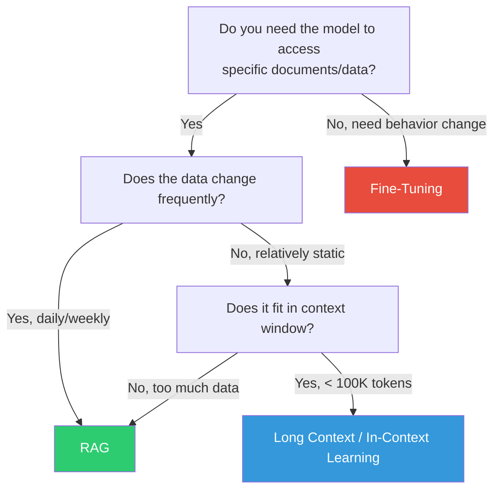
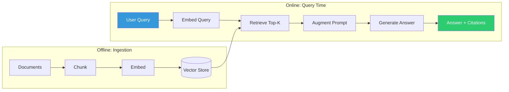
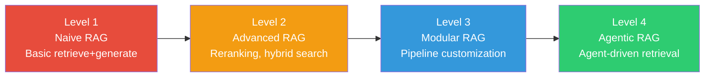

# What is RAG and Why Does It Exist?

## The Core Idea in One Sentence

**RAG (Retrieval-Augmented Generation)** is a technique where you give an LLM relevant documents to read *before* it answers a question, so it can base its answer on real data instead of relying solely on what it memorized during training.

---

## The "Open-Book Exam" Analogy

Think of how exams work:

| Exam Type | Analogy | AI Equivalent |
|-----------|---------|---------------|
| **Closed-book exam** | You rely entirely on memory | LLM alone (GPT-4, Claude) |
| **Open-book exam** | You can look up information before answering | **RAG** |
| **Studying for months** | You internalize new knowledge permanently | Fine-tuning |
| **Getting a bigger desk** | More notes fit in front of you at once | Long context windows |

### Why This Matters

When you ask an LLM "What is our company's refund policy?", it has NO idea. It wasn't trained on your internal docs. It will either:
1. **Hallucinate** - confidently make up a policy that sounds plausible
2. **Refuse** - say "I don't have that information"

RAG solves this: *before* the LLM answers, you **retrieve** your actual refund policy document and hand it to the LLM as context. Now it can give an accurate, grounded answer.

---

## Why RAG Exists: The Three Problems

### Problem 1: Hallucination

LLMs generate text that *sounds* correct but may be factually wrong. They're trained to be fluent, not factual.

```
User: "What's the maximum dosage of Drug X for children under 5?"
LLM (no RAG): "The recommended dosage is 10mg per kg..." 
                ← This might be COMPLETELY WRONG
LLM (with RAG): "According to the FDA prescribing information [source], 
                 the maximum dosage is 5mg per kg..." 
                ← Grounded in actual documents
```

### Problem 2: Stale Knowledge

LLMs have a training cutoff date. They don't know about:
- Yesterday's product update
- Last week's policy change
- This morning's security advisory

RAG gives them access to **live, current information**.

### Problem 3: Domain-Specific Data

LLMs were trained on the public internet. They don't know about:
- Your company's internal documentation
- Proprietary research papers
- Customer-specific data
- Private codebases

RAG bridges this gap without exposing your data during model training.

---

## RAG vs Fine-Tuning vs Long Context

This is the most common architectural decision. Here's how to think about it:



### Detailed Comparison

| Dimension | RAG | Fine-Tuning | Long Context |
|-----------|-----|-------------|--------------|
| **Use case** | Access external knowledge | Change model behavior/style | Small, static reference docs |
| **Data freshness** | Real-time | Stale (retraining needed) | Real-time (manual) |
| **Cost** | Per-query retrieval + generation | One-time training cost | High token cost per query |
| **Scalability** | Millions of docs | Limited by training data | Limited by context window |
| **Accuracy** | High (with good retrieval) | Can hallucinate new patterns | High (if doc fits) |
| **Setup complexity** | Medium | High | Low |
| **When data changes** | Just update the index | Retrain the model | Update the prompt |
| **Citability** | Can cite sources | Cannot cite sources | Can reference inline |

### When to Use Each

- **RAG**: Customer support over docs, legal research, medical Q&A, any "look it up" task
- **Fine-Tuning**: Change tone/style, teach new formats, domain-specific reasoning patterns
- **Long Context**: Summarize a single long document, analyze a specific report, code review
- **RAG + Fine-Tuning**: The LLM knows *how* to use retrieved docs + has access to them

---

## The Basic RAG Flow



### Step-by-Step Breakdown

1. **Query** → User asks: "What's our vacation policy for remote employees?"
2. **Retrieve** → System searches your HR docs, finds 3 relevant chunks
3. **Augment** → Those chunks are injected into the LLM prompt as context
4. **Generate** → LLM reads the context and generates a grounded answer

The actual prompt looks something like:

```
System: You are a helpful HR assistant. Answer based ONLY on the provided context.
If the context doesn't contain the answer, say "I don't have that information."

Context:
---
[Chunk 1: vacation_policy.pdf, page 3]
Remote employees are entitled to 25 days of paid vacation per year...
---
[Chunk 2: remote_work_guidelines.pdf, page 7]  
Vacation requests must be submitted 2 weeks in advance via the HR portal...
---

User: What's our vacation policy for remote employees?
```

---

## Real-World Examples

### 1. Customer Support Bot
- **Data**: Product docs, FAQ, troubleshooting guides, release notes
- **Query**: "How do I reset my password on the mobile app?"
- **Why RAG**: Answers change with each app version; too much data for context window

### 2. Legal Research Assistant
- **Data**: Case law, statutes, firm's previous briefs, contracts
- **Query**: "Find precedents for breach of fiduciary duty in Delaware"
- **Why RAG**: Millions of documents; needs precise citations; data updates daily

### 3. Medical Q&A for Clinicians
- **Data**: Drug databases, clinical guidelines, recent papers
- **Query**: "Interactions between Drug A and Drug B in elderly patients?"
- **Why RAG**: Life-critical accuracy; must cite sources; guidelines update frequently

### 4. Internal Knowledge Base
- **Data**: Confluence pages, Slack threads, meeting notes, design docs
- **Query**: "What was the decision on the authentication architecture?"
- **Why RAG**: Scattered across systems; changes constantly; permission-sensitive

---

## Limitations of RAG (It's Not Magic)

RAG is powerful but has real limitations. Don't oversell it:

| Limitation | Description |
|-----------|-------------|
| **Retrieval quality ceiling** | If retrieval fails, generation fails. Garbage in, garbage out. |
| **Chunking sensitivity** | Bad chunking = relevant info split across chunks = missed answers |
| **Latency overhead** | Retrieval adds 200-2000ms per query |
| **Context window limits** | Can only pass so many chunks; must choose wisely |
| **No reasoning over full corpus** | Can't answer "How many customers complained last month?" (needs aggregation) |
| **Cost at scale** | Embedding + storage + retrieval + generation costs add up |
| **Complex queries** | Multi-hop reasoning ("Find X, then use X to look up Y") is hard |
| **Freshness lag** | Time between document update and index update |

### When RAG is NOT the Answer

- **Aggregation queries**: "What's the average..." → Use SQL/analytics
- **Creative tasks**: "Write me a poem" → LLM alone is fine
- **Behavioral changes**: "Be more formal" → Fine-tuning or system prompt
- **Real-time data**: "What's the stock price now?" → API call, not RAG
- **Computation**: "Calculate the ROI of..." → Code execution, not retrieval

---

## The RAG Maturity Model

Most teams progress through these stages:



| Level | Characteristics | Typical Accuracy |
|-------|----------------|-----------------|
| Level 1 | Fixed pipeline, no evaluation | 40-60% |
| Level 2 | Reranking, better chunking, hybrid search | 60-75% |
| Level 3 | Query routing, adaptive retrieval, evaluation loops | 75-85% |
| Level 4 | Agent decides strategy, multi-step retrieval, self-correction | 85-95% |

---

## Key Takeaways

1. **RAG = giving LLMs a reference library** instead of relying on their memory
2. **Use RAG when**: data changes, is private, or is too large for context
3. **Don't use RAG when**: you need computation, aggregation, or behavioral changes
4. **Quality depends on retrieval**: invest heavily in chunking, embedding, and retrieval
5. **It's a system, not a model**: many components, each can fail independently
6. **Start simple, iterate**: Naive RAG first, measure, then improve the weakest link

---

## What's Next?

Now that you understand *what* RAG is and *why* it exists, the next sections cover *how* to build it well:
- [02 - Ingestion Pipeline](./02-ingestion-pipeline.md): Getting documents into the system
- [03 - Chunking Strategies](./03-chunking-strategies.md): Splitting documents intelligently
- [04 - Retrieval Techniques](./04-retrieval-techniques.md): Finding the right information
- [05 - RAG Patterns](./05-rag-patterns-taxonomy.md): All the ways to architect RAG

---

## Staff-Level Anti-Patterns

### Anti-Pattern 1: RAG for Everything
Not every LLM task needs retrieval. Creative writing, summarization of a provided document, code generation from a spec — these don't benefit from RAG. Adding retrieval adds latency, cost, and failure modes for zero gain.

### Anti-Pattern 2: No Evaluation of Retrieval Quality
Teams build RAG, test with 5 queries, declare success. Without systematic retrieval evaluation (recall@K, precision@K), you have no idea if your system actually works across the query distribution.

### Anti-Pattern 3: Ignoring When Long-Context Makes RAG Unnecessary
With 200K+ token context windows (Claude, Gemini), if your entire corpus fits in context, RAG adds unnecessary complexity. A 500-page employee handbook (~150K tokens) might just go directly into the prompt.

### Anti-Pattern 4: Building RAG Before Validating the Use Case
Teams spend months building RAG infrastructure only to discover users don't actually need it, or the questions require aggregation/computation that RAG can't provide.

---

## Trade-offs: RAG vs Fine-Tuning vs Long-Context (Decision Matrix)

| Decision Factor | Choose RAG | Choose Fine-Tuning | Choose Long-Context |
|----------------|-----------|-------------------|-------------------|
| Data changes weekly+ | ✅ | ❌ (retrain each time) | ✅ (if fits) |
| Need citations | ✅ | ❌ (no source tracking) | ⚠️ (manual) |
| Corpus > 200K tokens | ✅ | ❌ | ❌ (won't fit) |
| Need behavior/style change | ❌ | ✅ | ❌ |
| Minimize latency | ❌ (retrieval adds 200ms+) | ✅ (single call) | ✅ (single call) |
| Minimize per-query cost | ⚠️ (retrieval + generation) | ✅ (no retrieval) | ❌ (massive token cost) |
| Data is sensitive/private | ✅ (stays in your infra) | ⚠️ (training data exposure) | ✅ (prompt-only) |
| Need 99%+ accuracy | ⚠️ (retrieval can fail) | ❌ (hallucination risk) | ✅ (if doc fits) |

### The Hybrid Reality
Production systems often combine approaches:
- **Fine-tune** for domain-specific reasoning style + **RAG** for factual grounding
- **Long-context** for single-document tasks + **RAG** for cross-document queries
- **RAG** as default + **direct LLM** when classifier determines no retrieval needed

---

## Staff Insight

> "RAG is not dead, but the decision of WHEN to use it requires architectural judgment. The worst RAG systems are the ones built because someone read a blog post, not because they analyzed their actual information retrieval needs. The best RAG systems are the ones where the team can articulate exactly which problem RAG solves that a simpler approach cannot."

**The senior engineer's checklist before building RAG:**
1. Can the entire corpus fit in a long-context window? If yes, benchmark that first.
2. Does the data actually change? If it's static, consider fine-tuning or prompt injection.
3. Do users need citations? If not, maybe fine-tuning is sufficient.
4. Is the query pattern "look up facts" or "reason over everything"? RAG excels at the former, struggles with the latter.
5. What's the latency budget? RAG adds 200-2000ms minimum.

---

## Conclusion and Learning Path

You now understand the *why* behind RAG — the problems it solves, when to use it vs alternatives, and its limitations. The remainder of this module covers the *how*: building each component of a production RAG system from ingestion to evaluation. Each subsequent section builds on this foundation, so ensure you're comfortable with the trade-off framework above before proceeding.
