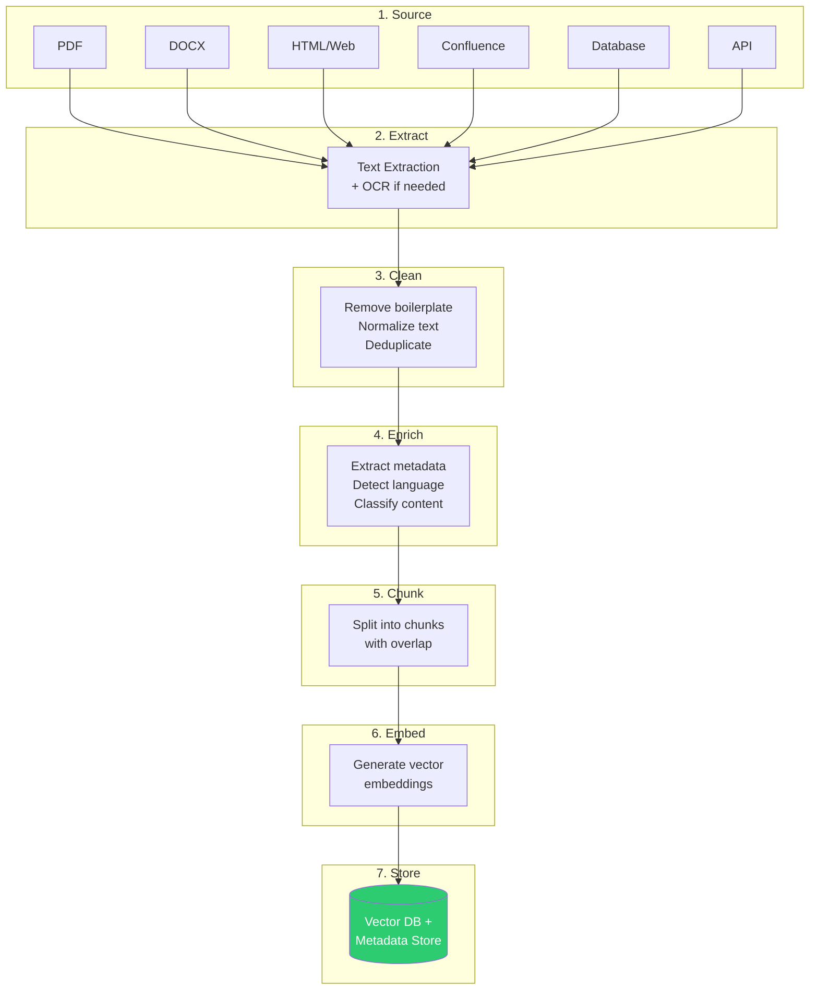
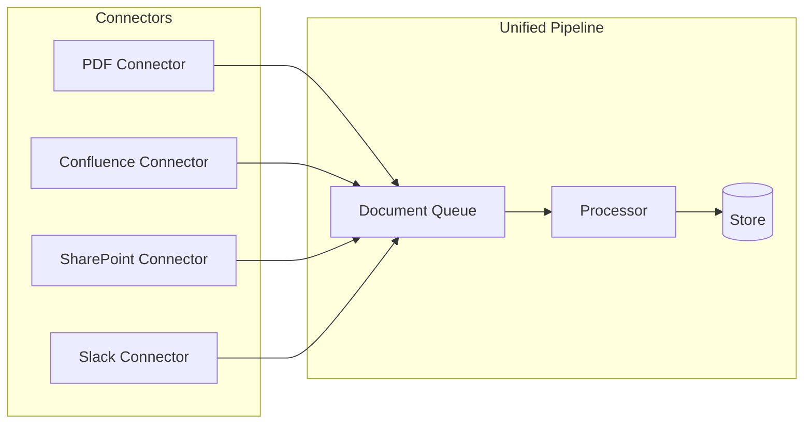
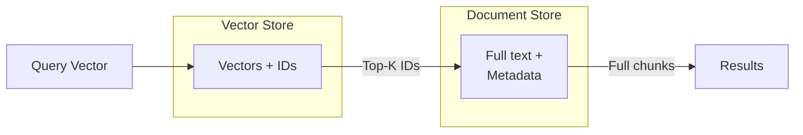
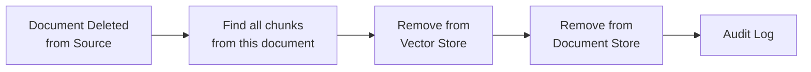

# The Ingestion Pipeline

## Overview

The ingestion pipeline is the **supply chain** of your RAG system. Just like a restaurant's food quality depends on its ingredients and preparation, your RAG quality depends entirely on how well you ingest documents.

**The golden rule: Garbage in, garbage out.** If your chunks are poorly extracted, badly cleaned, or incorrectly embedded, no amount of fancy retrieval will save you.

---

## The Full Pipeline



---

## Step 1: Document Sources

Real-world RAG systems pull from many sources simultaneously:

| Source Type | Examples | Challenges |
|------------|----------|------------|
| **PDFs** | Reports, papers, manuals | Tables, images, multi-column layouts |
| **Office docs** | DOCX, PPTX, XLSX | Formatting, embedded objects |
| **Web/HTML** | Docs sites, wikis | Navigation, ads, dynamic content |
| **Wikis** | Confluence, Notion | Nested pages, permissions |
| **Databases** | PostgreSQL, MongoDB | Structured data → text conversion |
| **APIs** | Slack, Jira, GitHub | Rate limits, pagination, auth |
| **Email** | Outlook, Gmail | Threads, attachments, signatures |
| **Code** | Repositories | Comments, docstrings, README |

### The Connector Pattern

Most production systems use a **connector architecture**:



Each connector handles:
- Authentication with the source
- Incremental syncing (only new/changed docs)
- Format-specific extraction
- Permission metadata

---

## Step 2: Text Extraction

This is where most RAG systems first break down. Text extraction is **much harder** than people think.

### PDF Extraction Challenges

PDFs are the worst. They're designed for *display*, not for *text extraction*:

| Challenge | Problem | Solution |
|-----------|---------|----------|
| Multi-column layout | Text reads left-to-right across columns | Layout-aware parsers (PyMuPDF, Unstructured) |
| Tables | Cells become scattered text | Table detection + structured extraction |
| Headers/footers | Repeated on every page, pollute content | Detect and remove based on position |
| Watermarks | Overlaid text mixed with content | Z-order detection |
| Scanned pages | No text layer at all | OCR (Tesseract, Azure Doc Intelligence) |
| Images with text | Charts, diagrams with labels | Vision models or OCR |
| Mathematical formulas | LaTeX or image-based | Specialized math OCR |

### Extraction Tools Comparison

| Tool | Best For | Limitations |
|------|----------|-------------|
| **PyPDF2/PyMuPDF** | Simple text PDFs | Bad with tables, images |
| **Unstructured.io** | Complex documents, multi-format | Heavier setup |
| **Azure Doc Intelligence** | Enterprise docs, forms | Paid API |
| **LlamaParse** | LLM-powered extraction | Cost per page |
| **Apache Tika** | Wide format support | Java dependency |
| **Docling** | Academic papers | Specialized |

### OCR for Scanned Documents

When documents are scanned images (no text layer):

```
Scanned PDF → Image extraction → OCR → Text → Normal pipeline
```

OCR quality varies dramatically. For production:
- **Tesseract**: Free, decent for clean scans
- **Azure Document Intelligence**: Best for forms/tables
- **Google Document AI**: Good general purpose
- **AWS Textract**: Good for structured docs

---

## Step 3: Cleaning

Raw extracted text is messy. Cleaning is essential but often overlooked.

### Common Cleaning Operations

```python
# Typical cleaning pipeline
def clean_text(raw_text: str) -> str:
    text = remove_headers_footers(raw_text)      # "Page 3 of 45"
    text = remove_boilerplate(text)               # "CONFIDENTIAL" stamps
    text = normalize_whitespace(text)             # Multiple spaces/newlines
    text = fix_encoding(text)                     # Broken unicode chars
    text = remove_urls_if_irrelevant(text)        # Tracking URLs
    text = normalize_quotes_dashes(text)          # Smart quotes → standard
    text = deduplicate_paragraphs(text)           # Repeated content
    return text
```

### What NOT to Clean

Be careful not to over-clean:
- **Don't remove numbers** in technical docs (dosages, measurements)
- **Don't lowercase** everything (proper nouns matter for search)
- **Don't remove special characters** in code or formulas
- **Don't remove "short" paragraphs** — they might be critical answers

---

## Step 4: Metadata Extraction

Metadata is the **secret weapon** of good RAG. It enables filtering, which dramatically improves retrieval precision.

### Essential Metadata

| Metadata Field | Why It Matters |
|---------------|----------------|
| `source_file` | Citation and deduplication |
| `page_number` | User can verify the answer |
| `title` | Helps with relevance |
| `author` | Authority/trust signals |
| `date_created` | Freshness for temporal queries |
| `date_modified` | Detect stale content |
| `section_heading` | Structural context |
| `document_type` | Route queries to right corpus |
| `permissions` | Access control at query time |
| `language` | Multi-language routing |
| `version` | Track document updates |

### Automatic Metadata Extraction

```python
metadata = {
    "source": "hr_policy_2024.pdf",
    "page": 5,
    "section": "Remote Work Policy",
    "last_modified": "2024-03-15",
    "department": "HR",
    "access_level": "all_employees",
    "doc_type": "policy",
    "chunk_index": 3,
    "total_chunks": 12,
}
```

---

## Step 5: Chunking

Covered in detail in [03-chunking-strategies.md](./03-chunking-strategies.md). The key decisions:
- Chunk size (typically 256-1024 tokens)
- Overlap (typically 10-20% of chunk size)
- Strategy (fixed, semantic, heading-aware, etc.)

---

## Step 6: Embedding

Convert text chunks into dense vector representations:

```python
# Each chunk becomes a vector
chunk = "Remote employees get 25 days vacation..."
vector = embedding_model.encode(chunk)  # → [0.023, -0.156, 0.089, ...] (768-1536 dims)
```

### Embedding Model Selection

| Model | Dimensions | Speed | Quality | Cost |
|-------|-----------|-------|---------|------|
| OpenAI text-embedding-3-small | 1536 | Fast | Good | $0.02/1M tokens |
| OpenAI text-embedding-3-large | 3072 | Fast | Best (API) | $0.13/1M tokens |
| Cohere embed-v3 | 1024 | Fast | Great | $0.1/1M tokens |
| BGE-large-en-v1.5 | 1024 | Medium | Great | Free (local) |
| all-MiniLM-L6-v2 | 384 | Very fast | Good | Free (local) |
| nomic-embed-text | 768 | Fast | Great | Free (local) |

### Embedding Best Practices

1. **Use the same model for indexing and querying** — mismatched models = terrible results
2. **Batch your embeddings** — don't embed one chunk at a time
3. **Consider instruction-prefixed models** — some models use "query: " vs "document: " prefixes
4. **Normalize vectors** if using cosine similarity
5. **Cache embeddings** — don't re-embed unchanged documents

---

## Step 7: Storage

You need to store both the vectors and the original text + metadata:



### Vector Database Options

| Database | Type | Best For |
|----------|------|----------|
| **ChromaDB** | Embedded | Prototypes, small scale |
| **Pinecone** | Managed cloud | Production, serverless |
| **Weaviate** | Self-hosted/cloud | Hybrid search built-in |
| **Qdrant** | Self-hosted/cloud | Performance, filtering |
| **Milvus** | Self-hosted | Massive scale |
| **pgvector** | PostgreSQL extension | Already using Postgres |

---

## Version Management

When documents are updated, you need a strategy:

### Option 1: Full Re-index
- Delete all chunks from the old version
- Re-ingest the new version
- Simple but expensive at scale

### Option 2: Diff-Based Update
- Compare old and new document
- Only re-chunk/re-embed changed sections
- Complex but efficient

### Option 3: Versioned Storage
- Keep all versions, tag with version number
- Query always hits latest by default
- Enables "what did the policy say on date X?"

---

## Deletion Propagation

When a source document is deleted:



**Critical**: If you don't propagate deletions, your RAG will answer from documents that no longer exist. This is a compliance and accuracy risk.

### Implementation Pattern

```python
# Every chunk stores its source document ID
# When source is deleted:
def delete_document(doc_id: str):
    chunk_ids = metadata_store.find_chunks(source_doc_id=doc_id)
    vector_store.delete(ids=chunk_ids)
    metadata_store.delete(ids=chunk_ids)
    audit_log.record(action="delete", doc_id=doc_id, chunks=len(chunk_ids))
```

---

## Scheduling and Orchestration

Production ingestion runs on schedules:

| Pattern | When to Use |
|---------|-------------|
| **Real-time** | Chat messages, tickets (webhook-triggered) |
| **Near real-time** | Wiki edits, doc updates (5-15 min polling) |
| **Batch** | Daily full sync from databases |
| **Event-driven** | File upload triggers ingestion |

---

## Monitoring the Pipeline

Track these metrics:

| Metric | What It Tells You |
|--------|-------------------|
| Documents ingested/day | Pipeline throughput |
| Extraction failures | Source format issues |
| Average chunk size | Chunking quality |
| Embedding latency | Processing bottlenecks |
| Total chunks in store | Index growth |
| Stale document count | Freshness |
| Duplicate chunk rate | Dedup effectiveness |

---

## Key Takeaways

1. **Ingestion quality determines RAG quality** — invest here first
2. **PDF extraction is hard** — test thoroughly with real documents
3. **Metadata enables filtering** — extract as much as possible
4. **Handle updates and deletions** — stale data is a liability
5. **Monitor everything** — silent failures are the worst kind
6. **Use incremental sync** — don't re-process unchanged documents

---

## Staff-Level Anti-Patterns

### Anti-Pattern 1: One-Size-Fits-All Chunking
Using 512-token fixed chunks for PDFs, code, tables, and chat logs alike. Each document type has different information density and structure. A legal contract needs different chunking than a Slack export.

### Anti-Pattern 2: No Metadata Extraction
Ingesting raw text without source, date, section, or author metadata. This makes it impossible to filter by recency, apply permissions, or provide citations. Metadata is not optional — it's the difference between a toy and a production system.

### Anti-Pattern 3: Synchronous Ingestion Blocking Users
User uploads a document and waits 30 seconds while it's chunked, embedded, and indexed. Ingestion should be async — acknowledge the upload immediately, process in background, notify when ready.

### Anti-Pattern 4: No Deduplication
The same content indexed multiple times (from Confluence AND SharePoint AND email attachment). Your retrieval now returns 3 copies of the same chunk, wasting context window slots.

### Anti-Pattern 5: Ignoring Document Structure
Treating a PDF as flat text when it has clear headings, tables, lists, and hierarchy. Flattening structure loses the relationships between sections that help retrieval quality.

---

## Trade-offs: Real-Time vs Batch Ingestion

| Dimension | Real-Time (Event-Driven) | Batch (Scheduled) |
|-----------|------------------------|-------------------|
| Freshness | Seconds-minutes | Hours-days |
| Infrastructure cost | High (always-on workers) | Low (scheduled jobs) |
| Complexity | High (webhooks, queues, retry logic) | Low (cron + script) |
| Error handling | Must handle per-doc failures gracefully | Can retry entire batch |
| Monitoring | Real-time dashboards needed | Daily reports sufficient |
| Best for | Chat messages, tickets, wiki edits | Full database syncs, initial loads |

### Accuracy of Parsing vs Speed

| Parser | Speed (pages/sec) | Accuracy | Cost |
|--------|-------------------|----------|------|
| PyPDF2 (text extraction) | 100+ | 60-70% (tables broken) | Free |
| Unstructured.io | 10-20 | 85-90% | Free (local) |
| Azure Doc Intelligence | 5-10 | 95%+ (forms/tables) | ~$0.01/page |
| LlamaParse (LLM-based) | 2-5 | 90-95% | ~$0.003/page |
| Human review | 0.1 | 99%+ | ~$0.50/page |

---

## Real Numbers: 1M Document Ingestion

| Configuration | Time | Cost | Notes |
|--------------|------|------|-------|
| PyPDF2 + fixed chunk + OpenAI embed | ~4 hours | ~$200 (embedding) | Fast but poor quality on complex docs |
| Unstructured + semantic chunk + OpenAI embed | ~20 hours | ~$500 | Good balance for most corpora |
| Azure Doc Intelligence + heading-aware chunk + local embed | ~40 hours | ~$10,000 (parsing) | Best quality, highest cost |
| LlamaParse + parent-child chunk + Cohere embed | ~80 hours | ~$3,000 (parsing) + $100 (embed) | Excellent for mixed doc types |

**Key insight**: The bottleneck is always parsing, not embedding. Invest in parsing quality — bad parsing cascades into bad chunks into bad retrieval into bad answers. You cannot fix upstream data quality problems downstream.

### Production Pipeline Architecture

```
Upload → Queue (SQS/Kafka) → Worker Pool → Parse → Clean → Chunk → Embed → Index
                                  ↓                                        ↓
                           Dead Letter Queue                        Completion Event
                           (failed docs)                            (notify user)
```

**Rule of thumb**: Plan for 10% of documents to fail parsing. Have a dead-letter queue and manual review process for failures.
