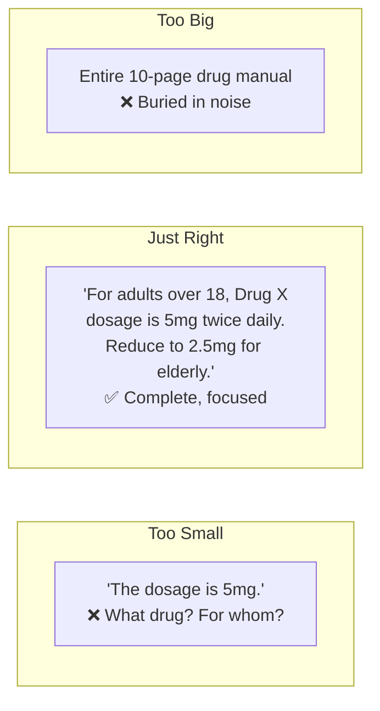
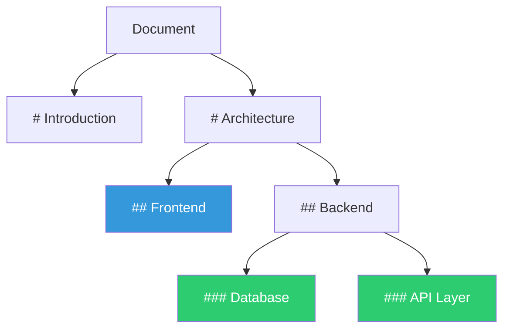
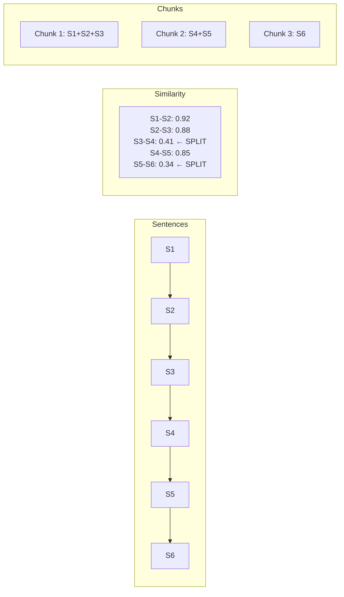
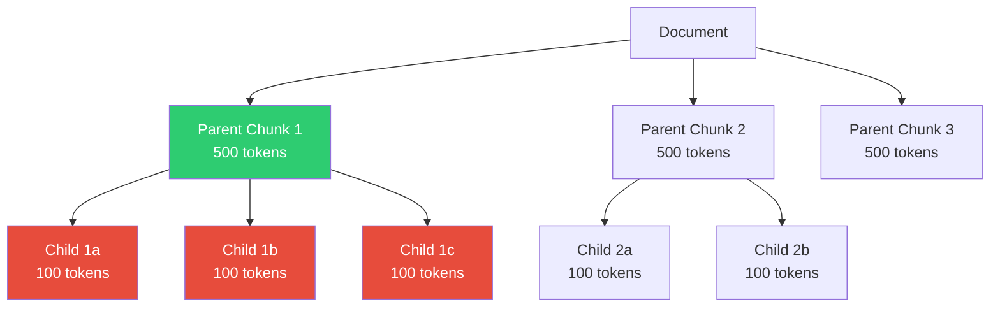
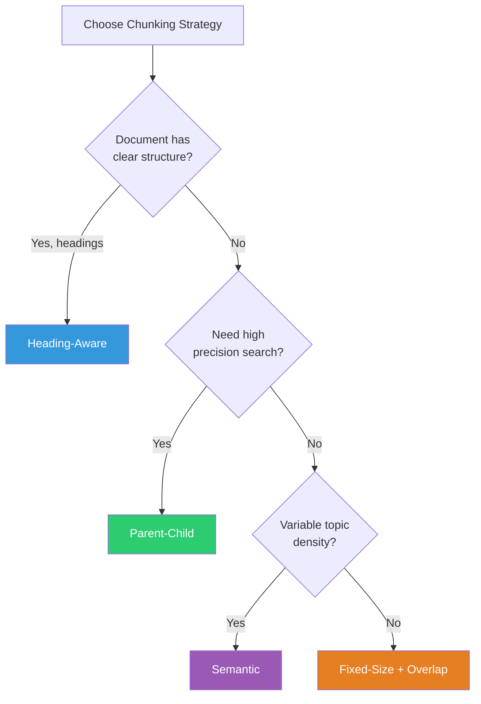

# Chunking Strategies

## Why Chunking Matters: The Goldilocks Problem

Chunking is the art of splitting documents into pieces that are **just right** for retrieval. Think of it like cutting a pizza:

- **Too big** (whole document): When you search, you get an entire 50-page manual. The LLM drowns in noise and can't find the specific answer.
- **Too small** (individual sentences): You find the exact sentence but lose all surrounding context. "Yes" is useless without knowing what question it answers.
- **Just right**: You get a focused passage with enough context to be self-contained and meaningful.



---

## Strategy 1: Fixed-Size Chunking

The simplest approach. Split every N characters/tokens with optional overlap.

**Analogy**: Cutting a loaf of bread into equal slices regardless of where the seeds or air pockets are.

```python
def fixed_size_chunk(text, chunk_size=500, overlap=50):
    chunks = []
    for i in range(0, len(text), chunk_size - overlap):
        chunks.append(text[i:i + chunk_size])
    return chunks
```

| Pros | Cons |
|------|------|
| Dead simple to implement | Splits mid-sentence, mid-paragraph |
| Predictable chunk sizes | No respect for document structure |
| Works with any text | Related info may be split across chunks |

**When to use**: Prototypes, homogeneous text (novels, transcripts), when you need simplicity.

---

## Strategy 2: Sentence-Based Chunking

Group sentences together until you hit a size limit.

**Analogy**: Cutting bread at natural gaps between layers, not through the middle of a layer.

```python
import nltk
def sentence_chunk(text, max_sentences=5):
    sentences = nltk.sent_tokenize(text)
    chunks = []
    for i in range(0, len(sentences), max_sentences):
        chunks.append(" ".join(sentences[i:i + max_sentences]))
    return chunks
```

| Pros | Cons |
|------|------|
| Never splits mid-sentence | Sentences vary wildly in length |
| Natural reading units | Doesn't respect topic boundaries |
| Easy to implement | Might group unrelated sentences |

---

## Strategy 3: Paragraph-Based Chunking

Use paragraph boundaries (double newlines) as natural break points.

**Analogy**: Each paragraph is a thought. Keep complete thoughts together.

| Pros | Cons |
|------|------|
| Respects author's structure | Paragraphs vary from 1 sentence to 1 page |
| Usually topically coherent | Some formats lack paragraph markers |
| Natural units | May need to merge small paragraphs |

---

## Strategy 4: Section/Heading-Aware Chunking

Split at document headings (H1, H2, H3), keeping each section as a chunk.

**Analogy**: Splitting a textbook by its table of contents — each chapter or subsection becomes a chunk.



```python
import re
def heading_chunk(text):
    # Split on markdown headings
    sections = re.split(r'\n(#{1,3} .+)\n', text)
    chunks = []
    current_heading = ""
    for part in sections:
        if re.match(r'^#{1,3} ', part):
            current_heading = part
        else:
            chunks.append(f"{current_heading}\n{part}")
    return chunks
```

| Pros | Cons |
|------|------|
| Respects document hierarchy | Not all docs have headings |
| Chunks are topically focused | Sections can be very large |
| Headings provide context | Need format-specific parsing |

**When to use**: Documentation, wikis, markdown files, structured reports.

---

## Strategy 5: Semantic Chunking

Use embeddings to detect where the *meaning* shifts, then split at those boundaries.

**Analogy**: Instead of cutting bread at equal intervals, you use a scanner to find where the wheat layer ends and the rye layer begins.



**Algorithm**:
1. Split into sentences
2. Embed each sentence
3. Compute similarity between adjacent sentences
4. Where similarity drops below threshold → chunk boundary

| Pros | Cons |
|------|------|
| Finds natural topic boundaries | Requires embedding computation |
| Chunks are semantically coherent | Slower than rule-based methods |
| Language/format agnostic | Threshold tuning needed |

---

## Strategy 6: Parent-Child Chunking

Create TWO levels of chunks:
- **Child chunks** (small, 100-200 tokens): Used for precise search matching
- **Parent chunks** (large, 500-1000 tokens): Returned as context for the LLM

**Analogy**: A library card catalog (small index cards) helps you find books. But you read the full book chapter, not the card.



**Flow**:
1. User asks a question
2. Search against **child** chunks (precision)
3. When a child matches, return its **parent** chunk (context)

| Pros | Cons |
|------|------|
| Best of both worlds: precision + context | More storage (2x chunks) |
| Small chunks match precisely | Mapping logic needed |
| Large context for generation | Index management complexity |

---

## Strategy 7: Table-Aware Chunking

Tables are a special challenge. Never split a table across chunks.

**Rules**:
1. Detect tables in the document
2. Keep entire table as one chunk (or serialize it)
3. Include table caption/title as context
4. Consider converting to markdown or key-value pairs

```python
# Table as a chunk with context
chunk = """
## Q3 Revenue by Region (Table)

| Region | Revenue | Growth |
|--------|---------|--------|
| North America | $45M | +12% |
| Europe | $32M | +8% |
| Asia Pacific | $28M | +22% |

Total company revenue grew 14% year-over-year.
"""
```

---

## Strategy 8: Code-Aware Chunking

For code repositories, chunk at logical boundaries:

- **Functions/methods**: Each function is a chunk
- **Classes**: Each class (if not too large)
- **Files**: Small files as single chunks
- **Logical blocks**: Imports, config sections

```python
# Don't chunk like this (mid-function):
# Chunk 1: "def calculate_tax(income):\n    if income < 50000:"
# Chunk 2: "        return income * 0.2\n    else:\n        return income * 0.3"

# Chunk like this (complete function):
# Chunk 1: "def calculate_tax(income):\n    if income < 50000:\n        return income * 0.2\n    else:\n        return income * 0.3"
```

---

## Overlap Strategies

Overlap means adjacent chunks share some text at their boundaries.

**Why overlap helps**: If the answer spans a chunk boundary, overlap ensures it appears completely in at least one chunk.

```
Without overlap:
[Chunk 1: "...the dosage is"] [Chunk 2: "5mg for adults..."]
← Answer split! Neither chunk has the full answer.

With overlap (50 chars):
[Chunk 1: "...the dosage is 5mg for adults"] 
[Chunk 2: "the dosage is 5mg for adults under..."]
← Both chunks have the complete answer.
```

**Typical overlap**: 10-20% of chunk size.

---

## Chunk Size Guidelines

| Use Case | Recommended Size | Overlap | Why |
|----------|-----------------|---------|-----|
| FAQ / Short answers | 128-256 tokens | 20 tokens | Answers are short, need precision |
| Technical docs | 256-512 tokens | 50 tokens | Need enough context for procedures |
| Legal documents | 512-1024 tokens | 100 tokens | Clauses reference each other |
| Code | Function-level | None | Natural boundaries exist |
| Conversational (chat logs) | Message groups | 1-2 messages | Keep conversation flow |
| Academic papers | Section-level | 1 paragraph | Sections are self-contained |

---

## Comparison of All Strategies



| Strategy | Complexity | Quality | Best For |
|----------|-----------|---------|----------|
| Fixed-size | ⭐ | ⭐⭐ | Prototypes, uniform text |
| Sentence | ⭐⭐ | ⭐⭐⭐ | Articles, narratives |
| Paragraph | ⭐⭐ | ⭐⭐⭐ | Well-structured docs |
| Heading-aware | ⭐⭐⭐ | ⭐⭐⭐⭐ | Documentation, reports |
| Semantic | ⭐⭐⭐⭐ | ⭐⭐⭐⭐ | Mixed content, unknown structure |
| Parent-child | ⭐⭐⭐⭐ | ⭐⭐⭐⭐⭐ | High-precision systems |
| Table-aware | ⭐⭐⭐ | ⭐⭐⭐⭐⭐ | Data-heavy documents |
| Code-aware | ⭐⭐⭐ | ⭐⭐⭐⭐⭐ | Codebases |

---

## Practical Tips

1. **Always include metadata with chunks**: source file, page, section heading
2. **Prepend context to chunks**: "From 'Vacation Policy', Section 'Remote Work':\n..."
3. **Test with real queries**: The best chunk size is the one that retrieves well for YOUR queries
4. **Measure retrieval quality**, not just chunk aesthetics
5. **Consider your embedding model's sweet spot**: Most perform best at 256-512 tokens
6. **Hybrid approach**: Use heading-aware for structured docs + fixed-size fallback for unstructured

---

## Key Takeaways

1. **There's no universal best strategy** — it depends on your documents and queries
2. **Start with heading-aware or fixed-size + overlap**, then measure and iterate
3. **Parent-child is the most powerful** for production systems
4. **Overlap prevents boundary splits** — always use some overlap
5. **Include structural context** (headings, titles) in each chunk
6. **Chunk size affects everything downstream** — test empirically

---

## Staff-Level Anti-Patterns

### Anti-Pattern 1: Fixed-Size Chunks Ignoring Semantics
Blindly chunking at 512 tokens regardless of content. A chunk that starts mid-sentence and ends mid-paragraph is useless for retrieval AND generation. The embedding captures noise, and the LLM receives incoherent context.

### Anti-Pattern 2: Chunks Too Small (Lose Context)
Chunking at 100 tokens seems like it would improve precision, but it destroys context. "The dosage is 5mg" without knowing which drug, which patient population, and which condition is dangerous in medical RAG.

### Anti-Pattern 3: Chunks Too Large (Dilute Relevance)
Chunking at 2000 tokens means the embedding represents a blend of multiple topics. When you search, the chunk matches weakly on many queries rather than strongly on the right one. The signal-to-noise ratio drops.

### Anti-Pattern 4: Not Preserving Document Hierarchy
Chunking a document without carrying forward its heading path. A chunk that says "see above for exceptions" is useless without the parent section context. Always prepend the heading breadcrumb.

### Anti-Pattern 5: Chunking Without Overlap for Narrative Content
Narrative documents (reports, papers) often have answers that span paragraph boundaries. Zero overlap means these answers exist in no single chunk. For narrative content, 10-20% overlap is essential.

---

## Trade-offs Table: Chunk Size vs Retrieval Precision vs Context Usage

| Chunk Size | Retrieval Precision | Context Window Usage | Embedding Quality | Best For |
|-----------|--------------------|--------------------|-------------------|----------|
| 64-128 tokens | Very high (specific) | Low (many chunks fit) | Poor (too little context for good embedding) | Sentence-level FAQ |
| 256-512 tokens | High | Medium | Good (sweet spot for most embedding models) | General purpose |
| 512-1024 tokens | Medium | High (fewer chunks fit) | Good | Long-form content, legal |
| 1024-2048 tokens | Low (diluted) | Very high | Declining (too much noise) | Only with parent-child |

**The fundamental tension**: Small chunks → better retrieval precision but worse embeddings and less context per chunk. Large chunks → better embeddings and more context but worse retrieval precision (match too broadly).

**Resolution**: Parent-child chunking. Search on small (256 token) children, return large (1024 token) parents. This is why parent-child is the production standard.

---

## Real-World: Different Document Types Need Different Strategies

| Document Type | Recommended Strategy | Chunk Size | Overlap | Why |
|--------------|---------------------|-----------|---------|-----|
| **Code** | Function/class-level | Variable (per function) | None | Functions are natural semantic units |
| **Legal contracts** | Clause-level (heading-aware) | 512-1024 tokens | 100 tokens | Clauses cross-reference; need full clause |
| **Medical literature** | Section-aware + parent-child | 256 (child) / 1024 (parent) | 50 tokens | Precision critical; context needed for safety |
| **Conversational (Slack/chat)** | Message-group (5-10 messages) | Variable | 2-3 messages | Conversations are sequential; context is temporal |
| **API documentation** | Endpoint-level | Variable (per endpoint) | None | Each endpoint is self-contained |
| **Financial reports** | Table-aware + section-level | 512 tokens (text), full table | 50 tokens | Tables must never be split |
| **Research papers** | Abstract + section-level | 512 tokens | 1 paragraph | Sections are topically coherent |
| **Meeting notes** | Topic-level (agenda items) | Variable | None | Each agenda item is a unit |

### The "One Strategy Per Document Type" Rule

Production systems should classify documents at ingestion time and route to different chunking strategies:

```python
def chunk_document(doc):
    doc_type = classify_document_type(doc)  # code, legal, medical, etc.
    strategy = CHUNKING_STRATEGIES[doc_type]
    return strategy.chunk(doc)
```

This single architectural decision — matching chunking to document type — typically improves retrieval recall by 15-30% over uniform chunking.
