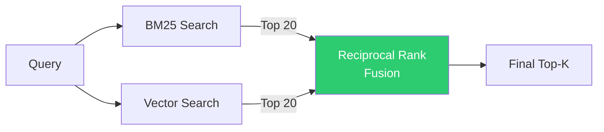
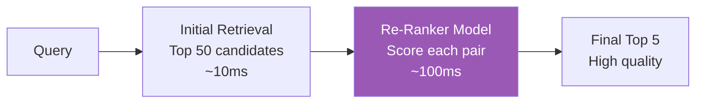
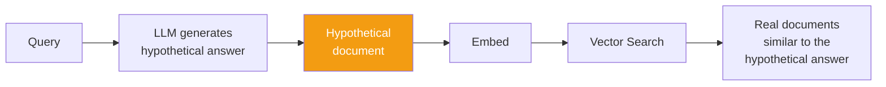
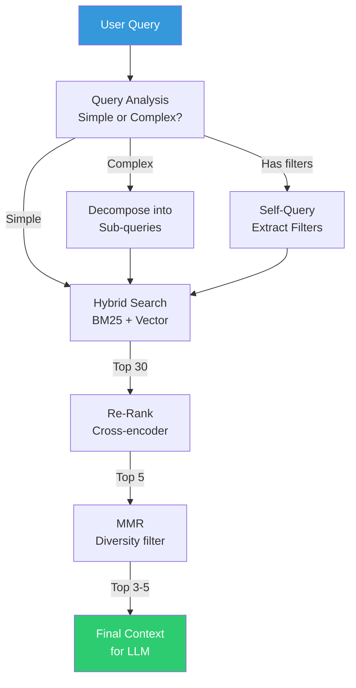

# Retrieval Techniques

## Overview

Retrieval is the **make-or-break** stage of RAG. If you retrieve the wrong documents, even the best LLM will generate wrong answers. This guide covers every major retrieval technique, from simple keyword search to advanced multi-step strategies.

**Analogy**: Retrieval is like a librarian. A bad librarian hands you random books. A good librarian understands your question, checks multiple shelves, cross-references, and hands you exactly the 3 pages you need.

---

## Technique 1: Keyword Search (BM25/TF-IDF)

The traditional approach. Matches documents by **exact word overlap**.

**How it works**: BM25 scores documents based on:
- How often the query terms appear in the document (term frequency)
- How rare those terms are across all documents (inverse document frequency)
- Document length normalization

```
Query: "Python asyncio event loop"
BM25 finds: Documents containing "Python", "asyncio", "event", "loop"
Scores higher: Documents where these words appear frequently and are rare in the corpus
```

| Pros | Cons |
|------|------|
| Fast and well-understood | Misses synonyms ("car" ≠ "vehicle") |
| Great for exact terms, IDs, names | No semantic understanding |
| No embedding model needed | Word order doesn't matter |
| Works well for keyword-heavy queries | Can't handle conceptual queries |

**When it shines**: Searching for error codes, product names, acronyms, specific terms.

---

## Technique 2: Semantic/Vector Search

Matches documents by **meaning**, not keywords.

**How it works**: 
1. Embed the query into a vector
2. Find document vectors closest to the query vector (cosine similarity)
3. "Similar meaning" = close in vector space

```
Query: "How to handle concurrent requests in Python"
Semantic finds: Document about "asyncio for parallel processing"
               (different words, same meaning!)
```

| Pros | Cons |
|------|------|
| Understands meaning and synonyms | Misses exact keywords/IDs |
| Handles paraphrased queries | Embedding model quality matters |
| Works across languages | "Semantic drift" on vague queries |
| No exact word match needed | Computationally heavier |

**When it shines**: Natural language questions, conceptual queries, when users don't know the exact terminology.

---

## Technique 3: Hybrid Search

**Combine keyword + semantic search** and merge results.

**Analogy**: Using both Google (keyword) and a smart assistant (semantic) and combining their answers.



**Why hybrid wins**: 
- Keyword catches exact matches that semantic misses (error codes, names)
- Semantic catches conceptual matches that keyword misses (paraphrases)
- Combined = best of both worlds

---

## Technique 4: Re-Ranking

Initial retrieval (BM25 or vector) is fast but coarse. **Re-ranking** applies a more powerful model to re-score the top results.

**Analogy**: Fast food line vs. fine dining. Initial retrieval is the fast pass (grab 50 candidates quickly). Re-ranking is the chef's selection (carefully pick the best 5).



**Re-ranker models**: Cohere Rerank, BGE-reranker, cross-encoders (ms-marco)

**Why it works**: Cross-encoders see query AND document together (more accurate) but are too slow for initial retrieval over millions of docs.

| Stage | Model Type | Speed | Accuracy |
|-------|-----------|-------|----------|
| Initial retrieval | Bi-encoder | Fast (ms) | Good |
| Re-ranking | Cross-encoder | Slow (100ms) | Excellent |

---

## Technique 5: Multi-Query Retrieval

The user's question might be vague or use different words than the documents. **Generate multiple versions of the query** and search with each.

```
Original: "How do I fix memory issues?"
Generated queries:
  1. "memory leak debugging techniques"
  2. "out of memory error solutions"  
  3. "reduce memory usage optimization"
  4. "heap overflow troubleshooting"
```

Retrieve results for ALL queries, then deduplicate and merge.

---

## Technique 6: Query Decomposition

Break complex queries into simpler sub-queries, retrieve for each, then combine.

```
Complex: "Compare the authentication approach in v1 vs v2 and explain the security implications"

Sub-queries:
  1. "authentication approach version 1"
  2. "authentication approach version 2"  
  3. "security implications of authentication changes"
```

---

## Technique 7: HyDE (Hypothetical Document Embeddings)

**Idea**: Instead of searching with the question, **imagine what the answer would look like**, then search for documents similar to that imagined answer.



**Why it works**: The hypothetical answer uses the same vocabulary and style as real documents, making vector similarity more effective.

**Example**:
```
Query: "What's our refund window?"
HyDE generates: "The refund policy allows customers to request a full refund within 30 days of purchase. After 30 days, partial refunds may be issued at management discretion."
Search with: embedding of the hypothetical answer
Finds: Actual refund policy document (similar language/structure)
```

---

## Technique 8: Self-Query

Extract **metadata filters** from the user's natural language question.

```
Query: "What were the Q3 2023 revenue numbers for the enterprise segment?"

Self-query extracts:
  - Search text: "revenue numbers"
  - Filters: quarter="Q3", year=2023, segment="enterprise"
```

This dramatically narrows the search space before vector similarity.

---

## Technique 9: Reciprocal Rank Fusion (RRF)

Algorithm to combine ranked results from multiple retrieval methods:

```python
def reciprocal_rank_fusion(ranked_lists, k=60):
    """Combine multiple ranked lists using RRF."""
    scores = {}
    for ranked_list in ranked_lists:
        for rank, doc_id in enumerate(ranked_list):
            scores[doc_id] = scores.get(doc_id, 0) + 1 / (k + rank + 1)
    return sorted(scores.items(), key=lambda x: x[1], reverse=True)
```

**Why RRF works**: It doesn't need score normalization across different retrieval methods. Only ranks matter.

---

## Technique 10: Maximal Marginal Relevance (MMR)

Problem: Top-K results might all say the same thing (redundant).
MMR balances **relevance** and **diversity**.

```
Score(doc) = λ * similarity(doc, query) - (1-λ) * max_similarity(doc, already_selected)
```

- λ = 1.0: Pure relevance (might be redundant)
- λ = 0.5: Balance relevance and diversity
- λ = 0.0: Maximum diversity (might miss relevant docs)

---

## Comparison Table

| Technique | Latency | Complexity | Best For |
|-----------|---------|-----------|----------|
| BM25 | ~5ms | Low | Exact terms, IDs, names |
| Vector search | ~20ms | Low | Conceptual queries |
| Hybrid (BM25+Vector) | ~30ms | Medium | General purpose (recommended default) |
| + Re-ranking | ~150ms | Medium | When precision matters |
| Multi-query | ~100ms | Medium | Vague or ambiguous queries |
| Query decomposition | ~200ms | High | Complex multi-part questions |
| HyDE | ~500ms | High | When query ≠ document style |
| Self-query | ~300ms | High | Metadata-rich corpora |

---

## The Full Retrieval Pipeline

In production, you often chain multiple techniques:



---

## Practical Recommendations

1. **Start with hybrid search** (BM25 + vector) — it's the best default
2. **Add re-ranking** when you need precision and can afford 100ms latency
3. **Use multi-query** when users ask vague questions
4. **Use self-query** when your corpus has rich metadata
5. **MMR is almost always worth it** — redundant results waste context window
6. **Measure before optimizing** — sometimes simple vector search is enough

---

## Key Takeaways

1. **No single technique is best** — combine them based on your use case
2. **Hybrid search is the best default** for most applications
3. **Re-ranking is the highest-ROI improvement** after basic retrieval
4. **Query understanding matters as much as document retrieval**
5. **Diversity (MMR) prevents wasting context on redundant information**
6. **Latency budget determines what you can use** — production has constraints

---

## Staff-Level Anti-Patterns

### Anti-Pattern 1: Dense-Only Retrieval
Using only vector/semantic search and wondering why users searching for "ERROR-4012" or "invoice #INV-2024-0891" get garbage results. Dense retrieval fundamentally cannot do exact keyword matching — it embeds meaning, not tokens. Always include BM25 for keyword-heavy queries.

### Anti-Pattern 2: Top-1 Retrieval
Retrieving only the single best chunk is fragile. If that one chunk is wrong (and it often is), the entire answer fails. Retrieve top-5 to top-10, use re-ranking to sort, and pass top-3 to the LLM. Redundancy is a feature, not a bug.

### Anti-Pattern 3: No Reranking Step
Initial retrieval (bi-encoder) is fast but coarse. Teams that skip re-ranking leave 10-20% accuracy on the table for 100ms of latency. Cross-encoder reranking is the single highest-ROI improvement in most RAG pipelines.

### Anti-Pattern 4: Ignoring Query Expansion for Ambiguous Queries
User asks "deployment issues" — this could mean Docker deployment, cloud deployment, CI/CD pipeline failures, or Kubernetes pod scheduling. Without multi-query expansion, you retrieve for one interpretation and miss the others.

---

## Trade-offs: Dense vs Sparse vs Hybrid Retrieval

| Dimension | Sparse (BM25) | Dense (Vector) | Hybrid (BM25 + Vector) |
|-----------|--------------|----------------|----------------------|
| **Exact keyword match** | Excellent | Poor | Excellent |
| **Semantic/conceptual match** | Poor | Excellent | Excellent |
| **Out-of-vocabulary handling** | Fails (unseen terms) | Good (embeds meaning) | Good |
| **Zero-shot (no training)** | Works immediately | Needs good embedding model | Needs both |
| **Latency** | ~5ms | ~20ms | ~30ms |
| **Infrastructure** | Simple (inverted index) | Vector DB + embedding model | Both |
| **Best use case** | Log search, error codes, IDs | Natural language Q&A | Production default |

### When to Use Each (Specific Use Cases)

- **BM25 only**: Internal log search, error code lookup, API reference search, searching by identifiers
- **Dense only**: Customer-facing Q&A where users don't know terminology, cross-lingual search, conceptual exploration
- **Hybrid (always start here)**: Enterprise knowledge bases, documentation search, support ticket resolution, any system where query types are mixed

---

## Real Numbers: BM25 vs Dense vs Hybrid Recall@10 Benchmarks

| Dataset / Domain | BM25 Recall@10 | Dense (E5-large) Recall@10 | Hybrid + RRF Recall@10 | Hybrid + Rerank Recall@10 |
|-----------------|----------------|---------------------------|----------------------|--------------------------|
| MS MARCO (web search) | 0.65 | 0.72 | 0.78 | 0.83 |
| Natural Questions | 0.62 | 0.74 | 0.79 | 0.84 |
| Technical docs (internal) | 0.71 | 0.63 | 0.80 | 0.86 |
| Legal case search | 0.58 | 0.69 | 0.76 | 0.82 |
| Medical literature | 0.55 | 0.71 | 0.77 | 0.85 |

**Key observations**:
1. BM25 actually beats dense retrieval on technical docs (exact terminology matters)
2. Hybrid consistently outperforms either alone by 8-15%
3. Adding a reranker on top of hybrid adds another 5-7%
4. The gap between "just BM25" and "hybrid + rerank" is ~20% recall — that's the difference between a frustrating system and a useful one

**Cost of reranking**: ~$0.001/query with Cohere Rerank API, or free with local cross-encoder (BGE-reranker, ~100ms on GPU). At 100K queries/day, that's $100/day for API or a single GPU instance.
