# RAG Patterns Taxonomy: 20 Architectures

## Overview

RAG is not one architecture — it's a **family of patterns**. Each pattern addresses specific retrieval challenges. This guide covers 20 distinct RAG patterns, when to use each, and their tradeoffs.

---

## Pattern 1: Naive RAG

The simplest possible RAG. Retrieve top-K chunks, stuff them into the prompt, generate.

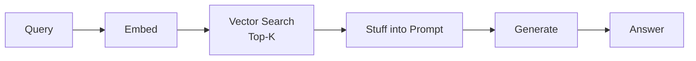

- **When to use**: Prototypes, simple Q&A over small document sets
- **Pros**: Simple, fast, easy to debug
- **Cons**: No quality control, retrieves irrelevant chunks, no error handling
- **Example**: FAQ bot over 50 product pages

---

## Pattern 2: Semantic RAG

Uses dense embeddings for meaning-based retrieval instead of keyword matching.

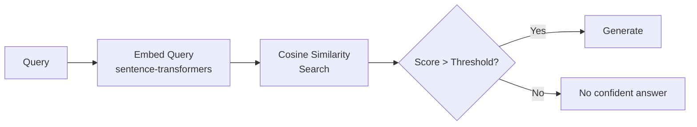

- **When to use**: When users ask questions in different words than the documents use
- **Pros**: Handles paraphrasing, synonyms, conceptual queries
- **Cons**: Misses exact keywords, requires good embedding model
- **Example**: Customer asking "how to get my money back" → finds "refund policy"

---

## Pattern 3: Keyword RAG (BM25)

Traditional information retrieval using term frequency-based scoring.

- **When to use**: Technical docs with specific terms, error codes, product names
- **Pros**: Fast, no embedding needed, great for exact matches
- **Cons**: No semantic understanding, word order irrelevant
- **Example**: Searching logs for "ERROR_CODE_5021"

---

## Pattern 4: Hybrid RAG

Combines keyword (BM25) and semantic (vector) search with rank fusion.

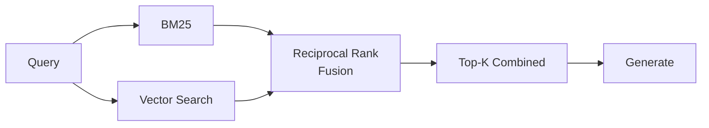

- **When to use**: **Default recommendation for production**. Best general-purpose approach.
- **Pros**: Catches both exact and semantic matches, robust
- **Cons**: Slightly more complex, need to tune fusion weights
- **Example**: Enterprise search where users mix technical terms with natural language

---

## Pattern 5: Reranked RAG

Adds a cross-encoder reranking step after initial retrieval.

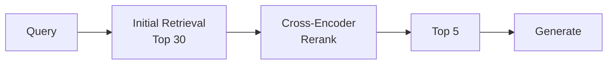

- **When to use**: When precision matters more than latency (medical, legal, financial)
- **Pros**: Significant quality improvement, filters out false positives
- **Cons**: Adds 100-200ms latency, requires reranker model
- **Example**: Medical Q&A where wrong information is dangerous

---

## Pattern 6: Parent-Child RAG

Small chunks for search precision, large chunks for generation context.

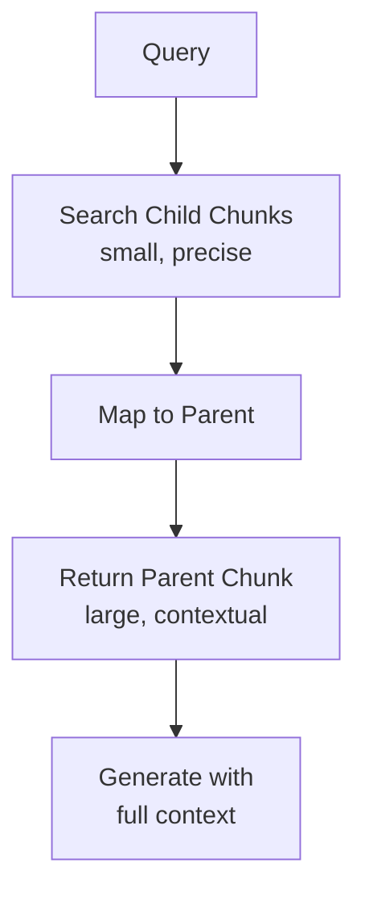

- **When to use**: When answers need surrounding context to make sense
- **Pros**: Precision of small chunks + context of large chunks
- **Cons**: Double storage, mapping complexity
- **Example**: Legal documents where a clause only makes sense with its section

---

## Pattern 7: Hierarchical RAG

Multi-level retrieval: document → section → paragraph.

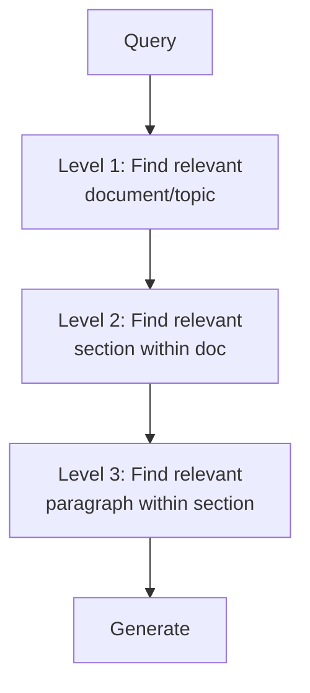

- **When to use**: Large document collections with clear hierarchy
- **Pros**: Efficient search over massive corpora, maintains hierarchy
- **Cons**: Complex indexing, multiple retrieval steps
- **Example**: Searching across 10,000 technical manuals

---

## Pattern 8: Multi-Query RAG

Generate multiple query variations, search with each, combine results.

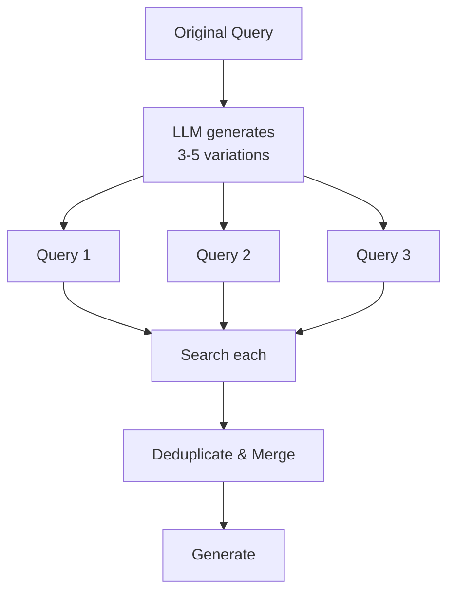

- **When to use**: Ambiguous or vague user queries
- **Pros**: Catches diverse relevant documents, handles ambiguity
- **Cons**: Higher latency (multiple searches), more LLM calls
- **Example**: User asks "deployment issues" — could mean config, scaling, or networking

---

## Pattern 9: Query Decomposition RAG

Break complex questions into sub-questions, answer each, then synthesize.

- **When to use**: Multi-part questions, comparative questions
- **Pros**: Handles complex queries that single retrieval can't
- **Cons**: Multiple retrieval rounds, higher latency and cost
- **Example**: "Compare the pricing of Product A vs B and recommend for enterprise"

---

## Pattern 10: HyDE RAG

Generate a hypothetical answer, embed it, use it to search for real documents.

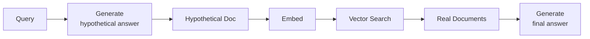

- **When to use**: When questions and documents use very different language
- **Pros**: Bridges vocabulary gap between questions and answers
- **Cons**: Extra LLM call, hypothetical may mislead search
- **Example**: "What happens if I'm late on payments?" → financial policy docs use formal language

---

## Pattern 11: Self-Query RAG

LLM extracts structured filters from natural language before retrieval.

- **When to use**: Metadata-rich corpora with date, category, author filters
- **Pros**: Dramatically narrows search space, very precise
- **Cons**: Requires structured metadata, LLM call for extraction
- **Example**: "Show me HR policies updated after January 2024 about remote work"

---

## Pattern 12: Corrective RAG (CRAG)

After retrieval, verify if documents are actually relevant. If not, try alternative retrieval.

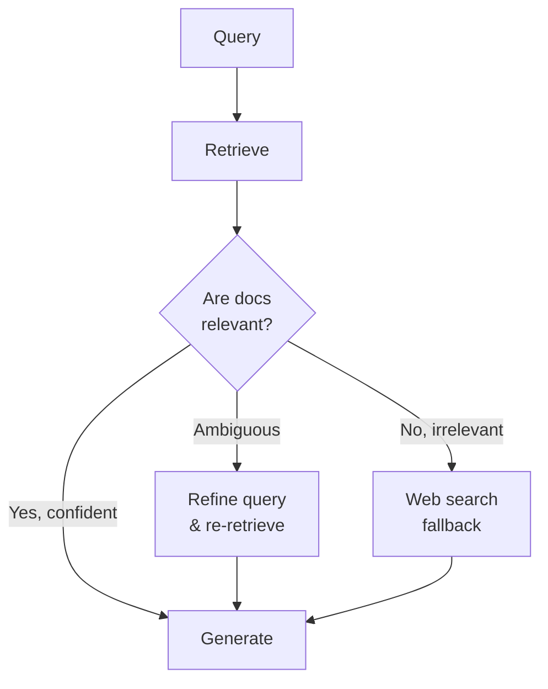

- **When to use**: When retrieval failures must be caught before generation
- **Pros**: Self-correcting, fewer hallucinations
- **Cons**: Extra evaluation step, higher latency
- **Example**: Medical assistant that must not generate ungrounded answers

---

## Pattern 13: Adaptive RAG

Dynamically choose retrieval strategy based on query type.

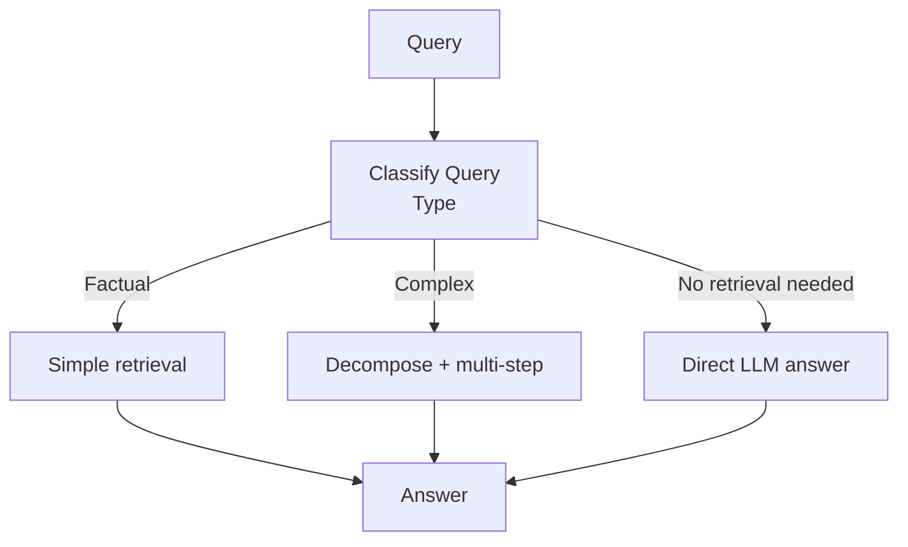

- **When to use**: Systems handling diverse query types
- **Pros**: Optimizes latency/cost per query, doesn't over-engineer simple queries
- **Cons**: Needs query classifier, routing logic
- **Example**: General assistant — "what's 2+2" doesn't need retrieval

---

## Pattern 14: Agentic RAG

An agent decides: what to retrieve, when to retrieve, whether to retrieve again.

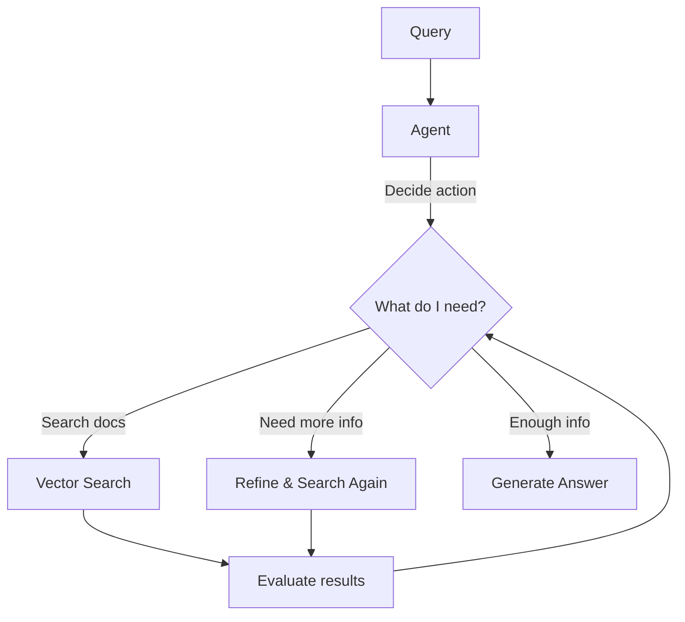

- **When to use**: Complex queries requiring multi-step reasoning
- **Pros**: Most flexible, handles novel queries
- **Cons**: Highest latency and cost, unpredictable behavior
- **Example**: Research assistant that iteratively explores a topic

---

## Pattern 15: Graph RAG

Augments vector search with a **knowledge graph** for relationship-aware retrieval.

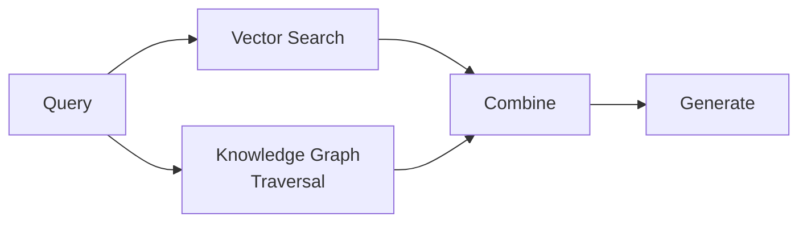

- **When to use**: Highly connected domains (org charts, supply chains, ontologies)
- **Pros**: Captures relationships, enables multi-hop reasoning
- **Cons**: Graph construction is expensive, maintenance overhead
- **Example**: "Who reports to the VP of Engineering?" — needs organizational graph

---

## Pattern 16: SQL + Vector RAG

Combines structured database queries with unstructured vector search.

- **When to use**: When answers need both structured data (numbers, dates) and unstructured (text)
- **Pros**: Precise for structured queries, semantic for text
- **Cons**: Need both SQL and vector infrastructure
- **Example**: "What was revenue for customers who complained about latency?"

---

## Pattern 17: Temporal RAG

Time-aware retrieval that considers document freshness and temporal relevance.

- **When to use**: News, policies, evolving documentation
- **Pros**: Prefers recent information, handles version conflicts
- **Cons**: Needs temporal metadata, decay function tuning
- **Example**: "What's our current pricing?" — must return latest, not 2022 pricing

---

## Pattern 18: Multimodal RAG

Retrieves and reasons over **images + text** together.

- **When to use**: Documents with diagrams, charts, screenshots
- **Pros**: Captures visual information, handles mixed content
- **Cons**: Vision models are expensive, image embedding is harder
- **Example**: Technical manuals with circuit diagrams

---

## Pattern 19: Federated RAG

Searches across **multiple independent sources** and combines results.

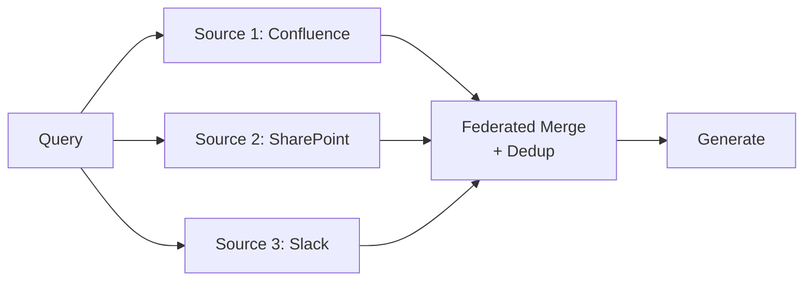

- **When to use**: Enterprise with scattered knowledge across many systems
- **Pros**: Single interface to all knowledge, comprehensive answers
- **Cons**: Permission management, latency of slowest source
- **Example**: "What's the onboarding process?" — info in wiki, Slack, and HR portal

---

## Pattern 20: Memory-Augmented RAG

Incorporates **conversation history** as an additional retrieval source.

- **When to use**: Multi-turn conversations, chatbots with context
- **Pros**: Maintains conversation coherence, handles follow-up questions
- **Cons**: Memory management, context window pressure
- **Example**: User asks "What about for enterprise?" (referring to previous pricing question)

---

## Decision Matrix: Choosing Your Pattern

| Pattern | Complexity | Latency | Best For |
|---------|-----------|---------|----------|
| Naive | ⭐ | ~500ms | Prototypes |
| Semantic | ⭐⭐ | ~500ms | Conceptual search |
| Hybrid | ⭐⭐ | ~600ms | **General purpose (start here)** |
| Reranked | ⭐⭐⭐ | ~700ms | Precision-critical |
| Parent-Child | ⭐⭐⭐ | ~600ms | Context-dependent answers |
| Multi-Query | ⭐⭐⭐ | ~1.5s | Ambiguous queries |
| HyDE | ⭐⭐⭐ | ~1.5s | Vocabulary mismatch |
| CRAG | ⭐⭐⭐⭐ | ~2s | Safety-critical |
| Agentic | ⭐⭐⭐⭐⭐ | ~3-10s | Complex research |
| Graph | ⭐⭐⭐⭐⭐ | ~1s | Relationship queries |

---

## Key Takeaways

1. **Start with Hybrid RAG + Reranking** — covers 80% of use cases
2. **Add patterns incrementally** based on measured failure modes
3. **Agentic RAG is most powerful but most expensive** — use only when needed
4. **Combine patterns**: Real systems often use 3-4 patterns together
5. **Each pattern adds complexity** — justify with measurable improvement
