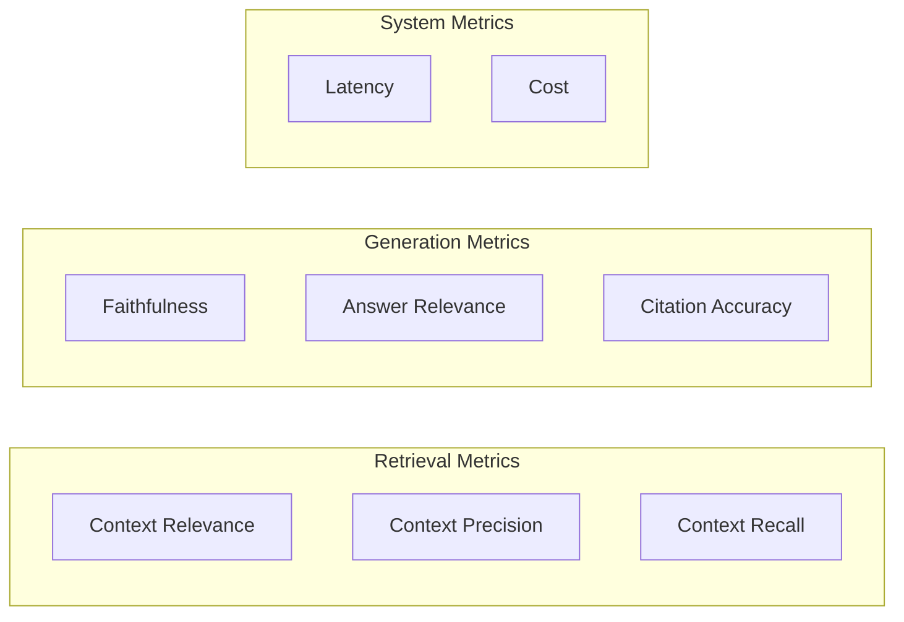
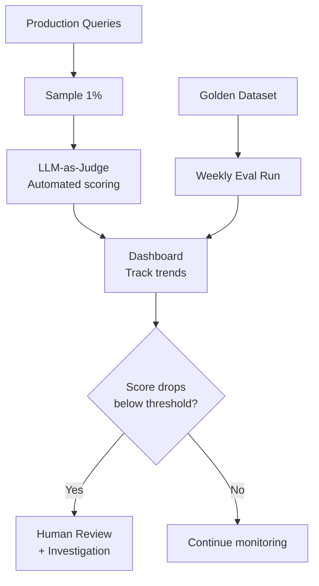

# RAG Evaluation Metrics

## Why Evaluation Matters

RAG systems have many failure modes that are invisible without measurement. A system can *feel* like it works during demos but fail silently in production. Evaluation tells you **where** your system is failing so you can fix the right component.



---

## Retrieval Metrics

### Context Relevance
**Question**: Are the retrieved documents actually relevant to the query?

```
Query: "What's the refund policy?"
Retrieved chunk: "Our company was founded in 2015..."  ← IRRELEVANT (score: 0)
Retrieved chunk: "Refunds are processed within 14 days..." ← RELEVANT (score: 1)
```

**How to measure**: LLM-as-judge rates each retrieved chunk as relevant or not.

### Context Precision
**Question**: Are the most relevant documents ranked highest?

If 5 chunks are retrieved and only chunks 1 and 4 are relevant, precision@5 is low because relevant results aren't concentrated at the top.

**Formula**: Precision@K = (relevant docs in top K) / K

### Context Recall
**Question**: Did we find ALL the relevant information needed to answer?

```
Query: "What are the side effects of Drug X?"
Ground truth has 5 side effects.
Retrieved docs mention only 3.
Context Recall = 3/5 = 0.6
```

This is the hardest to measure — requires a ground truth dataset.

---

## Generation Metrics

### Faithfulness (Groundedness)
**Question**: Is every claim in the answer supported by the retrieved context?

This catches **hallucination** — when the LLM adds information not present in the provided documents.

```
Context: "The refund window is 30 days."
Answer: "You can get a refund within 30 days, and after that you can get store credit."
                                                    ↑ NOT IN CONTEXT = unfaithful
```

**How to measure**:
1. Extract all claims from the answer
2. For each claim, check if it's supported by the context
3. Faithfulness = supported claims / total claims

### Answer Relevance
**Question**: Does the answer actually address what the user asked?

```
Query: "How do I reset my password?"
Answer: "Our password policy requires 12 characters with special symbols..."
        ↑ Related but doesn't answer the question!
```

### Citation Accuracy
**Question**: When the answer says "[Source: doc.pdf, page 3]", is that citation correct?

- Does the cited source actually contain the claimed information?
- Is the page/section reference accurate?

---

## System Metrics

### Latency Breakdown

| Component | Typical Range | Budget |
|-----------|--------------|--------|
| Query embedding | 10-50ms | |
| Vector search | 10-100ms | |
| Re-ranking | 50-200ms | |
| LLM generation | 500-3000ms | |
| **Total** | **600-3500ms** | Target < 3s |

### Cost Per Query

```
Embedding: ~$0.0001 (query embedding)
Retrieval: ~$0.0001 (vector DB query)
Re-ranking: ~$0.001 (if using API)
Generation: ~$0.01-0.05 (depends on model + context size)
Total: ~$0.01-0.05 per query
```

At 100K queries/day = $1,000-5,000/day. Cost matters.

---

## The RAGAS Framework

RAGAS (Retrieval Augmented Generation Assessment) is the standard open-source framework for RAG evaluation.

### Core RAGAS Metrics

| Metric | Measures | Needs Ground Truth? |
|--------|----------|-------------------|
| Faithfulness | Is answer grounded in context? | No |
| Answer Relevance | Does answer address the question? | No |
| Context Precision | Are relevant docs ranked first? | Yes |
| Context Recall | Did we find all relevant info? | Yes |

### Using RAGAS

```python
from ragas import evaluate
from ragas.metrics import faithfulness, answer_relevancy, context_precision, context_recall

results = evaluate(
    dataset=eval_dataset,  # questions + contexts + answers + ground_truth
    metrics=[faithfulness, answer_relevancy, context_precision, context_recall]
)
print(results)
# {'faithfulness': 0.85, 'answer_relevancy': 0.91, ...}
```

---

## Building Golden Datasets

A golden dataset is your **ground truth** for evaluation:

| Column | Description |
|--------|-------------|
| `question` | The user query |
| `ground_truth_answer` | The correct/ideal answer |
| `ground_truth_contexts` | The documents that contain the answer |

### How to Build One

1. **Start with 50-100 representative questions** covering your key use cases
2. **Have domain experts write ideal answers** with source references
3. **Categorize by difficulty**: simple factual, multi-hop, comparative, temporal
4. **Include edge cases**: out-of-scope questions, ambiguous queries, conflicting info
5. **Update regularly** as your document corpus changes

### Example Golden Dataset Entry

```json
{
  "question": "What's the maximum vacation days for senior engineers?",
  "ground_truth_answer": "Senior engineers (L5+) receive 28 days PTO per year.",
  "ground_truth_contexts": ["hr_policy_2024.pdf - Section 4.2"],
  "category": "factual",
  "difficulty": "easy"
}
```

---

## Automated vs Human Evaluation

| Approach | Speed | Cost | Quality | Use For |
|----------|-------|------|---------|---------|
| LLM-as-judge | Fast | Low | Good (80-90% agreement with humans) | Continuous monitoring |
| Human evaluation | Slow | High | Best | Golden dataset creation, calibration |
| Heuristic metrics | Instant | Free | Limited | Basic sanity checks |

### Best Practice: Combine Both

1. **LLM-as-judge for daily monitoring** — catch regressions fast
2. **Weekly human review** of sampled queries — calibrate the LLM judge
3. **Monthly golden dataset evaluation** — track progress over time

---

## Debugging with Metrics

| Symptom | Likely Cause | Metric to Check |
|---------|-------------|----------------|
| Wrong answers | Bad retrieval | Context Relevance, Recall |
| Hallucinated facts | LLM ignoring context | Faithfulness |
| Vague answers | Irrelevant context | Context Precision |
| Missing info | Incomplete retrieval | Context Recall |
| Slow responses | Pipeline bottleneck | Latency breakdown |
| Expensive | Too many tokens | Cost per query |

---

## Setting Up Evaluation Pipeline



---

## Key Takeaways

1. **Measure retrieval and generation separately** — know which component is failing
2. **Faithfulness is the most critical metric** — hallucination is the #1 RAG risk
3. **Build a golden dataset early** — even 50 examples gives you a baseline
4. **Use RAGAS** for standardized evaluation
5. **Automate with LLM-as-judge** but calibrate with human review
6. **Track metrics over time** — regressions happen silently
