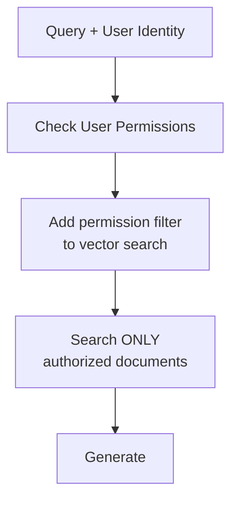
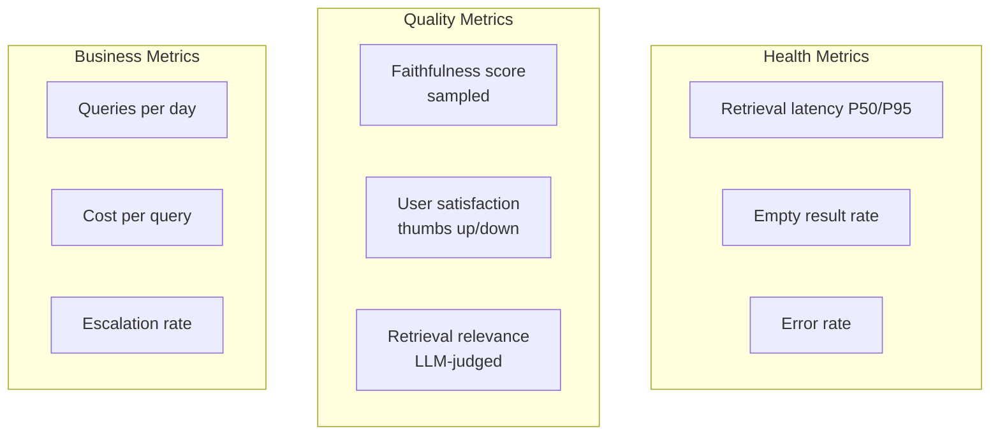
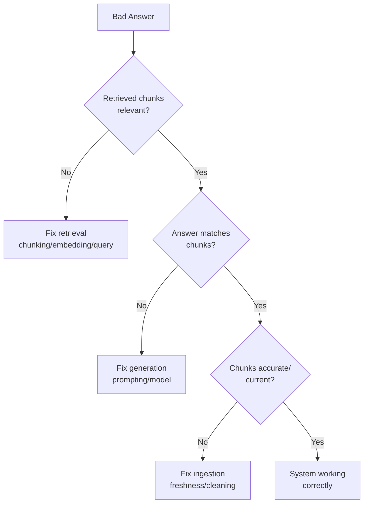

# Production RAG Challenges

## Overview

Building a RAG prototype takes a day. Building a production RAG system that's reliable, secure, and cost-effective takes months. This guide covers the hard problems that only surface at scale.

---

## Challenge 1: Stale Data and Freshness

**The problem**: Your vector store says the refund window is 14 days, but the policy was updated to 30 days yesterday.

### Freshness Strategies

| Strategy | Freshness | Cost | Complexity |
|----------|-----------|------|-----------|
| Full re-index (nightly) | 24h lag | High | Low |
| Incremental sync (hourly) | 1h lag | Medium | Medium |
| Event-driven (webhooks) | Minutes | Low | High |
| Real-time streaming | Seconds | Very high | Very high |

### Best Practice
- **Critical data** (pricing, policies): Event-driven, < 5 min lag
- **Reference data** (docs, guides): Hourly incremental sync
- **Archive data** (historical): Nightly batch

---

## Challenge 2: Permission-Aware Retrieval

**The problem**: User A asks "What's the salary band for L5 engineers?" They should only see this if they're in HR or management.

### Implementation Approaches

| Approach | How It Works | Tradeoff |
|----------|-------------|----------|
| **Pre-filter** | Filter by ACL before vector search | Fast but limits recall |
| **Post-filter** | Search all, filter results by permission | Wastes retrieval slots |
| **Separate indexes** | One index per permission group | Storage overhead |
| **Attribute-based** | Tag chunks with required permissions | Most flexible |

### Critical Rule
**Never rely on the LLM to enforce permissions.** The LLM will happily summarize confidential documents if they're in the context. Filtering must happen BEFORE the context reaches the LLM.

---

## Challenge 3: Multi-Tenant RAG

**The problem**: Company A and Company B both use your RAG platform. Company A must NEVER see Company B's data.

### Isolation Strategies

| Strategy | Isolation | Cost | Operations |
|----------|-----------|------|-----------|
| **Separate databases** | Complete | High | Complex |
| **Namespace/collection per tenant** | Strong | Medium | Medium |
| **Metadata filtering** | Logical | Low | Simple |

**Rule**: For regulated industries (healthcare, finance), use separate databases. For SaaS products, namespace isolation is usually sufficient.

---

## Challenge 4: Conflicting Information

**The problem**: Two documents say different things.
- Doc A (2023): "The maximum API rate limit is 100 req/s"
- Doc B (2024): "The maximum API rate limit is 500 req/s"

### Resolution Strategies

1. **Recency wins**: Always prefer the newer document (requires date metadata)
2. **Authority wins**: Official docs > blog posts > Slack messages
3. **Present both**: "According to [2024 doc], it's 500. Note: an older doc mentions 100."
4. **Human escalation**: Flag conflicting answers for review

---

## Challenge 5: Scale Challenges

### Millions of Documents

| Challenge | At 1K docs | At 1M docs | At 100M docs |
|-----------|-----------|-----------|-------------|
| Index time | Minutes | Hours | Days |
| Storage | MBs | GBs | TBs |
| Query latency | 5ms | 20ms | 100ms+ |
| Re-indexing | Easy | Expensive | Needs strategy |

### Scaling Strategies
- **Sharding**: Split index by domain/date/tenant
- **Hierarchical retrieval**: Coarse filter → fine search
- **Approximate nearest neighbor** (HNSW): Trade tiny accuracy for huge speed gains
- **Caching**: Frequent queries hit cache, not vector DB

---

## Challenge 6: Cost at Scale

### Cost Breakdown (100K queries/day)

| Component | Unit Cost | Daily Cost (100K queries) |
|-----------|-----------|--------------------------|
| Embedding (query) | $0.0001/query | $10 |
| Vector DB queries | $0.0001/query | $10 |
| Re-ranking | $0.001/query | $100 |
| LLM generation | $0.03/query | $3,000 |
| **Total** | | **~$3,120/day** |

### Cost Optimization
1. **Cache frequent queries** — 20% of queries are repeats
2. **Use smaller models** for simple queries (routing)
3. **Reduce context size** — fewer chunks = fewer tokens = lower cost
4. **Batch embeddings** during ingestion
5. **Use local models** for embedding and reranking

---

## Challenge 7: Monitoring RAG Quality

### What to Monitor

### Alert Thresholds

| Metric | Warning | Critical |
|--------|---------|----------|
| Empty retrieval rate | > 5% | > 15% |
| Avg faithfulness | < 0.8 | < 0.6 |
| P95 latency | > 3s | > 5s |
| User thumbs-down rate | > 10% | > 25% |

---

## Challenge 8: Common Failure Modes

### The Retrieval Failure Taxonomy

| Failure Mode | Symptom | Root Cause | Fix |
|-------------|---------|-----------|-----|
| **No results** | "I don't have that info" | Query doesn't match any chunks | Multi-query, HyDE |
| **Wrong results** | Confident wrong answer | Retrieved irrelevant chunks | Better chunking, reranking |
| **Partial results** | Incomplete answer | Answer spans multiple chunks | Overlap, parent-child |
| **Stale results** | Outdated answer | Index not refreshed | Freshness pipeline |
| **Hallucinated answer** | Plausible but unsupported | LLM ignoring context | Stronger prompting, faithfulness check |
| **Permission leak** | Unauthorized info exposed | Missing ACL filter | Pre-retrieval filtering |

### Debugging Workflow

---

## Challenge 9: Latency Budget

Users expect < 3 seconds for a response. Here's how to hit that:

| Component | Target | Optimization |
|-----------|--------|-------------|
| Query processing | < 50ms | Cache embeddings |
| Vector search | < 50ms | ANN indexes, limit scope |
| Re-ranking | < 150ms | Limit to top 20 candidates |
| LLM generation | < 2000ms | Streaming, smaller context |
| **Total** | **< 2.5s** | |

**Key insight**: Stream the LLM response. Users perceive streaming as faster even if total time is the same.

---

## Production Checklist

Before launching RAG to production:

- [ ] Permission filtering verified (red team tested)
- [ ] Freshness pipeline running and monitored
- [ ] Evaluation pipeline with golden dataset
- [ ] Cost projections at expected scale
- [ ] Latency within SLA under load
- [ ] Graceful degradation when components fail
- [ ] Logging for debugging (query, retrieved chunks, answer)
- [ ] User feedback mechanism (thumbs up/down)
- [ ] Alerting on quality drops
- [ ] Data deletion/GDPR compliance

---

## Key Takeaways

1. **Security first**: Permission filtering is non-negotiable
2. **Freshness is a spectrum**: Match freshness guarantees to data criticality
3. **Monitor quality continuously**: Silent degradation is the norm
4. **Cost grows with scale**: Plan optimization early
5. **Debug systematically**: Isolate retrieval vs generation failures
6. **Production RAG is an ongoing operation**, not a one-time build

---

## Staff-Level Anti-Patterns

### Anti-Pattern 1: Deploying Without a Latency Budget
No defined SLA for response time. Teams add reranking, multi-query expansion, and CRAG without measuring cumulative latency. Users abandon after 5 seconds. Every component must have a latency allocation that sums to < your SLA.

### Anti-Pattern 2: No Caching Layer
Every query hits embedding model → vector DB → reranker → LLM. But 20-30% of queries are repeats or near-duplicates. A semantic cache (embed query, check if similar query was answered recently) saves cost and latency instantly.

### Anti-Pattern 3: Single Retrieval Strategy for All Query Types
Using the same hybrid search + rerank for "What's the refund policy?" (simple lookup) and "Compare our Q1 and Q2 performance across all regions" (complex multi-hop). Route queries by complexity — simple queries need 500ms, complex queries can take 3s.

### Anti-Pattern 4: Ignoring Stale Data
The vector index says the API rate limit is 100/s but it was updated to 500/s two weeks ago. No freshness monitoring, no TTL on chunks, no alerting on stale documents. Users lose trust after one wrong answer from outdated data.

### Anti-Pattern 5: No Graceful Degradation When Retrieval Fails
Vector DB goes down → entire system returns 500 errors. Instead: fall back to BM25-only search, or fall back to LLM-without-context with a disclaimer, or return cached answers. Design for partial failure.

---

## Trade-offs: The Three Production Tensions

### 1. Freshness vs Cost
| Freshness Target | Approach | Monthly Cost (1M docs) | Complexity |
|-----------------|----------|----------------------|------------|
| Real-time (seconds) | Streaming pipeline (Kafka + workers) | $5,000-15,000 | Very high |
| Near real-time (minutes) | Event-driven webhooks | $1,000-3,000 | High |
| Hourly | Polling + incremental sync | $500-1,000 | Medium |
| Daily | Nightly batch re-index | $100-300 | Low |

**Decision**: Match freshness to data criticality. Pricing pages need real-time. Historical docs need daily at most.

### 2. Accuracy vs Latency
| Configuration | Accuracy (Recall@5) | P95 Latency | Monthly Cost |
|--------------|--------------------|-----------| ------------|
| Vector search only | 0.65 | 200ms | $500 |
| Hybrid search | 0.78 | 350ms | $800 |
| Hybrid + rerank | 0.85 | 600ms | $3,500 |
| Hybrid + rerank + multi-query | 0.89 | 1.5s | $8,000 |
| Full agentic (iterative) | 0.93 | 3-8s | $20,000 |

**Decision**: Most users accept 85% accuracy at 600ms. The jump from 85% to 93% costs 10x more latency and 6x more money.

### 3. Complexity vs Maintainability
Every pattern you add is a component that can fail, needs monitoring, and requires expertise to debug. A system with 8 retrieval patterns has 8 potential failure points. The team that built it may not be the team maintaining it.

**Rule**: If you can't explain your retrieval pipeline in under 2 minutes to a new engineer, it's too complex.

---

## War Story: RAG That Worked in Demo, Failed at Scale

### The Setup
A healthcare company built a RAG system for clinical guidelines. Demo: 50 test queries, 92% accuracy, leadership impressed. Production: 5,000 queries/day from actual clinicians.

### What Went Wrong

**Problem 1: Embedding Distribution Shift**
Demo queries were written by engineers: "What is the recommended dosage of metformin for type 2 diabetes in adults?"
Production queries from clinicians: "metformin dose T2DM adult" or "how much metformin elderly CKD stage 3"

The embedding model (trained on natural language) produced good vectors for engineer-style queries but poor vectors for clinical shorthand. Recall dropped from 92% to 61% on real traffic.

**Problem 2: Long-Tail Query Distribution**
50 demo queries covered the top use cases. Production had 2,000 unique query patterns. The long tail included queries about drug interactions (requiring multi-hop), temporal queries ("latest guidelines"), and negation queries ("when NOT to prescribe") — none tested in demo.

**Problem 3: Scale Revealed Latency Issues**
At 50 queries, everything ran sequentially on one machine. At 5,000/day with burst traffic (9am clinic opening), the vector DB connection pool exhausted, reranker became a bottleneck, and P95 latency hit 12 seconds.

### The Fix (3 Months)
1. **Query analysis**: Clustered production queries, built eval set from real distribution (not imagined queries)
2. **Medical-specific embedding model**: Switched from general-purpose to PubMedBERT embeddings (+18% recall on clinical shorthand)
3. **Query normalization**: Added a step to expand clinical abbreviations before embedding
4. **Load testing**: Simulated 10x traffic before relaunch
5. **Graceful degradation**: If P95 > 3s, disable reranking; if > 5s, return cached similar answers

### The Lesson
> "Your RAG system is only as good as your evaluation set. If your eval set doesn't match your production query distribution, your metrics are fiction. Always instrument production, sample real queries, and build your golden dataset from actual user behavior — never from what you imagine users will ask."
