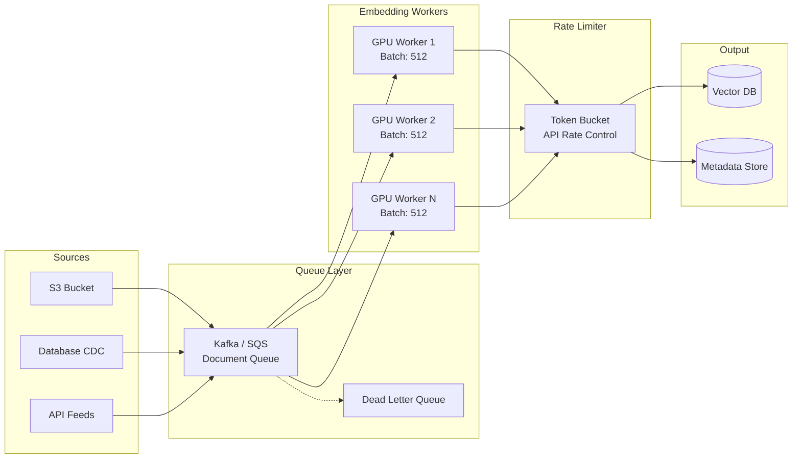
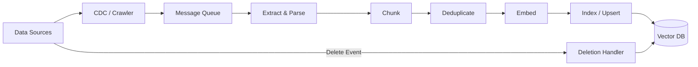
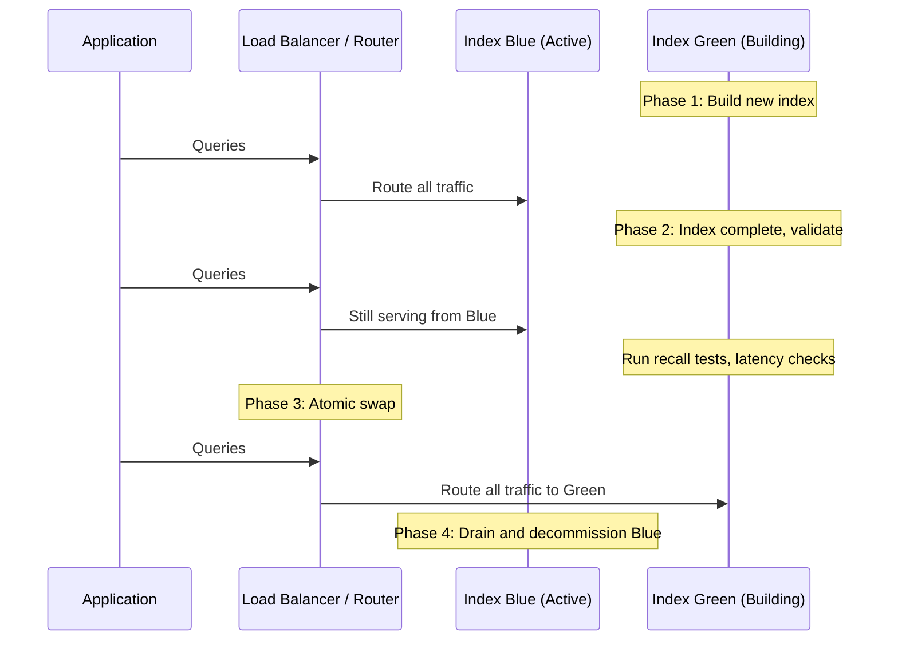
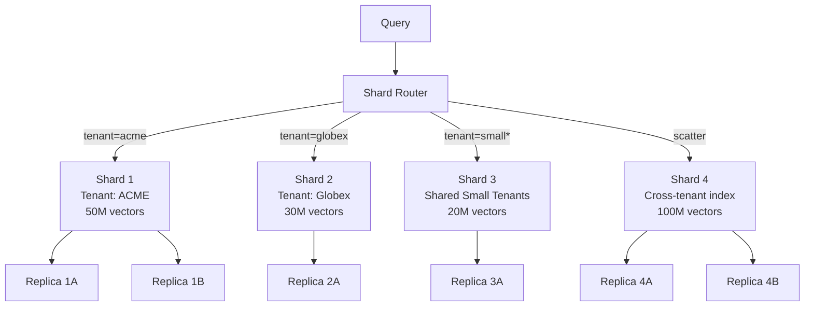
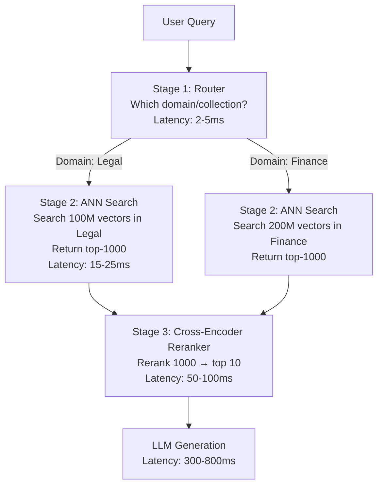
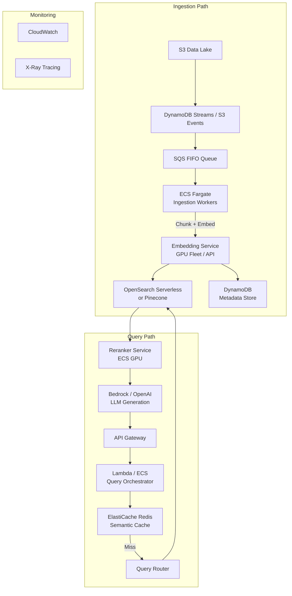

# Scaling RAG Systems to Millions and Billions of Records

## 1. The Scale Challenge

What changes when you go from a prototype to production at massive scale? Everything.

At 1K documents, you can brute-force search every vector. At 1M, you need approximate nearest neighbor (ANN) algorithms. At 1B, you need an entirely different architecture—hierarchical retrieval, sharding, caching, and careful cost management.

### Scale Progression Table

| Metric | 1K Docs | 100K Docs | 1M Docs | 100M Docs | 1B Docs |
|--------|---------|-----------|---------|-----------|---------|
| Vectors (avg 10 chunks/doc) | 10K | 1M | 10M | 1B | 10B |
| Storage (1536 dims, float32) | 60 MB | 6 GB | 60 GB | 6 TB | 60 TB |
| Index RAM (HNSW) | 120 MB | 12 GB | 120 GB | 12 TB | 120 TB |
| Query Latency (single node) | <5ms | <10ms | 20-50ms | Impossible | Impossible |
| Embedding Time (OpenAI API) | 3 sec | 5 min | 55 min | 92 hours | 38 days |
| Embedding Cost (ada-002) | $0.002 | $0.20 | $2.00 | $200 | $2,000 |
| Monthly Storage Cost | ~$0 | $1 | $15 | $1,500 | $15,000 |

### Real Numbers at 1M Documents

```
1M documents
× 10 chunks average per document
= 10M chunks/vectors
× 1536 dimensions × 4 bytes (float32)
= ~60 GB raw vector data
+ HNSW index overhead (2-3x)
= ~120-180 GB total RAM needed
```

### The Breaking Points

- **>100K vectors**: Brute-force search becomes too slow; need ANN indices (HNSW, IVF)
- **>10M vectors**: Single-node memory becomes a constraint; need sharding or quantization
- **>100M vectors**: Must use hierarchical retrieval; can't scan all vectors per query
- **>1B vectors**: Need full distributed architecture with routing, caching, tiered storage

---

## 2. Distributed Embedding Pipeline

### The Problem

Embedding 1 billion documents sequentially on a single GPU takes months. Even with OpenAI's API at 3000 embeddings/sec, processing 10B chunks takes 38 days of continuous calls.

### Solution Architecture



### Batch Optimization

```python
# Anti-pattern: one-at-a-time embedding
for doc in documents:
    embedding = embed(doc)  # Massive overhead per call

# Correct: batch embedding
BATCH_SIZE = 500  # Sweet spot for most APIs/models
for batch in chunked(documents, BATCH_SIZE):
    embeddings = embed_batch(batch)  # Amortized overhead
    upsert_batch(vector_db, embeddings)
```

### Cost Calculation at Scale

```
1B documents
× 3 chunks average (conservative)
= 3B embeddings needed

OpenAI ada-002: $0.0001 per 1K tokens, ~250 tokens/chunk
= 3B × 250 / 1000 × $0.0001
= $75,000 for initial embedding

Self-hosted E5-large on A100 fleet:
= 3B embeddings / 2000 per sec per GPU
= 1.5M seconds per GPU
= 17.4 GPU-days
= With 50 GPUs: ~8 hours
= 50 × A100 spot at $1.50/hr × 8 hrs = $600
```

### Embedding Generation Throughput Benchmarks

| Approach | Throughput | Cost per 1M embeddings | Best For |
|----------|-----------|----------------------|----------|
| OpenAI text-embedding-3-small | ~3,000/sec | $2.00 | Small-medium scale |
| OpenAI text-embedding-3-large | ~2,500/sec | $13.00 | Quality-critical |
| Cohere embed-v3 | ~2,800/sec | $10.00 | Multilingual |
| Self-hosted E5-large (T4) | ~300/sec/GPU | $0.15 (spot) | Cost-sensitive |
| Self-hosted E5-large (A100) | ~2,000/sec/GPU | $0.50 (spot) | High throughput |
| Sentence-transformers (A100) | ~2,500/sec/GPU | $0.40 (spot) | Maximum control |
| ONNX-optimized (CPU) | ~100/sec/core | $0.02 | Steady background |

### Incremental Embedding Strategy

```python
def should_embed(doc_id: str, content_hash: str) -> bool:
    """Only embed new or changed documents."""
    existing = metadata_store.get(doc_id)
    if not existing:
        return True  # New document
    if existing.content_hash != content_hash:
        return True  # Content changed
    return False  # Already embedded, skip

# Saves 70-90% of embedding cost on updates
```

### Deduplication Before Embedding

- **Exact dedup**: Hash-based (SHA-256 of content) — catches copies
- **Near-dedup**: MinHash/SimHash — catches paraphrased duplicates
- **Savings**: Typically 10-30% fewer embeddings needed
- **Implementation**: Run dedup as pipeline stage BEFORE embedding workers

---

## 3. Ingestion Architecture at Scale

### The Full Pipeline



### Change Data Capture (CDC)

Instead of re-processing everything, capture only changes:

```python
# PostgreSQL CDC with Debezium
# Captures INSERT, UPDATE, DELETE events
{
    "op": "u",  # update
    "before": {"id": 123, "content": "old..."},
    "after": {"id": 123, "content": "new..."},
    "source": {"table": "documents", "lsn": "0/1A2B3C"}
}

# Only re-embed the changed document
# Delete old chunks, create new chunks, embed, index
```

### Incremental vs Full Re-Index Decision Tree

```
Has the embedding model changed?
├── Yes → Full re-index required
└── No
    Has the chunking strategy changed?
    ├── Yes → Full re-index required
    └── No
        Are >30% of documents changed?
        ├── Yes → Full re-index (cheaper than incremental at this volume)
        └── No → Incremental update
```

### Blue-Green Indexing (Zero-Downtime Re-Index)



### Deletion Propagation

```python
async def handle_document_deletion(doc_id: str):
    """When source document is deleted, remove all derived vectors."""
    # 1. Find all chunk IDs for this document
    chunk_ids = await metadata_store.get_chunks_for_document(doc_id)
    
    # 2. Delete vectors from all shards
    for shard in get_shards_for_chunks(chunk_ids):
        await shard.delete(ids=chunk_ids)
    
    # 3. Invalidate caches
    await cache.invalidate_by_document(doc_id)
    
    # 4. Update metadata store
    await metadata_store.delete_document(doc_id)
    
    # 5. Log for audit
    audit_log.record_deletion(doc_id, chunk_count=len(chunk_ids))
```

### Backpressure Handling

```python
class IngestionPipeline:
    def __init__(self):
        self.queue_depth_threshold = 100_000
        self.indexing_lag_threshold = timedelta(minutes=30)
    
    async def check_backpressure(self):
        queue_depth = await self.queue.get_depth()
        indexing_lag = await self.get_indexing_lag()
        
        if queue_depth > self.queue_depth_threshold:
            # Slow down producers
            await self.throttle_ingestion(rate=0.5)
            await self.scale_up_workers()
        
        if indexing_lag > self.indexing_lag_threshold:
            # Alert: indexing falling behind
            await self.alert("indexing_lag_high", lag=indexing_lag)
```

### Idempotency

```python
async def upsert_chunk(chunk_id: str, vector: list, metadata: dict):
    """Idempotent: same chunk ingested twice = same result."""
    # Use deterministic chunk_id: hash(doc_id + chunk_index + content_hash)
    # Vector DB upsert semantics: insert or replace
    await vector_db.upsert(
        id=chunk_id,  # Deterministic, prevents duplicates
        vector=vector,
        metadata=metadata
    )
```

---

## 4. Vector Database Sharding for Billions

### When Single-Node Isn't Enough

| Vector Count | HNSW RAM (1536d) | Query Latency | Verdict |
|---|---|---|---|
| 1M | ~12 GB | <10ms | Single node fine |
| 10M | ~120 GB | 10-30ms | Large instance or shard |
| 100M | ~1.2 TB | Impractical | Must shard |
| 1B | ~12 TB | Impossible | Distributed required |

### Sharding Strategies

**1. Hash-Based Sharding**
```
shard_id = hash(vector_id) % num_shards
```
- Pro: Uniform distribution, simple
- Con: Every query hits ALL shards (scatter-gather)
- Use when: No natural partitioning key

**2. Metadata-Based Sharding**
```
shard_id = tenant_id  # or category, language, date_range
```
- Pro: Queries only hit relevant shards, natural isolation
- Con: Uneven distribution (hot shards)
- Use when: Queries always include the partition key

**3. Hybrid Sharding**
```
Large tenants: dedicated shard per tenant
Small tenants: shared shard with metadata filtering
```
- Pro: Balances isolation with efficiency
- Con: Complex routing logic

**4. Time-Based Sharding**
```
Hot shard: last 30 days (SSD, full replicas)
Warm shard: 30-365 days (SSD, fewer replicas)
Cold shard: >1 year (disk, compressed, on-demand)
```
- Pro: Matches access patterns, cost-efficient
- Con: Time-range queries span shards

### Sharded Architecture



### Cross-Shard Query (Scatter-Gather)

```python
async def search_across_shards(query_vector, top_k=10, shards=None):
    """Scatter query to relevant shards, gather and merge results."""
    target_shards = shards or get_all_shards()
    
    # Scatter: parallel search across shards
    tasks = [
        shard.search(query_vector, top_k=top_k * 2)  # Over-fetch
        for shard in target_shards
    ]
    shard_results = await asyncio.gather(*tasks)
    
    # Gather: merge and re-rank
    all_results = []
    for results in shard_results:
        all_results.extend(results)
    
    # Sort by score, take top_k
    all_results.sort(key=lambda x: x.score, reverse=True)
    return all_results[:top_k]
```

### Rebalancing Without Downtime

1. Create new shard with desired configuration
2. Start copying vectors from source shard (background)
3. During copy, dual-write new vectors to both old and new shards
4. Once copy complete, verify counts match
5. Update router to point to new shard
6. Drain old shard (stop reads after confirmation)
7. Decommission old shard

---

## 5. Hierarchical Retrieval (The Key to Billion-Scale)

### The Fundamental Insight

You **cannot** search 1 billion vectors for every user query. At 1B vectors with HNSW, even ANN search takes seconds and requires terabytes of RAM. The solution: search progressively smaller sets.

### Two-Stage Retrieval

```
Stage 1: Coarse Search
- Search document-level summaries (1B docs → 1B summary vectors)
- Or search cluster centroids (1B vectors → 10K clusters)
- Returns: 1000-10000 candidate documents
- Latency: 5-20ms

Stage 2: Fine Search
- Search chunk-level vectors ONLY within candidates
- Returns: top 10-50 chunks
- Latency: 10-30ms
```

### Three-Stage Retrieval for Billion Scale



### Document-Level vs Chunk-Level Indexing

```python
# Strategy: Maintain two indices
# Index 1: Document summaries (1 vector per doc, coarse)
# Index 2: Document chunks (10 vectors per doc, fine)

async def hierarchical_search(query, top_k=10):
    # Stage 1: Find relevant documents (coarse)
    query_vec = embed(query)
    doc_results = await doc_index.search(query_vec, top_k=100)
    candidate_doc_ids = [r.id for r in doc_results]
    
    # Stage 2: Search chunks within candidate documents only
    chunk_results = await chunk_index.search(
        query_vec, 
        top_k=top_k * 3,
        filter={"doc_id": {"$in": candidate_doc_ids}}
    )
    
    # Stage 3: Rerank
    reranked = reranker.rerank(query, chunk_results, top_k=top_k)
    return reranked
```

### Cluster-Based Retrieval

```python
# Pre-compute: cluster all vectors into K clusters (K = sqrt(N))
# For 1B vectors: K ≈ 31,623 clusters

# At query time:
# 1. Find nearest cluster centroids (search 31K vectors — fast!)
# 2. Search only within top-5 clusters (~160K vectors each)

async def cluster_search(query_vec, top_k=10):
    # Search centroids (31K vectors, <1ms)
    nearest_clusters = await centroid_index.search(query_vec, top_k=5)
    
    # Search within those clusters (~800K vectors total)
    results = await chunk_index.search(
        query_vec,
        top_k=top_k,
        filter={"cluster_id": {"$in": [c.id for c in nearest_clusters]}}
    )
    return results
```

### IVF (Inverted File Index) — The Database-Native Approach

Most vector databases implement this internally:
- **IVF-PQ** (Inverted File + Product Quantization): 10B+ vectors, low memory
- **IVF-HNSW**: Combines clustering with graph-based search
- **SCANN**: Google's approach—asymmetric hashing + reranking

---

## 6. Caching Strategies at Scale

### Tiered Caching Architecture

```
L1: In-Process Cache (microseconds)
    - LRU cache of recent query embeddings
    - Hot document vectors
    - Capacity: 1-10 GB per instance

L2: Distributed Cache - Redis (milliseconds)
    - Semantic query cache (query → retrieved chunks)
    - Embedding cache (doc_id → vector)
    - Capacity: 50-500 GB cluster

L3: Disk Cache - Local SSD (low milliseconds)
    - Full query results
    - Precomputed answers for common queries
    - Capacity: 1-10 TB per node

L4: Vector Database (tens of milliseconds)
    - The actual ANN search
    - Only hit when cache misses
```

### Semantic Cache

```python
class SemanticCache:
    """Cache similar queries, not just exact matches."""
    
    def __init__(self, similarity_threshold=0.95):
        self.threshold = similarity_threshold
        self.cache_index = VectorIndex()  # Small index of cached queries
    
    async def get(self, query: str) -> Optional[CachedResult]:
        query_vec = embed(query)
        results = await self.cache_index.search(query_vec, top_k=1)
        
        if results and results[0].score > self.threshold:
            # Similar enough query was already answered
            return await self.result_store.get(results[0].id)
        return None
    
    async def put(self, query: str, result: RetrievalResult):
        query_vec = embed(query)
        cache_id = generate_id()
        await self.cache_index.upsert(cache_id, query_vec)
        await self.result_store.set(cache_id, result, ttl=3600)
```

### Cache Invalidation

```python
async def on_document_updated(doc_id: str):
    """Invalidate all caches that reference this document."""
    # 1. Find cached results that included this document's chunks
    affected_cache_entries = await cache_metadata.find_by_document(doc_id)
    
    # 2. Invalidate those entries
    for entry in affected_cache_entries:
        await semantic_cache.invalidate(entry.cache_id)
        await redis_cache.delete(entry.query_hash)
    
    # 3. Track for monitoring
    metrics.increment("cache_invalidations", tags={"reason": "doc_update"})
```

### Cost Savings with Caching

```
Without caching (1M queries/day at billion scale):
- Vector search: 1M × $0.0001 = $100/day
- Reranking: 1M × $0.001 = $1,000/day  
- LLM calls: 1M × $0.01 = $10,000/day
- Total: ~$11,100/day = $333K/month

With 50% semantic cache hit rate:
- Vector search: 500K × $0.0001 = $50/day
- Reranking: 500K × $0.001 = $500/day
- LLM calls: 500K × $0.01 = $5,000/day
- Cache infrastructure: ~$3,000/month
- Total: ~$5,550/day + $100/day cache = $170K/month

Savings: ~$163K/month (49% reduction)
```

---

## 7. Multi-Tenant RAG at Billion Scale

### The Challenge

1000 tenants × 1M documents each = 1B documents total. Each tenant expects sub-second retrieval with complete data isolation.

### Isolation Patterns Comparison

| Pattern | Tenants | Isolation | Cost | Query Speed | Ops Complexity |
|---------|---------|-----------|------|-------------|----------------|
| Collection per tenant | <100 | Complete | High | Fast | Medium |
| Shared + metadata filter | <10K | Logical | Low | Medium | Low |
| Shard per large tenant | Mixed | Physical for large | Medium | Fast | High |
| Namespace (Pinecone-style) | <10K | Logical | Low | Fast | Low |

### Shared Collection with Metadata Filtering

```python
# Ingestion: tag every vector with tenant_id
await vector_db.upsert(
    id=chunk_id,
    vector=embedding,
    metadata={"tenant_id": "acme", "doc_id": doc_id, ...}
)

# Query: ALWAYS filter by tenant_id
results = await vector_db.search(
    vector=query_embedding,
    top_k=10,
    filter={"tenant_id": {"$eq": "acme"}}
)
```

**Performance consideration**: Metadata filtering BEFORE vector search (pre-filter) is efficient only if the database supports it natively. Post-filtering wastes compute scanning irrelevant vectors.

### Noisy Neighbor Mitigation

```python
class TenantRateLimiter:
    """Prevent one tenant from consuming all query capacity."""
    
    def __init__(self):
        self.limits = {
            "free": TokenBucket(rate=10, capacity=20),     # 10 QPS
            "pro": TokenBucket(rate=100, capacity=200),    # 100 QPS
            "enterprise": TokenBucket(rate=1000, capacity=2000),  # 1000 QPS
        }
    
    async def acquire(self, tenant_id: str, tier: str) -> bool:
        bucket = self.limits[tier]
        if not bucket.consume(1):
            raise RateLimitExceeded(
                f"Tenant {tenant_id} exceeded {tier} rate limit"
            )
        return True
```

### Tenant-Aware Capacity Planning

```
Large tenant (>10M docs): Dedicated shard, dedicated replicas
Medium tenant (1M-10M docs): Shared shard, guaranteed capacity reservation
Small tenant (<1M docs): Shared shard, best-effort
```

---

## 8. Real-World Architecture: Billion-Document RAG

### Complete Architecture (AWS)



### Request Flow at Billion Scale

```
1. Client sends query to API Gateway                         [0ms]
2. Lambda receives request, computes query embedding         [20ms]
3. Check semantic cache (Redis) for similar query            [2ms]
4. CACHE HIT → return cached result                         [total: 25ms]
5. CACHE MISS → Route to appropriate shard(s)               [3ms]
6. ANN search across relevant shards (scatter-gather)       [20-40ms]
7. Fetch full chunk text from metadata store                 [5ms]
8. Cross-encoder reranking of top-100 → top-10              [50-80ms]
9. Send top-10 chunks to LLM with prompt                    [300-800ms]
10. Cache result in semantic cache                           [2ms]
11. Return response to client                               [total: 400-950ms]
```

### Latency Budget

| Component | P50 | P95 | P99 | Budget |
|-----------|-----|-----|-----|--------|
| Embedding query | 15ms | 25ms | 40ms | 30ms |
| Cache check | 1ms | 3ms | 5ms | 5ms |
| Shard routing | 1ms | 2ms | 5ms | 5ms |
| ANN search | 15ms | 35ms | 60ms | 50ms |
| Metadata fetch | 3ms | 8ms | 15ms | 10ms |
| Reranking | 40ms | 80ms | 120ms | 100ms |
| LLM generation | 400ms | 800ms | 1500ms | 1000ms |
| **Total retrieval** | **75ms** | **153ms** | **245ms** | **200ms** |
| **Total end-to-end** | **475ms** | **953ms** | **1745ms** | **1200ms** |

### Monthly Cost at 1B Scale (AWS)

| Component | Specification | Monthly Cost |
|-----------|--------------|-------------|
| Vector DB (OpenSearch) | 20 nodes, r6g.4xlarge | $28,000 |
| Embedding GPU fleet | 10× g5.xlarge (spot) | $8,000 |
| ElastiCache (Redis) | r6g.2xlarge cluster | $4,500 |
| ECS Fargate (ingestion) | 50 tasks average | $6,000 |
| ECS Fargate (query) | 20 tasks + GPU for rerank | $12,000 |
| S3 storage | 60 TB | $1,400 |
| DynamoDB (metadata) | 10B items, on-demand | $5,000 |
| API Gateway + Lambda | 30M requests/month | $2,000 |
| Data transfer | ~10 TB/month | $900 |
| Monitoring (CloudWatch, X-Ray) | - | $1,200 |
| **Total** | | **~$69,000/month** |

---

## 9. Testing and Monitoring at Scale

### Load Testing Vector Search

```python
# Key metrics to measure during load testing:
metrics = {
    "throughput": "Queries per second at P99 < 500ms",
    "latency_distribution": "P50, P90, P95, P99 at target QPS",
    "recall@10": "What % of true top-10 are returned by ANN?",
    "memory_usage": "RAM consumption under load",
    "cpu_utilization": "Should stay <70% for headroom",
    "cache_hit_rate": "Target: 40-60%",
}
```

### Recall Testing at Scale

```python
async def measure_recall_at_scale():
    """ANN approximation gets worse at scale. Monitor it."""
    # Sample 1000 queries
    test_queries = sample_production_queries(n=1000)
    
    for query in test_queries:
        # Ground truth: exact brute-force search (expensive, do offline)
        exact_results = brute_force_search(query, top_k=10)
        
        # ANN results: what production returns
        ann_results = await production_search(query, top_k=10)
        
        # Calculate recall@10
        overlap = set(exact_results.ids) & set(ann_results.ids)
        recall = len(overlap) / 10
        
        metrics.record("recall_at_10", recall)
    
    # Alert if recall drops below threshold
    avg_recall = metrics.get_average("recall_at_10")
    if avg_recall < 0.92:  # Target: 92%+ recall
        alert("recall_degradation", value=avg_recall)
```

### SLOs for Retrieval

| Metric | SLO | Alert Threshold |
|--------|-----|-----------------|
| Retrieval P50 latency | <100ms | >150ms for 5min |
| Retrieval P95 latency | <300ms | >500ms for 5min |
| Retrieval P99 latency | <1000ms | >1500ms for 1min |
| Recall@10 | >92% | <88% |
| Cache hit rate | >40% | <30% for 15min |
| Shard balance (max/min ratio) | <2.0 | >3.0 |
| Ingestion lag | <30min | >1hr |
| Error rate | <0.1% | >1% for 5min |

### Monitoring Dashboard

Key panels:
1. **Query throughput** (QPS by tenant tier)
2. **Latency heatmap** (per stage: embed, search, rerank, LLM)
3. **Cache hit/miss ratio** (trending)
4. **Shard distribution** (vector count per shard, query load per shard)
5. **Memory utilization** (per shard node)
6. **Ingestion pipeline depth** (queue size, processing lag)
7. **Recall score** (daily sample measurement)
8. **Cost per query** (broken down by component)

### Capacity Planning Triggers

```
Add replicas when:
  - Query latency P95 > 200ms sustained
  - CPU > 70% on search nodes

Add shards when:
  - Single shard > 50M vectors (HNSW)
  - Memory utilization > 80%

Scale embedding workers when:
  - Ingestion queue depth > 1M messages
  - Ingestion lag > 2 hours
```

---

## 10. Common Mistakes at Scale

### Mistake 1: Searching ALL Vectors for Every Query

**Wrong**: Flat search across 1B vectors — takes seconds, costs enormous RAM.

**Right**: Hierarchical retrieval. Route → coarse search → fine search → rerank.

### Mistake 2: Not Using Metadata Filters

**Wrong**: Search everything, then filter results by tenant/category.

**Right**: Pre-filter by metadata, search only relevant subset. 10-100x faster.

### Mistake 3: Over-Sharding

**Wrong**: 1000 shards for 100M vectors (100K per shard).

**Right**: Fewer, larger shards (5-50M vectors each). Each shard has overhead: memory for HNSW graph, connection pooling, monitoring. Target: 10-50M vectors per shard.

### Mistake 4: Not Caching Embeddings

**Wrong**: Re-compute query embedding for repeated/similar queries.

**Right**: Cache query embeddings (exact match) and use semantic cache for similar queries. Embedding computation is 15-30ms saved per cached hit.

### Mistake 5: Full Re-Index on Every Change

**Wrong**: One document changes → rebuild entire 1B vector index.

**Right**: Incremental upsert/delete. Only full re-index when model or chunking strategy changes. Use blue-green for zero-downtime re-indexing.

### Mistake 6: No Deletion Propagation

**Wrong**: Delete source document but orphan vectors remain in index. Over time, 10-20% of vectors point to non-existent content.

**Right**: Maintain document→chunks mapping. On delete, cascade to all chunks. Periodic reconciliation job to catch stragglers.

### Mistake 7: Same Retrieval Strategy for All Query Types

**Wrong**: Use the same top-k ANN search for "what is X?" and "compare all instances of Y across our entire corpus."

**Right**: Query classification → different retrieval paths:
- Factual lookup: standard retrieval (fast)
- Aggregation query: broader retrieval + summarization
- Exploratory query: cluster-based browsing
- Comparison query: multi-document retrieval with dedup

---

## Why This Matters for an Architect

Scaling RAG to billions is not just "add more servers." It requires fundamental architectural decisions made early:

1. **Retrieval architecture** determines your latency ceiling — hierarchical vs flat
2. **Sharding strategy** determines operational complexity for years
3. **Caching design** determines your cost at scale (can save 40-50%)
4. **Ingestion pipeline** determines freshness and reliability
5. **Multi-tenancy model** determines isolation guarantees and pricing tiers

These decisions are hard to change later. A system designed for 1M docs will hit a wall at 100M. A system designed for 1B from day one costs more upfront but avoids painful migrations.

The key architectural insight: **at billion scale, the retrieval problem becomes a routing problem.** The question shifts from "how do I search fast?" to "how do I avoid searching most of the index?"

---

## Key Decisions Checklist

Before building a billion-scale RAG system, answer these:

- [ ] **Embedding model**: Self-hosted (cost) vs API (simplicity)? Lock-in risk?
- [ ] **Vector DB**: Managed (Pinecone/Weaviate Cloud) vs self-hosted (OpenSearch/Milvus)?
- [ ] **Sharding strategy**: Hash, metadata, time-based, or hybrid?
- [ ] **Retrieval stages**: Two-stage or three-stage? Router model needed?
- [ ] **Caching layers**: Which tiers? Semantic cache threshold?
- [ ] **Multi-tenancy**: Shared collection vs isolated? Where's the boundary?
- [ ] **Freshness SLA**: Real-time (CDC + streaming) or batch (hourly/daily)?
- [ ] **Re-indexing strategy**: Blue-green? How often is model update expected?
- [ ] **Quantization**: Full float32 or quantized (PQ/SQ)? Recall vs cost tradeoff?
- [ ] **Reranker**: Cross-encoder? Cohere rerank API? Latency budget for it?
- [ ] **Deletion strategy**: Hard delete propagation or soft delete + TTL?
- [ ] **Disaster recovery**: Cross-region replication for vector index?
- [ ] **Cost ceiling**: What's the monthly budget? (Drives all other decisions)
- [ ] **Recall target**: 90%? 95%? 99%? (Higher = more expensive architecture)
