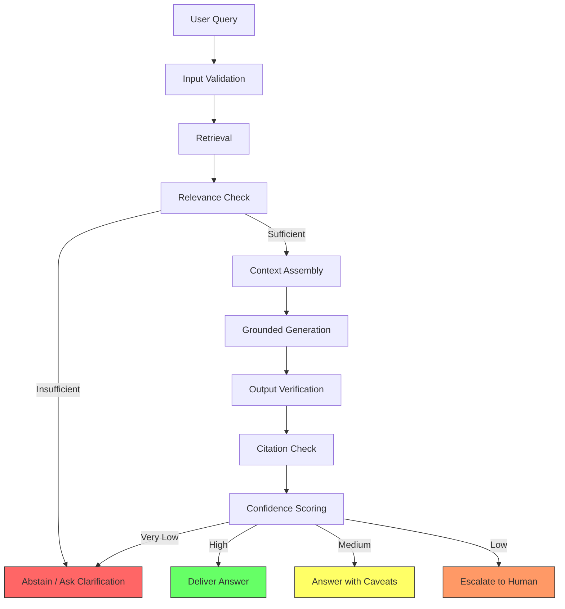
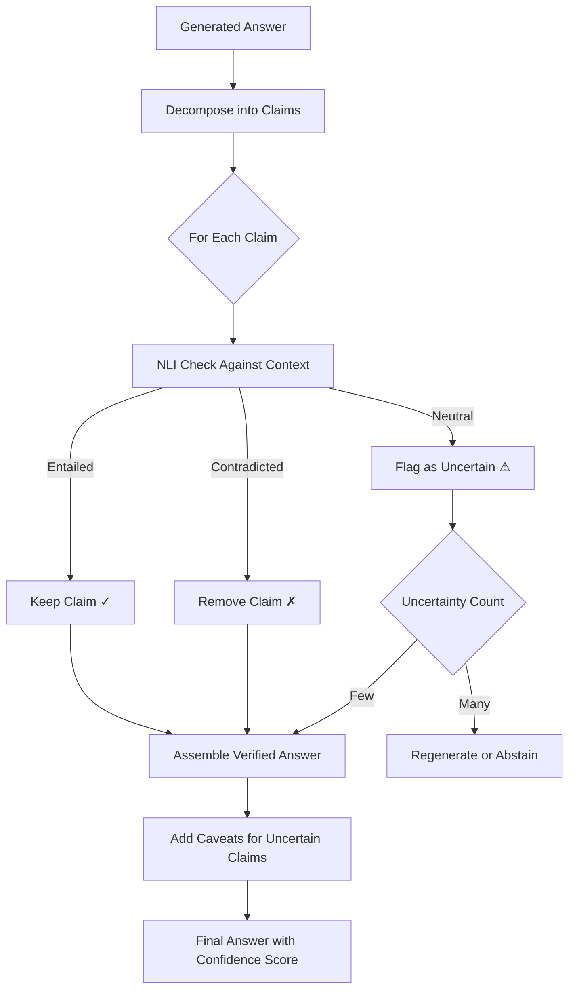

# Hallucination Prevention Architecture

## Why This Matters for an Architect

Hallucination prevention is an **architectural concern**, not a prompt engineering trick. You cannot bolt it on after the fact. Every layer of your RAG system—from ingestion to retrieval to generation to output—must be designed with hallucination prevention as a first-class requirement. A single missed layer creates a gap that will leak fabricated information to users at scale.

The difference between a toy demo and a production AI system is hallucination control. Demos work because they're tested on happy paths. Production systems face adversarial queries, contradicting documents, ambiguous questions, and edge cases that expose every weakness in your pipeline.

An architect must think about hallucination the way a security engineer thinks about vulnerabilities: defense in depth, assume every layer will fail, and design accordingly.

---

## 1. Understanding Hallucination

### The "Confident Liar" Problem

Hallucination is when an LLM generates text that sounds authoritative and fluent but is factually wrong, unsupported, or fabricated. The danger isn't that the model says "I don't know"—it's that it says something **completely false with perfect confidence**.

LLMs have no concept of truth. They predict the most probable next token given the context. If the most probable continuation of "The capital of Germany is" happens to be "Paris" (due to training data patterns), the model will say it without hesitation.

### Why LLMs Hallucinate

1. **Trained on probability, not truth**: The objective function is next-token prediction, not factual accuracy
2. **Compressed knowledge**: Training data is compressed into weights—details get lost or merged
3. **No grounding mechanism**: Unlike humans, LLMs can't "look things up" during generation
4. **Sycophancy bias**: Models are RLHF'd to be helpful, so they'd rather guess than refuse
5. **Distributional shift**: Production queries differ from training distribution

### Hallucination Taxonomy

| Type | Description | Example |
|------|-------------|---------|
| **Intrinsic** | Contradicts the provided context | Context says "revenue was $500M", model says "$5B" |
| **Extrinsic** | Claims not supported by any source | Inventing a feature that doesn't exist |
| **Factual** | Wrong facts from world knowledge | "Paris is the capital of Germany" |
| **Reasoning** | Wrong logical inference | "A>B and B>C, therefore A<C" |
| **Entity** | Wrong entity attribution | "Einstein invented the telephone" |
| **Temporal** | Wrong timeframe | "GPT-4 was released in 2020" |
| **Numerical** | Wrong numbers/quantities | Off by orders of magnitude |

### Why Hallucination is WORSE at Scale

| Scale Factor | Why It Increases Hallucination |
|---|---|
| More documents (millions) | More contradicting information, model must choose between conflicting claims |
| More users | More edge-case queries that fall outside well-covered topics |
| More topics | Model less certain about each individual topic |
| More updates | Temporal conflicts between old and new versions of truth |
| More languages | Translation artifacts introduce errors |

At 1,000 documents, contradictions are rare. At 1,000,000 documents, contradictions are **guaranteed**. Your architecture must handle this.

### Detection and Prevention Matrix

| Hallucination Type | Detection Method | Prevention Method |
|---|---|---|
| Intrinsic | NLI against context | Grounded generation prompts |
| Extrinsic | Source matching (no source found) | "Only use provided context" constraint |
| Factual | Knowledge graph cross-check | Retrieval of authoritative sources |
| Reasoning | Chain-of-thought verification | Step-by-step reasoning with validation |
| Entity | Named entity verification | Entity linking to knowledge base |
| Temporal | Temporal consistency check | Date-aware retrieval and filtering |
| Numerical | Numerical extraction and comparison | Exact quote extraction for numbers |

---

## 2. The Anti-Hallucination Architecture

### Multi-Layer Defense



### Defense in Depth: What Each Layer Catches

| Layer | Catches | Misses |
|---|---|---|
| Input Validation | Nonsensical queries, injection attempts | Valid but unanswerable questions |
| Retrieval Quality | Ensures relevant context is available | Can't guarantee context is sufficient |
| Relevance Check | Filters irrelevant retrieved chunks | May pass partially relevant context |
| Grounded Generation | Prevents extrinsic hallucination | Subtle misinterpretation of context |
| Output Verification | Catches unsupported claims post-hoc | Very subtle paraphrase errors |
| Citation Check | Ensures traceability | Citation may exist but be misapplied |
| Confidence Scoring | Calibrates user-facing risk | Requires proper calibration data |

No single layer catches everything. That's why you need ALL of them.

---

## 3. Prevention Layer 1: Retrieval Quality

### The #1 Cause of Hallucination: BAD RETRIEVAL

If the model doesn't have the right context, it WILL make things up. This is not a model problem—it's a retrieval problem. Fix retrieval first before touching anything else.

### Techniques to Improve Retrieval

#### Hybrid Search (Keyword + Semantic)

```python
def hybrid_search(query, alpha=0.7):
    semantic_results = vector_search(query, top_k=20)
    keyword_results = bm25_search(query, top_k=20)
    
    # Reciprocal rank fusion
    combined = reciprocal_rank_fusion(
        semantic_results, keyword_results, alpha=alpha
    )
    return combined[:10]
```

Semantic search alone misses exact terms (product names, error codes). Keyword search alone misses semantic similarity. Combine both.

#### Multi-Query Retrieval

```python
def multi_query_retrieve(original_query):
    # Generate 3 rephrasings of the question
    variants = llm.generate_query_variants(original_query, n=3)
    
    all_results = []
    for variant in [original_query] + variants:
        results = hybrid_search(variant)
        all_results.extend(results)
    
    # Deduplicate and rank by frequency of appearance
    return deduplicate_and_rank(all_results)
```

A single query formulation may miss relevant documents. Multiple formulations cast a wider net.

#### Reranking

```python
def rerank(query, candidates, top_k=5):
    # Cross-encoder reranking (much more accurate than bi-encoder)
    scores = cross_encoder.predict(
        [(query, doc.text) for doc in candidates]
    )
    ranked = sorted(zip(candidates, scores), key=lambda x: -x[1])
    return ranked[:top_k]
```

#### Minimum Relevance Threshold

```python
RELEVANCE_THRESHOLD = 0.65  # Calibrate this empirically

def filter_by_relevance(results, threshold=RELEVANCE_THRESHOLD):
    filtered = [r for r in results if r.score >= threshold]
    if not filtered:
        return None  # Signal: insufficient context
    return filtered
```

This is critical. If nothing is relevant enough, return NOTHING rather than forcing the model to work with irrelevant context.

#### Source Authority Scoring

```python
SOURCE_AUTHORITY = {
    "official_docs": 1.0,
    "internal_wiki": 0.8,
    "team_notes": 0.6,
    "email_threads": 0.4,
    "slack_messages": 0.3,
}

def authority_weighted_score(result):
    return result.relevance_score * SOURCE_AUTHORITY[result.source_type]
```

### Context Sufficiency Check

Before generating an answer, ask: "Do the retrieved documents actually contain enough information to answer this question?"

```python
def check_context_sufficiency(query, retrieved_docs):
    prompt = f"""Given this question: {query}
    And these documents: {retrieved_docs}
    
    Can the question be fully answered from these documents?
    Respond: SUFFICIENT, PARTIAL, or INSUFFICIENT"""
    
    sufficiency = llm.generate(prompt)
    
    if sufficiency == "INSUFFICIENT":
        return "abstain"
    elif sufficiency == "PARTIAL":
        return "answer_with_caveat"
    else:
        return "answer"
```

### Quantitative Impact

Good retrieval alone reduces hallucination by **40-60%**. It's the highest-leverage intervention.

---

## 4. Prevention Layer 2: Grounded Generation

### The "Only Say What You Can Prove" Principle

Grounded generation means the model ONLY outputs claims that are directly supported by the retrieved context. No world knowledge, no inference beyond what's stated, no gap-filling.

### Techniques

#### Cite-Then-Write

Force the model to identify the source BEFORE making a claim:

```
System: For each statement you make, first identify which source document 
supports it using the format [Source: doc_id]. If you cannot identify a 
source, do not make the statement.

Example:
[Source: policy_v3.pdf, Section 2.1] Employees are entitled to 20 days 
of annual leave. [Source: policy_v3.pdf, Section 2.3] Unused leave can 
be carried over for up to 5 days.
```

#### Attribution Prompting

```
System prompt:
- ONLY state facts that appear in the provided context documents
- If the answer is not in the provided context, say "I don't have enough 
  information to answer this question based on available documents"
- For each claim, include the source reference
- Do NOT use any prior knowledge outside of the provided documents
- If documents contain conflicting information, state BOTH versions with 
  their sources
- For numerical claims, use EXACT numbers from the source (do not round 
  or estimate)
```

#### Constrained Generation (Extractive-then-Abstractive)

```python
def grounded_generate(query, context_docs):
    # Step 1: Extract relevant quotes
    quotes = extract_relevant_quotes(query, context_docs)
    
    # Step 2: Generate answer constrained to quotes
    prompt = f"""Based ONLY on the following extracted quotes, answer the question.
    
    Quotes:
    {format_quotes(quotes)}
    
    Question: {query}
    
    Rules:
    - Only use information from the quotes above
    - Cite which quote supports each statement
    - If quotes don't answer the question, say so"""
    
    return llm.generate(prompt)
```

#### Structured Output with Citations

```python
from pydantic import BaseModel
from typing import List

class Citation(BaseModel):
    document_id: str
    section: str
    quote: str

class Claim(BaseModel):
    statement: str
    citations: List[Citation]
    confidence: float

class GroundedAnswer(BaseModel):
    claims: List[Claim]
    unsupported_aspects: List[str]  # Parts of the question we can't answer
    caveats: List[str]
```

Force structured output so every claim MUST have a citation. If the model can't fill in a citation, it's forced to acknowledge the gap.

#### The "Faithful Summarization" Technique

```python
def faithful_generate_and_verify(query, context):
    # Generate answer
    answer = llm.generate(query, context)
    
    # Decompose into sentences
    sentences = split_into_sentences(answer)
    
    # Verify each sentence against context
    verified_sentences = []
    for sentence in sentences:
        is_supported = nli_check(premise=context, hypothesis=sentence)
        if is_supported:
            verified_sentences.append(sentence)
        else:
            verified_sentences.append(f"[UNVERIFIED] {sentence}")
    
    return " ".join(verified_sentences)
```

### Quantitative Impact

Grounded generation reduces hallucination by an additional **20-30%** on top of good retrieval.

---

## 5. Prevention Layer 3: Output Verification

### Post-Generation Hallucination Detection

Even with perfect prompting, models sometimes hallucinate. You need a verification layer AFTER generation.

#### Claim Decomposition

```python
def decompose_claims(answer):
    prompt = f"""Break this answer into individual factual claims.
    Each claim should be a single, verifiable statement.
    
    Answer: {answer}
    
    Claims (one per line):"""
    
    claims = llm.generate(prompt).split("\n")
    return [c.strip() for c in claims if c.strip()]
```

Example:
- Input: "Einstein developed relativity in 1905 while working at a patent office in Bern."
- Claims: ["Einstein developed relativity", "This was in 1905", "He was working at a patent office", "The patent office was in Bern"]

#### Claim Verification via NLI

```python
from transformers import pipeline

nli_model = pipeline("text-classification", model="cross-encoder/nli-deberta-v3-base")

def verify_claim(claim, context):
    result = nli_model(f"{context} [SEP] {claim}")
    # Returns: entailment, contradiction, or neutral
    
    if result["label"] == "entailment":
        return "supported"
    elif result["label"] == "contradiction":
        return "contradicted"  # DEFINITE hallucination
    else:
        return "unsupported"  # Possible hallucination
```

#### Self-Consistency Check

```python
def self_consistency_check(query, context, n=3):
    answers = []
    for _ in range(n):
        answer = llm.generate(query, context, temperature=0.7)
        answers.append(answer)
    
    # Check agreement between answers
    claims_per_answer = [decompose_claims(a) for a in answers]
    
    # Claims that appear in all answers are likely correct
    # Claims that appear in only one answer are suspicious
    consistent_claims = find_intersection(claims_per_answer)
    inconsistent_claims = find_unique(claims_per_answer)
    
    return consistent_claims, inconsistent_claims
```

### The Verification Pipeline



### Handling Flagged Claims

| Scenario | Action |
|---|---|
| 1-2 unsupported claims out of 10 | Remove them, answer with remaining |
| >50% claims unsupported | Regenerate with stricter grounding |
| Contradicted claims found | Remove and add correction caveat |
| All claims unsupported | Abstain entirely |
| High-stakes domain + any uncertainty | Escalate to human |

### Quantitative Impact

Output verification catches **60-80%** of hallucinations that slip through previous layers.

---

## 6. Prevention Layer 4: Confidence-Driven Behavior

### Composite Confidence Scoring

```python
def compute_confidence(
    retrieval_scores,
    source_count,
    source_agreement,
    self_consistency_score,
    citation_coverage
):
    # Weights (tune empirically)
    w1, w2, w3, w4, w5 = 0.25, 0.15, 0.20, 0.25, 0.15
    
    confidence = (
        w1 * mean(retrieval_scores) +      # How relevant were the sources?
        w2 * min(source_count / 3, 1.0) +   # Multiple sources = more confident
        w3 * source_agreement +              # Do sources agree?
        w4 * self_consistency_score +        # Does model agree with itself?
        w5 * citation_coverage               # % of claims with citations
    )
    
    return round(confidence, 2)
```

### Confidence-Driven Actions

| Confidence Range | Action | User Experience |
|---|---|---|
| 0.9 - 1.0 | Answer confidently | Direct answer with citations |
| 0.7 - 0.9 | Answer with caveats | "Based on available information..." |
| 0.5 - 0.7 | Ask for clarification | "Could you clarify what you mean by...?" |
| 0.3 - 0.5 | Partial answer + flag | "I found partial information but recommend verifying..." |
| 0.0 - 0.3 | Abstain | "I don't have enough information to answer reliably." |

### The Key Insight

**ABSTAINING is better than HALLUCINATING.**

A user who gets "I don't know" will seek another source. A user who gets a confident wrong answer will act on it. The second scenario is far more damaging—especially in legal, medical, or financial contexts.

### Calibration

Your confidence score must actually correlate with accuracy:

```python
def calibration_check(predictions_with_confidence, ground_truth):
    """Verify that confidence bins match actual accuracy."""
    bins = [(0.0, 0.2), (0.2, 0.4), (0.4, 0.6), (0.6, 0.8), (0.8, 1.0)]
    
    for low, high in bins:
        bin_preds = [p for p in predictions_with_confidence 
                     if low <= p.confidence < high]
        actual_accuracy = mean([p.correct for p in bin_preds])
        expected_accuracy = (low + high) / 2
        
        # These should be close
        calibration_error = abs(actual_accuracy - expected_accuracy)
        print(f"Bin [{low}-{high}]: expected {expected_accuracy:.0%}, "
              f"actual {actual_accuracy:.0%}, error {calibration_error:.0%}")
```

If your 0.9 confidence bin only has 60% accuracy, your system is overconfident and needs recalibration.

### Quantitative Impact

Confidence-driven abstention eliminates user exposure to remaining hallucinations, achieving **<1% user-facing hallucination rate**.

---

## 7. Prevention Layer 5: Human-in-the-Loop

### When to Escalate

| Trigger | Reason |
|---|---|
| Confidence below threshold | System isn't sure enough |
| High-stakes domain | Medical, legal, financial—errors have real consequences |
| Conflicting sources detected | Can't auto-resolve the conflict |
| Novel question (no matching context) | Outside system's knowledge |
| User explicitly asks for human | User doesn't trust the AI answer |
| Flagged by output verification | Known potential hallucination |

### Escalation Patterns

#### Pattern 1: Async Review (Pre-Send)

```python
def async_review_pipeline(query, answer, confidence):
    if confidence < 0.7 or is_high_stakes(query):
        # Queue for human review before sending
        review_queue.add(ReviewItem(
            query=query,
            draft_answer=answer,
            confidence=confidence,
            sources=answer.citations,
            priority=compute_priority(confidence, query.domain)
        ))
        return "Your question has been forwarded for expert review. Expected response in 2 hours."
    else:
        return answer
```

#### Pattern 2: Real-Time Escalation

```python
def real_time_escalation(query, answer, confidence):
    if confidence < 0.5:
        transfer_to_human_agent(
            context={"query": query, "draft": answer, "sources": answer.citations}
        )
        return "Let me connect you with a specialist who can help."
    return answer
```

#### Pattern 3: Post-Hoc Audit

```python
def post_hoc_audit(query, answer, confidence):
    # Send answer immediately
    send_to_user(answer)
    
    # Queue for review if borderline
    if confidence < 0.8:
        audit_queue.add(AuditItem(
            query=query, answer=answer, 
            confidence=confidence, timestamp=now()
        ))
    
    # If review finds hallucination, send correction
    # "We've updated our previous response..."
```

### Human Feedback Loop

Corrections from human reviewers should feed back into the system:
1. Add corrected Q&A pairs to evaluation dataset
2. Identify retrieval failures (add missing documents)
3. Tune confidence thresholds based on actual error rates
4. Update prompts to address recurring hallucination patterns

---

## 8. Hallucination at Scale: The Million-Document Problem

### Why Scale Increases Hallucination Risk

| Problem | At 1K Docs | At 1M Docs |
|---|---|---|
| Contradicting information | Rare | Guaranteed |
| Outdated documents | Easy to manage | Hard to track |
| Quality variance | Curated corpus | Mixed quality |
| Information fragmentation | Answer in 1 doc | Answer across 10+ docs |
| Retrieval noise | Low | High (many partial matches) |

### Solutions for Scale

#### Source Authority Ranking

```python
AUTHORITY_TIERS = {
    "tier_1": ["official_documentation", "verified_policies", "legal_contracts"],
    "tier_2": ["internal_wiki", "engineering_docs", "team_runbooks"],
    "tier_3": ["meeting_notes", "email_threads", "slack_exports"],
    "tier_4": ["drafts", "personal_notes", "unverified_content"],
}

def authority_filter(results, min_tier=2):
    """Only include results from tier_1 and tier_2 sources."""
    return [r for r in results if get_tier(r.source) <= min_tier]
```

#### Temporal Filtering

```python
def temporal_filter(results, query_date_context=None):
    # If query is about current state, prefer recent documents
    if is_current_state_query(query):
        # Sort by recency, heavily penalize old docs
        for r in results:
            age_days = (now() - r.document_date).days
            r.score *= max(0.3, 1.0 - (age_days / 365))
    
    return sorted(results, key=lambda r: -r.score)
```

#### Conflict Resolution

```python
def resolve_conflicts(claims_by_source):
    """When sources disagree, don't pick one—present the disagreement."""
    conflicts = find_conflicting_claims(claims_by_source)
    
    if conflicts:
        resolution = "Sources provide different information:\n"
        for conflict in conflicts:
            resolution += f"- {conflict.source_a.name} states: {conflict.claim_a}\n"
            resolution += f"- {conflict.source_b.name} states: {conflict.claim_b}\n"
        resolution += "\nPlease verify which applies to your specific situation."
        return resolution
```

#### Document Quality Scoring at Ingestion

```python
def compute_document_quality(doc):
    scores = {
        "completeness": check_completeness(doc),      # Has intro, body, conclusion?
        "formatting": check_formatting(doc),          # Well-structured?
        "recency": compute_recency_score(doc.date),   # How recent?
        "author_authority": lookup_author_score(doc.author),
        "citation_count": doc.internal_citations,     # Referenced by others?
        "review_status": 1.0 if doc.is_reviewed else 0.5,
    }
    return mean(scores.values())
```

#### Knowledge Graph Validation

```python
def knowledge_graph_check(claim, kg):
    """Cross-check extracted claims against structured knowledge."""
    entities = extract_entities(claim)
    relations = extract_relations(claim)
    
    for entity in entities:
        if not kg.entity_exists(entity):
            return "unverifiable"
    
    for relation in relations:
        kg_result = kg.check_relation(relation)
        if kg_result == "contradicts":
            return "hallucination_detected"
        elif kg_result == "supports":
            return "verified"
    
    return "unverifiable"
```

---

## 9. Measuring Hallucination Rate

### Key Metrics

| Metric | Definition | Measurement Method |
|---|---|---|
| Faithfulness Score | % of claims supported by context | NLI + human sampling |
| Hallucination Rate | % of responses with >=1 unsupported claim | Automated + human audit |
| Claim-Level Precision | % of individual claims that are correct | Claim decomposition + verification |
| Citation Accuracy | % of citations that point to supporting text | Source-claim matching |
| Abstention Rate | % of queries where system refuses to answer | Log analysis |
| False Confidence Rate | % of high-confidence answers that are wrong | Calibration evaluation |

### How to Measure

#### Golden Dataset Evaluation

```python
def evaluate_on_golden_set(system, golden_qa_pairs):
    results = []
    for qa in golden_qa_pairs:
        answer = system.generate(qa.question)
        
        # Check against known-correct answer
        faithfulness = compute_faithfulness(answer, qa.correct_answer, qa.context)
        has_hallucination = detect_hallucination(answer, qa.context)
        
        results.append({
            "faithfulness": faithfulness,
            "hallucinated": has_hallucination,
            "confidence": answer.confidence
        })
    
    return aggregate_metrics(results)
```

#### LLM-as-Judge

```python
def llm_judge_faithfulness(answer, context):
    prompt = f"""You are a fact-checking judge. Given the context and the answer,
    determine if every claim in the answer is supported by the context.
    
    Context: {context}
    Answer: {answer}
    
    For each sentence in the answer, classify as:
    - SUPPORTED: directly supported by context
    - UNSUPPORTED: not mentioned in context
    - CONTRADICTED: contradicts the context
    
    Then give an overall faithfulness score from 0 to 1."""
    
    return judge_llm.generate(prompt)
```

#### Human Sampling

Sample 5% of production responses for human review. Stratify by confidence (review more low-confidence answers).

### Benchmarks: What's Achievable

| Mitigation Level | Hallucination Rate | Notes |
|---|---|---|
| No mitigation (raw LLM) | 20-40% | Depends on query difficulty |
| Good retrieval only | 10-20% | Biggest single improvement |
| + Grounded generation | 5-10% | Prompting and constraints |
| + Output verification | 2-5% | Post-hoc checking |
| + Confidence-driven abstention | <1% user-facing | System refuses uncertain answers |

### Production Monitoring

```python
# Dashboard metrics to track daily
hallucination_dashboard = {
    "daily_hallucination_rate": track_daily(detect_hallucinations),
    "confidence_distribution": histogram(answer_confidences),
    "abstention_rate": count(abstentions) / count(total_queries),
    "escalation_rate": count(escalations) / count(total_queries),
    "citation_coverage": mean(citation_coverage_per_answer),
    "user_feedback_negative": count(thumbs_down) / count(total_queries),
}

# Alerts
alert_if(hallucination_rate > 0.05, severity="high")
alert_if(abstention_rate > 0.30, severity="medium")  # System might be too conservative
alert_if(confidence_calibration_error > 0.15, severity="high")
```

---

## 10. The Complete Anti-Hallucination Checklist

| # | Check | How to Verify | Acceptable Threshold |
|---|---|---|---|
| 1 | Hybrid search implemented | Test with exact-match queries | Keyword+semantic both contributing |
| 2 | Minimum relevance threshold set | Measure retrieval precision | >0.65 cosine similarity |
| 3 | Context sufficiency check active | Test with unanswerable queries | System abstains on 90%+ |
| 4 | Source authority scoring | Check source weighting in results | Official docs ranked higher |
| 5 | Grounded generation prompt | Review system prompt | Explicit "only use context" instruction |
| 6 | Citation requirement in output | Sample outputs for citations | >95% claims have citations |
| 7 | Output verification pipeline | Run on test set | Catches >70% of planted hallucinations |
| 8 | Claim decomposition working | Test with complex answers | Correctly splits into atomic claims |
| 9 | NLI verification active | Test with known contradictions | Detects >80% of contradictions |
| 10 | Confidence scoring calibrated | Plot calibration curve | Calibration error <0.1 |
| 11 | Abstention threshold set | Test with out-of-scope queries | System refuses when appropriate |
| 12 | Conflict detection for contradicting sources | Test with conflicting docs | Reports conflicts, doesn't pick sides |
| 13 | Temporal filtering active | Test with outdated docs present | Prefers recent over stale |
| 14 | Human escalation path configured | Test escalation trigger | Escalation reaches human within SLA |
| 15 | Golden evaluation dataset exists | Review dataset coverage | >200 Q&A pairs, covers edge cases |
| 16 | Hallucination monitoring in production | Check dashboard | Real-time metrics visible |
| 17 | Alert thresholds configured | Trigger test alert | Alerts fire within 5 minutes |
| 18 | User feedback mechanism active | Test thumbs down flow | Feedback reaches review queue |
| 19 | Regular human audit scheduled | Check audit calendar | Weekly 5% sample review |
| 20 | Confidence threshold tuned on real data | Review tuning history | Updated within last 30 days |

---

## 11. Real-World Examples

### Example 1: Legal AI (Zero Tolerance)

**Domain**: Contract review and legal research for law firm.

**Hallucination target**: <0.1% (one error per thousand responses)

**Architecture choices**:
- Retrieval: BM25 + dense retrieval + reranking, minimum threshold 0.8
- Generation: Extractive only—direct quotes from contracts, no paraphrasing
- Verification: Every claim checked via NLI, self-consistency (5 generations)
- Confidence: Threshold at 0.9. Below that, async review by attorney
- Escalation: ALL answers reviewed by paralegal before delivery to client
- Output format: Always includes exact quote + page/paragraph reference

**Key design decision**: Never paraphrase legal text. Extract exact clauses. This eliminates most hallucination by construction.

### Example 2: Customer Support (Moderate Tolerance)

**Domain**: SaaS product help desk with 50K knowledge base articles.

**Hallucination target**: <2% (acceptable for non-critical product questions)

**Architecture choices**:
- Retrieval: Hybrid search + multi-query, threshold 0.6
- Generation: Grounded generation with citations, structured output
- Verification: NLI check on final answer, but no self-consistency (latency budget)
- Confidence: Answer directly above 0.7, add caveat 0.5-0.7, escalate below 0.5
- Escalation: Transfer to human agent for low-confidence or complex billing queries
- Output format: Conversational with inline links to help articles

**Key design decision**: Accept slightly higher hallucination rate in exchange for speed. Compensate with easy escalation and "was this helpful?" feedback.

### Example 3: Internal Knowledge Base (Lower Stakes)

**Domain**: Engineering team wiki with 200K documents.

**Hallucination target**: <5% (internal users can verify and correct)

**Architecture choices**:
- Retrieval: Semantic search + temporal filtering (prefer recent docs)
- Generation: Standard grounded generation, citations optional
- Verification: Self-consistency (2 generations), no NLI pipeline
- Confidence: Answer with caveat below 0.6, never fully abstain (show best guess)
- Escalation: None automated—users flag incorrect answers
- Output format: Answer + "Sources" section with links

**Key design decision**: Optimize for coverage and speed over precision. Users are technical and can verify. Include a prominent "flag as incorrect" button that feeds into improvement pipeline.

---

## Summary: The Hallucination Prevention Stack

```
┌─────────────────────────────────────────────────┐
│            USER-FACING LAYER                     │
│  Confidence-driven presentation + abstention     │
├─────────────────────────────────────────────────┤
│            VERIFICATION LAYER                    │
│  Claim decomposition → NLI → Self-consistency    │
├─────────────────────────────────────────────────┤
│            GENERATION LAYER                      │
│  Grounded generation + citation requirement      │
├─────────────────────────────────────────────────┤
│            RETRIEVAL LAYER                       │
│  Hybrid search + reranking + sufficiency check   │
├─────────────────────────────────────────────────┤
│            DATA LAYER                            │
│  Authority scoring + dedup + quality filtering   │
└─────────────────────────────────────────────────┘
```

Each layer reduces hallucination independently. Together, they compound:
- 40-60% reduction from retrieval
- 20-30% reduction from grounded generation
- 60-80% of remaining caught by verification
- Confidence-driven abstention handles the rest

Result: from 20-40% baseline hallucination to <1% user-facing hallucination.

The architecture is the defense. Not the prompt. Not the model. The **system**.
