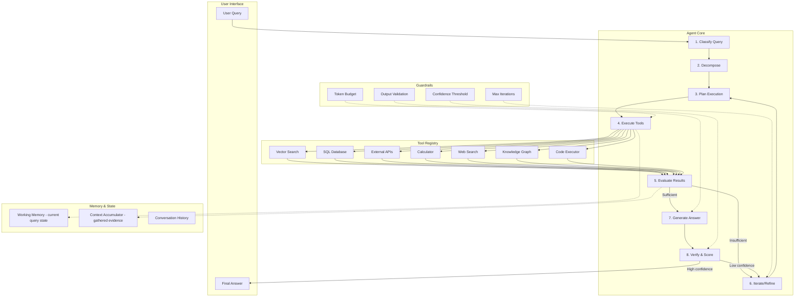
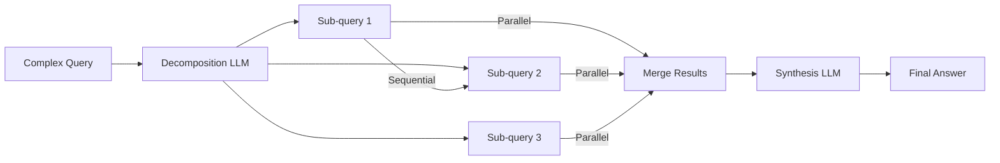
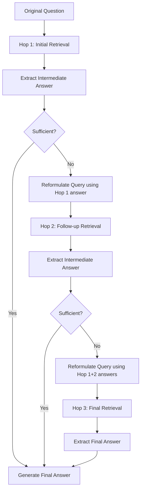
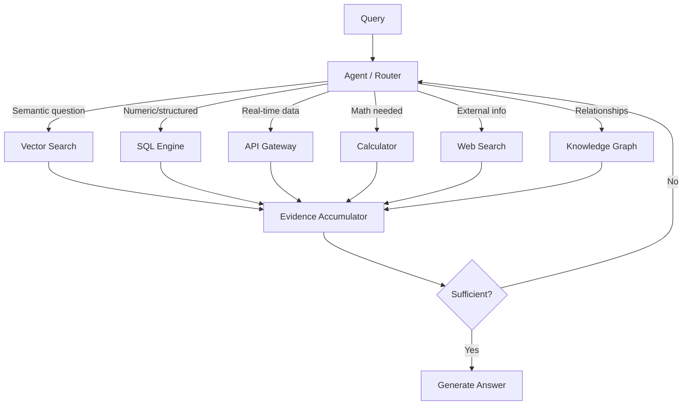
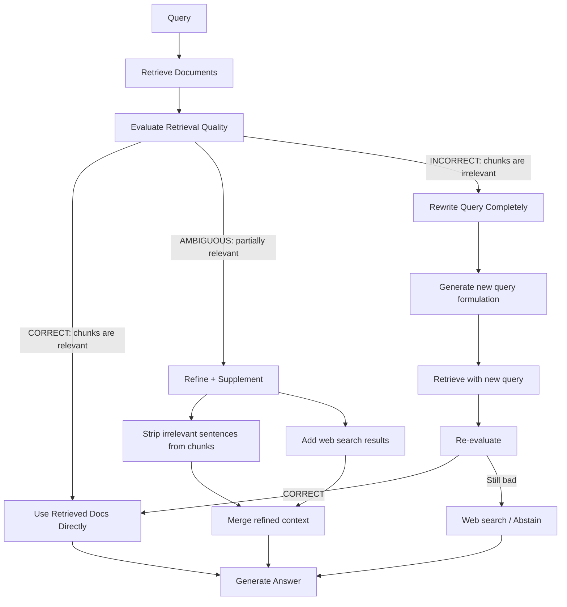
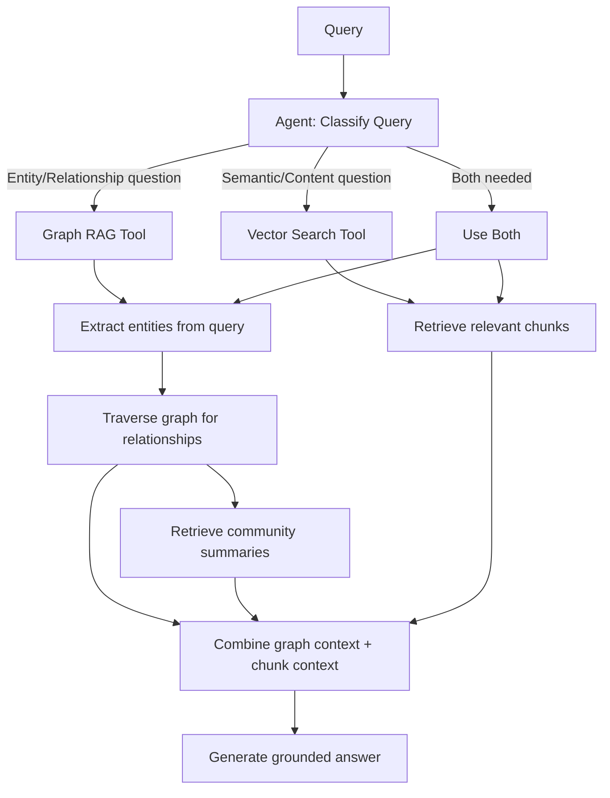

# Agentic RAG: The Definitive Deep-Dive

## 1. What is Agentic RAG

### The Core Difference

**Standard RAG** is a fixed pipeline: query → retrieve → generate. No decisions. No iteration. No judgment about whether the retrieved context is good enough. It's a conveyor belt — whatever comes out of retrieval goes into the LLM, and whatever the LLM says is the final answer.

**Agentic RAG** is an *agent* that decides HOW to answer. It chooses which tools to use, how many searches to perform, whether retrieved context is sufficient, and when to stop. It can plan, decompose, iterate, verify, and even refuse to answer when evidence is insufficient.

### The Researcher Analogy

Think of it this way:

- **Standard RAG** = a student who does ONE Google search, takes the first page of results, and writes an answer immediately. No verification, no additional sources, no judgment about quality.
- **Agentic RAG** = a professional researcher who reads the question, plans an approach, searches multiple databases, evaluates what they find, searches again if needed, cross-references sources, computes derived answers, and produces a thoroughly-researched report with citations.

The researcher *thinks* about how to answer. The student just *does* the pipeline.

### Key Difference Table

| Dimension | Standard RAG | Agentic RAG |
|-----------|-------------|-------------|
| **Retrieval** | Single retrieval pass | Multiple adaptive retrievals |
| **Decision-making** | None — fixed pipeline | Agent decides tools, queries, iterations |
| **Query handling** | Takes query as-is | Decomposes, reformulates, plans |
| **Tool usage** | Vector search only | Multiple tools (SQL, API, graph, search) |
| **Self-evaluation** | None | Checks evidence sufficiency at each step |
| **Iteration** | Never re-retrieves | Re-retrieves if context is insufficient |
| **Error recovery** | No recovery — wrong context = wrong answer | Detects failures, tries alternative approaches |
| **Computation** | None — generation only | Can calculate, aggregate, compare |
| **Multi-hop** | Cannot chain reasoning across documents | Chains retrievals to follow reasoning paths |
| **Confidence** | Always answers (even when shouldn't) | Can abstain or express uncertainty |

### When You Need Agentic RAG

You should move beyond standard RAG when your questions involve:

1. **Complex multi-part questions**: "Compare our Q1 and Q3 revenue, explain the growth drivers, and forecast Q4"
2. **Multiple source types**: Answer needs data from documents AND databases AND APIs
3. **Computation + retrieval**: "What's the average deal size for enterprise customers last quarter?" (needs retrieval + math)
4. **Insufficient first retrieval**: Questions where the first set of chunks may not contain the answer
5. **High-stakes answers requiring verification**: Compliance, legal, medical — you can't afford hallucination

If your use case is simple fact lookup from a single document corpus, standard RAG is fine. Don't over-engineer.

---

## 2. The Full Agentic RAG Architecture

### Architecture Diagram



### The 8-Step Agentic Loop

#### Step 1: Classify

The agent first determines what TYPE of question it's dealing with:

- **Simple lookup**: "What is our refund policy?" → single retrieval likely sufficient
- **Multi-hop**: "Who manages the team that built the payment system?" → needs chained retrievals
- **Computation**: "What's the YoY growth rate?" → needs retrieval + calculation
- **Comparison**: "How does Plan A differ from Plan B?" → needs parallel retrieval + synthesis
- **Aggregation**: "Summarize all customer complaints about shipping" → needs broad retrieval

Classification determines the complexity budget and tool selection strategy.

```
Classification Prompt:
"Given this question, classify it as one of: SIMPLE_LOOKUP, MULTI_HOP, 
COMPUTATION, COMPARISON, AGGREGATION, CREATIVE. 
Explain your reasoning in one sentence."
```

#### Step 2: Decompose

Complex queries are broken into sub-queries that can be independently answered:

**Example**: "What was the revenue growth rate between Q1 and Q3, and which product contributed most?"

Decomposition:
- Sub-query 1: "What was total revenue in Q1 2024?"
- Sub-query 2: "What was total revenue in Q3 2024?"
- Sub-query 3: "Which product had the highest revenue in Q3 2024?"
- Computation: Calculate (Q3 - Q1) / Q1 * 100
- Synthesis: Combine all findings into a coherent answer

#### Step 3: Plan

The agent creates an execution plan — which tools to use for each sub-query, in what order, and with what dependencies:

```
Plan:
1. Sub-query 1 → SQL tool (structured revenue data) [PARALLEL with 2, 3]
2. Sub-query 2 → SQL tool [PARALLEL with 1, 3]
3. Sub-query 3 → SQL tool [PARALLEL with 1, 2]
4. Computation → Calculator tool [DEPENDS ON 1, 2]
5. Synthesis → LLM generation [DEPENDS ON 1, 2, 3, 4]
```

#### Step 4: Execute

Call the selected tools with appropriate parameters. Handle errors gracefully — if SQL fails, try vector search as fallback.

#### Step 5: Evaluate

Critical step. The agent asks: "Do I have enough to answer the original question?"

Evaluation checks:
- Did each sub-query return results?
- Are results relevant (not off-topic chunks)?
- Do I have ALL parts needed for the full answer?
- Are there contradictions between sources?

#### Step 6: Iterate

If evaluation says "insufficient", the agent doesn't give up. It:
- Reformulates the query (different keywords, broader scope)
- Tries a different tool (vector search instead of SQL)
- Searches a different source (web search if internal docs fail)
- Asks a clarifying sub-question to fill the gap

Maximum iterations: typically 3-5 (with diminishing returns detection).

#### Step 7: Generate

With sufficient evidence accumulated, the agent generates a grounded answer. Key requirements:
- Every claim must be traceable to retrieved evidence
- Computations must show their work
- Gaps must be explicitly acknowledged
- Sources must be cited

#### Step 8: Verify

Final quality check before returning the answer:
- Does the answer actually address the original question?
- Is every claim supported by the evidence?
- Confidence score: high (>0.8), medium (0.5-0.8), low (<0.5)
- If low confidence: iterate or abstain

---

## 3. Query Decomposition Strategies

### Why Decompose

Most real-world questions are actually multiple questions bundled together. The LLM that generates sub-queries doesn't need to know the answers — it just needs to identify what information is needed.

**Example**: "What is the revenue growth rate between Q1 and Q3?"

This seems like one question but actually requires:
1. Find Q1 revenue (retrieval)
2. Find Q3 revenue (retrieval)
3. Calculate (Q3 - Q1) / Q1 * 100 (computation)

No single retrieval can answer this. You need a plan.

### Decomposition Patterns

#### Sequential Decomposition
Each sub-query depends on the answer to the previous one.

```
Question: "What's the stock price of the company that acquired Figma?"
Sub-query 1: "Which company acquired Figma?" → Adobe
Sub-query 2: "What is Adobe's current stock price?" → $524
```

You CANNOT execute sub-query 2 until sub-query 1 completes.

#### Parallel Decomposition
Sub-queries are independent and can execute simultaneously.

```
Question: "Compare the leave policies of the US and UK offices"
Sub-query 1: "What is the US office leave policy?" [PARALLEL]
Sub-query 2: "What is the UK office leave policy?" [PARALLEL]
Synthesis: Compare the two results
```

#### Conditional Decomposition
The next step depends on the RESULT of the previous step.

```
Question: "Is our system currently experiencing issues? If so, what's the impact?"
Sub-query 1: "What is the current system status?" → Check API
IF status == degraded:
    Sub-query 2a: "What services are affected?"
    Sub-query 2b: "How many users are impacted?"
ELSE:
    Return: "All systems operational"
```

#### Recursive Decomposition
The problem breaks into smaller instances of the same problem type.

```
Question: "Summarize all changes in the last 5 release notes"
→ Summarize release note 1
→ Summarize release note 2
→ ... (same pattern for each)
→ Synthesize all summaries
```

### Decomposition Flow



### Implementation: Decomposition Prompt

```
System: You are a query decomposition expert. Given a complex question,
break it into the minimum number of simple, answerable sub-queries.

Rules:
1. Each sub-query should be answerable by a single retrieval or tool call
2. Mark dependencies: which sub-queries depend on others
3. Mark parallelism: which can run simultaneously
4. Include any computation steps needed
5. Keep sub-queries atomic — one fact per query

Input: "{user_question}"

Output format:
- Sub-queries: [{id, query, tool_hint, depends_on}]
- Computation steps: [{operation, inputs}]
- Synthesis instruction: how to combine results
```

---

## 4. Multi-Hop Retrieval

### What is Multi-Hop

Multi-hop retrieval is needed when the answer isn't in any single document but requires chaining information across multiple documents. Each "hop" uses the answer from the previous retrieval as input to the next retrieval.

### Detailed Example

**Question**: "Who manages the team that built the payment system?"

**Hop 1**: Search for "who built the payment system"
- Retrieved: "The payment system was developed by the Platform Engineering team during Q2 2023"
- Extracted answer: "Platform Engineering team"

**Hop 2**: Search for "who manages the Platform Engineering team"
- Retrieved: "Sarah Chen leads the Platform Engineering team, reporting to VP of Engineering"
- Extracted answer: "Sarah Chen"

**Final answer**: "Sarah Chen manages the Platform Engineering team, which built the payment system."

Neither document alone answers the question. You need BOTH, in sequence.

### Implementation Patterns

#### Chain-of-Retrieval
The simplest pattern: use the extracted answer from hop N as the query for hop N+1.

```python
def multi_hop_retrieve(question, max_hops=4):
    current_query = question
    evidence_chain = []
    
    for hop in range(max_hops):
        # Retrieve with current query
        chunks = vector_search(current_query)
        evidence_chain.append(chunks)
        
        # Extract intermediate answer
        intermediate = llm_extract(
            f"Given this context, what's the intermediate answer to: {question}",
            chunks
        )
        
        # Check if we have the final answer
        if llm_judge(question, evidence_chain) == "SUFFICIENT":
            break
        
        # Formulate next hop query
        current_query = llm_formulate_next_query(
            original_question=question,
            intermediate_answer=intermediate,
            evidence_so_far=evidence_chain
        )
    
    return generate_final_answer(question, evidence_chain)
```

#### Graph Traversal
When entities and relationships are stored in a knowledge graph:

```
Hop 1: MATCH (system {name: "payment system"})-[:BUILT_BY]->(team) RETURN team
Hop 2: MATCH (team {name: "Platform Engineering"})-[:MANAGED_BY]->(person) RETURN person
```

#### Iterative Refinement
Each hop narrows the search space rather than following a chain:

```
Hop 1: Broad search → identifies relevant document set
Hop 2: Focused search within that set → finds specific section
Hop 3: Precision extraction → pulls exact answer
```

### Multi-Hop Flow



### Maximum Hop Depth

- **1 hop**: Simple factual questions (90% of queries in most systems)
- **2 hops**: Entity relationship questions ("who manages X's team")
- **3 hops**: Complex chains ("what's the budget of the department that owns the team that built X")
- **4+ hops**: Extremely rare. Beyond 4 hops, consider using a knowledge graph instead — chain-of-retrieval becomes too error-prone.

### Failure Modes in Multi-Hop

The fundamental risk: **error cascading**. If Hop 1 extracts the wrong intermediate answer, every subsequent hop is working with wrong information.

Mitigations:
- Retrieve top-k (not top-1) at each hop — keep multiple hypotheses alive
- Cross-validate: after final answer, verify the chain makes sense
- Confidence thresholds: if intermediate extraction confidence is low, try alternative query

---

## 5. Tool-Augmented Retrieval (Multi-Tool Agent)

### The Key Insight

Not every question is answered by vector search. Consider:

- "What was our revenue last quarter?" → **SQL database** (exact numbers)
- "Is the payment API currently down?" → **API health check** (real-time status)
- "What's 15% of $2.3M?" → **Calculator** (computation)
- "What does our refund policy say?" → **Vector search** (document retrieval)
- "What are the latest trends in AI?" → **Web search** (external knowledge)
- "How is Team A connected to Project X?" → **Knowledge graph** (relationships)

An agentic RAG system has a TOOLKIT, and the agent selects the right tool for each sub-task.

### Tool Registry

| Tool | Best For | Input | Output |
|------|----------|-------|--------|
| Vector Search | Semantic questions about documents | Natural language query | Ranked chunks with scores |
| SQL Query | Exact numbers, aggregations, filters | Structured query | Tabular data |
| API Call | Real-time data, system status | Endpoint + params | JSON response |
| Calculator | Arithmetic, percentages, comparisons | Expression | Numeric result |
| Web Search | External/current information | Search query | Web snippets |
| Knowledge Graph | Entity relationships, connections | Graph query | Entities + relationships |
| Code Executor | Complex logic, data transformation | Python code | Execution result |

### Tool Selection Strategies

#### Rule-Based Routing
Fast but rigid:

```python
def route_query(query, classification):
    if classification == "NUMERIC_LOOKUP":
        return ["sql"]
    elif classification == "POLICY_QUESTION":
        return ["vector_search"]
    elif classification == "REAL_TIME_STATUS":
        return ["api"]
    elif classification == "COMPUTATION":
        return ["vector_search", "calculator"]  # retrieve then compute
    else:
        return ["vector_search"]  # default fallback
```

#### LLM-Based Selection
Flexible but slower:

```
System: You have these tools available:
1. vector_search(query) - searches internal documents semantically
2. sql_query(query) - queries the business database for exact numbers
3. api_call(endpoint, params) - calls external APIs for real-time data
4. calculator(expression) - computes mathematical expressions
5. web_search(query) - searches the internet

Given the user's question, which tool(s) should be used and in what order?
Question: "{question}"
```

#### Hybrid (Recommended)
Rules handle obvious cases (fast path), LLM handles ambiguous cases:

```python
def select_tools(query, classification):
    # Fast path: clear-cut cases
    if has_sql_keywords(query) and classification == "NUMERIC":
        return ["sql"]
    if is_status_query(query):
        return ["api"]
    
    # Slow path: let LLM decide
    return llm_tool_selection(query, available_tools)
```

### Tool Chaining Example

**Question**: "What was our top product's revenue last quarter?"

```
Step 1: Agent recognizes this needs TWO tools
Step 2: Vector search → "Our top product by units sold is Widget Pro"
Step 3: SQL query → SELECT SUM(revenue) FROM sales 
                     WHERE product='Widget Pro' AND quarter='Q3-2024'
         Result: $2,300,000
Step 4: Combine → "Widget Pro, our top product, generated $2.3M in Q3 2024"
```

### Tool Routing Architecture



---

## 6. Evidence Sufficiency and Confidence

### The Critical Question

The #1 difference between standard RAG and agentic RAG: the agent EVALUATES whether it has enough evidence before generating an answer. Standard RAG always generates, regardless of retrieval quality.

### Sufficiency Signals

| Signal | Weak Evidence | Strong Evidence |
|--------|--------------|-----------------|
| Supporting chunks | 1 chunk, borderline relevant | 3+ chunks, highly relevant |
| Relevance scores | Highest score < 0.7 | Multiple scores > 0.85 |
| Coverage | Addresses part of the question | Addresses ALL parts |
| Source diversity | Single source | Multiple independent sources agree |
| Recency | Sources are 3+ years old for time-sensitive query | Sources are current |
| Consistency | Sources contradict each other | Sources corroborate |

### Sufficiency Check Implementation

```python
def check_sufficiency(question, sub_queries, evidence):
    """Returns: SUFFICIENT, PARTIAL, or INSUFFICIENT"""
    
    # Rule-based checks
    if len(evidence.chunks) == 0:
        return "INSUFFICIENT"
    if max(evidence.relevance_scores) < 0.6:
        return "INSUFFICIENT"
    
    # Coverage check: do we have evidence for each sub-query?
    covered = sum(1 for sq in sub_queries if has_evidence(sq, evidence))
    coverage_ratio = covered / len(sub_queries)
    
    if coverage_ratio < 0.5:
        return "INSUFFICIENT"
    if coverage_ratio < 1.0:
        return "PARTIAL"
    
    # LLM verification for borderline cases
    llm_judgment = llm_judge(
        f"Given this evidence, can you fully and accurately answer: {question}?"
        f"\nEvidence: {evidence.text}"
        f"\nRate: SUFFICIENT / PARTIAL / INSUFFICIENT"
    )
    
    return llm_judgment
```

### What To Do When Evidence Is Insufficient

| Strategy | When to Use | Example |
|----------|-------------|---------|
| Refine query | Relevant chunks exist but don't quite answer | Change "revenue" to "total sales figures" |
| Broaden search | No relevant chunks found | Remove filters, try different index |
| Different tool | Vector search returned nothing useful | Try SQL, try web search |
| Partial answer | Have evidence for part of the question | "I found X but couldn't determine Y" |
| Abstain | No relevant evidence after multiple attempts | "I cannot find sufficient information to answer this" |
| Escalate | High-stakes question with uncertain answer | Route to human expert |

### Confidence Scoring

```python
def compute_confidence(question, evidence, answer):
    """Returns confidence score 0.0 to 1.0"""
    
    factors = {
        "relevance": mean(evidence.relevance_scores),        # 0-1
        "coverage": evidence.coverage_ratio,                  # 0-1
        "consistency": 1.0 - evidence.contradiction_score,    # 0-1
        "source_count": min(len(evidence.sources) / 3, 1.0), # 0-1
        "grounding": llm_grounding_check(answer, evidence),  # 0-1
    }
    
    # Weighted average
    weights = [0.25, 0.25, 0.2, 0.15, 0.15]
    confidence = sum(w * v for w, v in zip(weights, factors.values()))
    
    return confidence
```

---

## 7. Corrective RAG (CRAG) Integration

### What is CRAG

Corrective RAG (CRAG) adds a **self-correction loop** to retrieval. Instead of blindly using whatever chunks are retrieved, CRAG evaluates the quality of retrieval and takes corrective action when retrieval is poor.

### CRAG Decision Flow



### How CRAG Fits Into Agentic RAG

CRAG is the **evaluation + correction sub-loop** within the larger agentic framework. Specifically, it handles Steps 5 and 6 (Evaluate and Iterate) of the agentic loop.

The agent orchestrates the high-level plan (decompose, tool selection). CRAG handles the low-level quality control on each individual retrieval operation.

### Implementing the Quality Evaluator

```python
def evaluate_retrieval(query, chunks):
    """Classify retrieval quality as CORRECT, AMBIGUOUS, or INCORRECT"""
    
    prompt = f"""
    Query: {query}
    Retrieved chunks:
    {format_chunks(chunks)}
    
    Evaluate: Do these chunks contain information that directly answers the query?
    - CORRECT: At least one chunk directly addresses the query
    - AMBIGUOUS: Chunks are related but don't directly answer
    - INCORRECT: Chunks are irrelevant to the query
    
    Classification:
    """
    
    return llm_classify(prompt)
```

### Knowledge Refinement

When retrieval is AMBIGUOUS, don't throw away the chunks — refine them:

1. For each chunk, identify which sentences are relevant to the query
2. Strip irrelevant sentences (reduce noise)
3. Supplement with web search results for the gaps
4. Merge refined internal context with external context

This gives you the best of both: internal knowledge (authoritative) + external knowledge (comprehensive).

---

## 8. Graph RAG Integration

### When Vector Search Isn't Enough

Vector search excels at finding semantically similar text. But it fails at:
- **Relationship questions**: "How is project A connected to team B?"
- **Multi-entity queries**: "What are all the dependencies of service X?"
- **Hierarchical questions**: "Who reports to the VP of Engineering?"
- **Path questions**: "How does data flow from ingestion to the dashboard?"

These questions need STRUCTURE, not just similarity.

### How Graph RAG Fits Into Agentic RAG



### Entity-Aware Retrieval

1. **Extract entities** from the query: "Who manages the Platform team?" → entities: [Platform team]
2. **Find entity in graph**: Look up "Platform team" node
3. **Traverse neighbors**: Follow "MANAGED_BY" edge → "Sarah Chen"
4. **Retrieve supporting text**: Vector search for chunks mentioning Sarah Chen + Platform team
5. **Generate**: Combine graph facts + text evidence into answer

### Community Summaries

Graph RAG pre-computes summaries of entity clusters (communities). When a question is broad ("Tell me about the engineering organization"), instead of retrieving hundreds of graph edges, you retrieve the pre-computed summary of the engineering community.

### When to Route to Graph RAG

Route to knowledge graph when the query contains:
- Relationship keywords: "connected to", "depends on", "reports to", "related to"
- Graph traversal intent: "all teams that...", "everything that uses..."
- Entity comparison: "difference between X and Y" (where X, Y are known entities)
- Hierarchical queries: "under", "above", "within", organizational questions

---

## 9. Failure Modes and Safeguards

### Guardrails Table

| Failure Mode | Detection | Prevention | Recovery |
|---|---|---|---|
| **Infinite loops** | Iteration counter > max | Set max_iterations=5 | Return best answer so far with caveat |
| **Cost explosion** | Token counter exceeds budget | Token budget per query (e.g., 50K) | Terminate and return partial answer |
| **Tool misuse** | Tool returns error / unexpected format | Parameter validation before call | Try alternative tool or parameters |
| **Cascading errors** | Confidence drops across hops | Confidence check at each hop | Cross-validate with independent retrieval |
| **Over-confidence** | No citations for claims | Mandatory citation requirement | Force re-evaluation with stricter criteria |
| **Decomposition errors** | Sub-queries don't cover original question | Validate decomposition covers full query | Fall back to direct retrieval without decomposition |
| **Hallucination in planning** | Agent plans to use non-existent tool | Validate plan against tool registry | Restrict to registered tools only |
| **Stale data** | Source timestamp > threshold | Check recency metadata | Flag as potentially outdated |

### Detailed Safeguards

#### Infinite Loop Prevention

```python
class AgentLoop:
    def __init__(self, max_iterations=5, diminishing_returns_threshold=0.1):
        self.max_iterations = max_iterations
        self.dr_threshold = diminishing_returns_threshold
    
    def run(self, query):
        evidence_quality = 0
        for i in range(self.max_iterations):
            new_evidence = self.retrieve_and_evaluate(query)
            new_quality = self.score_evidence(new_evidence)
            
            # Diminishing returns: new iteration didn't help much
            if new_quality - evidence_quality < self.dr_threshold:
                break
            
            evidence_quality = new_quality
            
            if evidence_quality > self.sufficiency_threshold:
                break
        
        return self.generate(query, self.accumulated_evidence)
```

#### Cost Control

```python
class TokenBudget:
    def __init__(self, max_tokens=50000):
        self.max_tokens = max_tokens
        self.used = 0
    
    def can_proceed(self, estimated_cost):
        return self.used + estimated_cost < self.max_tokens
    
    def record(self, actual_cost):
        self.used += actual_cost
        if self.used > self.max_tokens * 0.9:
            raise BudgetWarning("90% of token budget consumed")
```

#### Cascading Error Detection

```python
def multi_hop_with_validation(question, max_hops=4):
    chain = []
    for hop in range(max_hops):
        result = retrieve_and_extract(current_query)
        confidence = score_confidence(result)
        
        if confidence < 0.6:
            # Low confidence intermediate — try alternative approach
            alt_result = retrieve_alternative(current_query)
            if score_confidence(alt_result) > confidence:
                result = alt_result
            else:
                # Both low confidence — stop and report uncertainty
                return partial_answer(chain, uncertainty_note=True)
        
        chain.append(result)
```

---

## 10. Evaluation Metrics for Agentic RAG

### Standard RAG Metrics (Still Apply)

- **Faithfulness**: Is the answer grounded in retrieved evidence? (no hallucination)
- **Answer relevance**: Does the answer actually address the question?
- **Context relevance**: Are retrieved chunks relevant to the question?
- **Context recall**: Did retrieval find ALL relevant information?

### Additional Agentic Metrics

| Metric | What It Measures | How to Compute |
|--------|-----------------|----------------|
| Tool selection accuracy | Did the agent choose the optimal tool? | Compare to golden tool selections |
| Decomposition quality | Are sub-queries correct and complete? | Human eval: do sub-queries cover the full question? |
| Iteration efficiency | How many attempts to reach sufficiency? | Count iterations / was the final iteration necessary? |
| Abstention accuracy | Correctly refuses when it should | Precision/recall on unanswerable questions |
| Cost per query | Total tokens consumed | Sum all LLM calls for one query |
| Latency | End-to-end time | Wall clock time including all tool calls |
| Multi-hop accuracy | Correct at each intermediate step | Evaluate each hop independently |
| Plan quality | Was execution plan optimal? | Compare to expert-generated plan |

### Agent Scorecard Template

```
┌─────────────────────────────────────────────────────┐
│ AGENTIC RAG EVALUATION SCORECARD                    │
├─────────────────────┬───────┬───────────────────────┤
│ Dimension           │ Score │ Notes                 │
├─────────────────────┼───────┼───────────────────────┤
│ Answer Accuracy     │  /10  │ Correct final answer? │
│ Faithfulness        │  /10  │ Grounded in evidence? │
│ Tool Selection      │  /10  │ Right tools chosen?   │
│ Decomposition       │  /10  │ Sub-queries correct?  │
│ Efficiency          │  /10  │ Min iterations used?  │
│ Confidence Calibr.  │  /10  │ Confidence matches?   │
│ Abstention          │  /10  │ Refuses when needed?  │
│ Cost Efficiency     │  /10  │ Within token budget?  │
├─────────────────────┼───────┼───────────────────────┤
│ TOTAL               │  /80  │                       │
└─────────────────────┴───────┴───────────────────────┘
```

### Golden Trajectory Testing

For critical queries, define the IDEAL agent path:
1. Expected classification
2. Expected decomposition
3. Expected tool selections
4. Expected number of iterations
5. Expected final answer

Then compare the agent's actual trajectory to the golden path. Score how much they align. This catches regressions in agent behavior even when the final answer is correct (right answer, wrong process = fragile).

---

## 11. Enterprise Agentic RAG Patterns

### Pattern 1: Policy/HR Agent

**Use case**: Employees asking about company policies, benefits, procedures.

**Architecture**:
- Tools: Vector search (policy docs), SQL (employee records for personalization), API (benefits portal)
- Challenge: Permission-aware retrieval (manager sees different info than IC)
- Guardrails: Never reveal other employees' data, always cite policy document + section

```
Example: "Am I eligible for parental leave?"
→ Tool 1 (SQL): Look up employee tenure, employment type
→ Tool 2 (Vector search): Find parental leave policy
→ Combine: "Based on your 3 years of tenure and full-time status, 
   you are eligible for 16 weeks of parental leave per Policy HR-204 Section 3.2"
```

### Pattern 2: Financial Analyst Agent

**Use case**: Business users asking about financial metrics, trends, forecasts.

**Architecture**:
- Tools: SQL (financial database), Vector search (earnings reports, analyst notes), Calculator, Code executor (forecasting models)
- Challenge: Precision required — wrong numbers are catastrophic
- Guardrails: Always show SQL query used, double-check computations, flag estimates vs actuals

```
Example: "What's our revenue run rate and how does it compare to target?"
→ Tool 1 (SQL): SELECT SUM(revenue) FROM sales WHERE quarter='Q3-2024' → $45M
→ Tool 2 (Calculator): Annualized = $45M * 4 = $180M
→ Tool 3 (Vector search): "Q4 revenue target" → $200M annual target
→ Combine: "Current run rate is $180M/year (based on Q3). 
   This is 10% below the $200M annual target."
```

### Pattern 3: Technical Support Agent

**Use case**: Engineers troubleshooting systems, finding runbooks, checking status.

**Architecture**:
- Tools: Vector search (runbooks, docs), API (service health, metrics), Knowledge graph (service dependencies), Web search (known issues)
- Challenge: Time-sensitive, needs current data
- Guardrails: Always check service status first, escalate if severity is high

### Pattern 4: Research Agent

**Use case**: Analysts researching topics across internal and external sources.

**Architecture**:
- Tools: Vector search (internal reports), Web search (external research), Knowledge graph (entity connections), Code executor (data analysis)
- Challenge: Source quality varies wildly, need to assess credibility
- Guardrails: Separate facts from opinions, cite all sources, flag conflicting information

### LangGraph State Machine (Pseudocode)

```python
from langgraph.graph import StateGraph, END

class AgentState:
    query: str
    classification: str
    sub_queries: list
    plan: list
    evidence: list
    iteration_count: int
    confidence: float
    answer: str

def classify_node(state):
    state.classification = llm_classify(state.query)
    return state

def decompose_node(state):
    if state.classification in ["MULTI_HOP", "COMPUTATION", "COMPARISON"]:
        state.sub_queries = llm_decompose(state.query)
    else:
        state.sub_queries = [state.query]
    return state

def plan_node(state):
    state.plan = llm_plan(state.sub_queries, available_tools)
    return state

def execute_node(state):
    for step in state.plan:
        result = call_tool(step.tool, step.params)
        state.evidence.append(result)
    return state

def evaluate_node(state):
    sufficiency = check_sufficiency(state.query, state.sub_queries, state.evidence)
    state.confidence = compute_confidence(state.query, state.evidence)
    return state

def should_iterate(state):
    if state.confidence > 0.8:
        return "generate"
    if state.iteration_count >= 5:
        return "generate"  # give up, use what we have
    return "iterate"

def iterate_node(state):
    state.iteration_count += 1
    state.plan = refine_plan(state.query, state.evidence, state.plan)
    return state

def generate_node(state):
    state.answer = llm_generate(state.query, state.evidence, state.confidence)
    return state

# Build graph
graph = StateGraph(AgentState)
graph.add_node("classify", classify_node)
graph.add_node("decompose", decompose_node)
graph.add_node("plan", plan_node)
graph.add_node("execute", execute_node)
graph.add_node("evaluate", evaluate_node)
graph.add_node("iterate", iterate_node)
graph.add_node("generate", generate_node)

graph.set_entry_point("classify")
graph.add_edge("classify", "decompose")
graph.add_edge("decompose", "plan")
graph.add_edge("plan", "execute")
graph.add_edge("execute", "evaluate")
graph.add_conditional_edges("evaluate", should_iterate, {
    "generate": "generate",
    "iterate": "iterate"
})
graph.add_edge("iterate", "plan")
graph.add_edge("generate", END)

agent = graph.compile()
```

### Production Considerations

- **Log every step**: Classification, decomposition, tool calls, evaluations — all must be traceable
- **Cost tracking**: Tag each query with total token cost, alert on outliers
- **Timeout management**: Set per-query timeouts (e.g., 30s for interactive, 5min for batch)
- **Graceful degradation**: If agent times out or exceeds budget, return best partial answer
- **A/B testing**: Run agentic vs standard RAG on same queries, compare quality and cost

---

## 12. Agentic RAG vs Related Patterns

### Comparison Table

| Dimension | Standard RAG | Adaptive RAG | Corrective RAG | Self-RAG | Agentic RAG |
|-----------|-------------|--------------|----------------|----------|-------------|
| Retrieval passes | 1 | 1-2 | 1-2 | 1-3 | 1-N (unlimited) |
| Query modification | None | Route selection | Query rewrite | Self-critique | Full decomposition + rewrite |
| Tool diversity | Vector only | Vector + routing | Vector + web | Vector only | Any tools |
| Self-evaluation | None | None | Retrieval quality | Generation quality | Both retrieval + generation |
| Planning | None | None | None | None | Full planning + decomposition |
| Iteration | Never | Rarely | On failure | On low quality | Strategic iteration |
| Computation | None | None | None | None | Yes (calculator, code) |
| Cost (tokens/query) | 2-4K | 3-6K | 4-8K | 5-10K | 10-50K |
| Latency | 1-3s | 2-5s | 3-8s | 3-10s | 5-30s |
| Accuracy (complex Q) | Low | Medium | Medium-High | Medium-High | High |
| Implementation complexity | Low | Medium | Medium | Medium-High | High |

### Decision Tree: When to Use Each

```
Is the question simple and factual?
├── YES → Standard RAG (fast, cheap, good enough)
└── NO → Does it need multiple source types or computation?
    ├── YES → Agentic RAG
    └── NO → Does retrieval quality vary a lot?
        ├── YES → Is generation quality the main concern?
        │   ├── YES → Self-RAG
        │   └── NO → Corrective RAG
        └── NO → Do you need to route between strategies?
            ├── YES → Adaptive RAG
            └── NO → Standard RAG with better chunking
```

### Complexity vs Accuracy Tradeoff

```
Accuracy
  ^
  │                                          ★ Agentic RAG
  │                              ★ Self-RAG
  │                    ★ Corrective RAG
  │           ★ Adaptive RAG
  │  ★ Standard RAG
  │
  └──────────────────────────────────────────→ Complexity/Cost
```

The jump from Standard to Adaptive is high ROI (small complexity increase, meaningful accuracy gain). The jump from Self-RAG to Agentic is high cost but necessary for complex questions.

---

## Why This Matters for an Architect

1. **Most systems don't need full Agentic RAG**. Start with standard RAG, measure where it fails, and add agency only where needed. Over-engineering kills velocity and budget.

2. **The cost model changes dramatically**. Standard RAG: 3K tokens/query. Agentic RAG: 10-50K tokens/query. A 10x cost increase is fine if accuracy goes from 60% to 95% on high-value queries, but catastrophic for simple lookups.

3. **Observability is non-negotiable**. When an agent makes 5 tool calls across 3 iterations, you MUST be able to trace the full trajectory. Without observability, debugging is impossible.

4. **Latency expectations shift**. Users expect sub-second for simple questions. An agent taking 15 seconds for a complex research query is acceptable — but you need to communicate this (streaming, progress indicators).

5. **Failure modes are more complex**. Standard RAG fails simply (bad chunks → bad answer). Agentic RAG can fail in subtle ways (good chunks, bad plan, wrong tool, cascading errors). Your testing must cover the trajectory, not just the output.

---

## Key Decisions Checklist

When designing an Agentic RAG system, decide:

- [ ] **Scope**: Which queries get agentic treatment vs standard RAG? (Router needed)
- [ ] **Tools**: Which tools does the agent have access to? (Start minimal, add as needed)
- [ ] **Max iterations**: How many retrieval attempts before giving up? (3-5 typical)
- [ ] **Token budget**: Maximum cost per query? (Set alerts at 80% of budget)
- [ ] **Confidence threshold**: Below what score does the agent abstain? (0.5-0.7 typical)
- [ ] **Decomposition**: LLM-based or rule-based? (LLM-based is more flexible)
- [ ] **Tool selection**: Rule-based, LLM-based, or hybrid? (Hybrid recommended)
- [ ] **Multi-hop depth**: Maximum hops allowed? (3-4 typical maximum)
- [ ] **Fallback**: What happens when the agent fails? (Partial answer? Escalate? Abstain?)
- [ ] **Observability**: How do you trace the full agent trajectory? (Essential for debugging)
- [ ] **Evaluation**: How do you measure agent quality beyond answer correctness? (Scorecard)
- [ ] **Cost monitoring**: How do you detect and prevent cost explosion? (Per-query budgets)
- [ ] **Timeout**: Maximum wall-clock time per query? (10-30s for interactive use)
- [ ] **Permission model**: Does the agent respect access controls on retrieved data?
- [ ] **Human escalation**: When does the agent defer to a human? (Define clear criteria)
