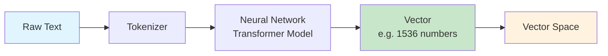
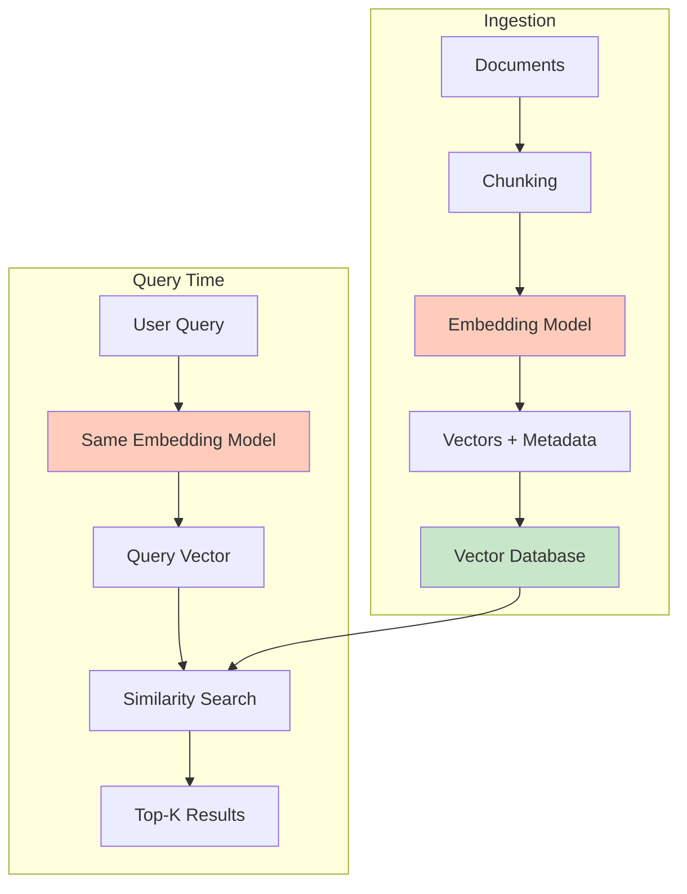

# What Are Embeddings?

## The Core Idea: Coordinates in Meaning Space

Imagine you have a giant map — not of geography, but of **meaning**. Every word, sentence, or document gets a specific location on this map. Things that mean similar things are placed close together; things that are unrelated are far apart.

An **embedding** is simply the coordinates of a piece of text on this meaning map.

Just like GPS coordinates (latitude, longitude) tell you where something is on Earth, an embedding (a list of numbers) tells you where something is in "meaning space."

```
"happy" → [0.21, -0.45, 0.89, 0.12, ...]   ← coordinates in meaning space
"joyful" → [0.23, -0.42, 0.91, 0.10, ...]   ← very close to "happy"!
"bicycle" → [-0.67, 0.33, -0.12, 0.55, ...]  ← far away from "happy"
```

## How Text Becomes Numbers

At a high level, here's what happens:



1. **Tokenize**: Split text into tokens (subwords)
2. **Encode**: Feed tokens through a trained neural network (transformer)
3. **Pool**: Combine all token representations into a single fixed-size vector
4. **Normalize**: Scale the vector to unit length (for cosine similarity)

You don't need to understand the internals — just know that the model has been trained on billions of text pairs to learn that similar meanings should produce similar numbers.

## What Does "1536 Dimensions" Mean?

On a real map, you need 2 numbers (lat, long) to pinpoint a location. For meaning, 2 dimensions aren't enough — language is far too complex.

Think of each dimension as capturing one **aspect** of meaning:

| Dimension (conceptual) | What it might capture |
|------------------------|----------------------|
| Dim 1 | Formal ↔ Casual |
| Dim 2 | Positive ↔ Negative sentiment |
| Dim 3 | Abstract ↔ Concrete |
| Dim 4 | Technical ↔ Everyday |
| ... | ... |
| Dim 1536 | Some subtle pattern humans can't name |

With 1536 dimensions, the model can capture incredibly subtle distinctions. More dimensions = more expressive power, but also more memory and compute.

**Common embedding sizes:**
- 384 dimensions: lightweight, fast
- 768 dimensions: medium, balanced
- 1536 dimensions: OpenAI's standard (text-embedding-3-small)
- 3072 dimensions: OpenAI's large model

## Semantic Similarity: Close Vectors = Similar Meanings

This is the magic. Because the model was trained on meaning, we get:

```
distance("dog", "puppy") = 0.05    ← very close
distance("dog", "cat") = 0.20      ← somewhat close (both animals)
distance("dog", "quantum") = 0.85  ← very far apart
```

This works for full sentences too:
```
"How do I reset my password?" ≈ "I forgot my login credentials"
```
They use different words but mean the same thing — and their vectors are close.

## The King - Man + Woman = Queen Analogy

One of the most famous properties of embeddings is **vector arithmetic on meaning**:

```
vector("king") - vector("man") + vector("woman") ≈ vector("queen")
```

This works because the model captures **relationships** as directions:
- The direction from "man" to "woman" represents a gender transformation
- Applying that same direction to "king" lands you near "queen"

Other examples:
- Paris - France + Italy ≈ Rome
- bigger - big + small ≈ smaller

## Distance Metrics: How to Measure "Closeness"

### Cosine Similarity

Measures the **angle** between two vectors, ignoring magnitude.

```
cos_sim(A, B) = (A · B) / (|A| × |B|)
```

- Range: -1 to 1 (1 = identical direction, 0 = orthogonal, -1 = opposite)
- **Best for**: normalized embeddings, text similarity

**Analogy**: Two flashlights pointing in the same direction have cosine similarity 1, even if one is brighter (longer vector).

### Euclidean Distance (L2)

Measures the **straight-line distance** between two points.

```
L2(A, B) = √(Σ(ai - bi)²)
```

- Range: 0 to ∞ (0 = identical)
- **Best for**: when magnitude matters, spatial data

### Dot Product (Inner Product)

Measures both direction AND magnitude.

```
dot(A, B) = Σ(ai × bi)
```

- Range: -∞ to ∞
- **Best for**: when vectors are NOT normalized, recommendation systems

### When to Use Which

| Metric | Use When | Example |
|--------|----------|---------|
| Cosine Similarity | Vectors are normalized, comparing text | Semantic search, document similarity |
| Euclidean (L2) | Magnitude matters, spatial reasoning | Image feature matching |
| Dot Product | Vectors not normalized, need speed | Recommendation engines, MaxSim (ColBERT) |

> **Architect tip**: If your embeddings are normalized (most text models do this), cosine similarity and dot product give identical rankings. Use dot product — it's faster (no division).

## Embedding Models Comparison

| Model | Provider | Dimensions | Speed | Quality (MTEB) | Cost |
|-------|----------|-----------|-------|-----------------|------|
| text-embedding-3-small | OpenAI | 1536 | Fast (API) | ~62% | $0.02/1M tokens |
| text-embedding-3-large | OpenAI | 3072 | Fast (API) | ~64% | $0.13/1M tokens |
| embed-v4 | Cohere | 1024 | Fast (API) | ~65% | $0.10/1M tokens |
| all-MiniLM-L6-v2 | Sentence-Transformers | 384 | Very Fast (local) | ~56% | Free (self-hosted) |
| jina-embeddings-v3 | Jina AI | 1024 | Fast (API) | ~66% | $0.02/1M tokens |
| voyage-3 | Voyage AI | 1024 | Fast (API) | ~67% | $0.06/1M tokens |

## The MTEB Benchmark

The **Massive Text Embedding Benchmark** (MTEB) evaluates embeddings across multiple tasks:
- Retrieval (finding relevant documents)
- Clustering (grouping similar items)
- Classification
- Semantic Textual Similarity (STS)

**How to read MTEB scores**: Higher is better. Look at the specific task you care about (usually Retrieval for RAG/search).

Check the leaderboard: [huggingface.co/spaces/mteb/leaderboard](https://huggingface.co/spaces/mteb/leaderboard)

## The Full Pipeline



## Why This Matters for an Architect

1. **Model lock-in**: Once you embed with a model, switching means re-embedding everything
2. **Cost at scale**: Embedding 10M documents at $0.02/1M tokens adds up
3. **Dimension tradeoffs**: More dimensions = better quality but 4x storage and slower search
4. **Consistency**: Query and document MUST use the same model
5. **Versioning**: When a model updates, old and new embeddings aren't compatible

---

*Next: [02 - Vector Database Fundamentals](./02-vector-database-fundamentals.md)*
