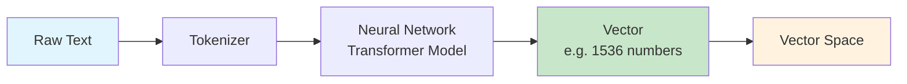
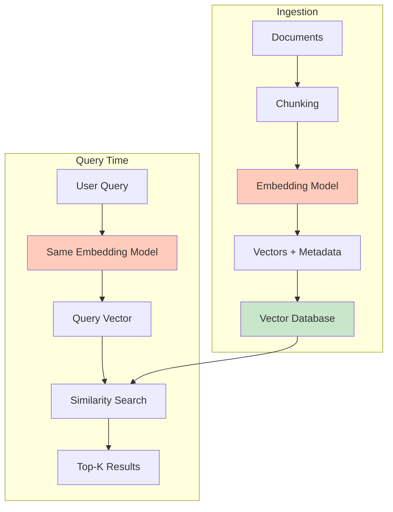

# What Are Embeddings?

## The Core Idea: Coordinates in Meaning Space

Imagine you have a giant map — not of geography, but of **meaning**. Every word, sentence, or document gets a specific location on this map. Things that mean similar things are placed close together; things that are unrelated are far apart.

An **embedding** is simply the coordinates of a piece of text on this meaning map.

Just like GPS coordinates (latitude, longitude) tell you where something is on Earth, an embedding (a list of numbers) tells you where something is in "meaning space."

```
"happy" → [0.21, -0.45, 0.89, 0.12, ...]   ← coordinates in meaning space
"joyful" → [0.23, -0.42, 0.91, 0.10, ...]   ← very close to "happy"!
"bicycle" → [-0.67, 0.33, -0.12, 0.55, ...]  ← far away from "happy"
```

## How Text Becomes Numbers

At a high level, here's what happens:



1. **Tokenize**: Split text into tokens (subwords)
2. **Encode**: Feed tokens through a trained neural network (transformer)
3. **Pool**: Combine all token representations into a single fixed-size vector
4. **Normalize**: Scale the vector to unit length (for cosine similarity)

You don't need to understand the internals — just know that the model has been trained on billions of text pairs to learn that similar meanings should produce similar numbers.

## What Does "1536 Dimensions" Mean?

On a real map, you need 2 numbers (lat, long) to pinpoint a location. For meaning, 2 dimensions aren't enough — language is far too complex.

Think of each dimension as capturing one **aspect** of meaning:

| Dimension (conceptual) | What it might capture |
|------------------------|----------------------|
| Dim 1 | Formal ↔ Casual |
| Dim 2 | Positive ↔ Negative sentiment |
| Dim 3 | Abstract ↔ Concrete |
| Dim 4 | Technical ↔ Everyday |
| ... | ... |
| Dim 1536 | Some subtle pattern humans can't name |

With 1536 dimensions, the model can capture incredibly subtle distinctions. More dimensions = more expressive power, but also more memory and compute.

**Common embedding sizes:**
- 384 dimensions: lightweight, fast
- 768 dimensions: medium, balanced
- 1536 dimensions: OpenAI's standard (text-embedding-3-small)
- 3072 dimensions: OpenAI's large model

## Semantic Similarity: Close Vectors = Similar Meanings

This is the magic. Because the model was trained on meaning, we get:

```
distance("dog", "puppy") = 0.05    ← very close
distance("dog", "cat") = 0.20      ← somewhat close (both animals)
distance("dog", "quantum") = 0.85  ← very far apart
```

This works for full sentences too:
```
"How do I reset my password?" ≈ "I forgot my login credentials"
```
They use different words but mean the same thing — and their vectors are close.

## The King - Man + Woman = Queen Analogy

One of the most famous properties of embeddings is **vector arithmetic on meaning**:

```
vector("king") - vector("man") + vector("woman") ≈ vector("queen")
```

This works because the model captures **relationships** as directions:
- The direction from "man" to "woman" represents a gender transformation
- Applying that same direction to "king" lands you near "queen"

Other examples:
- Paris - France + Italy ≈ Rome
- bigger - big + small ≈ smaller

## Distance Metrics: How to Measure "Closeness"

### Cosine Similarity

Measures the **angle** between two vectors, ignoring magnitude.

```
cos_sim(A, B) = (A · B) / (|A| × |B|)
```

- Range: -1 to 1 (1 = identical direction, 0 = orthogonal, -1 = opposite)
- **Best for**: normalized embeddings, text similarity

**Analogy**: Two flashlights pointing in the same direction have cosine similarity 1, even if one is brighter (longer vector).

### Euclidean Distance (L2)

Measures the **straight-line distance** between two points.

```
L2(A, B) = √(Σ(ai - bi)²)
```

- Range: 0 to ∞ (0 = identical)
- **Best for**: when magnitude matters, spatial data

### Dot Product (Inner Product)

Measures both direction AND magnitude.

```
dot(A, B) = Σ(ai × bi)
```

- Range: -∞ to ∞
- **Best for**: when vectors are NOT normalized, recommendation systems

### When to Use Which

| Metric | Use When | Example |
|--------|----------|---------|
| Cosine Similarity | Vectors are normalized, comparing text | Semantic search, document similarity |
| Euclidean (L2) | Magnitude matters, spatial reasoning | Image feature matching |
| Dot Product | Vectors not normalized, need speed | Recommendation engines, MaxSim (ColBERT) |

> **Architect tip**: If your embeddings are normalized (most text models do this), cosine similarity and dot product give identical rankings. Use dot product — it's faster (no division).

## Embedding Models Comparison

| Model | Provider | Dimensions | Speed | Quality (MTEB) | Cost |
|-------|----------|-----------|-------|-----------------|------|
| text-embedding-3-small | OpenAI | 1536 | Fast (API) | ~62% | $0.02/1M tokens |
| text-embedding-3-large | OpenAI | 3072 | Fast (API) | ~64% | $0.13/1M tokens |
| embed-v4 | Cohere | 1024 | Fast (API) | ~65% | $0.10/1M tokens |
| all-MiniLM-L6-v2 | Sentence-Transformers | 384 | Very Fast (local) | ~56% | Free (self-hosted) |
| jina-embeddings-v3 | Jina AI | 1024 | Fast (API) | ~66% | $0.02/1M tokens |
| voyage-3 | Voyage AI | 1024 | Fast (API) | ~67% | $0.06/1M tokens |

## The MTEB Benchmark

The **Massive Text Embedding Benchmark** (MTEB) evaluates embeddings across multiple tasks:
- Retrieval (finding relevant documents)
- Clustering (grouping similar items)
- Classification
- Semantic Textual Similarity (STS)

**How to read MTEB scores**: Higher is better. Look at the specific task you care about (usually Retrieval for RAG/search).

Check the leaderboard: [huggingface.co/spaces/mteb/leaderboard](https://huggingface.co/spaces/mteb/leaderboard)

## The Full Pipeline



## Why This Matters for an Architect

1. **Model lock-in**: Once you embed with a model, switching means re-embedding everything
2. **Cost at scale**: Embedding 10M documents at $0.02/1M tokens adds up
3. **Dimension tradeoffs**: More dimensions = better quality but 4x storage and slower search
4. **Consistency**: Query and document MUST use the same model
5. **Versioning**: When a model updates, old and new embeddings aren't compatible

---

## Staff-Level: Anti-Patterns

### 1. Using the Wrong Embedding Model for Your Domain

**Mistake**: Using a general-purpose model (text-embedding-3-small) for specialized domains like medical, legal, or code search without evaluation.

**Why it hurts**: General models encode "MI" as Michigan, not myocardial infarction. Legal "consideration" maps to everyday meaning. Code variable names become noise.

**Fix**: Always evaluate on YOUR queries first. If recall@10 < 85% on domain-specific test set, fine-tune or switch to domain-specific model.

### 2. Not Evaluating Embedding Quality Before Production

**Mistake**: Choosing a model based on MTEB leaderboard scores alone, deploying without measuring on your actual data.

**Why it hurts**: MTEB is averaged across diverse tasks. A model ranked #1 overall may rank #15 on your specific retrieval task.

**Fix**: Create a golden test set (50-100 query/document pairs). Measure recall@10 and nDCG@10 on YOUR data before choosing.

### 3. Treating All Text Equally (Title vs Body vs Metadata)

**Mistake**: Concatenating title + body + metadata into one string and embedding it all together.

**Why it hurts**: Titles are information-dense; body text dilutes the signal. A 500-word paragraph's embedding is dominated by common filler words, not the key concepts.

**Fix**: Embed title and body separately with different weights. Use title embeddings for initial retrieval, body for re-ranking. Or prepend structured prefixes: `"title: ... body: ..."`.

### 4. Embedding Without Preprocessing

**Mistake**: Embedding raw HTML, markdown with formatting, text with excessive whitespace, boilerplate headers/footers.

**Why it hurts**: Noise in input = noise in embedding. HTML tags, nav menus, and cookie banners pollute the semantic signal.

**Fix**: Strip formatting, remove boilerplate, normalize whitespace, chunk intelligently BEFORE embedding.

---

## Staff-Level: Dimension Trade-offs

| Dimension | Storage (100M vectors) | Annual Storage Cost | Quality (retrieval) | Best Use Case |
|-----------|----------------------|--------------------|--------------------|---------------|
| 256 | 100 GB | ~$200/yr | 85-88% recall | Mobile/edge, real-time autocomplete |
| 768 | 300 GB | ~$600/yr | 92-95% recall | General production, balanced |
| 1536 | 600 GB | ~$1,200/yr | 95-97% recall | High-quality search, RAG |
| 3072 | 1.2 TB | ~$2,400/yr | 97-98% recall | Maximum quality, cost not a concern |

**Staff decision framework**: Start with 1024 or 1536. Only go lower if latency/cost forces it. Only go higher if quality metrics justify the 2x storage bump.

---

## Staff-Level: Real Costs at Scale (1M Documents, ~500 tokens each)

| Provider | Model | Cost to Embed 1M Docs | Monthly Re-query Cost (100K queries) | Notes |
|----------|-------|----------------------|-------------------------------------|-------|
| OpenAI | text-embedding-3-small | $10 | $1 | Cheapest quality option |
| OpenAI | text-embedding-3-large | $65 | $6.50 | 2x quality bump, 6.5x cost |
| Cohere | embed-v4 | $50 | $5 | Good multilingual support |
| Voyage AI | voyage-3 | $30 | $3 | Best quality/cost ratio |
| Self-hosted | all-MiniLM-L6-v2 | $5 (GPU hours) | $0 (amortized) | Break-even at ~50M tokens/month |
| Self-hosted | BGE-large | $15 (GPU hours) | $0 (amortized) | Higher quality, slower |

**Hidden costs staff engineers catch**:
- Re-embedding when models update: budget for full re-embed 1-2x/year
- A/B testing new models: 2x storage during migration
- Embedding cache misses during cold starts
- Token counting surprises: code and non-English text tokenize to 2-3x more tokens

---

## Embedding Model Selection Framework

### Decision Criteria (Ranked by Impact)

| Factor | Weight | Considerations |
|--------|--------|---------------|
| Task alignment | 40% | Code search → code-trained model; multilingual → multilingual model |
| Dimension vs. quality | 25% | Higher dims ≠ always better; diminishing returns after 768 for most tasks |
| Latency budget | 20% | Real-time (<50ms) limits you to smaller models or cached embeddings |
| Cost at scale | 15% | Per-token pricing compounds; 1B docs × re-embed = significant cost |

### Provider Cost Comparison (2024-2025 pricing, per 1M tokens)

| Provider | Model | Dimensions | Cost/1M tokens | Quality (MTEB avg) |
|----------|-------|-----------|----------------|---------------------|
| OpenAI | text-embedding-3-small | 1536 | $0.02 | 62.3 |
| OpenAI | text-embedding-3-large | 3072 | $0.13 | 64.6 |
| Cohere | embed-v3 | 1024 | $0.10 | 64.5 |
| Google | text-embedding-004 | 768 | $0.025 | 63.8 |
| Voyage AI | voyage-large-2 | 1536 | $0.12 | 65.2 |
| Local (BGE) | bge-large-en-v1.5 | 1024 | GPU cost only | 63.6 |

### Embedding Dimension Trade-offs

```
Dimension impact on system design:
  256d  → 1KB/vector  → 1B vectors = ~1TB storage, fastest search
  768d  → 3KB/vector  → 1B vectors = ~3TB storage, good quality/cost balance
  1536d → 6KB/vector  → 1B vectors = ~6TB storage, diminishing quality gains
  3072d → 12KB/vector → 1B vectors = ~12TB storage, marginal improvement for most tasks
```

**Staff insight on dimension selection**:
- OpenAI's `text-embedding-3` models support **Matryoshka representations** — you can truncate to lower dimensions (e.g., 256 from 3072) with graceful quality degradation
- This enables a two-tier strategy: store full-dimension embeddings, but use truncated versions for initial candidate retrieval (cheaper index, faster search), then re-rank with full vectors
- Rule of thumb: if your recall@10 at 256d is within 3% of full-dimension, use 256d for the index layer

**Cost modeling formula**:
```
Monthly embedding cost = (new_docs/month × avg_tokens/doc × price_per_token)
                       + (re-embed_fraction × total_docs × avg_tokens/doc × price_per_token)
Storage cost          = total_vectors × dimensions × 4 bytes × replication_factor
```

---

*Next: [02 - Vector Database Fundamentals](./02-vector-database-fundamentals.md)*
