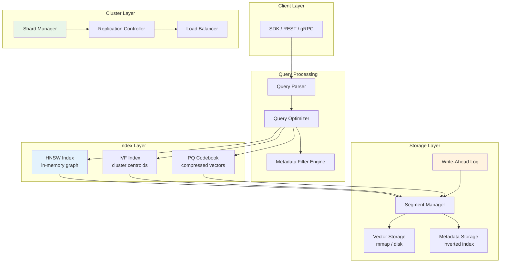
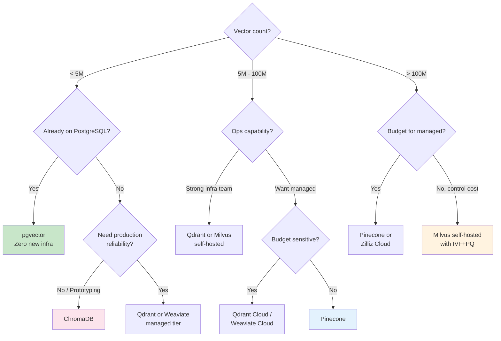

# Vector Database Fundamentals

## What Is a Vector Database?

A vector database is a specialized data system optimized for storing, indexing, and querying high-dimensional vectors — numerical representations of unstructured data (text, images, audio, code). Unlike traditional databases that find exact matches, vector databases find **semantically similar** items through approximate nearest neighbor (ANN) search.

### The Core Insight

Traditional databases answer: "Give me the row where `id = 42`"
Vector databases answer: "Give me the 10 items most similar to this query in meaning"

This is a fundamentally different computation. Traditional indexes (B-trees, hash maps) are useless for similarity search in 1536-dimensional space. Vector databases exist because this problem requires entirely different data structures and algorithms.

### Vector DB vs Traditional DB vs Search Engine

| Dimension | Traditional DB (PostgreSQL) | Search Engine (Elasticsearch) | Vector Database (Qdrant) |
|-----------|---------------------------|-------------------------------|--------------------------|
| Primary query | Exact match (`WHERE x = 5`) | Full-text keyword search (BM25) | Nearest neighbor (semantic similarity) |
| Index structure | B-tree, Hash, GIN | Inverted index | HNSW, IVF, PQ |
| Data model | Rows & columns | Documents with text fields | Vectors + metadata |
| Result guarantee | Exact | Ranked by relevance score | Approximate (recall < 100%) |
| Handles synonyms | No | Partially (analyzers) | Yes (semantic) |
| Query language | SQL | Query DSL | Vector API / gRPC |
| Latency (typical) | 1-10ms | 5-30ms | 5-50ms |
| Scaling pattern | Vertical + read replicas | Sharding by document | Sharding by vector space |
| Sweet spot | Structured, relational data | Text search with facets | Semantic similarity at scale |

**Key distinction**: Elasticsearch can do vector search (dense_vector field), and PostgreSQL can too (pgvector). The question is whether it's a bolt-on or the core architecture. Purpose-built vector DBs optimize everything — memory layout, disk I/O, compute — for vector operations.

---

## Core Operations

### Insert (Upsert)

```python
# Typical vector DB insert pattern
client.upsert(
    collection_name="products",
    points=[
        {
            "id": "prod_001",
            "vector": embedding_model.encode("wireless noise-canceling headphones"),  # [0.12, -0.45, ...]
            "payload": {
                "name": "Sony WH-1000XM5",
                "category": "electronics",
                "price": 349.99,
                "in_stock": True
            }
        }
    ]
)
```

Insert is expensive because the index must be updated. Most vector DBs batch inserts and rebuild index segments periodically.

### Search (kNN and ANN)

**Exact kNN (k-Nearest Neighbors)**: Compares the query vector against every single vector in the database. O(n) per query. Guarantees perfect recall. Unusable beyond ~100K vectors.

**Approximate Nearest Neighbor (ANN)**: Uses index structures to narrow the search space. Trades slight accuracy loss for orders-of-magnitude speedup. At 10M vectors, ANN might search 0.1% of the data and still achieve 95%+ recall.

```python
results = client.search(
    collection_name="products",
    query_vector=embedding_model.encode("good headphones for flights"),
    limit=10,
    query_filter={
        "must": [{"key": "category", "match": {"value": "electronics"}}],
        "must": [{"key": "price", "range": {"lte": 400.0}}]
    }
)
# Returns: [(id, score, payload), ...] ranked by similarity
```

### Update

Updating a vector requires re-indexing that point. Updating only metadata/payload is cheap — the vector index isn't touched. This distinction matters for system design: separate frequently-changing metadata from stable embeddings.

### Delete

Soft-delete (mark as deleted, filter out during search) is immediate. Hard-delete (reclaiming space, compacting index segments) happens during background maintenance. Similar to LSM-tree compaction in traditional DBs.

---

## How Similarity Search Works

### Distance Metrics

The choice of distance metric must match how your embedding model was trained. Using the wrong metric produces garbage results regardless of index quality.

#### Cosine Similarity

```
cosine_sim(A, B) = (A · B) / (||A|| × ||B||)
```

- Range: [-1, 1] (1 = identical direction, 0 = orthogonal, -1 = opposite)
- **Ignores magnitude**, only measures direction
- Best for: text embeddings (OpenAI, Cohere, most sentence transformers)
- Why: text embeddings are typically L2-normalized, so direction encodes semantics

#### Dot Product (Inner Product)

```
dot(A, B) = Σ(Aᵢ × Bᵢ)
```

- Range: unbounded
- **Considers magnitude** — longer vectors score higher
- Best for: Maximum Inner Product Search (MIPS), recommendation systems where magnitude encodes importance/popularity
- Caveat: If vectors are normalized, dot product = cosine similarity

#### Euclidean Distance (L2)

```
L2(A, B) = √(Σ(Aᵢ - Bᵢ)²)
```

- Range: [0, ∞) (0 = identical, larger = more different)
- Measures absolute distance in space
- Best for: image embeddings, spatial data, when magnitude differences matter
- Note: For normalized vectors, L2 ranking is equivalent to cosine ranking

### Choosing the Right Metric

| Embedding Source | Recommended Metric | Reason |
|-----------------|-------------------|--------|
| OpenAI text-embedding-3 | Cosine | Normalized, direction = semantics |
| Cohere embed-v3 | Cosine or Dot | Supports both, check docs |
| CLIP (images) | Cosine | Cross-modal alignment by direction |
| ColBERT | MaxSim (dot) | Late interaction scoring |
| Custom trained | Match training loss | Must align with training objective |

**Anti-pattern**: Using Euclidean distance with text embeddings that weren't trained with L2 loss. You'll get poor recall and blame the vector DB.

---

## Architecture: Write Path and Read Path

### Write Path: Encode → Index → Store

```
Document/Image/Audio
        │
        ▼
┌─────────────────┐
│ Embedding Model │  ← Encode unstructured data to vector
└────────┬────────┘
         │ vector [float32 × dim]
         ▼
┌─────────────────┐
│  Index Builder  │  ← Insert into ANN index (HNSW graph, IVF lists, etc.)
└────────┬────────┘
         │
         ▼
┌─────────────────┐
│ Persistent Store│  ← Write vector + metadata to disk/WAL
└─────────────────┘
```

**Key considerations**:
- WAL (Write-Ahead Log) for durability before index update
- Batching: accumulate vectors, build index segments periodically
- Memory pressure: HNSW graphs live in RAM; large inserts can cause OOM
- Segment merging: background process consolidates small segments (like LSM compaction)

### Read Path: Encode → Search → Rerank

```
User Query ("comfortable headphones for travel")
        │
        ▼
┌─────────────────┐
│ Embedding Model │  ← Same model used at write time!
└────────┬────────┘
         │ query vector
         ▼
┌─────────────────┐
│   ANN Search    │  ← Traverse HNSW graph / scan IVF clusters
│ + Metadata Filter│  ← Apply pre/post filters
└────────┬────────┘
         │ top-K candidates (maybe 100)
         ▼
┌─────────────────┐
│    Re-ranker    │  ← Cross-encoder or business logic re-scoring
└────────┬────────┘
         │ final top-N results (maybe 10)
         ▼
      Response
```

**Critical rule**: The embedding model at read time MUST match write time. If you upgrade your embedding model, you must re-embed and re-index all vectors. There is no backward compatibility.

---

## Vector DB Architecture Internals



---

## Index Types Overview

| Index | How It Works | Build Time | Query Time | Memory | Recall | Best For |
|-------|-------------|-----------|-----------|--------|--------|----------|
| **Flat** | Brute-force scan all vectors | O(1) | O(n) | Low | 100% | < 100K vectors, ground truth |
| **IVF** | Partition space into clusters, search nearest clusters | O(n) | O(n/k) | Low | 90-99% | Large datasets, disk-friendly |
| **HNSW** | Navigable small-world graph, greedy traversal | O(n log n) | O(log n) | **High** | 95-99%+ | Most production workloads |
| **PQ** | Compress vectors via product quantization, search in compressed space | O(n) | O(n) fast | **Very Low** | 85-95% | Memory-constrained, billions of vectors |
| **DiskANN** | Graph-based, optimized for SSD | O(n log n) | O(log n) | Low | 95%+ | Billion-scale, cost-sensitive |

**Deep dive on these algorithms**: See [03 - Indexing Algorithms](./03-indexing-algorithms.md)

**Staff-level insight**: HNSW dominates production because it offers the best recall/latency tradeoff and handles dynamic inserts well. IVF+PQ is the go-to when you have billion-scale data and can't fit HNSW graphs in RAM. DiskANN is emerging as the "best of both worlds" for cost-sensitive deployments.

---

## Metadata Filtering: Pre-filter vs Post-filter

This is one of the most misunderstood aspects of vector databases and a common source of production issues.

### Post-filter (Naive)

1. Run ANN search → get top-1000 candidates by vector similarity
2. Apply metadata filter → remove non-matching candidates
3. Return remaining results (maybe only 3 out of 1000)

**Problem**: If only 0.1% of your data matches the filter, you might search 1000 candidates and get 1 result. You asked for top-10 but got 1. Increasing the candidate pool helps but wastes compute.

### Pre-filter (Correct but Expensive)

1. Apply metadata filter → identify matching IDs (bitmap/inverted index)
2. Run ANN search ONLY within matching set
3. Return top-K

**Problem**: If the filtered set is small and scattered across the HNSW graph, the search can't efficiently traverse. Also requires maintaining a separate metadata index.

### Hybrid Approaches (What Production Systems Actually Do)

- **Qdrant**: Pre-filter using payload indexes, then search within filtered HNSW subgraph
- **Pinecone**: Proprietary filtering integrated into the index structure
- **Weaviate**: Combines inverted index (metadata) with HNSW, uses "allow list" during traversal
- **Milvus**: Partition-based filtering (pre-filter on partition key, ANN within partition)

### Why This Matters for Architects

```
Scenario: E-commerce with 50M products
Query: "red running shoes" + filter: category=shoes, brand=Nike, in_stock=true

Post-filter: Search all 50M, get top-100 similar, filter → maybe 2 results
Pre-filter: Narrow to 500K Nike shoes in stock, search those → get solid top-10

Performance difference: 10-100x depending on filter selectivity
```

**Design rule**: If your application always filters on a specific field (tenant_id, category), make that your partition key. The vector DB will physically separate data, making filtered search equivalent to unfiltered search on a smaller dataset.

---

## Consistency Models

### Eventual Consistency (Most Vector DBs Default)

- Writes are acknowledged before index is updated
- New vectors may not appear in search results for seconds/minutes
- Segment building is async; search uses last-built segments
- **Acceptable for**: RAG, recommendations, content discovery

### Strong Consistency

- Writes are visible to reads immediately after acknowledgment
- Requires synchronous index updates (expensive)
- **Required for**: deletion compliance (GDPR), real-time inventory, access control changes

| Database | Default Consistency | Strong Consistency Option |
|----------|-------------------|--------------------------|
| Pinecone | Eventual (~seconds) | No (freshness SLA only) |
| Qdrant | Eventual | Yes (per-request `wait=true`) |
| Weaviate | Eventual | Tunable (read/write concern) |
| Milvus | Eventual | Yes (consistency levels) |
| pgvector | **Strong** (PostgreSQL ACID) | Always (it's PostgreSQL) |

**Staff insight**: pgvector's strong consistency is a genuinely underrated advantage. If your use case requires immediate read-after-write (e.g., user uploads doc, immediately searches it), pgvector eliminates an entire class of bugs.

---

## Popular Vector Databases Compared

### Pinecone
- **Type**: Fully managed SaaS (no self-hosting option)
- **Strengths**: Zero ops, excellent DX, integrated metadata filtering, serverless tier
- **Weaknesses**: Vendor lock-in, no self-hosting, limited configurability, cost at scale
- **Scale**: Billions of vectors (pod-based or serverless)
- **Best for**: Teams that want to never think about infrastructure

### Weaviate
- **Type**: Open-source, managed cloud available
- **Strengths**: Multi-modal native (text, image, etc.), GraphQL API, hybrid search (BM25 + vector), modules ecosystem
- **Weaknesses**: Higher memory usage, complex module system, GraphQL not everyone's preference
- **Scale**: Billions (with sharding)
- **Best for**: Multi-modal search, teams that like GraphQL, hybrid keyword+vector

### Qdrant
- **Type**: Open-source (Rust), managed cloud available
- **Strengths**: Best-in-class performance (Rust), excellent filtering, quantization support, rich payload indexes, gRPC API
- **Weaknesses**: Smaller ecosystem than Weaviate, newer managed offering
- **Scale**: Billions (with sharding)
- **Best for**: Performance-critical applications, complex filtered search

### Milvus (Zilliz)
- **Type**: Open-source, Zilliz Cloud managed
- **Strengths**: Massive scale (designed for trillions), multiple index types, GPU acceleration, mature (CNCF project)
- **Weaknesses**: Complex to operate self-hosted (etcd, MinIO, Pulsar dependencies), heavier than alternatives
- **Scale**: Trillions of vectors
- **Best for**: Largest-scale deployments, organizations with strong infra teams

### pgvector
- **Type**: PostgreSQL extension
- **Strengths**: SQL joins with vector search, ACID transactions, existing tooling/backups/monitoring, strong consistency, zero new infrastructure
- **Weaknesses**: Performance ceiling at ~10M vectors, limited index options (HNSW, IVFFlat), no built-in sharding
- **Scale**: ~5-10M vectors per instance
- **Best for**: Applications already on PostgreSQL, need for joins/transactions, < 10M vectors

### ChromaDB
- **Type**: Open-source, embedded or client-server
- **Strengths**: Simplest API, great for prototyping, Python-native, runs in-process
- **Weaknesses**: Not production-hardened at scale, limited durability guarantees, small team
- **Scale**: Millions (single node)
- **Best for**: Prototyping, development, small-scale applications, Jupyter notebooks

---

## When to Use What

### Dedicated Vector DB (Qdrant, Pinecone, Milvus)

Choose when:
- > 10M vectors
- Vector search is the primary workload (not a feature bolted onto a CRUD app)
- Need maximum QPS/latency performance
- Complex ANN configurations (multi-index, quantization, sharding)
- Multi-tenancy at scale with isolation requirements

### pgvector Extension

Choose when:
- < 5-10M vectors
- Already running PostgreSQL
- Need SQL joins between vectors and relational data
- Strong consistency required (ACID)
- Team doesn't want to operate another database
- Vector search is a feature, not the product

### In-Memory (FAISS, ChromaDB embedded, NumPy brute-force)

Choose when:
- Prototyping / development
- Dataset fits in RAM and never changes (static corpus)
- Batch processing (not serving live traffic)
- Lambda/serverless function doing one-off similarity computation

---

## Performance Characteristics

### QPS and Latency at Different Scales

| Scale | Flat/Brute Force | HNSW (in-memory) | IVF+PQ (disk) |
|-------|-----------------|-------------------|----------------|
| 100K vectors | 500 QPS / 2ms | 10,000 QPS / 0.5ms | 5,000 QPS / 1ms |
| 1M vectors | 50 QPS / 20ms | 5,000 QPS / 1ms | 3,000 QPS / 2ms |
| 10M vectors | 5 QPS / 200ms | 2,000 QPS / 3ms | 1,500 QPS / 5ms |
| 100M vectors | Unusable | 500 QPS / 8ms | 800 QPS / 10ms |
| 1B vectors | Unusable | OOM (needs sharding) | 200 QPS / 20ms |

*Numbers are approximate for 1536-dim vectors on a single node with 64GB RAM. Real performance varies significantly by hardware, configuration, and recall target.*

### Memory Requirements (Approximate)

```
HNSW memory ≈ vectors × (dim × 4 bytes + M × 2 × 8 bytes)
  - 1M vectors × 1536 dim × fp32 = ~6 GB (vectors alone)
  - HNSW graph overhead (M=16): +256 MB
  - Total: ~6.3 GB for 1M vectors

With scalar quantization (int8): ~1.6 GB for 1M vectors
With PQ (64 subquantizers): ~64 MB for 1M vectors (but lower recall)
```

**Staff insight**: The memory equation drives architecture decisions. At 100M vectors with HNSW, you need ~630GB RAM. That's either a very expensive machine or you shard. PQ reduces this to ~6.4GB but drops recall to ~90%. This is why most billion-scale systems use tiered approaches: PQ for candidate retrieval, then rescore against full vectors from SSD.

---

## Anti-Patterns

### 1. Using Vector DB as Primary Data Store

Vector databases are indexes, not source-of-truth stores. They may lose data during compaction, have weaker durability guarantees than PostgreSQL, and lack proper backup/restore workflows.

**Fix**: Store source data in a proper database. Treat the vector DB as a derived index that can be rebuilt from source.

### 2. No Metadata Filtering Strategy

Querying without filters when you have partitioned data (multi-tenant, multi-category) means searching irrelevant vectors and paying for wasted compute.

**Fix**: Design your metadata schema upfront. Use partition keys for high-cardinality tenant isolation. Index frequently-filtered fields.

### 3. Wrong Distance Metric

Using Euclidean distance with normalized text embeddings, or cosine similarity with embeddings trained on absolute magnitude. Results look "sort of okay" but recall is 20% worse than it should be.

**Fix**: Check embedding model documentation. When in doubt, test all three metrics on your eval set and measure recall@10.

### 4. Ignoring Recall vs Latency Tradeoff

Setting HNSW `ef_search=500` for maximum recall when your SLA is 10ms p99. Or setting `ef_search=10` to hit latency targets but getting garbage results.

**Fix**: Profile and tune. Plot recall@10 vs p99 latency. Find the knee of the curve. Typical sweet spot: ef_search=100-200 gives 95%+ recall at <10ms for HNSW.

### 5. Embedding Model Mismatch Between Index and Query

Using `text-embedding-ada-002` to build your index, then switching to `text-embedding-3-small` for queries without re-indexing. The vector spaces are incompatible.

**Fix**: Version your embedding model alongside your index. Migrations require full re-indexing.

### 6. Not Testing at Production Scale

Vector search performance is non-linear. Something that works at 100K vectors may fail spectacularly at 10M. Memory usage, query latency, and index build time all change dramatically.

**Fix**: Load test with production-scale data before committing to architecture.

---

## Trade-offs Table

| Dimension | Managed (Pinecone) | Self-Hosted Open Source (Qdrant/Milvus) | Extension (pgvector) |
|-----------|-------------------|----------------------------------------|---------------------|
| Ops burden | Zero | High (unless small scale) | Zero (already have Postgres) |
| Cost at small scale | Higher (floor pricing) | Lower (own hardware) | Lowest (free extension) |
| Cost at large scale | Highest | Moderate | N/A (won't scale) |
| Vendor lock-in | High | None | None |
| Performance ceiling | High | Highest (full control) | Moderate |
| Feature velocity | Depends on vendor | You control upgrade timing | Follows pgvector releases |
| Consistency | Eventual | Configurable | Strong (ACID) |
| Compliance/data residency | Limited regions | Full control | Full control |
| Time to production | Hours | Days-Weeks | Minutes |

---

## Real-World Examples

### Notion (AI Search)
- **Problem**: Search across millions of workspace pages semantically
- **Approach**: pgvector initially (already on PostgreSQL), migrated to dedicated solution at scale
- **Key decision**: Started simple, migrated when they hit pgvector's ceiling (~5M vectors per workspace became problematic with complex filters)

### Spotify (Recommendations)
- **Problem**: Find similar songs/podcasts from a catalog of 100M+ items
- **Approach**: Custom ANN solution (Annoy library, later Voyager) built in-house, now exploring managed options
- **Key decision**: At their scale, off-the-shelf solutions didn't exist when they started; custom gave them control over the recall/latency tradeoff specific to music

### Netflix (Content Discovery)
- **Problem**: Semantic search across titles, descriptions, and visual features for personalization
- **Approach**: Custom HNSW implementation integrated with their existing recommendation infrastructure
- **Key decision**: Multi-modal embeddings (text + image + engagement signals) required custom distance functions

### Shopify (Product Search)
- **Problem**: Semantic product search across millions of merchant stores
- **Approach**: Qdrant for vector search with complex metadata filtering (per-store, per-category)
- **Key decision**: Filtering performance was the deciding factor — post-filter approaches failed because each store is a tiny slice of total data

---

## Staff Decision Framework: Choosing a Vector DB



### Decision Factors Checklist

1. **Scale trajectory**: Where will you be in 12 months? Don't optimize for today's 100K if you'll have 50M next year.
2. **Filtering complexity**: If every query filters on tenant + category + date range, filtering performance matters more than raw ANN speed.
3. **Consistency requirements**: Need read-after-write? pgvector or Qdrant with `wait=true`. Can tolerate seconds of delay? Any option works.
4. **Team expertise**: A self-hosted Milvus cluster with etcd + MinIO + Pulsar is a real operational commitment.
5. **Existing infrastructure**: Already on PostgreSQL? pgvector is free. Already on Kubernetes? Self-hosted Qdrant is straightforward.
6. **Multi-modal needs**: Text + image + audio vectors in the same queries? Weaviate has native support.
7. **Cost model**: Pinecone charges per-vector stored + per-query. Self-hosted is fixed infra cost regardless of query volume. At high QPS, self-hosted wins economically.
8. **Compliance**: Data residency requirements may eliminate SaaS options. Healthcare/finance often requires self-hosted.

---

## Key Takeaways for Architects

1. **Vector databases are specialized indexes**, not general-purpose stores. Design your architecture with a source-of-truth DB alongside the vector index.
2. **pgvector is the right default** for most applications under 10M vectors. Don't add infrastructure complexity without a proven need.
3. **The embedding model matters more than the database**. A great embedding model with flat search beats a bad model with HNSW.
4. **Metadata filtering design is an architectural decision** — get it wrong and you'll face either poor relevance or poor performance.
5. **Test at target scale early**. Vector search performance is highly non-linear and surprising.
6. **Plan your embedding migration strategy** before you need it. Model upgrades require full re-indexing.
7. **Recall is a tunable knob**, not a binary. Understand your acceptable recall and tune index parameters to hit it at your latency budget.

---

*Next: [03 - Indexing Algorithms](./03-indexing-algorithms.md)*
