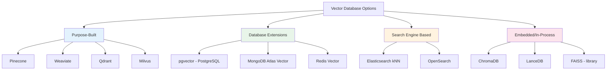
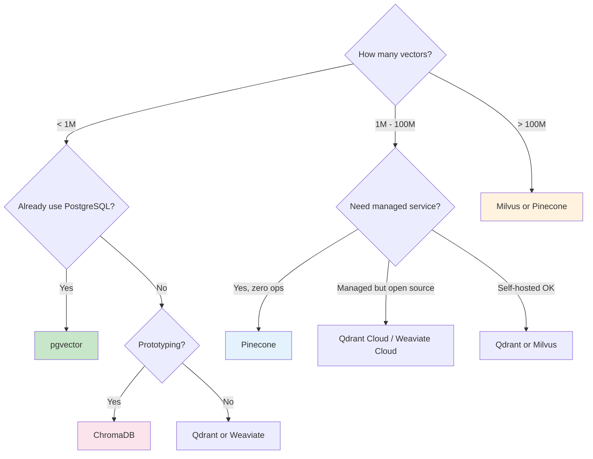

# Vector Database Fundamentals

## The "Library with a Semantic Card Catalog" Analogy

Imagine a traditional library: you search by title, author, or Dewey Decimal number. If you ask "books about overcoming adversity," the catalog is useless — it doesn't understand meaning.

Now imagine a magical library where every book has a "meaning coordinate." When you describe what you want, the librarian instantly finds books in the same neighborhood of meaning — even if they use completely different words.

**That's a vector database**: a database optimized to store vectors (meaning coordinates) and find the nearest neighbors blazingly fast.

## Can't I Just Use PostgreSQL?

Actually, **yes you can** — with pgvector! But there are tradeoffs:

| Aspect | pgvector (PostgreSQL) | Purpose-built Vector DB |
|--------|----------------------|------------------------|
| Setup complexity | Low (just an extension) | Moderate to High |
| SQL + vectors together | ✅ Native | ❌ Separate system |
| Scale (>10M vectors) | Struggles | Built for this |
| ANN algorithm options | HNSW, IVFFlat | HNSW, IVF, PQ, DiskANN, more |
| Filtering + search | Excellent (SQL WHERE) | Good (metadata filters) |
| Operational burden | Already have Postgres? Zero | New infra to manage |
| Memory efficiency | Moderate | Highly optimized |

**Architect's rule of thumb**: If you have <5M vectors and already run PostgreSQL → use pgvector. If you need billions of vectors or maximum search performance → use a purpose-built vector DB.

## Vector DB vs Traditional DB

| Feature | Traditional DB (SQL) | Vector Database |
|---------|---------------------|-----------------|
| Primary query | Exact match (WHERE x = 5) | Nearest neighbor (find similar) |
| Index type | B-tree, Hash | HNSW, IVF, PQ |
| Result guarantee | Exact | Approximate (ANN) |
| Data model | Rows & columns | Vectors + metadata |
| Query language | SQL | Custom API / gRPC |
| Scaling pattern | Vertical / Read replicas | Sharding by vector space |
| Typical latency | 1-10ms | 5-50ms |

## Categories of Vector Databases



## Major Players Comparison

| Database | Type | Hosting | Max Scale | Pricing Model | Best For |
|----------|------|---------|-----------|---------------|----------|
| **Pinecone** | Managed SaaS | Cloud only | Billions | Per-vector/query | Teams wanting zero ops |
| **Weaviate** | Open source | Self-hosted or cloud | Billions | Free / managed tiers | Multimodal, GraphQL fans |
| **Qdrant** | Open source | Self-hosted or cloud | Billions | Free / managed tiers | Performance-critical apps |
| **Milvus** | Open source | Self-hosted (Zilliz cloud) | Trillions | Free / managed | Massive scale |
| **ChromaDB** | Open source | Embedded / self-hosted | Millions | Free | Prototyping, small apps |
| **pgvector** | Extension | Wherever Postgres runs | ~10M | Free (extension) | Already using PostgreSQL |

## Selection Decision Tree



## Key Concepts

### Collections
A **collection** is like a table in SQL. It holds vectors of the same dimensionality and purpose.

```
Collection: "product_embeddings"
  - Dimension: 1536
  - Distance metric: cosine
  - Count: 2,500,000 vectors
```

### Points / Vectors
Each entry in a collection is a **point**: a vector plus an ID and optional metadata.

```json
{
  "id": "doc_42",
  "vector": [0.12, -0.45, 0.89, ...],  // 1536 floats
  "metadata": {
    "title": "Intro to ML",
    "category": "engineering",
    "created_at": "2024-01-15"
  }
}
```

### Payload / Metadata
Extra structured data attached to each vector. Enables **filtered search**:
> "Find similar documents, but only in the 'engineering' category"

### Indexes
The data structure that makes search fast. Without an index, every query scans all vectors (brute force). Indexes trade slight accuracy for massive speed gains.

## Why This Matters for an Architect

1. **Choosing the wrong vector DB is expensive to reverse** — you'll need to re-index and migrate
2. **pgvector is often "good enough"** — don't over-engineer if you already run Postgres
3. **Managed vs self-hosted** is an ops decision, not a technical one at small scale
4. **Metadata filtering design** is critical — bad filter patterns kill performance
5. **Plan for scale**: know your growth trajectory before committing

---

*Next: [03 - Indexing Algorithms](./03-indexing-algorithms.md)*
