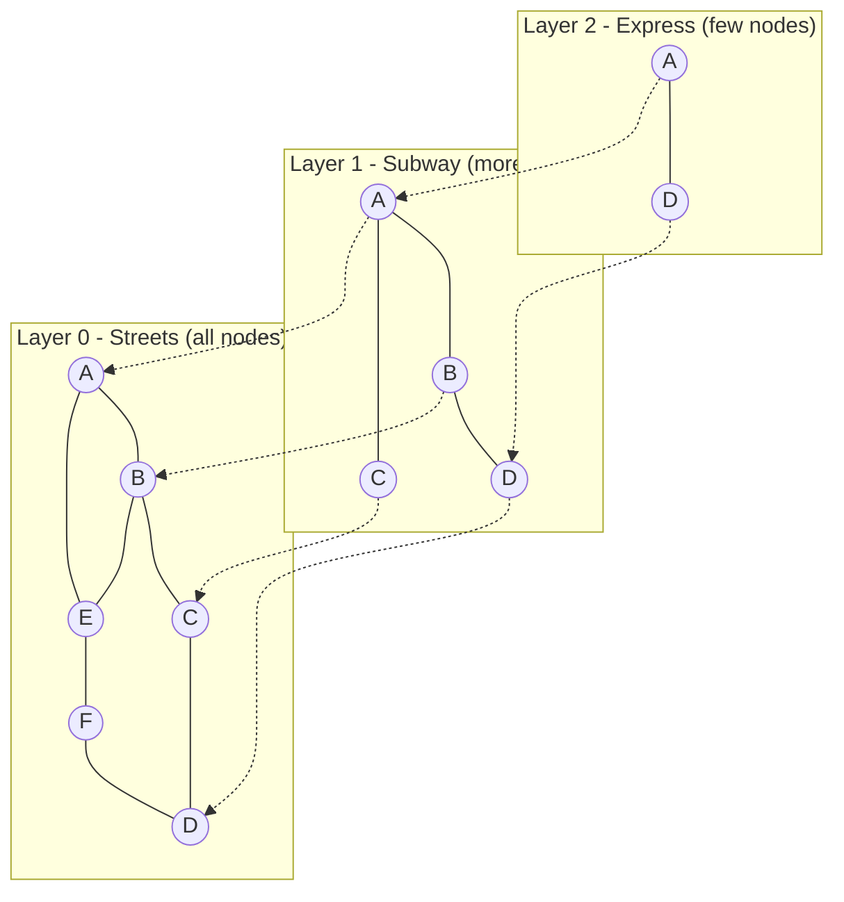
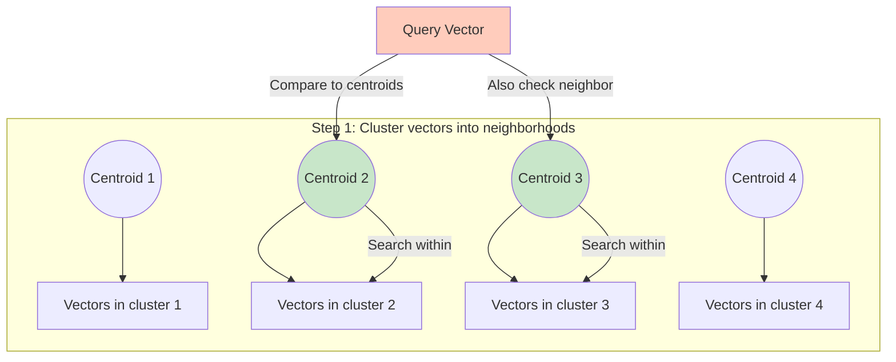
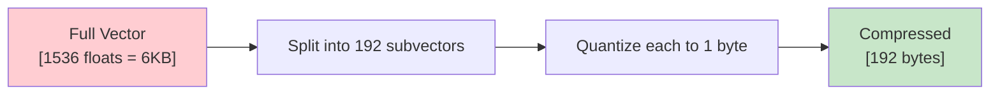

# Indexing Algorithms for Vector Search

## Why Brute-Force Search Fails at Scale

Brute-force (flat) search compares your query against **every single vector** in the database.

- 1,000 vectors → 1,000 comparisons → ~0.1ms ✅
- 1,000,000 vectors → 1,000,000 comparisons → ~100ms ⚠️
- 100,000,000 vectors → 100,000,000 comparisons → ~10 seconds ❌

It's O(n) per query. At scale, this is unacceptable for real-time applications.

**The solution**: Approximate Nearest Neighbor (ANN) algorithms that trade a tiny bit of accuracy for massive speed improvements.

## ANN: "Close Enough, Fast Enough"

ANN algorithms don't guarantee finding THE closest vector — they find vectors that are **very likely** among the closest. Typical recall rates are 95-99%, meaning you find 95-99 of the true top-100 results.

For most applications (search, RAG, recommendations), this tradeoff is invisible to users.

---

## HNSW (Hierarchical Navigable Small World)

### The "Express Train" Analogy

Imagine navigating a city to find a restaurant:
- **Layer 0 (street level)**: Every building connected to neighbors. Slow but precise.
- **Layer 1 (subway)**: Major landmarks connected. Skip whole neighborhoods.
- **Layer 2 (express train)**: Only a few hub stations. Cross the city in 2 stops.

You start on the express train (top layer), get roughly close, drop to the subway, get closer, then walk the streets to your exact destination.

### How HNSW Works

1. **Build**: Insert vectors one by one. Each vector gets random layer assignment (exponential decay — most end up on layer 0).
2. **Connect**: At each layer, connect the new vector to its M nearest existing neighbors.
3. **Search**: Start at top layer, greedily move toward query, descend layers, refine.

### Key Parameters

| Parameter | What it controls | Higher value means |
|-----------|-----------------|-------------------|
| `M` | Connections per node | Better recall, more memory |
| `ef_construction` | Build-time search width | Better graph quality, slower build |
| `ef_search` | Query-time search width | Better recall, slower query |

### Typical Values

- M = 16 (default sweet spot)
- ef_construction = 200 (invest in build quality)
- ef_search = 100 (tune for recall vs latency)

### HNSW Tradeoffs

| Pros | Cons |
|------|------|
| Fastest query time | High memory usage (graph + vectors in RAM) |
| Excellent recall (>99%) | Slow to build at scale |
| No training required | Updates require graph maintenance |
| Works well at any scale | Memory = O(n × M) |

---

## IVF (Inverted File Index)

### The "Neighborhood" Analogy

Instead of searching the entire city, first figure out which **neighborhood** your target is probably in, then only search within that neighborhood.

### How IVF Works

1. **Train**: Run k-means clustering on your vectors → create `nlist` centroids
2. **Assign**: Each vector goes into its nearest centroid's cluster (inverted list)
3. **Search**: Compare query to centroids → probe the `nprobe` nearest clusters → search within those clusters only

### Key Parameters

| Parameter | What it controls | Typical value |
|-----------|-----------------|---------------|
| `nlist` | Number of clusters | √n to 4×√n |
| `nprobe` | Clusters to search at query time | 5-20% of nlist |

### When to Use IVF

- Larger datasets where HNSW memory is too expensive
- Can accept slightly lower recall than HNSW
- Need faster build times
- Works well with Product Quantization (IVF-PQ)

---

## Product Quantization (PQ)

### The "Zip File for Vectors" Analogy

A 1536-dimensional float32 vector uses 6KB of memory. With 100M vectors, that's 600GB just for raw vectors.

PQ is like zip compression: it lossy-compresses each vector from thousands of bytes to just 32-128 bytes.

### How It Works

1. **Split** the vector into `m` subvectors (e.g., split 1536 dims into 192 groups of 8)
2. **Train** a small codebook (256 codes) for each subvector group
3. **Encode** each subvector as its nearest codebook entry (1 byte per group)
4. **Result**: 1536 float32 (6144 bytes) → 192 bytes (32x compression!)

### Tradeoffs

| Compression ratio | Recall loss | Use case |
|------------------|-------------|----------|
| 4x | ~1% | Quality-focused |
| 16x | ~3-5% | Balanced |
| 32x+ | ~10%+ | Memory-constrained |

---

## Scalar Quantization (SQ)

Simpler than PQ: just reduce the precision of each number.

- float32 (4 bytes) → float16 (2 bytes): 2x compression, ~0.1% recall loss
- float32 → int8 (1 byte): 4x compression, ~1-2% recall loss

Most vector DBs support this as an easy win.

---

## Flat Index (Brute Force)

When to use:
- Dataset < 10,000 vectors
- Need 100% recall (ground truth benchmarking)
- One-time batch processing

It's just linear scan — compare query to every vector. Perfect recall, O(n) speed.

---

## Algorithm Comparison

| Algorithm | Query Speed | Memory | Build Time | Recall | Best For |
|-----------|------------|--------|-----------|--------|----------|
| Flat | O(n) slow | Low (just vectors) | None | 100% | Small datasets, benchmarking |
| HNSW | ~1-5ms | High (graph + vectors) | Slow | 95-99%+ | Real-time search, <50M vectors |
| IVF | ~5-20ms | Medium | Fast (k-means) | 90-98% | Large datasets, memory-constrained |
| IVF-PQ | ~10-30ms | Very Low | Medium | 85-95% | Billions of vectors, low memory |
| DiskANN | ~5-10ms | Low (disk-based) | Slow | 95-99% | Huge datasets, SSD available |

---

## Why This Matters for an Architect

1. **HNSW is the default choice** for most real-time applications (Pinecone, Qdrant, Weaviate all use it)
2. **Memory is the bottleneck**: 100M vectors × 1536 dims × 4 bytes = 600GB RAM for HNSW
3. **Quantization is not optional at scale** — you WILL need it beyond 10M vectors
4. **Build time matters**: HNSW can take hours to build for large datasets. Plan for this.
5. **Parameter tuning** (ef_search, nprobe) directly controls your latency-recall tradeoff

---

*Next: [04 - Vector DB Operations](./04-vector-db-operations.md)*
