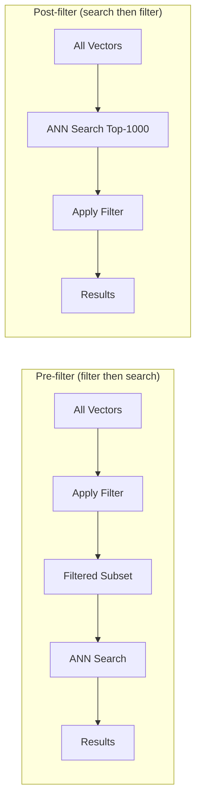
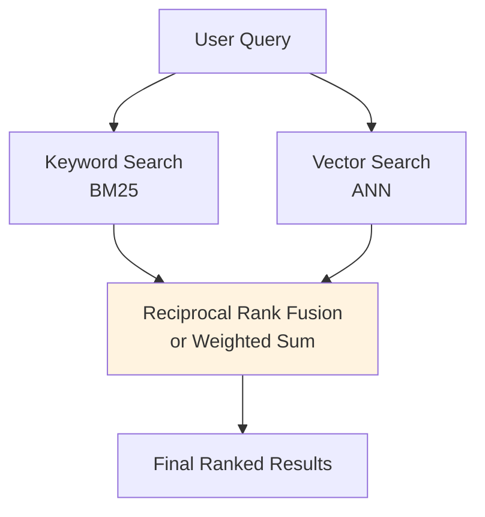
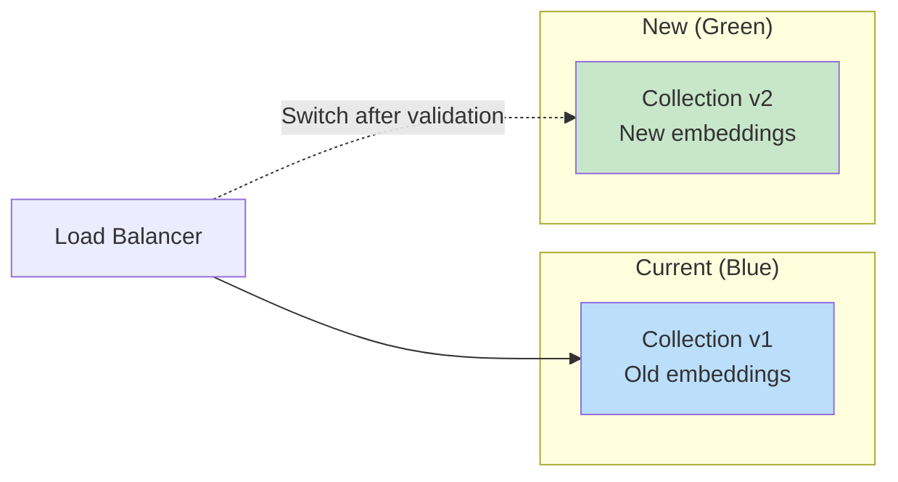

# Vector Database Operations

## CRUD Operations on Vectors

### Insert (Upsert)

```python
# Typical upsert pattern
collection.upsert(
    ids=["doc_1", "doc_2"],
    vectors=[[0.1, 0.2, ...], [0.3, 0.4, ...]],
    metadata=[{"title": "Doc 1"}, {"title": "Doc 2"}]
)
```

**Upsert** (update or insert) is preferred over insert because:
- Re-embedding a document should overwrite, not duplicate
- Idempotent operations simplify retry logic

### Read (Search)

```python
results = collection.query(
    query_vector=[0.15, 0.22, ...],
    top_k=10,
    filter={"category": "engineering"}
)
```

### Update

Update metadata without re-embedding:
```python
collection.update(id="doc_1", metadata={"status": "reviewed"})
```

### Delete

```python
collection.delete(ids=["doc_1", "doc_2"])
# or by filter
collection.delete(filter={"status": "deprecated"})
```

## Batch Upserts and Bulk Loading

**Never insert one vector at a time**. Always batch.

| Batch Size | Typical Throughput | Notes |
|-----------|-------------------|-------|
| 1 | ~50 vectors/sec | Terrible — network overhead dominates |
| 100 | ~5,000 vectors/sec | Good for real-time ingestion |
| 1,000 | ~20,000 vectors/sec | Sweet spot for most DBs |
| 10,000+ | Varies | May hit memory limits |

**Bulk loading pattern** for millions of vectors:
1. Disable indexing during load
2. Batch upsert in chunks of 1,000
3. Rebuild index after all data is loaded
4. Verify recall accuracy

## Metadata Filtering: Pre-filter vs Post-filter



| Strategy | Pros | Cons |
|----------|------|------|
| Pre-filter | Exact filter compliance | May miss similar vectors outside filter |
| Post-filter | Better recall | May return fewer than K results |
| Hybrid (most modern DBs) | Best of both | More complex implementation |

**Architect's tip**: If your filter is very selective (removes >90% of data), pre-filtering can degrade search quality because the ANN graph was built on all data. Consider separate collections for highly selective filters.

## Hybrid Search: Keyword + Vector

Combines BM25 (keyword) with vector similarity for better results:



**Why hybrid?**
- Vector search misses exact terms (product IDs, names)
- Keyword search misses semantic meaning
- Together: best of both worlds

**Fusion methods:**
- **RRF (Reciprocal Rank Fusion)**: `score = Σ 1/(k + rank_i)` — simple, robust
- **Weighted sum**: `score = α × vector_score + (1-α) × keyword_score` — tunable

## Payload Indexes for Fast Filtering

Without a payload index, filters scan all metadata sequentially. With one, it's instant.

Always create indexes on fields you filter by:
```python
collection.create_payload_index("category", field_type="keyword")
collection.create_payload_index("created_at", field_type="datetime")
collection.create_payload_index("price", field_type="float")
```

## Collection Management

### Schema Design Decisions

| Decision | Options | Guidance |
|----------|---------|----------|
| One big collection vs many small | Depends on data heterogeneity | Same embedding model + same entity type → one collection |
| Metadata structure | Flat vs nested | Keep flat — nested filtering is slow/unsupported |
| ID strategy | UUID vs natural key | Natural key (doc_hash) enables idempotent upserts |

### Multi-collection patterns

```
products_collection (1536d, cosine)
support_tickets_collection (1536d, cosine)  
images_collection (512d, cosine)  ← different model, different dimensions!
```

## Backup and Disaster Recovery

| Strategy | RPO | RTO | Cost |
|----------|-----|-----|------|
| Snapshots to object storage | Hours | Hours | Low |
| Continuous replication | Seconds | Minutes | Medium |
| Multi-region active-active | Zero | Zero | High |

**Key insight**: You can always re-embed from source documents. Your source-of-truth is the original content + embedding model, not the vectors themselves. This makes backup less critical than for traditional DBs.

## Blue-Green Deployments for Index Updates

When you change embedding models or rebuild indexes:



1. Create new collection with new embeddings
2. Run validation queries — compare quality
3. Switch traffic to new collection
4. Keep old collection for rollback (24-48h)
5. Delete old collection

## Index Rebuilding Strategies

When to rebuild:
- After large bulk deletes (>30% of data)
- When recall accuracy drops below threshold
- After changing index parameters

How:
1. **Online rebuild**: Supported by some DBs (Qdrant). Serves queries during rebuild.
2. **Offline rebuild**: Take collection offline, rebuild, bring back. Faster but has downtime.
3. **Shadow rebuild**: Build new index alongside old, swap atomically.

## Monitoring

### Key Metrics

| Metric | Target | Alert When |
|--------|--------|-----------|
| p50 query latency | <10ms | >50ms |
| p99 query latency | <100ms | >500ms |
| Recall accuracy | >95% | <90% |
| Index memory usage | <80% of node RAM | >90% |
| Upsert throughput | Baseline ± 20% | Drop >50% |
| Error rate | <0.1% | >1% |

### Recall Monitoring

Periodically compare ANN results against brute-force for a sample of queries:
```
recall@10 = |ANN_top10 ∩ BruteForce_top10| / 10
```

If recall drops, your index may need rebuilding or parameter tuning.

## Why This Matters for an Architect

1. **Batch everything** — single inserts are 100x slower than batched
2. **Filter design** determines performance more than index choice
3. **Hybrid search** is the default for production — pure vector search leaves quality on the table
4. **Monitoring recall** is unique to vector DBs — you must actively verify search quality
5. **Blue-green is essential** for model migrations — you WILL change embedding models

---

*Next: [05 - Embedding Strategies](./05-embedding-strategies.md)*
