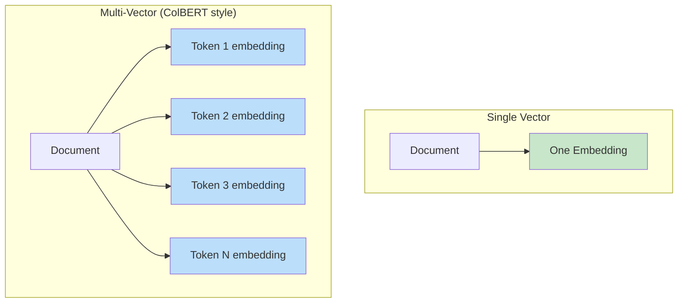
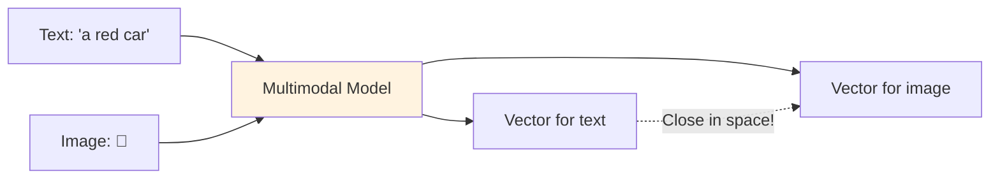
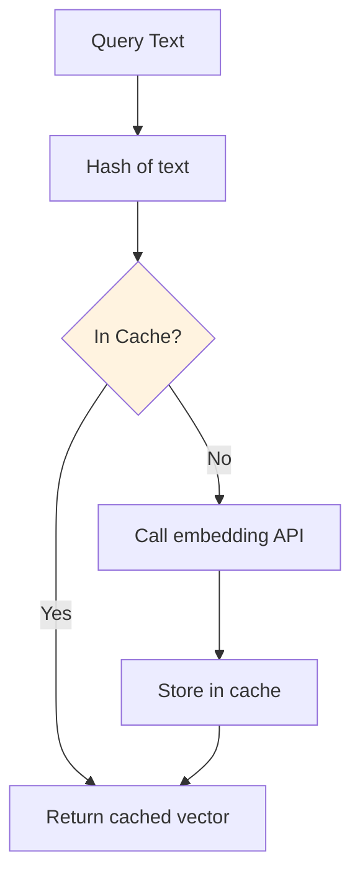

# Embedding Strategies

## Choosing Embedding Dimensions

More dimensions capture more nuance, but cost more in every way:

| Dimensions | Storage (per vector) | Search Speed | Quality | Use Case |
|-----------|---------------------|--------------|---------|----------|
| 256 | 1 KB | Fastest | Good for simple tasks | Mobile, edge |
| 384 | 1.5 KB | Very fast | Good | Prototyping, low-latency |
| 768 | 3 KB | Fast | Very good | General purpose |
| 1024 | 4 KB | Moderate | Excellent | Production search |
| 1536 | 6 KB | Moderate | Excellent | OpenAI default |
| 3072 | 12 KB | Slower | Best | Maximum quality |

**Formula**: Storage = vectors × dimensions × 4 bytes (float32)
- 10M vectors × 1536 dims = **60 GB** just for vectors (before index overhead)

## Single vs Multi-Vector Embeddings

### Single Vector (standard)
One embedding per document. Simple, fast, most common.

### Multi-Vector (advanced)
Multiple embeddings per document — one per paragraph, sentence, or token.



**When to use multi-vector**: When documents are long and queries might match only one section.

## Late Interaction Models (ColBERT)

ColBERT stores per-token embeddings and uses **MaxSim** at query time:

1. Embed query into per-token vectors
2. For each query token, find its max similarity to any document token
3. Sum all MaxSim scores = document relevance

**Pros**: Much better retrieval quality (captures fine-grained matching)
**Cons**: 100-200x more storage per document, more complex infrastructure

## Matryoshka Embeddings (Variable-Length)

Named after Russian nesting dolls. The model is trained so that the first N dimensions are independently useful:

```
Full embedding: [d1, d2, d3, ..., d1536]
               |---- 256 dims ----|  ← still useful!
               |-------- 512 dims --------|  ← better
               |------------- 1536 dims --------------|  ← best
```

**Use case**: Store full vectors, but use truncated versions for fast initial filtering, then re-rank with full vectors.

OpenAI's text-embedding-3 models support this natively.

## Domain-Specific Embeddings

General-purpose models may fail on specialized vocabulary:

| Domain | Problem with general models | Solution |
|--------|---------------------------|----------|
| Medical | "MI" = myocardial infarction, not Michigan | Fine-tune on medical text |
| Legal | "consideration" has a specific legal meaning | Fine-tune on legal corpus |
| Code | Variable names, syntax patterns | Use code-specific models |

**When to fine-tune**:
- General model recall <85% on your domain queries
- Lots of domain-specific jargon
- You have labeled pairs (query, relevant_document)

**When NOT to fine-tune**:
- General model works well enough (>90% recall)
- You lack training data (<1,000 pairs)
- Your domain uses common language

## Multimodal Embeddings

Models like CLIP embed text AND images into the same vector space:



**Use cases**:
- Image search with text queries
- Product matching (description ↔ photo)
- Content moderation across modalities

## Embedding Versioning

### The Problem

You embed 10M documents with model v1. Six months later, model v2 is better. But v1 and v2 vectors are **incompatible** — they live in different spaces.

### Strategies

| Strategy | Effort | Risk | When to use |
|----------|--------|------|-------------|
| Full re-embed | High (cost + time) | Low | Model upgrade worth the improvement |
| Dual-index (run both) | Medium (2x storage) | Low | Gradual migration |
| Never change | Zero | Medium (stuck on old quality) | If current quality is acceptable |
| Incremental re-embed | Medium | Medium (mixed index during migration) | Very large datasets |

### Blue-Green Embedding Migration

```
Day 1: Start embedding all docs with v2 into new collection
Day 3: New collection complete. Run eval queries.
Day 4: Eval passes. Switch traffic to new collection.
Day 5: Delete old collection.
```

## Embedding Caching

Embeddings are deterministic (same input → same output). Cache aggressively.



**Cache layers:**
- L1: In-memory (Redis) for hot queries
- L2: Disk/DB for all previously seen texts

**ROI**: If 30% of queries repeat, caching saves 30% of embedding API costs.

## The "Embedding Drift" Problem

If your embedding model gets updated by the provider (even minor versions), old vectors may become slightly incompatible with new query vectors.

**Mitigations**:
- Pin to specific model versions (e.g., `text-embedding-3-small-20240101`)
- Monitor recall metrics — drift shows up as gradual quality degradation
- Re-embed periodically (quarterly) as maintenance

## Cost Analysis: Embedding at Scale

### OpenAI text-embedding-3-small pricing

| Documents | Avg Tokens/Doc | Total Tokens | Cost |
|-----------|---------------|--------------|------|
| 10,000 | 500 | 5M | $0.10 |
| 100,000 | 500 | 50M | $1.00 |
| 1,000,000 | 500 | 500M | $10.00 |
| 10,000,000 | 500 | 5B | $100.00 |
| 100,000,000 | 500 | 50B | $1,000.00 |

### Self-hosted (sentence-transformers) cost

| Scale | GPU Required | Monthly Cost (cloud) |
|-------|-------------|---------------------|
| <1M docs (one-time) | T4 for a few hours | $5-10 |
| Continuous (1K/min) | T4 always-on | $300-500/mo |
| High throughput (10K/min) | A100 | $2,000-3,000/mo |

**Break-even**: Self-hosting wins at >50M tokens/month (~$1/month with OpenAI). But you also pay for infra, maintenance, and GPU availability.

## Why This Matters for an Architect

1. **Dimension choice is permanent** (per collection) — choose wisely up front
2. **Model migration is the hardest vector DB operation** — design for it from day one
3. **Caching embeddings** is free money — implement it always
4. **Multimodal** opens powerful UX possibilities but doubles complexity
5. **Cost scales linearly** with document count — budget for re-embedding cycles

---

## Staff-Level: Anti-Patterns

### 1. Single Embedding for Entire Document

**Mistake**: Embedding a 10-page document as one vector.

**Why it hurts**: Long text gets averaged into a generic embedding that matches nothing well. A document about "Python performance tuning" and "Python decorators" becomes a vague "Python" embedding that loses both specific topics.

**Fix**: Chunk documents into 200-500 token segments with 50-token overlap. Each chunk gets its own vector. At query time, retrieve chunks, then return parent documents.

### 2. Not Using Metadata for Pre-filtering

**Mistake**: Relying purely on semantic similarity when you have structured data (dates, categories, authors) that could narrow the search space.

**Why it hurts**: Vector search finds semantically similar content across ALL your data. If a user searches within "Q4 2024 reports," you're wasting recall on irrelevant documents from 2022.

**Fix**: Store structured attributes as metadata. Apply filters BEFORE vector search. Design your metadata schema as carefully as you'd design a database schema.

### 3. Ignoring Multilingual Requirements

**Mistake**: Using an English-only model (like all-MiniLM-L6-v2) for a product that serves multiple languages.

**Why it hurts**: English-only models produce garbage embeddings for non-English text. Worse, they might produce plausible-looking vectors that just happen to be semantically wrong.

**Fix**: Use multilingual models from the start (Cohere embed-v4, multilingual-e5-large). They map all languages to the same space — cross-lingual search comes free.

### 4. Same Model for Code and Natural Language

**Mistake**: Using text-embedding-3-small for both documentation and code snippets.

**Why it hurts**: Code has unique semantics (variable names, syntax, indentation) that natural language models poorly capture. `def calculate_total()` and "function to compute the sum" should be close, but general models often miss this.

**Fix**: Use code-specific models for code (CodeBERT, voyage-code-2). If you need both, maintain separate collections with different models and merge results.

---

## Staff-Level: Trade-offs

### Late Chunking vs Pre-Chunking

| Approach | How It Works | Pros | Cons |
|----------|-------------|------|------|
| Pre-chunking (standard) | Split → embed each chunk independently | Simple, parallelizable | Chunks lose document context |
| Late chunking | Embed full doc → split embeddings by position | Chunks retain full document context | Requires compatible model, more compute |
| Contextual chunking | Prepend doc summary to each chunk before embedding | Cheap approximation of late chunking | Slightly more tokens per chunk |

**Staff recommendation**: Start with contextual chunking (prepend title + summary to each chunk). It's 80% of late chunking's benefit at 10% of the complexity.

### Single vs Multi-Vector Per Document

| Approach | Storage | Query Speed | Quality | Best For |
|----------|---------|------------|---------|----------|
| Single vector (doc-level) | 1x | Fastest | Good for short docs | FAQ, tweets, product descriptions |
| Chunk-level vectors | 5-20x | Fast (more candidates) | Best for long docs | Articles, reports, books |
| Token-level (ColBERT) | 100-200x | Slower (MaxSim) | Highest | Research, precision-critical |
| Hybrid (chunk + doc summary) | 6-21x | Fast | Very good | Best general-purpose approach |

---

## Staff-Level: Embedding Strategy Is 70% of RAG Quality

This is the single most important insight for staff engineers building RAG systems:

**The ranking of what impacts RAG output quality:**
1. **Embedding & chunking strategy** (70%) — garbage retrieval = garbage generation
2. **Prompt engineering** (15%) — how you present retrieved context to the LLM
3. **LLM choice** (10%) — GPT-4 vs Claude vs Gemini matters less than retrieval quality
4. **Vector DB tuning** (5%) — index parameters, recall optimization

**What this means in practice:**
- Spend 70% of your optimization time on chunking experiments and embedding model evaluation
- A/B test chunking strategies: size (256 vs 512 tokens), overlap (0 vs 50 vs 100 tokens), boundary strategy (sentence vs paragraph vs semantic)
- Build an evaluation pipeline FIRST: golden queries + expected retrieved docs
- Track retrieval metrics independently from generation metrics (recall@10, MRR, nDCG)

**Staff red flag**: If your team is tuning HNSW parameters or debating vector DB providers before they've settled on their chunking strategy, they're optimizing the wrong layer.

---

## Embedding Refresh and Recomputation Strategies

### When to Re-embed

| Trigger | Action | Risk of NOT doing it |
|---------|--------|---------------------|
| Model upgrade (e.g., v2 → v3) | Full re-embed | Quality regression vs. new docs on new model |
| Chunk strategy change | Full re-embed | Inconsistent retrieval behavior |
| Source document updated | Incremental re-embed affected chunks | Stale answers |
| Drift detected (retrieval quality drops) | Investigate → selective re-embed | Gradual quality degradation |

### Versioning Embeddings in Production

```
Strategy: Blue-green embedding deployments

Collection naming: documents_v2_ada002, documents_v3_embed3small
Alias:            documents_active → points to current version

Migration steps:
1. Create new collection with new model embeddings
2. Backfill in background (batch pipeline, off-peak)
3. Shadow-test: send queries to both, compare recall
4. Swap alias atomically when new collection validates
5. Keep old collection for 7-14 days (rollback window)
6. Delete old collection after confidence period
```

**Staff insight**: Never re-embed in-place. Always create a parallel collection. The swap should be atomic (alias change), and you need the ability to rollback within minutes. Budget 2x storage during migration windows — this is a planned cost, not waste.

**Embedding versioning metadata to store**:
- `embedding_model`: exact model identifier (e.g., `text-embedding-3-small`)
- `embedding_date`: when the embedding was generated
- `chunk_strategy_version`: hash or version of chunking config
- `source_doc_hash`: detect if source changed since embedding

---

*Next: [06 - Multi-Tenant Vector Architecture](./06-multi-tenant-vector-architecture.md)*
