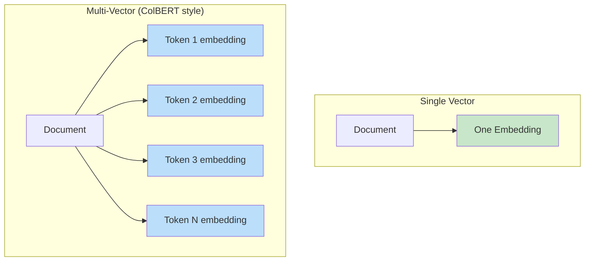
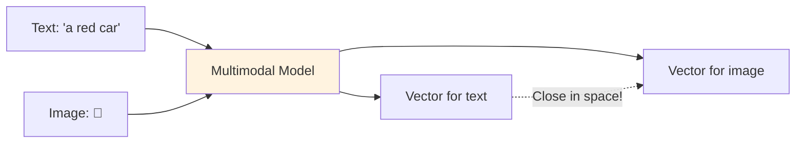
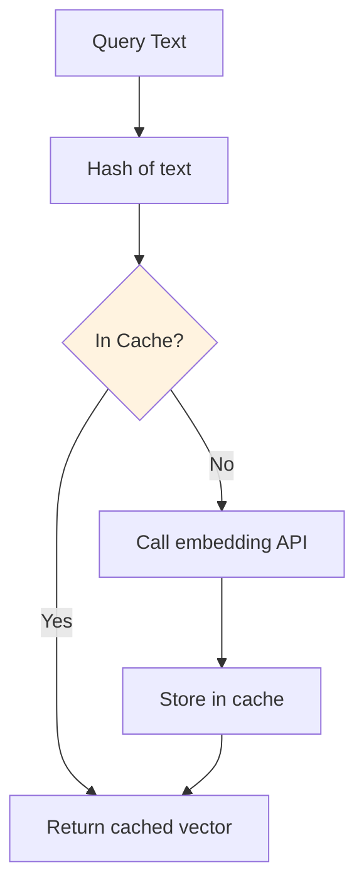

# Embedding Strategies

## Choosing Embedding Dimensions

More dimensions capture more nuance, but cost more in every way:

| Dimensions | Storage (per vector) | Search Speed | Quality | Use Case |
|-----------|---------------------|--------------|---------|----------|
| 256 | 1 KB | Fastest | Good for simple tasks | Mobile, edge |
| 384 | 1.5 KB | Very fast | Good | Prototyping, low-latency |
| 768 | 3 KB | Fast | Very good | General purpose |
| 1024 | 4 KB | Moderate | Excellent | Production search |
| 1536 | 6 KB | Moderate | Excellent | OpenAI default |
| 3072 | 12 KB | Slower | Best | Maximum quality |

**Formula**: Storage = vectors × dimensions × 4 bytes (float32)
- 10M vectors × 1536 dims = **60 GB** just for vectors (before index overhead)

## Single vs Multi-Vector Embeddings

### Single Vector (standard)
One embedding per document. Simple, fast, most common.

### Multi-Vector (advanced)
Multiple embeddings per document — one per paragraph, sentence, or token.



**When to use multi-vector**: When documents are long and queries might match only one section.

## Late Interaction Models (ColBERT)

ColBERT stores per-token embeddings and uses **MaxSim** at query time:

1. Embed query into per-token vectors
2. For each query token, find its max similarity to any document token
3. Sum all MaxSim scores = document relevance

**Pros**: Much better retrieval quality (captures fine-grained matching)
**Cons**: 100-200x more storage per document, more complex infrastructure

## Matryoshka Embeddings (Variable-Length)

Named after Russian nesting dolls. The model is trained so that the first N dimensions are independently useful:

```
Full embedding: [d1, d2, d3, ..., d1536]
               |---- 256 dims ----|  ← still useful!
               |-------- 512 dims --------|  ← better
               |------------- 1536 dims --------------|  ← best
```

**Use case**: Store full vectors, but use truncated versions for fast initial filtering, then re-rank with full vectors.

OpenAI's text-embedding-3 models support this natively.

## Domain-Specific Embeddings

General-purpose models may fail on specialized vocabulary:

| Domain | Problem with general models | Solution |
|--------|---------------------------|----------|
| Medical | "MI" = myocardial infarction, not Michigan | Fine-tune on medical text |
| Legal | "consideration" has a specific legal meaning | Fine-tune on legal corpus |
| Code | Variable names, syntax patterns | Use code-specific models |

**When to fine-tune**:
- General model recall <85% on your domain queries
- Lots of domain-specific jargon
- You have labeled pairs (query, relevant_document)

**When NOT to fine-tune**:
- General model works well enough (>90% recall)
- You lack training data (<1,000 pairs)
- Your domain uses common language

## Multimodal Embeddings

Models like CLIP embed text AND images into the same vector space:



**Use cases**:
- Image search with text queries
- Product matching (description ↔ photo)
- Content moderation across modalities

## Embedding Versioning

### The Problem

You embed 10M documents with model v1. Six months later, model v2 is better. But v1 and v2 vectors are **incompatible** — they live in different spaces.

### Strategies

| Strategy | Effort | Risk | When to use |
|----------|--------|------|-------------|
| Full re-embed | High (cost + time) | Low | Model upgrade worth the improvement |
| Dual-index (run both) | Medium (2x storage) | Low | Gradual migration |
| Never change | Zero | Medium (stuck on old quality) | If current quality is acceptable |
| Incremental re-embed | Medium | Medium (mixed index during migration) | Very large datasets |

### Blue-Green Embedding Migration

```
Day 1: Start embedding all docs with v2 into new collection
Day 3: New collection complete. Run eval queries.
Day 4: Eval passes. Switch traffic to new collection.
Day 5: Delete old collection.
```

## Embedding Caching

Embeddings are deterministic (same input → same output). Cache aggressively.



**Cache layers:**
- L1: In-memory (Redis) for hot queries
- L2: Disk/DB for all previously seen texts

**ROI**: If 30% of queries repeat, caching saves 30% of embedding API costs.

## The "Embedding Drift" Problem

If your embedding model gets updated by the provider (even minor versions), old vectors may become slightly incompatible with new query vectors.

**Mitigations**:
- Pin to specific model versions (e.g., `text-embedding-3-small-20240101`)
- Monitor recall metrics — drift shows up as gradual quality degradation
- Re-embed periodically (quarterly) as maintenance

## Cost Analysis: Embedding at Scale

### OpenAI text-embedding-3-small pricing

| Documents | Avg Tokens/Doc | Total Tokens | Cost |
|-----------|---------------|--------------|------|
| 10,000 | 500 | 5M | $0.10 |
| 100,000 | 500 | 50M | $1.00 |
| 1,000,000 | 500 | 500M | $10.00 |
| 10,000,000 | 500 | 5B | $100.00 |
| 100,000,000 | 500 | 50B | $1,000.00 |

### Self-hosted (sentence-transformers) cost

| Scale | GPU Required | Monthly Cost (cloud) |
|-------|-------------|---------------------|
| <1M docs (one-time) | T4 for a few hours | $5-10 |
| Continuous (1K/min) | T4 always-on | $300-500/mo |
| High throughput (10K/min) | A100 | $2,000-3,000/mo |

**Break-even**: Self-hosting wins at >50M tokens/month (~$1/month with OpenAI). But you also pay for infra, maintenance, and GPU availability.

## Why This Matters for an Architect

1. **Dimension choice is permanent** (per collection) — choose wisely up front
2. **Model migration is the hardest vector DB operation** — design for it from day one
3. **Caching embeddings** is free money — implement it always
4. **Multimodal** opens powerful UX possibilities but doubles complexity
5. **Cost scales linearly** with document count — budget for re-embedding cycles

---

*Next: [06 - Multi-Tenant Vector Architecture](./06-multi-tenant-vector-architecture.md)*
