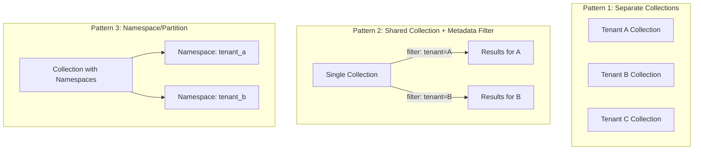
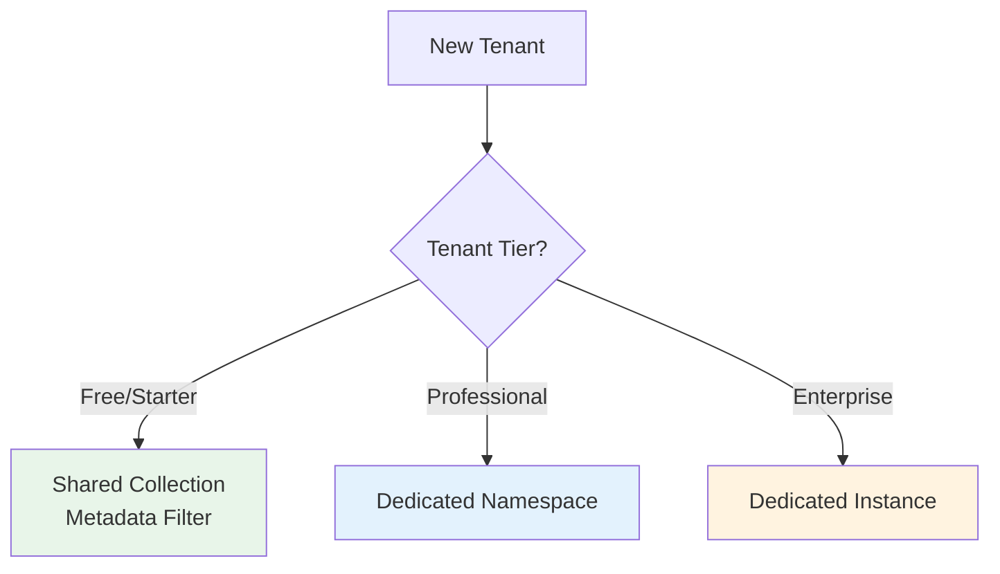

# Multi-Tenant Vector Architecture

## The Multi-Tenancy Challenge

In a SaaS application, multiple customers (tenants) share infrastructure. Each tenant's data must be isolated — Tenant A must **never** see Tenant B's search results.

With traditional databases, this is solved with row-level security or separate schemas. With vector databases, it's more nuanced because the search index itself is shared.

## Five Isolation Patterns



### Pattern 1: Separate Collections Per Tenant

Each tenant gets their own collection with its own index.

| Pros | Cons |
|------|------|
| Perfect isolation | Thousands of collections = operational nightmare |
| Independent scaling | Cannot share index optimizations |
| Easy to delete tenant data | Resource waste for small tenants |
| No filter overhead | Collection limit in some DBs |

**Best for**: <100 tenants, large data per tenant, strict compliance requirements

### Pattern 2: Shared Collection with Metadata Filter

All tenants share one collection. Each vector has a `tenant_id` in metadata. Queries always include a tenant filter.

| Pros | Cons |
|------|------|
| Simple architecture | Filter on every query (slight overhead) |
| Efficient resource use | One bad tenant can impact others |
| Easy to manage | Harder to delete all tenant data |
| Scales to millions of tenants | Must NEVER forget the filter |

**Best for**: Many tenants (>1000), small-medium data per tenant, standard isolation

### Pattern 3: Namespace/Partition-Based Isolation

Some DBs (Pinecone, Milvus) have native namespace support — logical partitions within a collection.

| Pros | Cons |
|------|------|
| Cleaner than metadata filter | Not all DBs support this |
| Native isolation semantics | Limited partition count in some DBs |
| Better performance than filter | Harder to search across tenants |
| Easy tenant deletion | |

**Best for**: When your DB supports it natively (Pinecone namespaces, Milvus partitions)

### Pattern 4: Separate Instances Per Tenant

Each tenant gets a dedicated vector DB instance.

| Pros | Cons |
|------|------|
| Maximum isolation | Extremely expensive |
| Independent scaling | Operational complexity ×N |
| Meet any compliance req | Slow provisioning |
| Zero noisy-neighbor | Wasted resources for small tenants |

**Best for**: Enterprise customers paying premium, regulated industries (healthcare, finance)

### Pattern 5: Hybrid Approach

Combine patterns based on tenant tier:



## Choosing a Pattern

| Factor | Shared + Filter | Namespaces | Separate Collections | Separate Instances |
|--------|----------------|------------|---------------------|-------------------|
| Tenants: 10 | Overkill | Good | ✅ Best | Expensive |
| Tenants: 1,000 | ✅ Best | Good | ⚠️ Hard | Impossible |
| Tenants: 100,000 | ✅ Best | If supported | ❌ No | ❌ No |
| Data per tenant: 1K vectors | ✅ Best | Good | Wasteful | Wasteful |
| Data per tenant: 10M vectors | Works | Good | ✅ Best | Good |
| Compliance: SOC2 | ✅ OK | ✅ OK | ✅ OK | ✅ Best |
| Compliance: Data residency | ❌ Hard | ❌ Hard | ⚠️ Maybe | ✅ Best |

## Permission-Aware Search

Beyond tenant isolation, you may need document-level permissions:

```python
# User can only see documents they have access to
results = collection.query(
    query_vector=query_embedding,
    top_k=10,
    filter={
        "tenant_id": "company_abc",
        "AND": [
            {"access_groups": {"$in": user.groups}},  # user's groups
            {"OR": [
                {"visibility": "public"},
                {"owner_id": user.id}
            ]}
        ]
    }
)
```

**Design considerations**:
- Store ACL info in metadata (access_groups, owner_id, visibility)
- Create payload indexes on permission fields
- Accept that complex permission filters slow queries by 2-5x
- Consider pre-computing "accessible document IDs" and using ID filters

## Performance Implications

| Pattern | Query Latency | Index Efficiency | Memory Overhead |
|---------|--------------|-----------------|-----------------|
| Shared + filter | +20-50% (filter cost) | Best (one large index) | Lowest |
| Namespaces | +5-10% | Good | Low |
| Separate collections | Baseline (no filter) | Worst (many small indexes) | High (per-index overhead) |
| Separate instances | Baseline | Good (dedicated resources) | Highest |

**Key insight**: A single large HNSW index with a metadata filter is often **faster** than many small indexes, because HNSW quality improves with more data.

## Cost Implications

For 1,000 tenants, each with 100K vectors (1536d):

| Pattern | Total Vectors | Storage | Monthly Cost (managed) |
|---------|--------------|---------|----------------------|
| Shared collection | 100M | ~600GB | $500-1,000 |
| 1,000 collections | 100M | ~700GB (+overhead) | $600-1,200 |
| 1,000 instances | 100M | ~1TB (+OS overhead) | $10,000-50,000 |

## Security Considerations

1. **Always filter server-side** — never trust client-provided tenant_id
2. **Defense in depth** — even with namespace isolation, validate at application layer
3. **Audit logging** — log which tenant accessed what
4. **Data deletion** — ensure complete removal (vectors + metadata + backups)
5. **Encryption** — at-rest encryption for all patterns; per-tenant keys for separate instances

## Why This Matters for an Architect

1. **Choose early** — migrating between patterns is expensive (full re-index)
2. **"Metadata filter" is the 80% solution** — start here unless you have strong reasons not to
3. **Never trust the application layer alone** — bugs in filter logic = data leakage
4. **Permission complexity kills performance** — simplify your ACL model for vector search
5. **Hybrid patterns** let you serve all customer tiers without over-engineering

---

## Staff-Level: Anti-Patterns

### 1. Shared Index Without Namespace Isolation

**Mistake**: Using a single HNSW index for all tenants with only application-level filtering (no DB-level enforcement).

**Why it's catastrophic**: A single missing `tenant_id` filter in one API endpoint leaks data across ALL tenants. This is a security incident, not a bug.

**Fix**: Use DB-native isolation (namespaces, partitions) as the primary boundary. Application-level filter is defense-in-depth, not the primary mechanism.

### 2. Tenant Data Leakage via Similarity Search

**Mistake**: Pre-filter is post-filter in disguise. Some DBs compute top-K across ALL vectors first, then filter by tenant. If a tenant has sparse data, results from other tenants may "leak" through the ANN graph traversal.

**Why it happens**: HNSW graph connects vectors from different tenants. Traversal visits cross-tenant vectors even if they're filtered from results. With post-filtering, if your tenant has <K relevant results, you return fewer results — or worse, the DB returns nothing.

**Fix**: Use pre-filtering with partition-aware indexes (Qdrant payload index, Pinecone namespaces). Verify with tests: query as tenant A, ensure NO results from tenant B appear under any condition.

### 3. No Per-Tenant Resource Limits

**Mistake**: One tenant uploads 50M vectors while others have 10K each. The large tenant's data dominates the index, degrading performance for everyone.

**Why it hurts**: Uncontrolled growth causes memory pressure, longer query times, and unfair resource allocation. One whale tenant can DoS your entire system.

**Fix**: Implement per-tenant quotas (max vectors, max QPS, max storage). Monitor and alert on tenants approaching limits. Offer tier upgrades for more capacity.

### 4. One Index for All Tenants (Performance Coupling)

**Mistake**: All tenants in one massive HNSW index. When it's time to rebuild, compact, or migrate, ALL tenants are affected simultaneously.

**Why it hurts**: Maintenance windows impact everyone. One tenant's bulk delete triggers compaction that slows queries for all. Rolling updates are impossible.

**Fix**: For >10K tenants, use sharded architecture where tenants map to shard groups. Maintenance can roll shard-by-shard. Critical tenants get their own shard.

---

## Staff-Level: Isolation Pattern Trade-offs (Deep Dive)

| Dimension | Index-Per-Tenant | Namespace Partitioning | Metadata Filtering |
|-----------|-----------------|----------------------|-------------------|
| **Isolation guarantee** | Physical (strongest) | Logical (strong) | Application-level (weakest) |
| **Cost at 100 tenants** | 100x base cost | 1.2x base cost | 1x base cost |
| **Cost at 10K tenants** | Impossible | 1.5x base cost | 1x base cost |
| **Tenant deletion** | Drop collection (instant) | Delete namespace (fast) | Filter-delete (slow, fragmentation) |
| **Performance isolation** | Perfect | Good (shared compute) | Poor (noisy neighbor) |
| **Cross-tenant analytics** | Expensive (query each) | Possible (remove namespace filter) | Easy |
| **Operational complexity** | Very high | Medium | Low |
| **Compliance/audit** | Easiest to prove isolation | Medium | Hardest (prove filter always applied) |

**Staff decision matrix:**
- Regulated enterprise (healthcare, finance) → Index-per-tenant for top-tier, namespace for standard
- B2B SaaS (100-10K tenants) → Namespace partitioning
- B2C or marketplace (100K+ "tenants") → Metadata filtering with strict middleware enforcement

---

## Staff-Level: How Real Systems Handle Multi-Tenancy

### Pinecone Namespaces
- Each namespace is a logical partition within an index
- Queries are scoped to exactly one namespace (no cross-namespace search)
- Deletion: `delete(namespace="tenant_a", delete_all=True)` — clean, fast
- Limit: No hard limit on namespaces, but each must have vectors to exist
- **Gotcha**: Cannot query across namespaces in one call (need fan-out)

### Qdrant Collections + Payload Filtering
- Recommended pattern: shared collection with `tenant_id` payload field + payload index
- Payload index on `tenant_id` makes filtered search nearly as fast as unfiltered
- Alternative: separate collection per tenant (supported, but operational overhead)
- **Gotcha**: Without payload index on tenant_id, filtering scans linearly — O(n) degradation

### Weaviate Multi-Tenancy (native)
- First-class multi-tenancy: `class.with_tenant("tenant_a")`
- Tenants can be individually activated/deactivated (cold storage)
- Each tenant gets isolated shard — no cross-tenant graph connections
- **Best of both worlds**: isolation of separate collections + operational simplicity of shared infrastructure

### Milvus Partitions
- Partitions within a collection (logical grouping)
- Query can target specific partition: `search(partition_names=["tenant_a"])`
- Limit: 1024 partitions per collection (for >1K tenants, need partition key strategy)
- **Gotcha**: Partition key approach (hash-based) doesn't guarantee tenant isolation

---

## Cost Isolation Strategies

### Per-Tenant Cost Attribution

```
Challenge: In shared infrastructure, how do you bill/attribute costs per tenant?

Approach 1 — Metered queries:
  Track: queries_per_tenant, vectors_stored_per_tenant
  Bill:  (query_count × cost_per_query) + (vector_count × cost_per_vector_month)

Approach 2 — Resource-weighted allocation:
  Track: CPU-seconds consumed, memory-hours, storage bytes
  Bill:  proportional share of infrastructure cost

Approach 3 — Tiered isolation pricing:
  Shared partition: $0.01/1K queries (noisy neighbor risk)
  Dedicated namespace: $0.05/1K queries (logical isolation)
  Dedicated cluster: $500/month base (full isolation)
```

### Noisy Neighbor Mitigation

| Problem | Solution | Trade-off |
|---------|----------|-----------|
| One tenant's bulk ingestion slows queries | Rate limit ingestion per tenant; separate ingest/query paths | Ingest latency for heavy tenants |
| Large tenant's index rebuild affects all | Schedule rebuilds per-partition; use incremental indexes (HNSW) | Complexity |
| Query hot-spot (one tenant 80% of traffic) | Auto-detect hot tenants → migrate to dedicated shard | Operational overhead |
| Memory pressure from uneven vector counts | Shard by vector count, not tenant count | Rebalancing needed |

**Staff pattern — Adaptive isolation**:
```
Monitor: p99_latency per tenant, query_rate per tenant
If tenant.p99 > SLA_threshold for 5min:
  → Check if caused by co-located tenant activity
  → If yes: auto-migrate to less-loaded shard (or dedicated)
  → Alert platform team for capacity review
```

### Tenant Migration Patterns

**When tenants outgrow their tier**:
1. **Shard split**: Tenant grows beyond partition limits → migrate to dedicated namespace
2. **Cluster promotion**: Tenant needs SLA guarantees → provision dedicated cluster, copy vectors, swap routing
3. **Region migration**: Tenant needs data residency → replicate to target region, validate, cut over

**Zero-downtime migration steps**:
1. Provision target (new shard/cluster/region)
2. Enable dual-write: new vectors go to both old and new
3. Backfill historical vectors to new target
4. Shadow-read: query both, validate consistency
5. Swap read path to new target
6. Stop writes to old, drain, decommission

---

*Next: [07 - Scaling Vector Databases](./07-scaling-vector-databases.md)*
