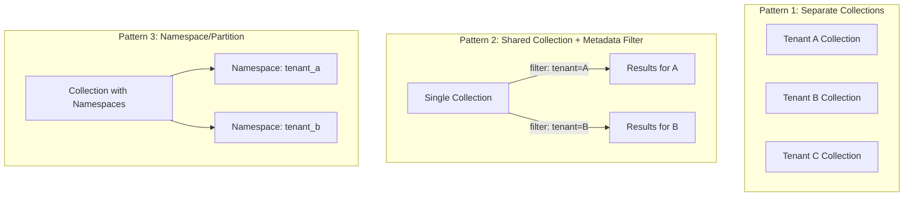
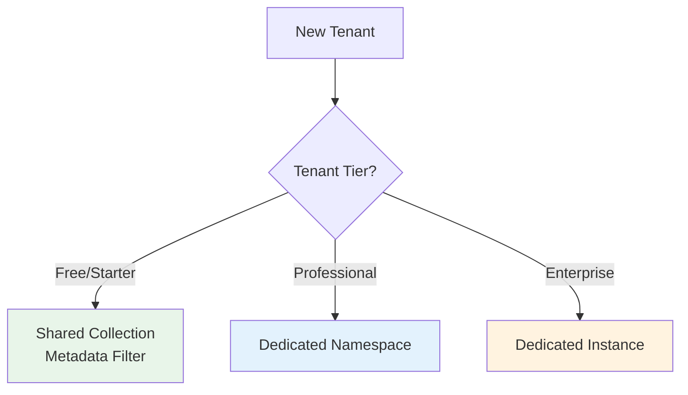

# Multi-Tenant Vector Architecture

## The Multi-Tenancy Challenge

In a SaaS application, multiple customers (tenants) share infrastructure. Each tenant's data must be isolated — Tenant A must **never** see Tenant B's search results.

With traditional databases, this is solved with row-level security or separate schemas. With vector databases, it's more nuanced because the search index itself is shared.

## Five Isolation Patterns



### Pattern 1: Separate Collections Per Tenant

Each tenant gets their own collection with its own index.

| Pros | Cons |
|------|------|
| Perfect isolation | Thousands of collections = operational nightmare |
| Independent scaling | Cannot share index optimizations |
| Easy to delete tenant data | Resource waste for small tenants |
| No filter overhead | Collection limit in some DBs |

**Best for**: <100 tenants, large data per tenant, strict compliance requirements

### Pattern 2: Shared Collection with Metadata Filter

All tenants share one collection. Each vector has a `tenant_id` in metadata. Queries always include a tenant filter.

| Pros | Cons |
|------|------|
| Simple architecture | Filter on every query (slight overhead) |
| Efficient resource use | One bad tenant can impact others |
| Easy to manage | Harder to delete all tenant data |
| Scales to millions of tenants | Must NEVER forget the filter |

**Best for**: Many tenants (>1000), small-medium data per tenant, standard isolation

### Pattern 3: Namespace/Partition-Based Isolation

Some DBs (Pinecone, Milvus) have native namespace support — logical partitions within a collection.

| Pros | Cons |
|------|------|
| Cleaner than metadata filter | Not all DBs support this |
| Native isolation semantics | Limited partition count in some DBs |
| Better performance than filter | Harder to search across tenants |
| Easy tenant deletion | |

**Best for**: When your DB supports it natively (Pinecone namespaces, Milvus partitions)

### Pattern 4: Separate Instances Per Tenant

Each tenant gets a dedicated vector DB instance.

| Pros | Cons |
|------|------|
| Maximum isolation | Extremely expensive |
| Independent scaling | Operational complexity ×N |
| Meet any compliance req | Slow provisioning |
| Zero noisy-neighbor | Wasted resources for small tenants |

**Best for**: Enterprise customers paying premium, regulated industries (healthcare, finance)

### Pattern 5: Hybrid Approach

Combine patterns based on tenant tier:



## Choosing a Pattern

| Factor | Shared + Filter | Namespaces | Separate Collections | Separate Instances |
|--------|----------------|------------|---------------------|-------------------|
| Tenants: 10 | Overkill | Good | ✅ Best | Expensive |
| Tenants: 1,000 | ✅ Best | Good | ⚠️ Hard | Impossible |
| Tenants: 100,000 | ✅ Best | If supported | ❌ No | ❌ No |
| Data per tenant: 1K vectors | ✅ Best | Good | Wasteful | Wasteful |
| Data per tenant: 10M vectors | Works | Good | ✅ Best | Good |
| Compliance: SOC2 | ✅ OK | ✅ OK | ✅ OK | ✅ Best |
| Compliance: Data residency | ❌ Hard | ❌ Hard | ⚠️ Maybe | ✅ Best |

## Permission-Aware Search

Beyond tenant isolation, you may need document-level permissions:

```python
# User can only see documents they have access to
results = collection.query(
    query_vector=query_embedding,
    top_k=10,
    filter={
        "tenant_id": "company_abc",
        "AND": [
            {"access_groups": {"$in": user.groups}},  # user's groups
            {"OR": [
                {"visibility": "public"},
                {"owner_id": user.id}
            ]}
        ]
    }
)
```

**Design considerations**:
- Store ACL info in metadata (access_groups, owner_id, visibility)
- Create payload indexes on permission fields
- Accept that complex permission filters slow queries by 2-5x
- Consider pre-computing "accessible document IDs" and using ID filters

## Performance Implications

| Pattern | Query Latency | Index Efficiency | Memory Overhead |
|---------|--------------|-----------------|-----------------|
| Shared + filter | +20-50% (filter cost) | Best (one large index) | Lowest |
| Namespaces | +5-10% | Good | Low |
| Separate collections | Baseline (no filter) | Worst (many small indexes) | High (per-index overhead) |
| Separate instances | Baseline | Good (dedicated resources) | Highest |

**Key insight**: A single large HNSW index with a metadata filter is often **faster** than many small indexes, because HNSW quality improves with more data.

## Cost Implications

For 1,000 tenants, each with 100K vectors (1536d):

| Pattern | Total Vectors | Storage | Monthly Cost (managed) |
|---------|--------------|---------|----------------------|
| Shared collection | 100M | ~600GB | $500-1,000 |
| 1,000 collections | 100M | ~700GB (+overhead) | $600-1,200 |
| 1,000 instances | 100M | ~1TB (+OS overhead) | $10,000-50,000 |

## Security Considerations

1. **Always filter server-side** — never trust client-provided tenant_id
2. **Defense in depth** — even with namespace isolation, validate at application layer
3. **Audit logging** — log which tenant accessed what
4. **Data deletion** — ensure complete removal (vectors + metadata + backups)
5. **Encryption** — at-rest encryption for all patterns; per-tenant keys for separate instances

## Why This Matters for an Architect

1. **Choose early** — migrating between patterns is expensive (full re-index)
2. **"Metadata filter" is the 80% solution** — start here unless you have strong reasons not to
3. **Never trust the application layer alone** — bugs in filter logic = data leakage
4. **Permission complexity kills performance** — simplify your ACL model for vector search
5. **Hybrid patterns** let you serve all customer tiers without over-engineering

---

*Next: [07 - Scaling Vector Databases](./07-scaling-vector-databases.md)*
