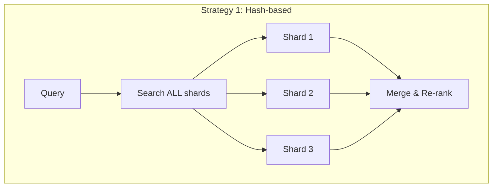
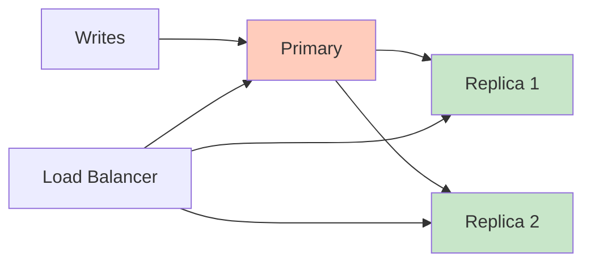

# Scaling Vector Databases

## The Scaling Challenge

Vector databases have a unique scaling problem: **HNSW indexes must fit in RAM** for optimal performance. Unlike traditional databases where you can rely on disk I/O with B-tree indexes, vector search is memory-bound.

```
100M vectors × 1536 dims × 4 bytes = 600 GB of vectors alone
+ HNSW graph overhead (~1.5x) = ~900 GB total RAM needed
```

This is why scaling vector databases requires different strategies than traditional databases.

## Sharding Strategies



| Strategy | How it works | Pros | Cons |
|----------|-------------|------|------|
| Hash-based | Vectors distributed by ID hash | Even distribution | Must query ALL shards |
| Metadata-based | Shard by category/tenant | Skip irrelevant shards | Uneven distribution |
| Vector-space partitioning | Cluster vectors, assign clusters to shards | Query only relevant shards | Complex rebalancing |

**Key insight**: Unlike SQL databases where you can route a query to one shard by key, vector search often requires querying ALL shards and merging results (because similar vectors might be on any shard).

## Replication for High Availability



- **Replication factor 3** is standard for production
- Replicas serve read queries (search)
- Primary handles writes (upserts)
- Eventual consistency: new vectors visible on replicas after 100ms-few seconds

## The HNSW Memory Problem

HNSW requires the full graph in RAM for fast traversal. Solutions:

### 1. Quantization (reduce vector size)

| Method | Compression | RAM Savings | Quality Loss |
|--------|------------|-------------|--------------|
| Scalar (float32→int8) | 4x | 75% | ~1% |
| Product Quantization | 8-32x | 87-97% | 3-10% |
| Binary Quantization | 32x | 97% | 10-20% |

### 2. DiskANN (Microsoft)

Stores the graph on SSD instead of RAM. Uses clever caching + PQ to minimize disk reads.

- **Latency**: 5-10ms (vs 1-3ms for in-memory HNSW)
- **Cost**: 10-50x cheaper than RAM-based at scale
- **Requirement**: Fast NVMe SSD

### 3. Tiered Storage

```
Hot tier (RAM):     Most queried vectors
Warm tier (SSD):    Less frequent vectors  
Cold tier (Object): Archived, rarely searched
```

## Geographic Distribution

For global applications with latency requirements:

| Pattern | Latency | Consistency | Complexity | Cost |
|---------|---------|-------------|-----------|------|
| Single region + CDN | High for distant users | Strong | Low | Low |
| Read replicas per region | Low reads, high writes | Eventual | Medium | Medium |
| Multi-region active-active | Low | Eventual/Conflict resolution | High | High |

**Practical approach**: Most vector search workloads are read-heavy (1000:1 read:write). Deploy read replicas in user regions, write to a single primary.

## Capacity Planning Formulas

### Memory Estimation

```
RAM = num_vectors × (dims × bytes_per_dim + overhead_per_vector)

Where:
- bytes_per_dim = 4 (float32), 2 (float16), 1 (int8)
- overhead_per_vector ≈ 200-500 bytes (ID, metadata pointers, graph links)
- HNSW graph overhead ≈ num_vectors × M × 2 × 8 bytes (M=16 → 256 bytes/vector)
```

**Quick formula (HNSW, float32, M=16):**
```
RAM (GB) ≈ num_vectors × (dims × 4 + 500) / 1,000,000,000
```

Examples:
- 1M × 1536d = **6.7 GB**
- 10M × 1536d = **67 GB**
- 100M × 1536d = **670 GB**
- 1B × 1536d = **6.7 TB** (need sharding or quantization)

### QPS Estimation

Single node (modern hardware, HNSW, ef_search=100):
- 1M vectors: ~2,000-5,000 QPS
- 10M vectors: ~500-1,000 QPS
- 100M vectors: ~100-300 QPS (with quantization)

Scale linearly with read replicas.

## When You Need Millions vs Billions

| Scale | Infrastructure | Approach |
|-------|---------------|----------|
| <1M vectors | Single node, 8-16GB RAM | Simple. Any vector DB. |
| 1-10M | Single node, 32-128GB RAM | Still manageable on one machine. |
| 10-100M | Cluster (3-5 nodes) | Sharding + replication. Consider quantization. |
| 100M-1B | Large cluster (10+ nodes) | Quantization required. DiskANN or tiered storage. |
| >1B | Distributed system | Milvus/Pinecone territory. Custom sharding. |

## Cost at Scale (Monthly Estimates)

| Vectors | Managed (Pinecone) | Self-hosted (AWS) | Key Assumption |
|---------|--------------------|--------------------|----------------|
| 1M | $70 | $100-200 | Single node |
| 10M | $200-400 | $300-600 | Single large node |
| 100M | $1,000-3,000 | $1,500-3,000 | 3-5 node cluster |
| 1B | $10,000-30,000 | $5,000-15,000 | Large cluster + quantization |

**Self-hosted is cheaper at scale but requires expertise**. Factor in engineering time.

## Monitoring and Alerting

### Critical Metrics

| Metric | Why | Alert Threshold |
|--------|-----|-----------------|
| Memory utilization | HNSW is RAM-bound | >85% |
| Query latency p99 | User experience | >200ms |
| Recall@10 (sampled) | Search quality degrading | <92% |
| Segment count | Too many = slow compaction | >50 |
| Write queue depth | Ingestion falling behind | >10,000 |
| Disk usage | Snapshots, WAL growth | >80% |

### Alerting Rules

```yaml
# Example alerting configuration
alerts:
  - name: high_latency
    condition: p99_latency > 200ms for 5min
    severity: warning
    
  - name: memory_critical
    condition: memory_usage > 90%
    severity: critical
    action: scale_up_or_evict
    
  - name: recall_degradation
    condition: sampled_recall < 0.92
    severity: warning
    action: investigate_index_health
```

## Why This Matters for an Architect

1. **RAM is your primary cost driver** — optimize with quantization before adding nodes
2. **Plan for 10x your current scale** — vector DB migrations are painful
3. **DiskANN is a game-changer** — if 5-10ms latency is acceptable, you save 10x on infra
4. **Sharding means querying all shards** — it's not free like SQL partitioning
5. **Monitoring recall** is unique and critical — you must proactively catch quality degradation

---

## Staff-Level: Anti-Patterns

### 1. Vertical Scaling Only (Hit the Memory Wall)

**Mistake**: "Just get a bigger instance" — going from 64GB → 128GB → 256GB → 512GB RAM.

**Why it fails**: RAM instances above 256GB are exponentially expensive and have diminishing availability. You'll hit a wall at ~500M vectors on a single node regardless of instance size. Plus: single point of failure.

**Fix**: Design for horizontal scaling from the start. Shard at 50M vectors per node (with quantization). The jump from 1 node to 3 is painful if you didn't plan for it.

### 2. No Read Replicas for Search-Heavy Workloads

**Mistake**: Running search and indexing on the same node. During bulk ingestion, search latency spikes 5-10x.

**Why it hurts**: HNSW graph updates compete with graph traversal for CPU and memory bandwidth. Write locks (even brief ones) cause read latency tail spikes.

**Fix**: Separate write path (primary) from read path (replicas). Replication factor 3 minimum for production. This also gives you HA for free.

### 3. Ignoring Compaction Scheduling

**Mistake**: Never triggering compaction or scheduling it during peak hours.

**Why it hurts**: After many deletes/updates, the HNSW graph has "tombstones" — dead nodes still consuming memory and slowing traversal. Segments proliferate, each requiring separate search.

**Fix**: Schedule compaction during lowest-traffic window (typically 2-5 AM). Monitor segment count. Trigger compaction when segments > 20 or after >20% deletes.

### 4. Not Planning for Re-indexing Needs

**Mistake**: No strategy for the inevitable: model upgrade, parameter change, or dimensionality change that requires full re-index.

**Why it's critical**: Re-indexing 500M vectors takes 12-48 hours. Without a plan, you're choosing between extended downtime or extended degraded quality.

**Fix**: Always maintain blue-green capability. Budget for 2x storage during migrations. Automate the re-index → validate → switch → cleanup pipeline.

---

## Staff-Level: Trade-offs

### Shard Count vs Query Latency

| Shards | Query Fanout | Added Latency (p50) | Added Latency (p99) | When to Use |
|--------|-------------|--------------------|--------------------|-------------|
| 1 | None | Baseline | Baseline | <50M vectors |
| 3 | 3-way scatter-gather | +2-3ms | +5-10ms | 50-150M vectors |
| 10 | 10-way scatter-gather | +5-8ms | +15-30ms | 150-500M vectors |
| 30+ | 30-way scatter-gather | +10-15ms | +50-100ms | 500M-1B vectors |

**Key insight**: Each shard adds p99 tail latency because you wait for the SLOWEST shard. More shards = more probability of one slow response. Mitigate with: hedged requests, shard-level timeouts, adaptive routing.

### Memory vs Disk Indexes

| Approach | Latency (p50) | Cost per 100M vectors | Recall | Best For |
|----------|--------------|----------------------|--------|----------|
| HNSW in RAM (float32) | 1-3ms | $3,000-5,000/mo | 99%+ | Latency-critical, <100M |
| HNSW in RAM (int8) | 2-4ms | $800-1,500/mo | 97-99% | Best price/performance |
| DiskANN (SSD) | 5-10ms | $300-600/mo | 95-99% | Cost-sensitive, >100M |
| IVF-PQ in RAM | 10-30ms | $200-400/mo | 85-95% | Billion-scale, batch OK |

### Recall vs Throughput

| Configuration | Recall@10 | QPS (single node, 10M vectors) | Use Case |
|---------------|-----------|-------------------------------|----------|
| ef_search=50 | 92% | 3,000 QPS | High-throughput, approximate OK |
| ef_search=100 | 96% | 1,500 QPS | Balanced (most production) |
| ef_search=200 | 99% | 700 QPS | Quality-critical (RAG, legal) |
| ef_search=500 | 99.5% | 250 QPS | Near-exact (compliance, audit) |

---

## Staff-Level: Real Numbers at Scale

### 100M Vectors (1536d, HNSW, M=16)

| Metric | Without Quantization | With Scalar Quantization (int8) | With PQ (64 bytes) |
|--------|---------------------|-------------------------------|-------------------|
| RAM required | ~670 GB | ~190 GB | ~35 GB |
| Nodes needed (128GB/node) | 6 nodes | 2 nodes | 1 node |
| Monthly infra cost | $8,000-12,000 | $2,500-4,000 | $800-1,500 |
| Query latency (p50) | 2ms | 3ms | 15ms (+ re-rank) |
| Recall@10 | 99% | 97% | 90% (before re-rank) |
| Build time | 8-12 hours | 6-8 hours | 4-6 hours |

### 500M Vectors (1536d)

| Approach | Nodes | RAM Total | Monthly Cost | p50 Latency | Recall |
|----------|-------|-----------|-------------|-------------|--------|
| HNSW + SQ (int8) | 8-10 | ~950 GB | $12,000-18,000 | 5ms | 97% |
| DiskANN (NVMe) | 3-5 | ~200 GB + 3TB SSD | $4,000-7,000 | 8ms | 96% |
| HNSW + PQ + re-rank | 3-4 | ~180 GB | $4,000-6,000 | 20ms | 97% (after re-rank) |

### 1B Vectors (1536d)

| Approach | Nodes | Monthly Cost | p50 Latency | Notes |
|----------|-------|-------------|-------------|-------|
| Sharded HNSW + SQ | 15-20 | $25,000-40,000 | 8-12ms | Best latency, highest cost |
| DiskANN cluster | 5-8 | $8,000-15,000 | 10-15ms | Best cost/performance |
| IVF-PQ (Milvus/Zilliz) | 5-8 | $6,000-12,000 | 25-40ms | Cheapest, acceptable for batch |
| Pinecone (managed) | N/A | $30,000-60,000 | 5-10ms | Zero ops, premium pricing |

**Staff insight**: At 1B vectors, the choice is architectural, not just parametric. You're designing a distributed system, not configuring a database. Plan for: rolling upgrades, partial re-indexing, graceful degradation, and capacity headroom (always keep 30% spare).

---

## Scaling Readiness Checklist

Before scaling your vector database, confirm:

- [ ] **Metrics baseline**: p50/p95/p99 latency, QPS, recall@10 measured under current load
- [ ] **Capacity model**: know your vectors/month growth rate and when you'll hit limits
- [ ] **Index rebuild plan**: can you rebuild indexes without downtime? Tested?
- [ ] **Backup/restore**: tested recovery time for your data volume
- [ ] **Monitoring**: alerts on memory usage >70%, query latency degradation, index staleness
- [ ] **Horizontal scaling tested**: verified shard rebalancing works under load
- [ ] **Cost projection**: 6-month forward cost modeled at current growth rate

---

*Back to: [01 - What Are Embeddings](./01-what-are-embeddings.md)*
