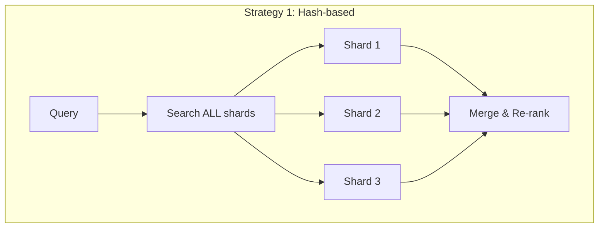
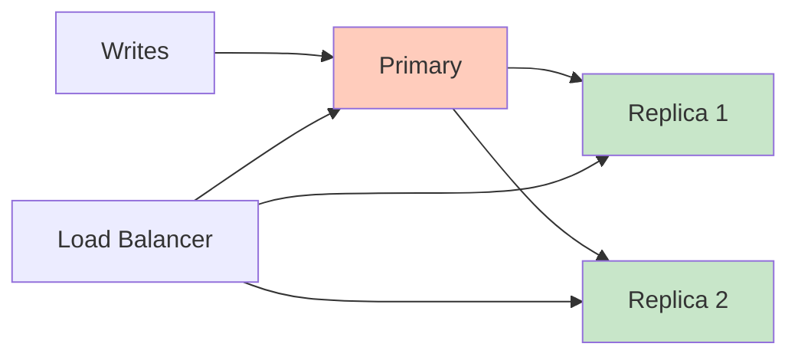

# Scaling Vector Databases

## The Scaling Challenge

Vector databases have a unique scaling problem: **HNSW indexes must fit in RAM** for optimal performance. Unlike traditional databases where you can rely on disk I/O with B-tree indexes, vector search is memory-bound.

```
100M vectors × 1536 dims × 4 bytes = 600 GB of vectors alone
+ HNSW graph overhead (~1.5x) = ~900 GB total RAM needed
```

This is why scaling vector databases requires different strategies than traditional databases.

## Sharding Strategies



| Strategy | How it works | Pros | Cons |
|----------|-------------|------|------|
| Hash-based | Vectors distributed by ID hash | Even distribution | Must query ALL shards |
| Metadata-based | Shard by category/tenant | Skip irrelevant shards | Uneven distribution |
| Vector-space partitioning | Cluster vectors, assign clusters to shards | Query only relevant shards | Complex rebalancing |

**Key insight**: Unlike SQL databases where you can route a query to one shard by key, vector search often requires querying ALL shards and merging results (because similar vectors might be on any shard).

## Replication for High Availability



- **Replication factor 3** is standard for production
- Replicas serve read queries (search)
- Primary handles writes (upserts)
- Eventual consistency: new vectors visible on replicas after 100ms-few seconds

## The HNSW Memory Problem

HNSW requires the full graph in RAM for fast traversal. Solutions:

### 1. Quantization (reduce vector size)

| Method | Compression | RAM Savings | Quality Loss |
|--------|------------|-------------|--------------|
| Scalar (float32→int8) | 4x | 75% | ~1% |
| Product Quantization | 8-32x | 87-97% | 3-10% |
| Binary Quantization | 32x | 97% | 10-20% |

### 2. DiskANN (Microsoft)

Stores the graph on SSD instead of RAM. Uses clever caching + PQ to minimize disk reads.

- **Latency**: 5-10ms (vs 1-3ms for in-memory HNSW)
- **Cost**: 10-50x cheaper than RAM-based at scale
- **Requirement**: Fast NVMe SSD

### 3. Tiered Storage

```
Hot tier (RAM):     Most queried vectors
Warm tier (SSD):    Less frequent vectors  
Cold tier (Object): Archived, rarely searched
```

## Geographic Distribution

For global applications with latency requirements:

| Pattern | Latency | Consistency | Complexity | Cost |
|---------|---------|-------------|-----------|------|
| Single region + CDN | High for distant users | Strong | Low | Low |
| Read replicas per region | Low reads, high writes | Eventual | Medium | Medium |
| Multi-region active-active | Low | Eventual/Conflict resolution | High | High |

**Practical approach**: Most vector search workloads are read-heavy (1000:1 read:write). Deploy read replicas in user regions, write to a single primary.

## Capacity Planning Formulas

### Memory Estimation

```
RAM = num_vectors × (dims × bytes_per_dim + overhead_per_vector)

Where:
- bytes_per_dim = 4 (float32), 2 (float16), 1 (int8)
- overhead_per_vector ≈ 200-500 bytes (ID, metadata pointers, graph links)
- HNSW graph overhead ≈ num_vectors × M × 2 × 8 bytes (M=16 → 256 bytes/vector)
```

**Quick formula (HNSW, float32, M=16):**
```
RAM (GB) ≈ num_vectors × (dims × 4 + 500) / 1,000,000,000
```

Examples:
- 1M × 1536d = **6.7 GB**
- 10M × 1536d = **67 GB**
- 100M × 1536d = **670 GB**
- 1B × 1536d = **6.7 TB** (need sharding or quantization)

### QPS Estimation

Single node (modern hardware, HNSW, ef_search=100):
- 1M vectors: ~2,000-5,000 QPS
- 10M vectors: ~500-1,000 QPS
- 100M vectors: ~100-300 QPS (with quantization)

Scale linearly with read replicas.

## When You Need Millions vs Billions

| Scale | Infrastructure | Approach |
|-------|---------------|----------|
| <1M vectors | Single node, 8-16GB RAM | Simple. Any vector DB. |
| 1-10M | Single node, 32-128GB RAM | Still manageable on one machine. |
| 10-100M | Cluster (3-5 nodes) | Sharding + replication. Consider quantization. |
| 100M-1B | Large cluster (10+ nodes) | Quantization required. DiskANN or tiered storage. |
| >1B | Distributed system | Milvus/Pinecone territory. Custom sharding. |

## Cost at Scale (Monthly Estimates)

| Vectors | Managed (Pinecone) | Self-hosted (AWS) | Key Assumption |
|---------|--------------------|--------------------|----------------|
| 1M | $70 | $100-200 | Single node |
| 10M | $200-400 | $300-600 | Single large node |
| 100M | $1,000-3,000 | $1,500-3,000 | 3-5 node cluster |
| 1B | $10,000-30,000 | $5,000-15,000 | Large cluster + quantization |

**Self-hosted is cheaper at scale but requires expertise**. Factor in engineering time.

## Monitoring and Alerting

### Critical Metrics

| Metric | Why | Alert Threshold |
|--------|-----|-----------------|
| Memory utilization | HNSW is RAM-bound | >85% |
| Query latency p99 | User experience | >200ms |
| Recall@10 (sampled) | Search quality degrading | <92% |
| Segment count | Too many = slow compaction | >50 |
| Write queue depth | Ingestion falling behind | >10,000 |
| Disk usage | Snapshots, WAL growth | >80% |

### Alerting Rules

```yaml
# Example alerting configuration
alerts:
  - name: high_latency
    condition: p99_latency > 200ms for 5min
    severity: warning
    
  - name: memory_critical
    condition: memory_usage > 90%
    severity: critical
    action: scale_up_or_evict
    
  - name: recall_degradation
    condition: sampled_recall < 0.92
    severity: warning
    action: investigate_index_health
```

## Why This Matters for an Architect

1. **RAM is your primary cost driver** — optimize with quantization before adding nodes
2. **Plan for 10x your current scale** — vector DB migrations are painful
3. **DiskANN is a game-changer** — if 5-10ms latency is acceptable, you save 10x on infra
4. **Sharding means querying all shards** — it's not free like SQL partitioning
5. **Monitoring recall** is unique and critical — you must proactively catch quality degradation

---

*Back to: [01 - What Are Embeddings](./01-what-are-embeddings.md)*
