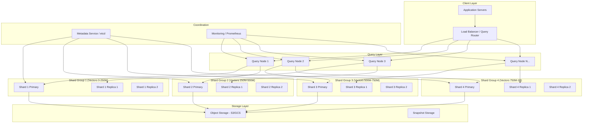

# Petabyte-Scale Vector Database Operations

## Overview

Operating vector databases at petabyte scale—billions of vectors—introduces challenges that don't exist at smaller scales. This document covers the architecture, operational practices, and performance tuning required when your vector database holds 1B+ vectors.

---

## Scale Characteristics

### The Math of Billions

```
1 billion vectors × 1536 dimensions × 4 bytes (float32) = ~5.7 TB raw vector data

With HNSW index overhead (~1.5x):
  Index size ≈ 8.5 TB

With metadata (avg 500 bytes/vector):
  Metadata ≈ 500 GB

Total storage requirement: ~9-10 TB for 1B vectors at 1536 dims
```

### Scale Tiers

| Tier | Vectors | Raw Data | Typical Infra |
|------|---------|----------|---------------|
| Small | <10M | <60 GB | Single node, all in RAM |
| Medium | 10M-100M | 60-600 GB | Single large node or small cluster |
| Large | 100M-1B | 600 GB-6 TB | Multi-node cluster |
| Petabyte | 1B-10B | 6-60 TB | Large distributed cluster |

### When You Cross the Threshold

Problems that emerge at billion-scale:
- **Single-node impossible**: No single machine has 10TB of RAM
- **Index build time**: Hours to days for full rebuild
- **Query routing**: Must determine which shards to search
- **Consistency**: Updates must propagate across replicas
- **Cost**: $50K-$500K/month in infrastructure

---

## Cluster Architecture for Billion-Scale



### Architecture Components

| Component | Role | Scaling Strategy |
|-----------|------|-----------------|
| Query Router | Routes queries to appropriate shards | Horizontal, stateless |
| Query Nodes | Execute searches, merge results | Scale with QPS |
| Shard Primaries | Hold authoritative data, accept writes | Scale with data volume |
| Shard Replicas | Serve reads, provide HA | Scale with read QPS |
| Metadata Service | Track shard locations, cluster state | 3-5 node consensus |
| Object Storage | Durable storage for snapshots | Unlimited |

### Sharding Strategies

**Hash-based sharding:**
```
shard_id = hash(vector_id) % num_shards
- Pro: Even distribution
- Con: Must query ALL shards (no routing optimization)
```

**Range-based sharding:**
```
shard_id = determined by vector_id range
- Pro: Can do range queries efficiently
- Con: Hot spots possible
```

**Semantic sharding (advanced):**
```
shard_id = cluster_assignment(vector)
- Pro: Similar vectors on same shard, fewer shards to query
- Con: Complex assignment, rebalancing is expensive
```

---

## Operational Challenges at Scale

### Index Build Time

Building an HNSW index over 1B vectors:

```
Typical build rates:
- HNSW (M=16, efConstruction=200): ~5,000-10,000 vectors/sec per core
- 1B vectors / 10,000 per sec = 100,000 seconds ≈ 28 hours (single core)
- With 32 cores parallel: ~1-2 hours per shard (if sharded to 250M each)

IVF index build:
- Training phase: Sample 1M vectors, train 65,536 centroids (~30 min)
- Assignment phase: Assign 1B vectors to clusters (~2-4 hours)
- Total: ~3-5 hours
```

**Implications:**
- Cannot rebuild indexes on the fly
- Must plan maintenance windows or use rolling rebuilds
- Incremental index updates are essential

### Memory Requirements

**HNSW in RAM (fastest, most expensive):**
```
Vector data: 1B × 1536 × 4 bytes = 5.7 TB
Graph links: 1B × M × 2 × 8 bytes (M=16) = 256 GB
Total: ~6 TB RAM needed

At $6/GB/month (cloud RAM pricing):
  Monthly cost: ~$36,000 just for RAM
```

**IVF + quantization (balanced):**
```
Centroids in RAM: 65,536 × 1536 × 4 = 384 MB
Quantized vectors (PQ64): 1B × 64 bytes = 64 GB
Full vectors on SSD for re-ranking: 5.7 TB SSD

RAM needed: ~65 GB (much more affordable)
```

### Disk-Based Indexes

When RAM isn't enough, disk-based approaches become necessary:

**DiskANN (Microsoft):**
```
- Stores graph on SSD, small footprint in RAM
- RAM: compressed vectors for distance computation (~100GB for 1B vectors)
- SSD: full graph structure
- Performance: 5-10ms latency at 95%+ recall
- Used by: Microsoft Bing, Azure Cognitive Search
```

**SPANN (Space-Partition ANN):**
```
- Hierarchical partitioning with posting lists on disk
- RAM: partition centroids and navigation structure
- SSD: vector posting lists
- Good for: very high dimensionality, extreme scale
```

**Vamana (DiskANN's graph algorithm):**
```
- Builds graph optimized for sequential disk reads
- Minimizes random I/O during search
- Key insight: graph traversal follows spatial locality
```

### Compaction and Garbage Collection

At billion-scale, deleted vectors accumulate:

```
Problem:
- 1B vectors, 1% daily churn = 10M deletes/day
- After 30 days: 300M tombstones consuming space and slowing search
- Search must skip deleted vectors → wasted computation

Solution: Compaction
- Background process rewrites segments without deleted vectors
- Must not impact query latency
- Typically scheduled during low-traffic periods
- Progressive: compact oldest/most-fragmented segments first

Compaction budget:
- Rewrite rate: ~50,000 vectors/sec
- 300M vectors to compact: ~100 minutes
- Schedule: nightly, or continuous background at low priority
```

### Query Routing

**Broadcast (naive):**
```
Query → ALL shards → merge top-K results
- Latency: max(shard_latencies) + merge_time
- Cost: N shard queries per user query
- Works but expensive at 100+ shards
```

**Filtered routing:**
```
Query + metadata filter → only relevant shards
- Example: tenant_id filter routes to tenant's shard
- Reduces fan-out significantly
- Requires metadata-aware routing layer
```

**Learned routing (advanced):**
```
Train a lightweight model to predict which shards contain relevant vectors
- Input: query vector
- Output: top-K shards to search
- Can reduce fan-out from N shards to 2-5 shards
- Trade-off: slight recall loss for major latency/cost win
```

---

## Performance Tuning at Scale

### HNSW Parameters

| Parameter | What It Controls | Typical Range | Impact |
|-----------|-----------------|---------------|--------|
| M | Max connections per node | 12-48 | Higher = better recall, more memory |
| efConstruction | Build-time search width | 100-500 | Higher = better graph quality, slower build |
| efSearch | Query-time search width | 50-500 | Higher = better recall, higher latency |

**Tuning guidance:**
```
For 1B vectors, 1536 dims:
- M=16: Good balance (memory: ~256 GB for graph)
- M=32: Better recall at 99%+ but doubles graph memory
- efConstruction=200: Standard quality
- efConstruction=500: High quality, 2.5x build time
- efSearch: Start at 100, increase until recall target met

Rule of thumb:
- Recall 95%: efSearch ≈ 64-128
- Recall 99%: efSearch ≈ 256-512
- Recall 99.9%: efSearch ≈ 1000+ (consider exact search)
```

### IVF Parameters

| Parameter | What It Controls | Typical Range |
|-----------|-----------------|---------------|
| nlist | Number of clusters | sqrt(N) to 4*sqrt(N) |
| nprobe | Clusters searched per query | 1-256 |

```
For 1B vectors:
- nlist = 65,536 (sqrt(1B) ≈ 31,623, use next power of 2)
- nprobe = 16: ~90% recall, fast
- nprobe = 64: ~95% recall, moderate latency
- nprobe = 256: ~99% recall, higher latency

Each nprobe increase:
- Searches ~15,000 more vectors (1B / 65,536)
- Adds ~0.5-1ms latency
```

### Quantization for Memory Reduction

**Product Quantization (PQ):**
```
Original: 1536 dims × 4 bytes = 6,144 bytes/vector
PQ64 (64 sub-quantizers, 8 bits each): 64 bytes/vector
Compression: 96x
Memory for 1B vectors: 64 GB (vs 5.7 TB)
Recall loss: ~5-10% at top-10

PQ128: 128 bytes/vector, 48x compression, ~2-5% recall loss
```

**Scalar Quantization (SQ):**
```
float32 → int8: 4x compression
1B vectors: 5.7 TB → 1.4 TB
Recall loss: ~1-3%
Simple, fast, good first step
```

**Binary Quantization:**
```
float32 → 1 bit per dimension: 32x compression
1B × 1536 dims: 5.7 TB → 180 GB
Recall loss: ~10-20% (use as first-pass filter)
Extremely fast hamming distance computation
```

**Hybrid approach (recommended for billion-scale):**
```
1. Binary quantization for coarse filtering (search all 1B quickly)
2. PQ for re-ranking top 1000 candidates
3. Full precision for final top-10 re-ranking

Memory: 180 GB (binary) + 64 GB (PQ) + disk (full vectors)
Achieves 99%+ recall with <10ms p99 latency
```

### Hybrid Search Optimization (Dense + Sparse)

At billion-scale, combining dense vectors with sparse (BM25) search:

```
Architecture:
- Dense index: 1B vectors in distributed HNSW/IVF
- Sparse index: 1B documents in inverted index (Elasticsearch/Tantivy)
- Fusion: Reciprocal Rank Fusion (RRF) or learned score combination

Latency budget (p99 target: 50ms):
- Dense search: 20ms (search 4 shards in parallel)
- Sparse search: 15ms (Elasticsearch query)
- Fusion + re-ranking: 10ms
- Network overhead: 5ms

Optimization:
- Pre-filter with sparse (get candidate IDs)
- Then dense search only within candidates
- Reduces dense search space by 100-1000x
```

---

## Monitoring

### Key Metrics Dashboard

```
┌─────────────────────────────────────────────────────┐
│ VECTOR DB HEALTH DASHBOARD                          │
├─────────────────────────────────────────────────────┤
│                                                     │
│ QPS: 12,450 req/s    │  Recall@10: 96.2%          │
│ p50 latency: 8ms     │  Index freshness: 45s       │
│ p95 latency: 24ms    │  Vectors: 1.02B             │
│ p99 latency: 89ms    │  Deleted (pending GC): 14M  │
│                                                     │
│ Memory utilization:   │  Disk utilization:          │
│ ████████░░ 78%        │  ██████░░░░ 62%            │
│                                                     │
│ Shard balance:        │  Replica lag:               │
│ min: 248M max: 253M  │  max: 2.1s avg: 0.4s       │
│                                                     │
│ ALERTS:                                             │
│ ⚠ Shard 7 p99 > 100ms (threshold: 80ms)           │
│ ⚠ Recall drift: -0.3% over 7 days                 │
│                                                     │
└─────────────────────────────────────────────────────┘
```

### Critical Metrics

| Metric | Warning Threshold | Critical Threshold | Action |
|--------|------------------|-------------------|--------|
| p99 latency | >100ms | >500ms | Check hot shards, increase efSearch |
| Recall@10 | <95% | <90% | Index corruption or parameter drift |
| Memory usage | >80% | >90% | Scale out or enable quantization |
| Shard imbalance | >10% | >25% | Rebalance shards |
| Replica lag | >5s | >30s | Check network, disk I/O |
| GC backlog | >5% deleted | >15% deleted | Trigger compaction |
| QPS per shard | >5000 | >8000 | Add replicas |

### Recall Monitoring

```python
# Recall monitoring: compare approximate search vs exact search on sample
def monitor_recall(db_client, sample_queries, ground_truth, k=10):
    """
    Run periodically (every hour) on a sample of 1000 queries.
    Ground truth computed via exact search on a subset.
    """
    hits = 0
    total = 0
    for query, true_ids in zip(sample_queries, ground_truth):
        results = db_client.search(query, top_k=k)
        result_ids = set(r.id for r in results)
        hits += len(result_ids & set(true_ids[:k]))
        total += k
    
    recall = hits / total
    emit_metric("vector_db.recall_at_10", recall)
    
    if recall < 0.95:
        alert("Recall degradation detected", recall)
```

---

## Backup and Recovery

### Snapshotting 6TB of Vectors

```
Challenge: Consistent snapshot of distributed 6TB dataset

Approaches:

1. Coordinated snapshot (simple, disruptive):
   - Pause writes across all shards
   - Snapshot each shard to object storage
   - Resume writes
   - Downtime: 10-30 minutes for 6TB

2. Incremental snapshots (preferred):
   - Each shard maintains WAL (Write-Ahead Log)
   - Periodic base snapshot + continuous WAL shipping
   - Point-in-time recovery by replaying WAL to timestamp
   - No write pauses needed

3. Replica-based backup:
   - Dedicated "backup replica" per shard group
   - Backup replica paused, snapshot taken, then catches up
   - Zero impact on production reads/writes

Storage costs for backups:
- Full snapshot: 6TB × $0.023/GB/month (S3) = ~$140/month
- 30 daily incrementals (~5% change/day): ~$20/month
- Total backup cost: ~$160/month (trivial vs compute costs)
```

### Recovery Scenarios

| Scenario | RTO Target | Strategy |
|----------|-----------|----------|
| Single shard failure | <5 min | Promote replica, rebuild replacement |
| Multi-shard failure | <30 min | Restore from snapshots, replay WAL |
| Full cluster loss | <4 hours | Rebuild from object storage snapshots |
| Data corruption | <1 hour | Point-in-time recovery from WAL |
| Region failure | <15 min | Failover to standby region |

---

## Cost Optimization

### Tiered Storage Architecture

```
┌─────────────────────────────────────────┐
│           HOT TIER (RAM)                │
│   Last 30 days, frequently queried      │
│   200M vectors, HNSW in memory          │
│   Cost: ~$7,200/month                   │
├─────────────────────────────────────────┤
│           WARM TIER (SSD)               │
│   30-180 days, occasionally queried     │
│   500M vectors, DiskANN                 │
│   Cost: ~$3,000/month                   │
├─────────────────────────────────────────┤
│           COLD TIER (Object Storage)    │
│   180+ days, rarely queried             │
│   300M vectors, loaded on demand        │
│   Cost: ~$200/month                     │
└─────────────────────────────────────────┘

Total: ~$10,400/month vs ~$36,000/month (all in RAM)
Savings: 71%
```

### Right-Sizing Instances

```
Common mistake: Using memory-optimized instances for everything

Better approach:
- Query nodes: Compute-optimized (CPU for distance calculations)
- Index nodes: Memory-optimized (RAM for HNSW graph)
- Ingest nodes: General purpose (balanced CPU/memory)
- Backup nodes: Storage-optimized (high disk throughput)

Example (AWS):
- Query: c6i.4xlarge ($0.68/hr, 16 vCPU, 32 GB RAM)
- Index: r6i.8xlarge ($2.02/hr, 32 vCPU, 256 GB RAM)
- Ingest: m6i.2xlarge ($0.384/hr, 8 vCPU, 32 GB RAM)
```

### Cost Comparison at 1B Vectors

| Solution | Monthly Cost | Latency (p99) | Recall |
|----------|-------------|---------------|--------|
| Pinecone p2 (performance) | ~$65,000 | 20ms | 99% |
| Pinecone s1 (storage) | ~$25,000 | 100ms | 95% |
| Qdrant Cloud (custom) | ~$15,000-30,000 | 30ms | 98% |
| Self-managed Milvus | ~$12,000-20,000 | 40ms | 97% |
| Self-managed Weaviate | ~$15,000-25,000 | 35ms | 97% |
| pgvector (not recommended at this scale) | N/A | N/A | N/A |

*Prices approximate, vary by configuration and region.*

---

## Anti-Patterns at Petabyte Scale

### 1. No Monitoring on Recall

```
WRONG: "Search seems fine, users aren't complaining"

Reality: Recall degrades slowly. By the time users notice,
you've lost 10-15% of relevant results. Always measure
recall against ground truth continuously.
```

### 2. Single Replica

```
WRONG: "We'll save money with just the primary shard"

Reality: Single shard failure = full outage for that partition.
At 1B vectors, recovery from snapshot takes hours.
Minimum: 2 replicas per shard for production.
```

### 3. No Capacity Planning

```
WRONG: "We'll add more nodes when it gets slow"

Reality: At billion-scale, adding a shard requires:
- Rebalancing data (hours to days)
- Rebuilding indexes on new shards
- Potential recall regression during migration

Plan: Always maintain 30% headroom. Start scaling at 70% capacity.
```

### 4. Ignoring Recall Drift

```
WRONG: "We tuned parameters once during setup"

Reality: As data distribution changes, optimal parameters change.
New vectors may have different characteristics than original data.
Review recall monthly, retune quarterly.
```

### 5. Full Rebuild as Default Recovery

```
WRONG: "If something goes wrong, we'll just rebuild the index"

Reality: Rebuilding 1B vector index takes 6-28 hours.
That's 6-28 hours of degraded service.
Always have: snapshots, WAL, replica promotion.
```

---

## Staff Runbook: "Vector DB is Slow"

```
┌─────────────────────────────────────────────────────┐
│ TROUBLESHOOTING: Vector DB Latency Increase         │
└─────────────────────────────────────────────────────┘

1. CHECK: Is it all queries or specific patterns?
   │
   ├── All queries slow:
   │   │
   │   ├── CHECK: Memory pressure (is system swapping?)
   │   │   ├── YES → Add RAM or enable quantization
   │   │   └── NO → Continue
   │   │
   │   ├── CHECK: QPS spike? (DDoS or upstream retry storm?)
   │   │   ├── YES → Rate limit, add replicas, check upstream
   │   │   └── NO → Continue
   │   │
   │   ├── CHECK: Background compaction running?
   │   │   ├── YES → Throttle compaction, reschedule to off-peak
   │   │   └── NO → Continue
   │   │
   │   └── CHECK: Network saturation between nodes?
   │       ├── YES → Check NIC utilization, add bandwidth
   │       └── NO → Escalate to vendor/deep investigation
   │
   └── Specific queries slow:
       │
       ├── CHECK: Do slow queries have complex metadata filters?
       │   ├── YES → Ensure filter indexes exist, check filter selectivity
       │   └── NO → Continue
       │
       ├── CHECK: Are slow queries hitting specific shards?
       │   ├── YES → Hot shard detected
       │   │   ├── Add replicas for hot shard
       │   │   └── Consider re-sharding (long-term fix)
       │   └── NO → Continue
       │
       └── CHECK: Query vector quality (embedding of garbage input?)
           ├── YES → Add input validation upstream
           └── NO → Collect query samples, investigate with vendor

IMMEDIATE MITIGATIONS:
- Reduce efSearch (trade recall for latency)
- Enable result caching for repeated queries
- Shed load on non-critical traffic
- Increase timeout on client side (if transient)
```

---

## Real-World Numbers and Benchmarks

### Milvus Benchmarks (from official reports)

```
Dataset: 1B vectors, 128 dimensions, SIFT1B
Hardware: 8× c5.4xlarge (32 vCPU, 64 GB RAM each)

Results:
- Index type: IVF_SQ8
- Build time: 4.2 hours
- QPS: 8,500 (single query, top-10)
- Latency p99: 12ms
- Recall@10: 95.2%
- Total RAM: 480 GB across cluster
```

### Qdrant Cluster Sizing (1B vectors, 1536 dims)

```
Recommended configuration:
- 16 shards, 2 replicas each = 48 nodes
- Each node: 32 GB RAM, 500 GB NVMe SSD
- Index: HNSW with scalar quantization (int8)
- Per-node vector count: ~62.5M vectors

Performance:
- QPS: ~3,000-5,000 (depends on efSearch)
- Latency p95: 30-50ms
- Recall@10: 97%

Cost (AWS r6i.xlarge × 48):
- ~$14,000/month compute
- ~$3,000/month storage
- Total: ~$17,000/month
```

### Pinecone at Scale

```
Pod type: p2 (performance-optimized)
Configuration: p2.x8 pods

For 1B vectors (1536 dims):
- Pods needed: ~33 p2.x8 pods
- Monthly cost: ~$65,000
- QPS included: ~200/pod = 6,600 total
- Additional QPS: add replicas ($2,000/replica/month)

Latency:
- p50: 5ms
- p99: 20ms
- Recall: ~99%

Note: Pinecone Serverless may be more cost-effective
for bursty workloads (pay per query).
```

---

## Key Takeaways

1. **Billion-scale is a different game**: Single-node solutions don't work. Plan for distributed from the start.

2. **RAM is the #1 cost driver**: Use quantization and tiered storage aggressively. Don't keep everything in RAM unless latency demands it.

3. **Index builds are expensive**: Plan for incremental updates, not full rebuilds. Treat index build like a database migration—planned, tested, reversible.

4. **Monitor recall continuously**: It's the metric that degrades silently. By the time users notice, damage is done.

5. **Disk-based indexes are viable**: DiskANN achieves <10ms p99 with 100x less RAM. The "everything in RAM" era is ending.

6. **Cost optimization is ongoing**: Right-size instances, tier your storage, archive old vectors. A 70% cost reduction is common with proper tiering.

7. **Plan for failure at every level**: Single node, single shard, single region—all will fail eventually. Your architecture must survive each.
