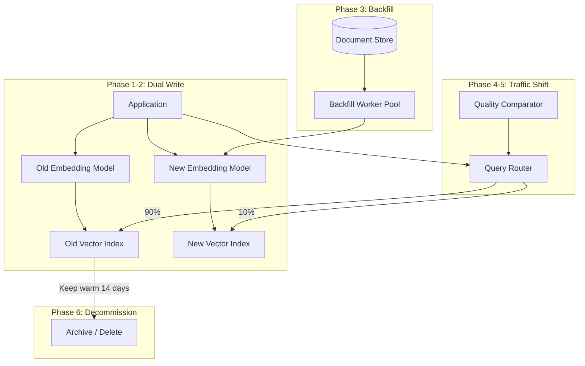

# Embedding Migration Playbook

## Overview

Migrating embedding models in production is one of the most operationally complex tasks in vector search infrastructure. Unlike schema migrations in relational databases, you cannot simply alter a column—every single vector must be recomputed, and vectors from different models are fundamentally incompatible.

This document is the complete playbook for executing embedding model migrations safely.

---

## Why Migration Happens

| Trigger | Example | Urgency |
|---------|---------|---------|
| Better model released | text-embedding-ada-002 → text-embedding-3-large | Low (planned) |
| Cost reduction | 1536-dim → 768-dim model (half storage/compute) | Medium |
| Quality improvement | General model → domain-fine-tuned model | Medium |
| Vendor change | OpenAI → Cohere → self-hosted | High (dependency risk) |
| Model deprecation | Provider EOL announcement | High (deadline-driven) |
| Dimension change | Upgrading from 768 to 1536 dims for better recall | Low |
| Multimodal upgrade | Text-only → text+image embeddings | Medium |

---

## The Fundamental Challenge

**Vectors from different embedding models live in incompatible vector spaces.**

```
Model A: "machine learning" → [0.12, -0.45, 0.78, ...]  (1536 dims)
Model B: "machine learning" → [0.67, 0.23, -0.11, ...]  (1536 dims)

These vectors are NOT comparable. Computing cosine similarity between
a Model A query vector and Model B document vectors returns garbage.

You CANNOT:
- Mix vectors from different models in the same index
- Query with Model B embeddings against Model A indexed vectors
- Gradually replace vectors without a clear boundary
```

---

## Migration Architecture



---

## Migration Strategies

### Strategy 1: Big Bang

```
Timeline: Hours to days
Risk: HIGH
Complexity: LOW

Process:
1. Re-embed entire corpus with new model
2. Build new index
3. Atomic swap: old index → new index
4. Delete old index

Pros:
- Simple to reason about
- No dual-index complexity
- Clean cutover

Cons:
- Requires full re-embedding before switch (compute + time)
- If new model is worse, rollback means another full re-embedding
- Downtime or stale results during switchover

Best for: <10M vectors, non-critical systems, dev/staging
```

### Strategy 2: Dual-Index (Recommended for Production)

```
Timeline: Weeks
Risk: LOW
Complexity: MEDIUM

Process:
1. Deploy new index alongside old
2. Dual-write: all new/updated documents go to BOTH indexes
3. Backfill: re-embed historical documents into new index
4. Quality comparison: run same queries against both
5. Gradual traffic shift: 10% → 50% → 100%
6. Decommission old index after confidence period

Pros:
- Zero downtime
- Easy rollback (just route back to old index)
- Quality comparison before full commitment

Cons:
- 2x storage cost during migration
- 2x embedding cost for new documents during dual-write
- More complex routing logic

Best for: Production systems, >10M vectors, critical search
```

### Strategy 3: Shadow Mode

```
Timeline: Weeks (evaluation) + migration time
Risk: VERY LOW
Complexity: MEDIUM

Process:
1. Compute new embeddings for all queries (shadow, not served)
2. Log results from both old and new models
3. Compare quality offline (no user impact)
4. Once confident, execute migration (Big Bang or Dual-Index)

Pros:
- Zero risk during evaluation
- Rich quality comparison data
- Builds confidence before commitment

Cons:
- Doubles embedding compute for queries during shadow period
- Still need actual migration after evaluation
- Adds latency to query path (if synchronous)

Best for: High-stakes search, regulated industries, expensive migrations
```

### Strategy 4: Incremental Migration

```
Timeline: Weeks to months
Risk: MEDIUM
Complexity: HIGH

Process:
1. New documents always get new embeddings
2. Background worker re-embeds old documents gradually
3. Index tracks which model each vector came from
4. Query routes to appropriate index based on vector model
5. Eventually all vectors are new-model, merge into single index

Pros:
- Spreads compute cost over time
- No spike in embedding API costs
- New content immediately benefits from better model

Cons:
- Complex routing logic (which vectors use which model?)
- Inconsistent quality during transition
- Hard to do quality comparison (different subsets in each index)

Best for: Very large corpora (>1B vectors), tight compute budgets
```

---

## Step-by-Step Playbook

### Phase 1: Evaluate New Model

**Duration: 1-2 weeks**

```
Evaluation criteria:

1. Quality (most important):
   - Run benchmark queries against both models
   - Measure: Recall@10, MRR, NDCG
   - Use production query logs as test set (last 30 days)
   - Minimum bar: new model must be ≥ old model on all metrics

2. Latency:
   - Embedding generation time (per document, per query)
   - New model latency must fit within latency budget
   - Example: query embedding must complete in <50ms

3. Cost:
   - Per-token or per-request pricing
   - Consider: query volume × embedding cost
   - Example: 10M queries/day × $0.0001 = $1,000/day

4. Dimensions:
   - Fewer dims = less storage, faster search
   - More dims = potentially better recall
   - If dimension changes: NEW INDEX REQUIRED (no in-place migration)

5. Throughput:
   - Can embedding API handle backfill load?
   - Rate limits, batch sizes, concurrent requests
   - Example: OpenAI allows 3,000 RPM on standard tier
```

**Go/No-Go from Phase 1:**
```
□ New model quality ≥ old model (statistically significant)
□ Latency within budget
□ Cost acceptable (including migration compute)
□ API throughput sufficient for backfill timeline
□ No breaking changes in tokenization/input handling
```

### Phase 2: Set Up Dual-Write Pipeline

**Duration: 2-5 days**

```python
# Dual-write implementation
class EmbeddingService:
    def __init__(self):
        self.old_model = OldEmbeddingModel()
        self.new_model = NewEmbeddingModel()
        self.old_index = VectorIndex("old_index")
        self.new_index = VectorIndex("new_index")
        self.migration_active = True
    
    def index_document(self, doc_id: str, text: str, metadata: dict):
        """Write to both indexes during migration."""
        # Always write to old (current production)
        old_embedding = self.old_model.embed(text)
        self.old_index.upsert(doc_id, old_embedding, metadata)
        
        if self.migration_active:
            # Also write to new index
            new_embedding = self.new_model.embed(text)
            self.new_index.upsert(doc_id, new_embedding, metadata)
    
    def search(self, query: str, top_k: int = 10, use_new: bool = False):
        """Route queries based on migration state."""
        if use_new:
            query_vec = self.new_model.embed(query)
            return self.new_index.search(query_vec, top_k)
        else:
            query_vec = self.old_model.embed(query)
            return self.old_index.search(query_vec, top_k)
```

**Verification:**
```
□ New documents appear in BOTH indexes
□ Metadata is consistent between indexes
□ Dual-write adds acceptable latency (<50ms)
□ Error handling: if new-index write fails, don't block old-index write
□ Monitoring: track dual-write success rate
```

### Phase 3: Backfill Historical Documents

**Duration: Hours to weeks (depends on corpus size)**

```
Compute budget estimation:

Documents: 100,000,000 (100M)
Embedding cost: $0.0001 per document (OpenAI text-embedding-3-small)
Total cost: $10,000

Time estimation:
- API rate: 1,000 documents/second (batched)
- 100M / 1,000 per sec = 100,000 seconds ≈ 28 hours
- With parallelism (10 workers): ~3 hours

For 1B documents:
- Cost: $100,000
- Time (1000 docs/sec): ~12 days single-threaded
- Time (10 workers): ~28 hours
- Time (100 workers, if rate limit allows): ~3 hours
```

**Backfill worker design:**
```python
class BackfillWorker:
    def __init__(self, batch_size=100, max_concurrent=10):
        self.batch_size = batch_size
        self.semaphore = asyncio.Semaphore(max_concurrent)
        self.progress = ProgressTracker()
    
    async def backfill(self, document_source):
        """Process all historical documents."""
        async for batch in document_source.iter_batches(self.batch_size):
            async with self.semaphore:
                try:
                    embeddings = await self.new_model.embed_batch(
                        [doc.text for doc in batch]
                    )
                    await self.new_index.upsert_batch(
                        [(doc.id, emb, doc.metadata) 
                         for doc, emb in zip(batch, embeddings)]
                    )
                    self.progress.advance(len(batch))
                except RateLimitError:
                    await asyncio.sleep(60)
                    # Retry batch
                except Exception as e:
                    self.progress.record_failure(batch, e)
    
    def get_progress(self):
        return {
            "total": self.progress.total,
            "completed": self.progress.completed,
            "failed": self.progress.failed,
            "eta": self.progress.estimated_completion(),
        }
```

**Backfill monitoring:**
```
□ Track: documents processed, documents remaining, ETA
□ Track: embedding API errors, rate limit hits
□ Track: index write failures
□ Alerting: if backfill stalls for >1 hour
□ Checkpoint: resume from last position on failure
```

### Phase 4: Quality Comparison

**Duration: 1-2 weeks**

```python
class QualityComparator:
    """Compare search quality between old and new indexes."""
    
    def compare_query(self, query: str, ground_truth: list = None):
        # Get results from both indexes
        old_results = self.search_old(query, top_k=20)
        new_results = self.search_new(query, top_k=20)
        
        metrics = {
            "overlap_at_10": self.overlap(old_results[:10], new_results[:10]),
            "mrr_old": self.mrr(old_results, ground_truth) if ground_truth else None,
            "mrr_new": self.mrr(new_results, ground_truth) if ground_truth else None,
            "ndcg_old": self.ndcg(old_results, ground_truth) if ground_truth else None,
            "ndcg_new": self.ndcg(new_results, ground_truth) if ground_truth else None,
        }
        return metrics
    
    def run_evaluation(self, query_log: list, sample_size=1000):
        """Run on sample of production queries."""
        results = []
        for query in random.sample(query_log, sample_size):
            metrics = self.compare_query(query)
            results.append(metrics)
        
        return {
            "avg_overlap_at_10": mean(r["overlap_at_10"] for r in results),
            "queries_where_new_better": sum(1 for r in results if r["mrr_new"] > r["mrr_old"]),
            "queries_where_old_better": sum(1 for r in results if r["mrr_old"] > r["mrr_new"]),
        }
```

**Quality gates:**
```
PROCEED if:
  □ Average recall@10 of new ≥ old (within 1% margin)
  □ MRR improvement ≥ 0% (new is at least as good)
  □ No catastrophic failures (queries returning completely wrong results)
  □ Overlap@10 ≥ 70% (results are similar, not wildly different)
  □ Manual review of 50 "most different" queries shows new is acceptable

STOP if:
  □ New model recall < old by >2%
  □ Any query category shows >10% regression
  □ Edge cases (short queries, long documents) perform poorly
```

### Phase 5: Gradual Traffic Shift

**Duration: 1-2 weeks**

```
Day 1-2:   10% traffic → new index (canary)
Day 3-5:   25% traffic → new index
Day 6-8:   50% traffic → new index
Day 9-11:  75% traffic → new index
Day 12-14: 100% traffic → new index

At each stage, monitor:
- Search latency (p50, p95, p99)
- Click-through rate (if applicable)
- User complaints / support tickets
- Recall metrics (automated)
- Error rates

Rollback trigger:
- p99 latency increases >50%
- CTR drops >5%
- Error rate increases >1%
- Recall drops >3%
```

**Traffic routing implementation:**
```python
class MigrationRouter:
    def __init__(self, new_traffic_pct: float = 0.0):
        self.new_traffic_pct = new_traffic_pct
    
    def route_query(self, query: str, user_id: str) -> SearchResults:
        """Deterministic routing based on user_id for consistency."""
        # Same user always gets same experience (no flip-flopping)
        use_new = (hash(user_id) % 100) < (self.new_traffic_pct * 100)
        
        if use_new:
            return self.search_new_index(query)
        else:
            return self.search_old_index(query)
    
    def set_traffic(self, pct: float):
        """Adjust traffic split. Called via admin API."""
        assert 0.0 <= pct <= 1.0
        self.new_traffic_pct = pct
        log.info(f"Migration traffic set to {pct*100}% new index")
```

### Phase 6: Decommission Old Index

**Duration: 2-4 weeks (including bake time)**

```
After 100% traffic on new index for 7+ days with no issues:

Week 1: Stop dual-writes to old index
Week 2: Keep old index running but unused (warm standby)
Week 3: Take final snapshot of old index
Week 4: Delete old index, reclaim resources

DO NOT delete old index until:
□ 14 days at 100% new traffic with no rollbacks
□ Final quality comparison shows sustained improvement
□ Snapshot of old index stored in object storage
□ Team sign-off on decommission
```

---

## Handling Dimension Changes

When migrating from 1536 → 768 dimensions (or any dimension change):

```
Impact:
- Existing index CANNOT be modified (dimensions are fixed at creation)
- Must create entirely new index with new dimension
- Storage reduced by 50% (768 vs 1536)
- Search may be faster (fewer distance computations)
- Quality may differ (test carefully)

Steps:
1. Create new index with dimension=768
2. Follow standard dual-write + backfill process
3. Update all embedding generation to use new dimension
4. No "partial migration" possible—it's all or nothing per index
```

When migrating from 768 → 1536 dimensions:
```
- Storage doubles
- Ensure cluster has capacity BEFORE starting
- New index will need 2x the RAM/disk
- Plan capacity increase alongside migration
```

---

## Compute Cost Reference

| Corpus Size | Model | Cost per Embed | Total Cost | Time (1K/sec) |
|-------------|-------|---------------|------------|---------------|
| 1M docs | text-embedding-3-small | $0.00002 | $20 | 17 min |
| 10M docs | text-embedding-3-small | $0.00002 | $200 | 2.8 hrs |
| 100M docs | text-embedding-3-small | $0.00002 | $2,000 | 28 hrs |
| 1B docs | text-embedding-3-small | $0.00002 | $20,000 | 12 days |
| 1M docs | text-embedding-3-large | $0.00013 | $130 | 17 min |
| 100M docs | text-embedding-3-large | $0.00013 | $13,000 | 28 hrs |
| 100M docs | Cohere embed-v3 | $0.0001 | $10,000 | 28 hrs |
| 100M docs | Self-hosted (GPU cost) | ~$0.00005 | ~$5,000 | 14 hrs |

**Cost optimization tips:**
- Batch requests (max batch size per API call)
- Use smaller model if quality is equivalent
- Self-host for very large corpora (>100M, break-even at ~50M docs)
- Negotiate volume pricing with provider

---

## Rollback Plan

```
Rollback scenarios and responses:

1. Quality regression detected during Phase 5:
   → Route 100% traffic back to old index
   → Investigate: which queries regressed? Why?
   → Fix: fine-tune new model, or add re-ranking layer
   → Time to rollback: <1 minute (routing change)

2. New embedding API outage during dual-write:
   → Old index continues serving (unaffected)
   → Queue failed new-index writes for retry
   → New index may fall behind; backfill catches up later
   → No user impact

3. Backfill corruption (wrong vectors indexed):
   → Stop backfill immediately
   → Identify corrupted range (by timestamp)
   → Delete corrupted vectors from new index
   → Fix bug, restart backfill from checkpoint
   → No user impact (old index still serving)

4. Full migration complete, then regression found:
   → IF old index still exists: route back immediately
   → IF old index deleted: re-embed with old model (expensive)
   → This is why we keep old index for 14+ days post-migration
```

---

## Anti-Patterns

### 1. No Quality Comparison

```
WRONG: "The new model has better benchmarks, so it must be better for us"

Reality: Public benchmarks don't reflect YOUR data distribution.
A model that's 2% better on MTEB might be 5% worse on your
domain-specific queries.

ALWAYS run quality comparison on YOUR production queries.
```

### 2. Destroying Old Index Too Early

```
WRONG: "Migration is done, delete the old index to save money"

Reality: Subtle quality issues may take days/weeks to surface.
Users may not report problems immediately.
Keep old index warm for minimum 14 days.

Cost of keeping old index: ~$X,000/month
Cost of re-embedding everything if you need to rollback: $XX,000 + days of downtime
```

### 3. No Dual-Write Phase

```
WRONG: "We'll just re-embed everything and swap"

Reality: During the re-embedding period (hours/days), new documents
only exist in the old index. After swap, those documents are missing
from the new index.

ALWAYS dual-write before starting backfill.
```

### 4. Mixing Vectors from Different Models

```
WRONG: "We'll just start using the new model for new documents
        and leave old documents with old embeddings"

Reality: Queries embedded with the new model won't find old documents.
Queries embedded with the old model won't find new documents.
You get a silently degrading search experience.

NEVER mix embedding models in the same index without clear routing.
```

### 5. No Backfill Checkpointing

```
WRONG: "Start the backfill, it'll finish in 28 hours"

Reality: API rate limits, network errors, OOM kills will interrupt.
Without checkpointing, you restart from zero.
100M docs × 2 failed attempts = $20K wasted.

ALWAYS checkpoint progress. Resume from last successful batch.
```

---

## Staff Checklist: Embedding Migration Go/No-Go

### Pre-Migration (Before Phase 2)

```
EVALUATION:
□ New model tested on ≥1,000 production queries
□ Quality metrics (Recall@10, MRR) equal or better than old
□ Latency within budget (embedding generation + search)
□ Cost analysis complete (migration cost + ongoing cost)
□ Dimension compatibility assessed (same dim = easier, different = new index)
□ API rate limits sufficient for backfill timeline

INFRASTRUCTURE:
□ New index provisioned with sufficient capacity
□ Dual-write code reviewed and tested in staging
□ Backfill worker tested on subset (1% of corpus)
□ Monitoring dashboards updated for new index
□ Alerting configured for new index metrics
□ Rollback procedure documented and tested

ORGANIZATIONAL:
□ Team briefed on migration plan and timeline
□ On-call aware of migration (potential issues)
□ Stakeholders informed of timeline
□ Success criteria defined and agreed upon
```

### During Migration (Phase 2-5)

```
DAILY CHECKS:
□ Backfill progress on track (% complete, ETA)
□ Error rate in backfill < 0.1%
□ Dual-write success rate > 99.9%
□ No increase in search latency
□ No increase in error rates
□ Quality metrics stable

WEEKLY CHECKS:
□ Cost tracking (embedding API spend vs budget)
□ Storage growth in new index as expected
□ Quality comparison results reviewed
□ Traffic shift schedule on track
```

### Post-Migration (Phase 6)

```
DECOMMISSION CRITERIA:
□ 100% traffic on new index for ≥14 days
□ No rollbacks triggered
□ Quality metrics sustained or improved
□ No user-reported search quality issues
□ Old index snapshot taken and stored
□ Cost savings realized (if dimension reduction)
□ Documentation updated (model version, parameters)
□ Runbooks updated with new model details
□ Team retro completed (lessons learned)
```

---

## Key Takeaways

1. **You cannot mix embeddings**: This is the fundamental constraint. Different models produce incompatible vector spaces. Plan accordingly.

2. **Dual-write is non-negotiable for production**: Any gap between old and new indexes means missing documents. Start dual-write before backfill.

3. **Quality comparison before traffic shift**: Never assume a "better" model is better for your use case. Measure on your data.

4. **Keep the old index as insurance**: The cost of maintaining it for 2 weeks is trivial compared to the cost of re-embedding if something goes wrong.

5. **Checkpoint everything**: Backfill will fail. Networks will drop. APIs will rate-limit. Design for resumability.

6. **Budget time and money**: 100M documents at $0.0001 each = $10K and ~28 hours. Plan for this in sprint capacity and cloud budget.

7. **Deterministic routing during traffic shift**: Same user should always hit the same index to avoid confusion. Hash user_id for consistent routing.
