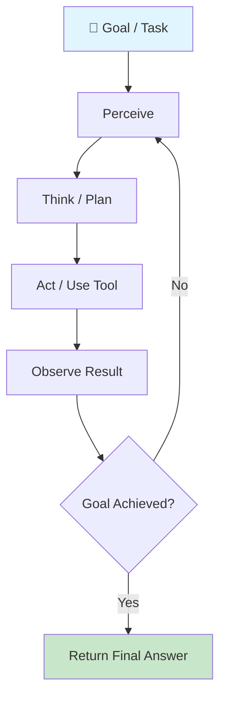
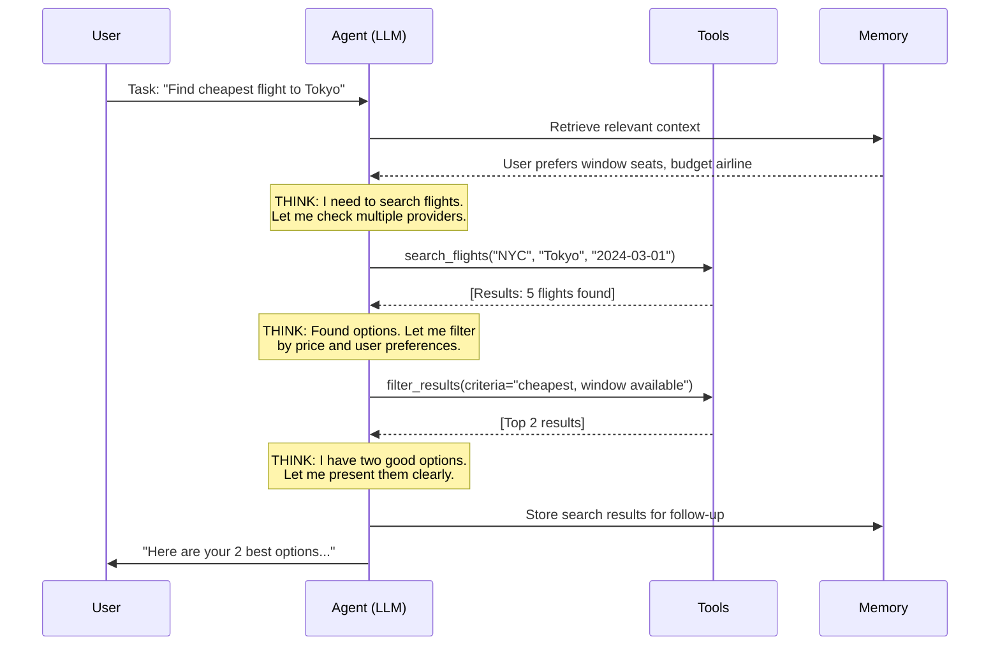

# What Are AI Agents?

## The "Autonomous Employee" Analogy

Think of an AI agent like hiring a new employee. A chatbot is like a receptionist who can only answer FAQs. A pipeline is like an assembly line worker who follows fixed steps. But an **agent** is like a skilled employee who:

- Understands goals (not just instructions)
- Decides what to do next based on the situation
- Uses tools (email, spreadsheet, database) independently
- Adapts when things don't go as planned
- Knows when to ask for help

An AI agent is an **LLM that can autonomously decide what actions to take** to accomplish a goal, execute those actions, observe results, and iterate until the goal is achieved.

---

## Agent vs Chatbot vs Pipeline

| Aspect | Chatbot | Pipeline | Agent |
|--------|---------|----------|-------|
| **Control Flow** | User drives each step | Fixed, pre-defined | LLM decides dynamically |
| **Tools** | None or pre-selected | Hard-coded sequence | Chosen at runtime |
| **Memory** | Conversation only | None (stateless) | Working + long-term |
| **Planning** | None | Pre-planned by developer | Self-planned |
| **Error Handling** | "Sorry, I can't help" | Fails or retries | Adapts strategy |
| **Autonomy** | Zero | Zero | Low to High |
| **Example** | FAQ bot | ETL pipeline with LLM | Research assistant |

---

## The Agent Loop

Every agent follows the same fundamental loop:



1. **Perceive** — Read the current state (user input, tool results, memory)
2. **Think** — Reason about what to do next (this is where the LLM shines)
3. **Act** — Execute an action (call a tool, write output)
4. **Observe** — See what happened (tool returned data, error occurred)
5. **Repeat** — Loop until the goal is achieved or a termination condition is met

This is the same loop humans use. You perceive a problem, think about solutions, try something, see if it worked, and adjust.

---

## Agent Anatomy

Every well-designed agent has these components:

```
┌─────────────────────────────────────────────┐
│                  AI AGENT                     │
├─────────────────────────────────────────────┤
│  🎯 Goal         What the agent is trying    │
│                   to accomplish               │
├─────────────────────────────────────────────┤
│  📋 Instructions  System prompt, persona,    │
│                   constraints, guidelines     │
├─────────────────────────────────────────────┤
│  🔧 Tools         Functions it can call       │
│                   (APIs, databases, search)   │
├─────────────────────────────────────────────┤
│  🧠 Memory        What it remembers           │
│                   (context, history, facts)   │
├─────────────────────────────────────────────┤
│  📐 Planning      How it breaks down tasks    │
│                   (sequential, DAG, adaptive) │
├─────────────────────────────────────────────┤
│  ⚡ Execution     How it runs actions and     │
│                   handles results/errors      │
└─────────────────────────────────────────────┘
```

---

## Why Agents Matter

Agents unlock automation of **complex, multi-step tasks** that previously required human judgment:

- **Research**: "Find the top 5 competitors, analyze their pricing, and write a report"
- **Code**: "Fix this bug by reading the error, finding the file, understanding the code, and submitting a PR"
- **Customer Support**: "Look up the order, check the return policy, process the refund, and email the customer"

These tasks require **decisions at each step** — you can't pre-script them because the path depends on intermediate results.

---

## The Autonomy Spectrum

```
Simple Chatbot ──────────────────────────────── Fully Autonomous Agent

L0          L1            L2              L3           L4           L5
No tools    Tool-using    Multi-step      Self-planning  Self-improving  Fully
             LLM          tool use        agent          agent           autonomous
```

| Level | Description | Example | Risk |
|-------|-------------|---------|------|
| **L0** | Pure text, no tools | ChatGPT in basic mode | None |
| **L1** | Single tool calls, human approves | "Want me to search?" | Low |
| **L2** | Multi-step tool use, single task | Code completion with file access | Medium |
| **L3** | Plans and executes multi-step tasks | Research agent with web access | High |
| **L4** | Creates sub-agents, modifies own tools | Agent that writes new tools | Very High |
| **L5** | Fully autonomous, long-running | Autonomous business operator | Extreme |

**As an architect, you choose the autonomy level based on the risk tolerance of your use case.**

---

## Real-World Agent Examples

### Customer Support Agent
- Reads customer ticket → Looks up order → Checks policy → Decides resolution → Executes (refund/replace) → Responds to customer

### Code Assistant Agent (like GitHub Copilot Workspace)
- Reads issue → Explores codebase → Plans changes → Writes code → Runs tests → Creates PR

### Research Agent
- Takes research question → Searches multiple sources → Cross-references → Synthesizes findings → Produces report

### Data Analysis Agent
- Receives dataset → Explores schema → Writes queries → Interprets results → Creates visualizations → Writes insights

---

## The Full Agent Execution Loop (Detailed)



---

## Why This Matters for an Architect

When designing agent systems, architects must consider:

1. **Guardrails** — What can the agent NOT do? (prevent unauthorized actions)
2. **Autonomy Budget** — How many steps before human approval is needed?
3. **Failure Recovery** — What happens when the agent gets stuck or makes mistakes?
4. **Cost Control** — Agents can generate thousands of tokens per task; budget matters
5. **Observability** — Can you trace WHY the agent made each decision?
6. **Security** — Tool access is API access; agents need least-privilege permissions
7. **Scalability** — One agent per user? Shared agents? Agent pools?

The key architectural decision: **how much autonomy to grant** based on the consequences of mistakes. A typo-fixing agent can be fully autonomous. A money-transferring agent needs human approval.

---

## Key Takeaways

- An agent is an LLM with a goal, tools, memory, and an execution loop
- The fundamental loop is: Perceive → Think → Act → Observe → Repeat
- Agents exist on a spectrum from simple chatbot to fully autonomous
- The architect's job is choosing the right autonomy level and building guardrails
- Multi-step tasks that require judgment are where agents shine
