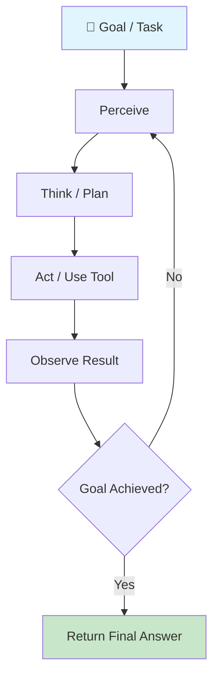
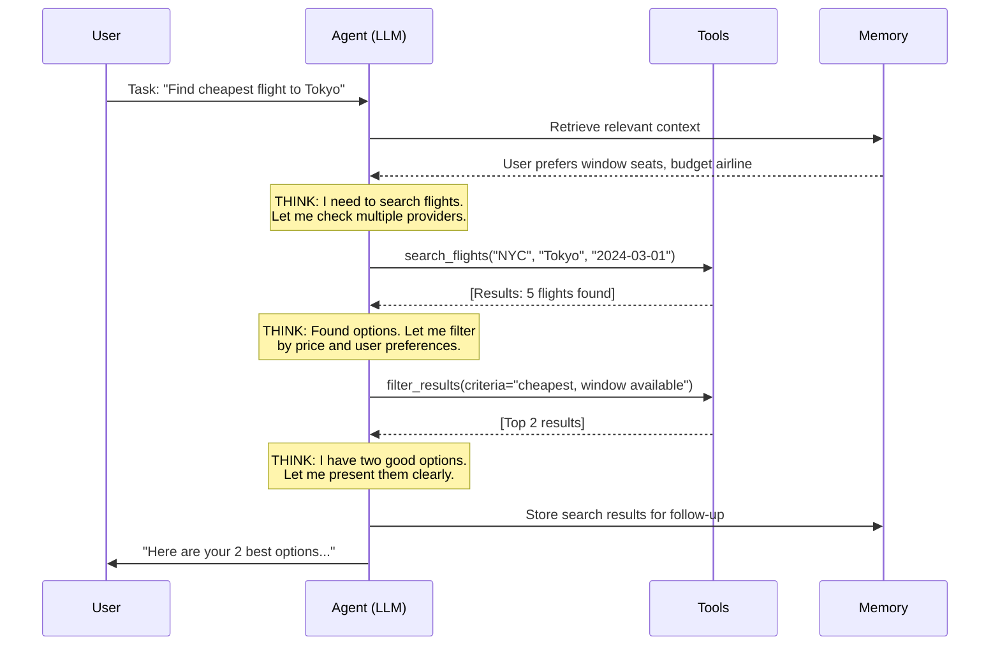

# What Are AI Agents?

## The "Autonomous Employee" Analogy

Think of an AI agent like hiring a new employee. A chatbot is like a receptionist who can only answer FAQs. A pipeline is like an assembly line worker who follows fixed steps. But an **agent** is like a skilled employee who:

- Understands goals (not just instructions)
- Decides what to do next based on the situation
- Uses tools (email, spreadsheet, database) independently
- Adapts when things don't go as planned
- Knows when to ask for help

An AI agent is an **LLM that can autonomously decide what actions to take** to accomplish a goal, execute those actions, observe results, and iterate until the goal is achieved.

---

## Agent vs Chatbot vs Pipeline

| Aspect | Chatbot | Pipeline | Agent |
|--------|---------|----------|-------|
| **Control Flow** | User drives each step | Fixed, pre-defined | LLM decides dynamically |
| **Tools** | None or pre-selected | Hard-coded sequence | Chosen at runtime |
| **Memory** | Conversation only | None (stateless) | Working + long-term |
| **Planning** | None | Pre-planned by developer | Self-planned |
| **Error Handling** | "Sorry, I can't help" | Fails or retries | Adapts strategy |
| **Autonomy** | Zero | Zero | Low to High |
| **Example** | FAQ bot | ETL pipeline with LLM | Research assistant |

---

## The Agent Loop

Every agent follows the same fundamental loop:



1. **Perceive** — Read the current state (user input, tool results, memory)
2. **Think** — Reason about what to do next (this is where the LLM shines)
3. **Act** — Execute an action (call a tool, write output)
4. **Observe** — See what happened (tool returned data, error occurred)
5. **Repeat** — Loop until the goal is achieved or a termination condition is met

This is the same loop humans use. You perceive a problem, think about solutions, try something, see if it worked, and adjust.

---

## Agent Anatomy

Every well-designed agent has these components:

```
┌─────────────────────────────────────────────┐
│                  AI AGENT                     │
├─────────────────────────────────────────────┤
│  🎯 Goal         What the agent is trying    │
│                   to accomplish               │
├─────────────────────────────────────────────┤
│  📋 Instructions  System prompt, persona,    │
│                   constraints, guidelines     │
├─────────────────────────────────────────────┤
│  🔧 Tools         Functions it can call       │
│                   (APIs, databases, search)   │
├─────────────────────────────────────────────┤
│  🧠 Memory        What it remembers           │
│                   (context, history, facts)   │
├─────────────────────────────────────────────┤
│  📐 Planning      How it breaks down tasks    │
│                   (sequential, DAG, adaptive) │
├─────────────────────────────────────────────┤
│  ⚡ Execution     How it runs actions and     │
│                   handles results/errors      │
└─────────────────────────────────────────────┘
```

---

## Why Agents Matter

Agents unlock automation of **complex, multi-step tasks** that previously required human judgment:

- **Research**: "Find the top 5 competitors, analyze their pricing, and write a report"
- **Code**: "Fix this bug by reading the error, finding the file, understanding the code, and submitting a PR"
- **Customer Support**: "Look up the order, check the return policy, process the refund, and email the customer"

These tasks require **decisions at each step** — you can't pre-script them because the path depends on intermediate results.

---

## The Autonomy Spectrum

```
Simple Chatbot ──────────────────────────────── Fully Autonomous Agent

L0          L1            L2              L3           L4           L5
No tools    Tool-using    Multi-step      Self-planning  Self-improving  Fully
             LLM          tool use        agent          agent           autonomous
```

| Level | Description | Example | Risk |
|-------|-------------|---------|------|
| **L0** | Pure text, no tools | ChatGPT in basic mode | None |
| **L1** | Single tool calls, human approves | "Want me to search?" | Low |
| **L2** | Multi-step tool use, single task | Code completion with file access | Medium |
| **L3** | Plans and executes multi-step tasks | Research agent with web access | High |
| **L4** | Creates sub-agents, modifies own tools | Agent that writes new tools | Very High |
| **L5** | Fully autonomous, long-running | Autonomous business operator | Extreme |

**As an architect, you choose the autonomy level based on the risk tolerance of your use case.**

---

## Real-World Agent Examples

### Customer Support Agent
- Reads customer ticket → Looks up order → Checks policy → Decides resolution → Executes (refund/replace) → Responds to customer

### Code Assistant Agent (like GitHub Copilot Workspace)
- Reads issue → Explores codebase → Plans changes → Writes code → Runs tests → Creates PR

### Research Agent
- Takes research question → Searches multiple sources → Cross-references → Synthesizes findings → Produces report

### Data Analysis Agent
- Receives dataset → Explores schema → Writes queries → Interprets results → Creates visualizations → Writes insights

---

## The Full Agent Execution Loop (Detailed)



---

## Why This Matters for an Architect

When designing agent systems, architects must consider:

1. **Guardrails** — What can the agent NOT do? (prevent unauthorized actions)
2. **Autonomy Budget** — How many steps before human approval is needed?
3. **Failure Recovery** — What happens when the agent gets stuck or makes mistakes?
4. **Cost Control** — Agents can generate thousands of tokens per task; budget matters
5. **Observability** — Can you trace WHY the agent made each decision?
6. **Security** — Tool access is API access; agents need least-privilege permissions
7. **Scalability** — One agent per user? Shared agents? Agent pools?

The key architectural decision: **how much autonomy to grant** based on the consequences of mistakes. A typo-fixing agent can be fully autonomous. A money-transferring agent needs human approval.

---

## Key Takeaways

- An agent is an LLM with a goal, tools, memory, and an execution loop
- The fundamental loop is: Perceive → Think → Act → Observe → Repeat
- Agents exist on a spectrum from simple chatbot to fully autonomous
- The architect's job is choosing the right autonomy level and building guardrails
- Multi-step tasks that require judgment are where agents shine

---

## Staff-Level: Anti-Patterns

| Anti-Pattern | Why It's Wrong | What To Do Instead |
|-------------|---------------|-------------------|
| Calling any LLM wrapper an "agent" | Conflates chatbots, pipelines, and agents — leads to wrong architecture decisions | Apply the litmus test: does it have a goal, plan, act, observe loop? If not, it's not an agent |
| Agents without a clear objective function | No way to measure success or know when to stop | Define explicit success criteria before building: "task is done when X is true" |
| No stop condition (runs forever) | Cost explosion, user frustration, resource exhaustion | Always define: max iterations, token budget, time limit, AND a goal-completion check |
| Agents that can't explain their reasoning | Impossible to debug, audit, or trust | Require reasoning traces (ReAct-style) or at minimum structured logging of decisions |
| "Agent" that just calls one API | Over-engineering a simple function call into a complex system | Use a simple function/pipeline — agents are for multi-step decision-making |

---

## Staff-Level: Trade-offs

### Autonomy vs Control

```
More Autonomy                              More Control
├── Faster execution                       ├── Predictable behavior
├── Handles novel situations               ├── Easier to audit/comply
├── Less human bottleneck                  ├── Lower risk of catastrophic errors
└── Higher risk of wrong actions           └── Slower, requires human availability
```

**Decision framework**: Match autonomy to consequence severity.
- Low consequence (summarize text) → high autonomy
- High consequence (send money, delete data) → low autonomy + human approval

### Flexibility vs Predictability

| Flexible Agent | Predictable Agent |
|---------------|------------------|
| Can handle unexpected inputs | Follows known paths reliably |
| May produce surprising outputs | Output format is consistent |
| Better for exploratory tasks | Better for production workflows |
| Harder to test exhaustively | Easy to write regression tests |

---

## Staff-Level: The Defining Rule

> **"If it doesn't have a planning loop, it's not an agent — it's a chatbot with tools."**

The critical differentiator:
- **Chatbot with tools**: User says something → LLM picks a tool → returns result. One-shot. No iteration.
- **Agent**: Receives goal → plans approach → executes step → observes result → decides next step → iterates until done OR gives up.

The **loop** is what makes it an agent. Without the loop, you have a tool-augmented LLM — which is fine! But don't call it an agent and don't architect it like one.

**Practical test for your system**:
1. Can it take >1 action without user intervention? (minimum bar)
2. Does it decide its OWN next action based on previous results? (not pre-scripted)
3. Does it have a termination condition tied to goal completion? (not just "ran out of steps")

If all three are yes → agent. Otherwise → something simpler, and that's okay.

---

## Agent Taxonomy: Simple → Autonomous Spectrum

| Level | Type | Description | Example |
|-------|------|-------------|---------|
| 0 | Prompt/Response | Single LLM call, no tools | Chatbot, text summarizer |
| 1 | Tool-augmented LLM | LLM + tools, single turn | RAG query, calculator use |
| 2 | Simple agent | Fixed loop: reason → act → observe, 2-5 steps | Customer support with lookup |
| 3 | Complex agent | Dynamic planning, 5-20 steps, error recovery | Code generation agent |
| 4 | Multi-agent | Multiple agents coordinating | Research + writing pipeline |
| 5 | Autonomous agent | Long-running, self-directed, minimal human input | Devin-style coding agent |

**Staff insight**: Most production value is at Level 1-2. Levels 4-5 are research-grade — impressive demos but fragile in production. Don't over-architect.

## Production Readiness Assessment

Before deploying an agent to production, score these dimensions:

```
Reliability:     Can it handle 95% of inputs without failure?        [1-5]
Predictability:  Does it produce consistent results for same input?  [1-5]
Cost control:    Is worst-case cost bounded and acceptable?          [1-5]
Observability:   Can you debug a failed run from logs alone?         [1-5]
Graceful failure: Does it fail safely (no side effects, clear error)? [1-5]
Latency:         Is end-to-end time acceptable for the use case?     [1-5]

Score ≥ 24/30: Production ready
Score 18-23:   Staging/internal only
Score < 18:    Prototype — not ready for users
```

## Agent Complexity Decision Framework

```
Start here: Can you solve this with a single LLM call + structured output?
  YES → Do that. You don't need an agent.
  NO  ↓

Do you need external data or actions (API calls, DB queries)?
  YES, 1-2 tools, single turn → Tool-augmented LLM (Level 1)
  YES, multiple steps needed  ↓

Is the sequence of steps predictable/fixed?
  YES → Pipeline/workflow (deterministic), not an agent
  NO  → You need an agent (Level 2+)  ↓

Do steps require different expertise/models?
  NO  → Single agent with multiple tools (Level 2-3)
  YES → Consider multi-agent only if single agent fails (Level 4)
```

**The golden rule**: Always start one level simpler than you think you need. Promote to higher complexity only when you have evidence the simpler approach fails.
