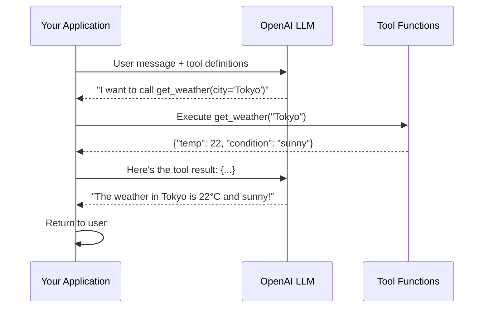
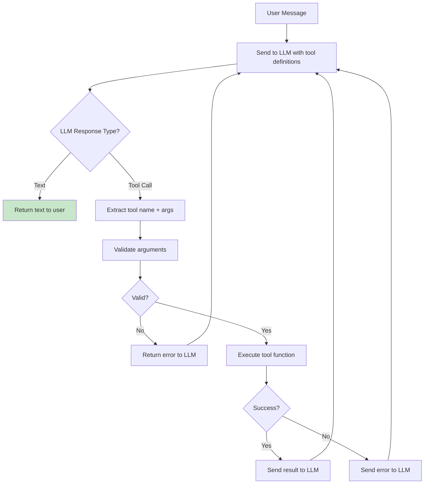

# Tool Calling and Function Calling

## The "Hands" of an AI Agent

An LLM without tools is like a brilliant mind trapped in a jar — it can think and reason but can't **do** anything in the real world. Tool calling gives the LLM **hands**:

- **Search** — hands that can reach into the internet
- **Calculator** — hands that can do precise math
- **Database** — hands that can look up records
- **API** — hands that can trigger actions in other systems

Without tools, an LLM can only generate text. With tools, it can **take action**.

---

## How Function Calling Works (OpenAI API)

The flow has 3 players: **your code**, **the LLM**, and **your tools**.



**Critical insight**: The LLM **never executes tools itself**. It only **decides** which tool to call and with what arguments. YOUR code executes the tool and feeds the result back.

---

## Tool Definition Schema

Every tool is defined with three things:

```python
tools = [
    {
        "type": "function",
        "function": {
            "name": "get_weather",                    # What to call it
            "description": "Get current weather for a city. "
                          "Use when user asks about weather, "
                          "temperature, or conditions.",       # When to use it
            "parameters": {                            # What arguments it needs
                "type": "object",
                "properties": {
                    "city": {
                        "type": "string",
                        "description": "City name, e.g., 'San Francisco'"
                    },
                    "unit": {
                        "type": "string",
                        "enum": ["celsius", "fahrenheit"],
                        "description": "Temperature unit"
                    }
                },
                "required": ["city"]
            }
        }
    }
]
```

The LLM reads descriptions to decide which tool to use — **the tool is only as good as its description**.

---

## The LLM's Role in Tool Calling

The LLM does two things:

1. **Decides WHICH tool** — Based on the user's intent and tool descriptions
2. **Decides WHAT arguments** — Extracts or infers parameter values from context

The LLM does NOT:
- Execute the tool
- Have access to the tool's implementation
- Know the tool's response until you feed it back

Think of the LLM as a **dispatcher** — it reads the request and routes it to the right department with the right info.

---

## Single vs Parallel Tool Calls

### Single Tool Call
```
User: "What's the weather in Tokyo?"
LLM: → calls get_weather(city="Tokyo")
```

### Parallel Tool Calls
```
User: "Compare weather in Tokyo and Paris"
LLM: → calls get_weather(city="Tokyo") AND get_weather(city="Paris")
     (both in the same response)
```

Parallel tool calls are more efficient — one round trip instead of two. The LLM can request multiple tool calls simultaneously when they're independent.

---

## Tool Execution Flow (Detailed)



This loop continues until the LLM responds with text (no more tool calls needed).

---

## Designing Good Tool Descriptions

The description is the LLM's **only guide** for when and how to use a tool. Bad descriptions = bad tool usage.

| Bad Description | Good Description |
|----------------|-----------------|
| "Search" | "Search the product catalog by name, category, or price range. Returns top 10 matching products with name, price, and availability." |
| "Send email" | "Send an email to a customer. Use ONLY for order confirmations and shipping updates. Never for marketing." |
| "Calculate" | "Perform arithmetic calculations. Input a math expression like '2 + 2' or '15% of 230'. Use for precise numbers, never estimate." |

### Rules for Great Tool Descriptions:
1. **State when to use it** — "Use when the user asks about..."
2. **State when NOT to use it** — "Do NOT use for..."
3. **Describe what it returns** — "Returns a list of..."
4. **Include examples** — "e.g., 'San Francisco, CA'"
5. **Mention limitations** — "Only works for US addresses"

---

## Tool Error Handling

Tools fail. Networks time out. APIs return errors. Your agent must handle this gracefully.

```python
def execute_tool(tool_name, arguments):
    try:
        result = tool_functions[tool_name](**arguments)
        return {"status": "success", "data": result}
    except ToolNotFoundError:
        return {"status": "error", "message": f"Tool '{tool_name}' does not exist"}
    except ValidationError as e:
        return {"status": "error", "message": f"Invalid arguments: {e}"}
    except TimeoutError:
        return {"status": "error", "message": "Tool timed out, try again"}
    except Exception as e:
        return {"status": "error", "message": f"Tool failed: {str(e)}"}
```

When you send an error back to the LLM, it can:
- Try a different tool
- Try different arguments
- Ask the user for clarification
- Give up gracefully

---

## Tool Safety: The Danger Zone

Not all tools are equal in risk:

| Safety Level | Tools | Supervision |
|-------------|-------|-------------|
| **Safe (read-only)** | search, get_weather, lookup | None needed |
| **Moderate (writes)** | send_email, create_ticket | Log + audit |
| **Dangerous (money/data)** | transfer_money, delete_records | Human approval |
| **Forbidden** | execute_arbitrary_code, sudo | Never unsupervised |

**Principle of Least Privilege**: Give the agent only the tools it needs for its specific task. A customer support agent doesn't need `delete_database`.

---

## The Tool Contract Pattern

Every production tool should have a clear contract:

```python
class ToolContract:
    name: str                    # Unique identifier
    description: str             # When and how to use
    input_schema: dict           # JSON Schema for parameters
    output_schema: dict          # What the response looks like
    side_effects: list[str]      # What it changes in the world
    permissions_required: list   # What access it needs
    rate_limit: str              # How often it can be called
    idempotent: bool            # Safe to retry?
    timeout_ms: int             # How long before giving up
```

This contract helps architects:
- **Audit** what agents can do
- **Test** tools in isolation
- **Monitor** tool usage patterns
- **Restrict** tools per agent role

---

## Key Takeaways

- Tool calling = LLM decides, your code executes
- The LLM never sees tool code; it only reads descriptions
- Good descriptions are the #1 factor in tool calling accuracy
- Always handle errors and feed them back to the LLM
- Apply least-privilege: only give tools the agent actually needs
- Parallel tool calls improve efficiency for independent operations
- Every production tool needs a contract: schema + side effects + permissions
