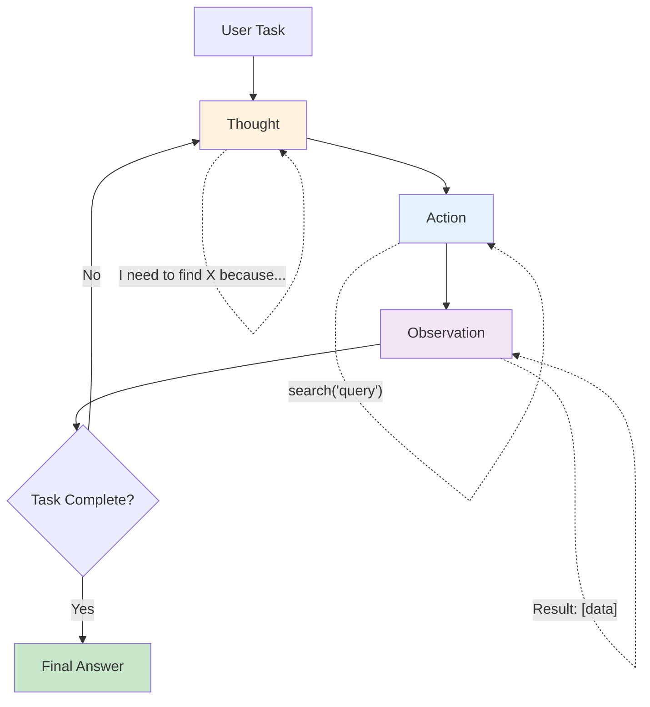

# The ReAct Pattern

## What is ReAct?

**ReAct** = **Re**asoning + **Act**ing

It's a pattern where the LLM explicitly **thinks out loud** before taking action. Instead of just calling a tool, the agent first writes down its reasoning — why it's choosing this tool, what it expects, and what it will do with the result.

## The "Think Out Loud" Analogy

Imagine a detective solving a case:

- **Without ReAct** (just acting): *searches database* → *calls witness* → *checks alibi* (you don't know WHY)
- **With ReAct** (thinking aloud): "The suspect claims they were at home. I should check if their phone GPS confirms this. Let me query the location database." → *queries database* → "GPS shows they were downtown. This contradicts their statement. I should interview the witness who saw them."

ReAct makes the agent's reasoning **visible and debuggable**.

---

## The ReAct Loop



Each iteration has exactly three parts:
1. **Thought** — What am I trying to do? What do I know? What's my next step?
2. **Action** — Call a specific tool with specific arguments
3. **Observation** — What did the tool return?

---

## How ReAct Differs from Simple Tool Calling

| Aspect | Simple Tool Calling | ReAct |
|--------|-------------------|-------|
| Reasoning | Implicit (hidden in LLM) | Explicit (written out) |
| Debuggability | Low — "why did it call that?" | High — reasoning is visible |
| Token usage | Lower | Higher (thoughts cost tokens) |
| Accuracy on complex tasks | Lower | Higher (forced reasoning) |
| Loop detection | Hard | Easy (you can see repeated thoughts) |

---

## ReAct Trace Example

**Task**: "What's the population of the country where the Eiffel Tower is located?"

```
Thought 1: I need to find which country the Eiffel Tower is in.
            I know it's in Paris, France, but let me verify.
Action 1:  knowledge_base("Eiffel Tower location")
Observation 1: The Eiffel Tower is located in Paris, France.

Thought 2: The Eiffel Tower is in France. Now I need to find
            the current population of France.
Action 2:  web_search("France population 2024")
Observation 2: France population 2024: approximately 68.4 million.

Thought 3: I now have both pieces of information. The Eiffel Tower
            is in France, and France has ~68.4 million people.
            I can provide the final answer.
Final Answer: The Eiffel Tower is in France, which has a population
              of approximately 68.4 million people.
```

---

## Implementing ReAct from Scratch (Pseudocode)

```python
def react_agent(task, tools, max_iterations=10):
    context = f"Task: {task}\n"
    
    for i in range(max_iterations):
        # Ask LLM to generate next Thought + Action
        prompt = REACT_PROMPT + context + "Thought:"
        response = llm.generate(prompt, stop=["Observation:"])
        
        # Parse the response
        thought, action = parse_thought_and_action(response)
        context += f"Thought {i+1}: {thought}\n"
        
        # Check if agent wants to give final answer
        if action.tool == "final_answer":
            return action.args["answer"]
        
        # Execute the tool
        context += f"Action {i+1}: {action.tool}({action.args})\n"
        observation = execute_tool(action.tool, action.args)
        context += f"Observation {i+1}: {observation}\n"
    
    return "Max iterations reached. Could not complete task."
```

---

## The ReAct System Prompt

```
You are a reasoning agent. For each step, you MUST output:

Thought: [your reasoning about what to do next]
Action: [tool_name(arguments)]

After receiving an Observation, think again.
When you have enough information, use:
Action: final_answer("your complete answer")

Available tools:
- web_search(query): Search the web for current information
- calculator(expression): Compute a mathematical expression
- knowledge_base(topic): Look up factual information

RULES:
- Always think before acting
- Never guess — use tools to verify
- If a tool fails, try a different approach
- Maximum 10 steps
```

---

## Advantages of ReAct

1. **Transparent** — You can read the agent's reasoning and understand its decisions
2. **Debuggable** — When something goes wrong, you can see WHERE the reasoning failed
3. **Steerable** — You can modify the prompt to change reasoning patterns
4. **Reliable** — Forced reasoning reduces impulsive/wrong tool calls
5. **Auditable** — Full trace for compliance and review

---

## Limitations of ReAct

1. **Token-expensive** — Every thought costs tokens; complex tasks accumulate fast
2. **Can loop** — Agent may repeat the same thought-action cycle endlessly
3. **Slow** — Each step requires a full LLM call
4. **Context overflow** — Long traces fill up the context window
5. **Over-thinking** — Simple tasks don't need explicit reasoning

---

## When to Use ReAct

| Use ReAct When... | Use Simple Tool Calling When... |
|-------------------|-------------------------------|
| Task requires multi-step reasoning | Task is straightforward (1-2 tool calls) |
| Debugging/auditability is critical | Speed is the priority |
| Agent makes frequent mistakes | Agent is reliable on this task type |
| Task is novel/complex | Task is routine/familiar |
| You need to explain decisions to users | User just wants the result |

---

## Loop Detection Strategies

```python
# Strategy 1: Max iterations
MAX_STEPS = 10

# Strategy 2: Detect repeated actions
if action in previous_actions[-3:]:
    inject_message("You've tried this before. Try a different approach.")

# Strategy 3: Detect repeated thoughts
if thought_similarity(current_thought, previous_thoughts) > 0.9:
    force_new_strategy()

# Strategy 4: Token budget
if total_tokens > TOKEN_BUDGET:
    force_final_answer()
```

---

## Key Takeaways

- ReAct = explicit reasoning before every action
- The loop is: Thought → Action → Observation → repeat
- Main benefit: transparency and debuggability
- Main cost: more tokens and slower execution
- Use for complex tasks; skip for simple ones
- Always implement loop detection and max iterations
