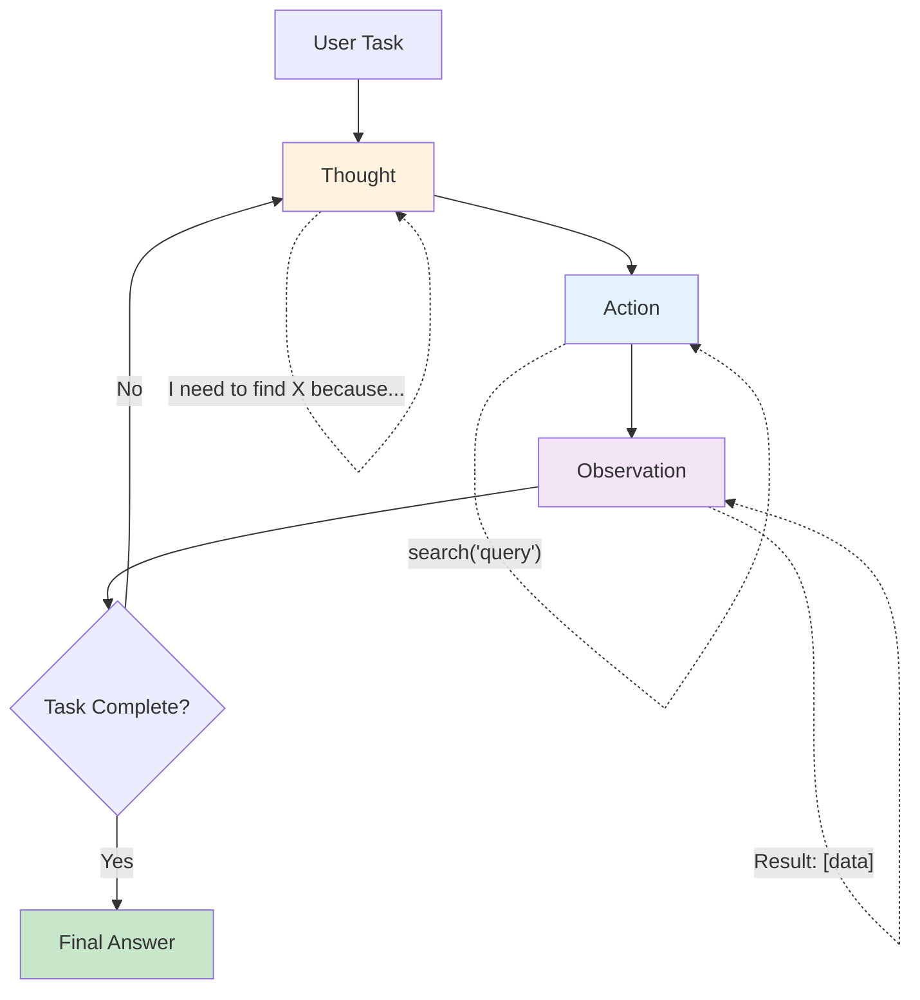

# The ReAct Pattern

## What is ReAct?

**ReAct** = **Re**asoning + **Act**ing

It's a pattern where the LLM explicitly **thinks out loud** before taking action. Instead of just calling a tool, the agent first writes down its reasoning — why it's choosing this tool, what it expects, and what it will do with the result.

## The "Think Out Loud" Analogy

Imagine a detective solving a case:

- **Without ReAct** (just acting): *searches database* → *calls witness* → *checks alibi* (you don't know WHY)
- **With ReAct** (thinking aloud): "The suspect claims they were at home. I should check if their phone GPS confirms this. Let me query the location database." → *queries database* → "GPS shows they were downtown. This contradicts their statement. I should interview the witness who saw them."

ReAct makes the agent's reasoning **visible and debuggable**.

---

## The ReAct Loop



Each iteration has exactly three parts:
1. **Thought** — What am I trying to do? What do I know? What's my next step?
2. **Action** — Call a specific tool with specific arguments
3. **Observation** — What did the tool return?

---

## How ReAct Differs from Simple Tool Calling

| Aspect | Simple Tool Calling | ReAct |
|--------|-------------------|-------|
| Reasoning | Implicit (hidden in LLM) | Explicit (written out) |
| Debuggability | Low — "why did it call that?" | High — reasoning is visible |
| Token usage | Lower | Higher (thoughts cost tokens) |
| Accuracy on complex tasks | Lower | Higher (forced reasoning) |
| Loop detection | Hard | Easy (you can see repeated thoughts) |

---

## ReAct Trace Example

**Task**: "What's the population of the country where the Eiffel Tower is located?"

```
Thought 1: I need to find which country the Eiffel Tower is in.
            I know it's in Paris, France, but let me verify.
Action 1:  knowledge_base("Eiffel Tower location")
Observation 1: The Eiffel Tower is located in Paris, France.

Thought 2: The Eiffel Tower is in France. Now I need to find
            the current population of France.
Action 2:  web_search("France population 2024")
Observation 2: France population 2024: approximately 68.4 million.

Thought 3: I now have both pieces of information. The Eiffel Tower
            is in France, and France has ~68.4 million people.
            I can provide the final answer.
Final Answer: The Eiffel Tower is in France, which has a population
              of approximately 68.4 million people.
```

---

## Implementing ReAct from Scratch (Pseudocode)

```python
def react_agent(task, tools, max_iterations=10):
    context = f"Task: {task}\n"
    
    for i in range(max_iterations):
        # Ask LLM to generate next Thought + Action
        prompt = REACT_PROMPT + context + "Thought:"
        response = llm.generate(prompt, stop=["Observation:"])
        
        # Parse the response
        thought, action = parse_thought_and_action(response)
        context += f"Thought {i+1}: {thought}\n"
        
        # Check if agent wants to give final answer
        if action.tool == "final_answer":
            return action.args["answer"]
        
        # Execute the tool
        context += f"Action {i+1}: {action.tool}({action.args})\n"
        observation = execute_tool(action.tool, action.args)
        context += f"Observation {i+1}: {observation}\n"
    
    return "Max iterations reached. Could not complete task."
```

---

## The ReAct System Prompt

```
You are a reasoning agent. For each step, you MUST output:

Thought: [your reasoning about what to do next]
Action: [tool_name(arguments)]

After receiving an Observation, think again.
When you have enough information, use:
Action: final_answer("your complete answer")

Available tools:
- web_search(query): Search the web for current information
- calculator(expression): Compute a mathematical expression
- knowledge_base(topic): Look up factual information

RULES:
- Always think before acting
- Never guess — use tools to verify
- If a tool fails, try a different approach
- Maximum 10 steps
```

---

## Advantages of ReAct

1. **Transparent** — You can read the agent's reasoning and understand its decisions
2. **Debuggable** — When something goes wrong, you can see WHERE the reasoning failed
3. **Steerable** — You can modify the prompt to change reasoning patterns
4. **Reliable** — Forced reasoning reduces impulsive/wrong tool calls
5. **Auditable** — Full trace for compliance and review

---

## Limitations of ReAct

1. **Token-expensive** — Every thought costs tokens; complex tasks accumulate fast
2. **Can loop** — Agent may repeat the same thought-action cycle endlessly
3. **Slow** — Each step requires a full LLM call
4. **Context overflow** — Long traces fill up the context window
5. **Over-thinking** — Simple tasks don't need explicit reasoning

---

## When to Use ReAct

| Use ReAct When... | Use Simple Tool Calling When... |
|-------------------|-------------------------------|
| Task requires multi-step reasoning | Task is straightforward (1-2 tool calls) |
| Debugging/auditability is critical | Speed is the priority |
| Agent makes frequent mistakes | Agent is reliable on this task type |
| Task is novel/complex | Task is routine/familiar |
| You need to explain decisions to users | User just wants the result |

---

## Loop Detection Strategies

```python
# Strategy 1: Max iterations
MAX_STEPS = 10

# Strategy 2: Detect repeated actions
if action in previous_actions[-3:]:
    inject_message("You've tried this before. Try a different approach.")

# Strategy 3: Detect repeated thoughts
if thought_similarity(current_thought, previous_thoughts) > 0.9:
    force_new_strategy()

# Strategy 4: Token budget
if total_tokens > TOKEN_BUDGET:
    force_final_answer()
```

---

## Key Takeaways

- ReAct = explicit reasoning before every action
- The loop is: Thought → Action → Observation → repeat
- Main benefit: transparency and debuggability
- Main cost: more tokens and slower execution
- Use for complex tasks; skip for simple ones
- Always implement loop detection and max iterations

---

## Staff-Level: Anti-Patterns

| Anti-Pattern | Why It Fails | Fix |
|-------------|-------------|-----|
| Infinite reasoning loops | Agent thinks in circles without making progress — burns tokens endlessly | Cap iterations (hard max), detect thought similarity >0.85, inject "try a completely different approach" |
| Not capping iterations | A 50-step ReAct trace costs $2-5 in tokens and takes minutes | Set max_iterations=5-10 for most tasks; force final_answer at limit |
| ReAct for simple direct-answer questions | "What's 2+2?" doesn't need Thought→Action→Observation — massive overkill | Route simple queries to direct response; only use ReAct for multi-step tasks |
| No observation validation | Tool returns garbage/error, agent treats it as valid data and reasons on top of noise | Validate observations before injecting: check for error codes, empty results, nonsensical outputs |
| Thoughts that don't add information | "I should search for this" (adds nothing vs just searching) — wastes tokens | Prompt the model to include NEW reasoning: what it learned, what changed, why this next action |

---

## Staff-Level: Trade-offs

### ReAct vs Function-Calling vs Plan-Then-Execute

| Dimension | ReAct | Native Function Calling | Plan-Then-Execute |
|-----------|-------|------------------------|-------------------|
| **Transparency** | High (explicit thoughts) | Low (reasoning hidden) | Medium (plan visible) |
| **Speed** | Slow (thought tokens) | Fast (minimal overhead) | Medium (plan + execute) |
| **Token cost** | High (2-3x more tokens) | Low | Medium |
| **Complex reasoning** | Excellent | Adequate for simple | Good for structured |
| **Debugging** | Easy (read the trace) | Hard (why did it pick that?) | Medium (see the plan) |
| **Error recovery** | Good (can reason about errors) | Limited (retry or fail) | Good (can re-plan) |
| **Best for** | Novel/complex tasks | Routine/simple tasks | Tasks with known structure |

**Decision rule**: Use function-calling by default. Add ReAct only when you need debuggability or the task requires multi-step reasoning that function-calling gets wrong.

---

## Staff-Level: When ReAct Fails

ReAct degrades significantly in these scenarios:

1. **Tasks requiring >5 steps** — Context fills up with thoughts, observations get pushed out, agent loses track of earlier findings. Solution: summarize every 3-4 steps.

2. **Tasks needing precise upfront planning** — ReAct is greedy (one step at a time). For tasks where step 5 depends on choices at step 1, plan-then-execute wins because it considers the full path.

3. **High-throughput production systems** — The 2-3x token overhead of thoughts makes ReAct expensive at scale. Reserve for complex cases, use lightweight patterns for routine work.

4. **Tasks with strict output format** — ReAct's free-form thoughts can drift. The model forgets the required output schema after many reasoning steps.

5. **Concurrent/parallel tasks** — ReAct is inherently sequential (think→act→observe). If subtasks are independent, a DAG executor is more efficient.

**Staff insight**: In production, most teams implement a "hybrid" — ReAct-style reasoning for the first few steps to establish approach, then switch to direct execution for the remaining mechanical steps. This gives you debuggability where it matters without the full token cost.

---

## ReAct Variants and Extensions

### ReWOO (Reasoning Without Observation)

```
Key difference: Plan ALL tool calls upfront, execute in batch, then reason over results.

Flow:  Plan → [Tool1, Tool2, Tool3] → Execute all → Synthesize

Advantages:
- Parallel tool execution (3-5x faster for independent calls)
- Lower token cost (no interleaved reasoning between each tool)
- Predictable latency (know upfront how many calls)

Disadvantages:
- Can't adapt mid-execution (no course correction)
- Wasted calls if early results would have changed the plan
- Poor for exploratory tasks where next step depends on previous result

Best for: Well-structured tasks with independent data gathering steps
```

### LATS (Language Agent Tree Search)

```
Key difference: Explore multiple reasoning paths, backtrack on failures.

Flow:  Think → Act → Observe → Score → Branch/Backtrack

Advantages:
- Higher success rate on complex tasks (explores alternatives)
- Self-correcting (backtracks from bad paths)
- Produces confidence scores per path

Disadvantages:
- 5-20x more expensive than standard ReAct (multiple paths)
- High latency (sequential exploration)
- Complex to implement and debug

Best for: High-value tasks where correctness > cost (code generation, complex reasoning)
```

### Comparison Matrix

| Variant | Token Cost | Latency | Adaptability | Implementation Complexity |
|---------|-----------|---------|--------------|--------------------------|
| Standard ReAct | 2-3x base | Medium | High | Low |
| ReWOO | 1.5x base | Low (parallel) | None (fixed plan) | Medium |
| LATS | 5-20x base | High | Very high | High |
| Hybrid (ReAct → Direct) | 1.5-2x base | Medium-Low | Medium | Low |

## Production Tuning for ReAct Loops

```
Key parameters to tune:
  max_iterations:     Start at 5, increase only with evidence (most tasks solve in 3)
  thought_budget:     Limit reasoning tokens per step (150-300 tokens usually sufficient)
  early_termination:  If confidence > threshold after step N, skip remaining
  retry_policy:       Tool failures get 1 retry, then force alternative approach
  
Anti-patterns to detect:
  - Loop repetition: Same thought/action appearing twice → force terminate
  - Observation ignoring: Model repeats action despite contradicting observation
  - Goal drift: Thought diverges from original task → inject reminder
```

## Cost Management for Iterative Agents

```
Per-request cost model:
  Cost = Σ(input_tokens + output_tokens) × price_per_token × num_iterations

Cost controls:
  1. Hard budget per request: $0.50 max → terminate gracefully at limit
  2. Escalating model: Start with cheap model (GPT-4o-mini), promote to expensive (Claude Opus)
     only if cheap model fails after 3 iterations
  3. Cache observations: If same tool+args seen before, reuse result (saves tool cost + latency)
  4. Thought compression: Summarize history every 5 steps instead of carrying full trace

Monitoring:
  - Track cost per successful completion vs. cost per failure
  - Alert if avg iterations trending up (may indicate prompt/tool regression)
  - Dashboard: cost distribution across users/tasks to find outliers
```

**Staff rule of thumb**: If your ReAct agent averages more than 5 iterations, you likely have a tool design problem (tools too granular) or a prompt problem (unclear goal specification), not an algorithm problem.
