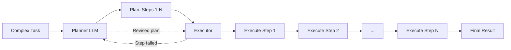
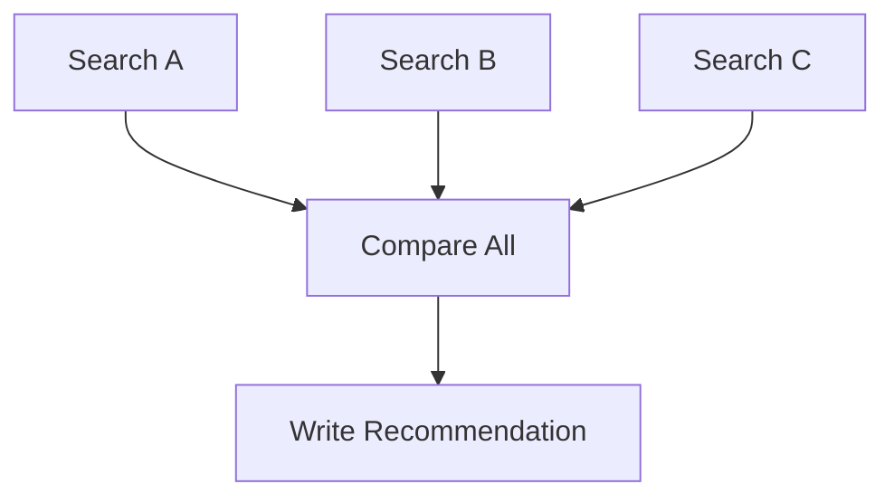
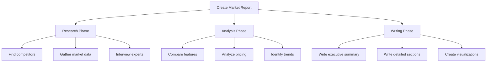
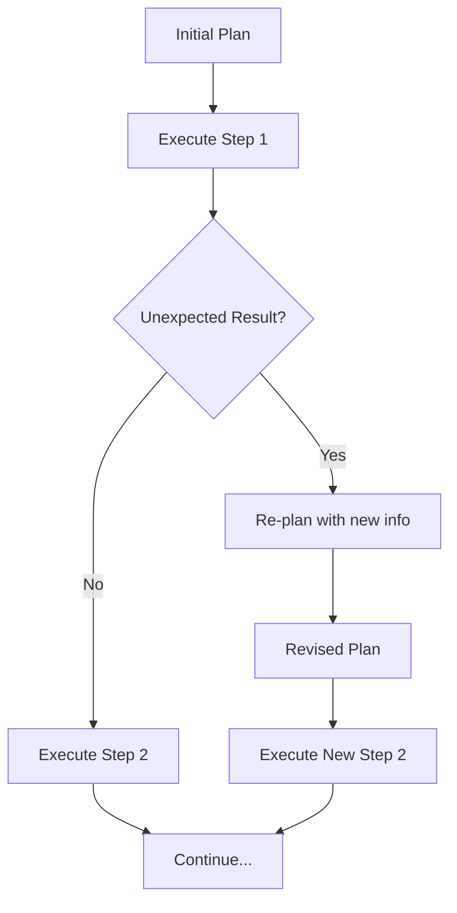
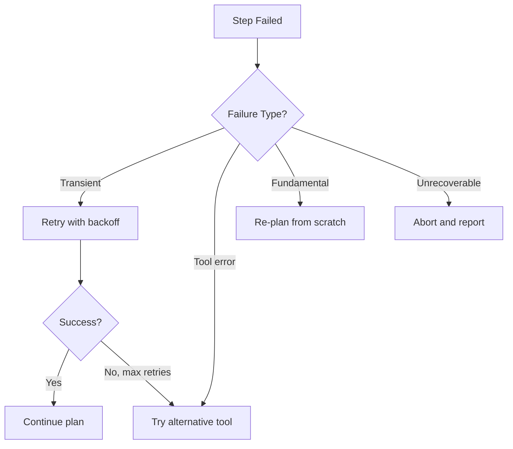

# Planning and Decomposition

## Why Complex Tasks Need Planning

Imagine building a house. You wouldn't just start hammering nails randomly. You'd:
1. Design blueprints
2. Pour the foundation
3. Frame the walls
4. Install plumbing and electrical
5. Finish interior

**Planning** is the same for AI agents. Complex tasks have dependencies, parallel opportunities, and decision points. Without a plan, the agent acts myopically — making locally good decisions that may be globally bad.

---

## The "Project Manager" Analogy

Think of the planning agent as a **project manager**:
- Breaks the project into tasks
- Identifies dependencies ("can't paint walls before they're built")
- Assigns work (to tools or sub-agents)
- Monitors progress
- Re-plans when things go wrong

---

## Plan-Then-Execute Pattern



**Separation of concerns**: The planner thinks strategically. The executor handles tactical execution. This mirrors how humans work — you plan your day, then execute tasks.

---

## Planning Strategies

### 1. Sequential Planning

The simplest form: a linear list of steps.

```
Plan:
1. Search for competitors in the CRM space
2. Gather pricing information for each
3. Compare features side by side
4. Write a summary recommendation
```


**When to use**: Simple tasks with clear ordering and no parallelism.

---

### 2. DAG Planning (Directed Acyclic Graph)

Some steps can run in parallel; others depend on previous results.

```
Plan:
1. Search competitor A pricing    ─┐
2. Search competitor B pricing    ─┼─→ 4. Compare all results
3. Search competitor C pricing    ─┘         │
                                             ↓
                                   5. Write recommendation
```



**When to use**: Tasks with independent sub-tasks that can run concurrently.

---

### 3. Hierarchical Planning

Break high-level goals into sub-goals, each with their own plans.



**When to use**: Large, complex tasks that need multiple levels of decomposition.

---

### 4. Adaptive Planning

The plan evolves based on what you learn during execution.



**When to use**: Exploratory tasks where you don't know what you'll find until you start.

---

## Plan Representation Formats

### Natural Language Plan
```
Step 1: Search the web for "AI startup funding 2024"
Step 2: Extract the top 10 results
Step 3: For each result, summarize key findings
Step 4: Synthesize into a report
```

### Structured Plan (JSON)
```json
{
  "goal": "Market research report",
  "steps": [
    {"id": 1, "action": "web_search", "args": {"query": "AI funding 2024"}, "depends_on": []},
    {"id": 2, "action": "web_search", "args": {"query": "AI market size 2024"}, "depends_on": []},
    {"id": 3, "action": "analyze", "args": {"data": "$1,$2"}, "depends_on": [1, 2]},
    {"id": 4, "action": "write_report", "args": {"analysis": "$3"}, "depends_on": [3]}
  ]
}
```

### DAG with Dependencies
```python
plan = {
    "step_1": {"tool": "search", "deps": []},
    "step_2": {"tool": "search", "deps": []},
    "step_3": {"tool": "analyze", "deps": ["step_1", "step_2"]},
    "step_4": {"tool": "write", "deps": ["step_3"]}
}
```

---

## Plan Validation

Before executing, validate the plan:

| Check | Question |
|-------|----------|
| **Completeness** | Does the plan address the full goal? |
| **Feasibility** | Do we have tools for every step? |
| **Dependencies** | Are dependencies acyclic (no loops)? |
| **Resource limits** | Will it stay within token/time/cost budget? |
| **Safety** | Does any step require human approval? |

```python
def validate_plan(plan):
    errors = []
    for step in plan.steps:
        if step.tool not in available_tools:
            errors.append(f"Step {step.id}: tool '{step.tool}' not available")
        if has_circular_dependency(step, plan):
            errors.append(f"Step {step.id}: circular dependency detected")
        if step.estimated_cost > budget_remaining:
            errors.append(f"Step {step.id}: exceeds budget")
    return errors
```

---

## Re-Planning on Failure

When a step fails, the agent has options:

1. **Retry** — Same step, same approach (transient failure)
2. **Alternative** — Same goal, different tool/approach
3. **Skip** — Mark as non-critical and continue
4. **Re-plan** — Go back to the planner with what you've learned
5. **Abort** — Task cannot be completed, report why



---

## The Planner-Executor Architecture

```
┌─────────────────────────────────────────┐
│              PLANNER AGENT               │
│  - Receives complex task                │
│  - Breaks into steps                    │
│  - Defines dependencies                 │
│  - Validates feasibility                │
│  - Re-plans on failure                  │
└─────────────┬───────────────────────────┘
              │ Plan (list of steps)
              ▼
┌─────────────────────────────────────────┐
│             EXECUTOR AGENT               │
│  - Takes one step at a time            │
│  - Calls tools                         │
│  - Reports results back                │
│  - Reports failures back               │
└─────────────────────────────────────────┘
```

This separation gives you:
- **Better reasoning** — planner focuses on strategy, executor on tactics
- **Easier debugging** — bad plan? Bad execution? You can tell
- **Reusability** — same executor, different planners for different domains

---

## Key Takeaways

- Complex tasks need decomposition before execution
- Four strategies: sequential, DAG, hierarchical, adaptive
- Always validate plans before executing them
- Build re-planning into the system — failures WILL happen
- The planner-executor split mirrors how effective teams work
- DAG plans enable parallelism, which reduces total execution time
