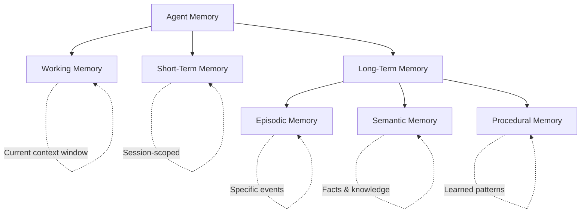
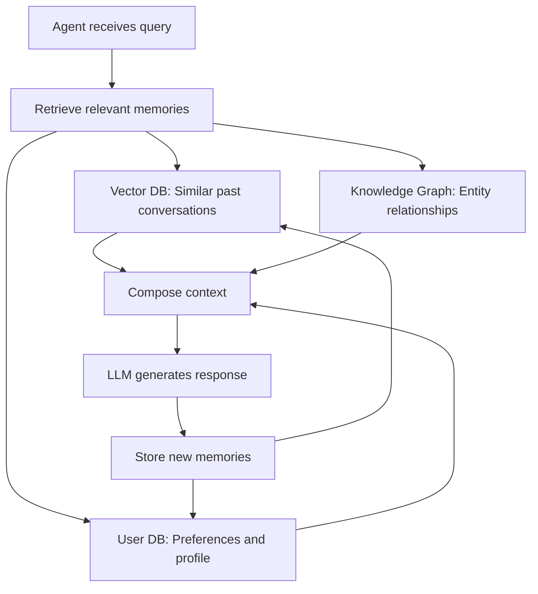

# Memory for Agents

## The "Goldfish Problem"

Without memory, every LLM call starts from zero. The agent forgets:
- What it already tried (repeats failed approaches)
- What the user said earlier (asks the same questions)
- What it learned (re-discovers facts every session)

This is the **goldfish problem** — every 3 seconds is a fresh start. Memory gives agents continuity, learning, and personalization.

---

## Memory Types



### Working Memory (Context Window)

The LLM's immediate context — messages in the current conversation. Limited by the model's context window (128K tokens for GPT-4).

**Analogy**: Your desk. Only what's in front of you right now.

### Short-Term Memory (Session)

Information stored for the duration of a session but not persisted. Variables, intermediate results, conversation summaries.

**Analogy**: A whiteboard in a meeting room. Erased after the meeting.

### Long-Term Memory (Persistent)

Information that survives across sessions. Stored in external systems.

**Analogy**: Filing cabinets, notebooks, your company wiki.

---

## Long-Term Memory Subtypes

| Type | What It Stores | Example | Storage |
|------|---------------|---------|---------|
| **Episodic** | Specific past events | "Last Tuesday, user complained about slow search" | Event log / vector DB |
| **Semantic** | Facts and knowledge | "User prefers Python over JavaScript" | Knowledge graph / DB |
| **Procedural** | How to do things | "When user says 'deploy', run these 5 steps" | Prompt templates / rules |

### Episodic Memory
```
Event: 2024-01-15 14:30
Context: User asked to debug API endpoint
Action: Found N+1 query problem in /users endpoint
Outcome: Fixed with eager loading, 10x speedup
Lesson: Check for N+1 queries when API is slow
```

### Semantic Memory
```
User Preferences:
- Language: Python
- Framework: FastAPI
- Style: Concise code, minimal comments
- Testing: Pytest with fixtures
```

### Procedural Memory
```
Deployment Procedure:
1. Run tests → 2. Build Docker image → 3. Push to ECR → 4. Update ECS service
If tests fail: stop and report, never deploy broken code
```

---

## Memory Storage Approaches

| Approach | Best For | Limitations |
|----------|----------|-------------|
| **In-context** (system prompt) | Critical always-needed info | Limited space, expensive |
| **Vector store** | Semantic search over large memory | Can retrieve irrelevant items |
| **Database (SQL/NoSQL)** | Structured, queryable facts | Needs schema design |
| **Knowledge graph** | Relationships between entities | Complex to build and maintain |
| **File system** | Documents, code, artifacts | Slow retrieval for large sets |

### Architecture Example



---

## Memory Retrieval: What to Remember and When

Not all memories are relevant. Retrieving too much = context overflow. Too little = goldfish.

**Retrieval strategies**:

1. **Recency** — Most recent interactions first
2. **Relevance** — Semantically similar to current query (vector search)
3. **Importance** — High-impact events (errors, user preferences, decisions)
4. **Frequency** — Often-referenced information

```python
def retrieve_memories(query, user_id, max_tokens=2000):
    # Combine multiple retrieval strategies
    recent = get_recent_memories(user_id, limit=5)
    relevant = vector_search(query, user_id, top_k=5)
    important = get_high_importance_memories(user_id, limit=3)
    
    # Deduplicate and rank
    all_memories = deduplicate(recent + relevant + important)
    ranked = rank_by_combined_score(all_memories)
    
    # Fit within token budget
    return truncate_to_tokens(ranked, max_tokens)
```

---

## Memory Management

### Forgetting (Necessary!)

Not everything should be remembered forever:
- Outdated information (old preferences, stale data)
- Low-importance interactions ("ok", "thanks")
- Superseded facts (old address after user moves)

### Summarization

As conversations grow, summarize older parts:
```
[Messages 1-50: Summary] User onboarded, set up Python project,
configured FastAPI with PostgreSQL, deployed to AWS.
[Messages 51-100: Full detail kept]
```

### Consolidation

Periodically merge and clean memories:
- Combine fragmented facts into coherent profiles
- Resolve contradictions (latest preference wins)
- Extract patterns from episodic memories → semantic knowledge

---

## Memory Safety

| Concern | Mitigation |
|---------|-----------|
| **PII storage** | Encrypt, minimize, auto-expire |
| **Right to forget** | Implement memory deletion API |
| **Memory poisoning** | Validate before storing; don't trust all inputs |
| **Cross-user leakage** | Strict memory isolation per user |
| **Stale info** | TTL (time-to-live) on memories |
| **Context injection** | Sanitize retrieved memories before injecting |

---

## Practical Memory Architecture

```
┌──────────────────────────────────────────────┐
│                 AGENT LAYER                    │
├──────────────────────────────────────────────┤
│  Working Memory: Current messages (in-context)│
│  ┌──────────────────────────────────────┐    │
│  │ System prompt + last N messages      │    │
│  └──────────────────────────────────────┘    │
├──────────────────────────────────────────────┤
│  Memory Manager                              │
│  - Decides what to store                     │
│  - Decides what to retrieve                  │
│  - Handles summarization                     │
│  - Enforces privacy rules                    │
├──────────────────────────────────────────────┤
│  Storage Layer                               │
│  ┌────────┐ ┌──────────┐ ┌──────────────┐  │
│  │Vector  │ │ User DB  │ │ Knowledge    │  │
│  │Store   │ │(profiles)│ │ Graph        │  │
│  └────────┘ └──────────┘ └──────────────┘  │
└──────────────────────────────────────────────┘
```

---

## Key Takeaways

- Without memory, agents are goldfish — they forget everything between calls
- Six memory types: working, short-term, episodic, semantic, procedural, long-term
- Retrieval is as important as storage — retrieve only what's relevant
- Memory must be managed: summarization, forgetting, consolidation
- Privacy and safety: encrypt PII, support deletion, isolate per user
- The memory manager is a critical architectural component
